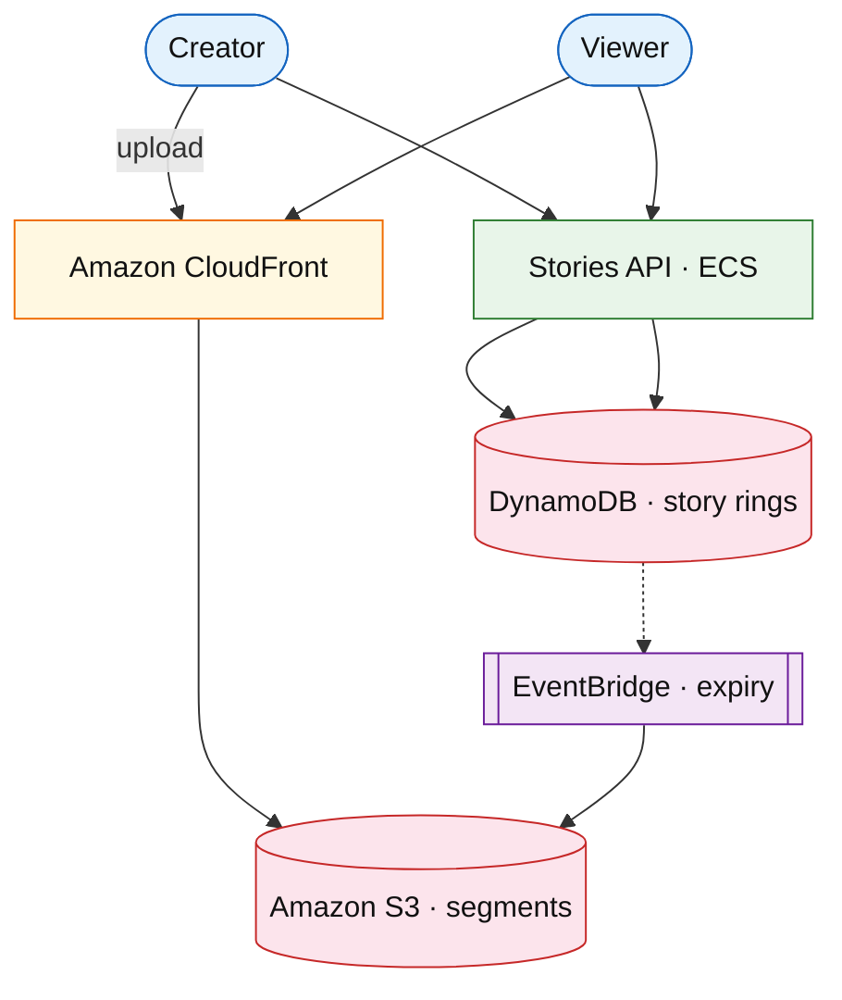

# Ephemeral stories platform (Snapchat / IG Stories)

## Introduction

Stories are **short media** that **expire in 24h**, viewed in sequence by followers — write path is media upload + metadata; read path is CDN + view counter, not a ranked [feed ranking](../social/feed-ranking-service.md) problem.

**Company anchors:** Snapchat, Instagram Stories, WhatsApp Status.

## Requirements discovery

| Lock (target) |
| --- |
| 500M DAU posting stories |
| TTL 24 h hard delete |
| View list per story ring |
| p99 view &lt; 100 ms (CDN hit) |

## Architecture (user → database)

**Narrative:** **Creator** uploads segments to **S3**; **DynamoDB** stores ordered segment IDs + `expires_at`. **Viewers** fetch manifest from API, stream from **CloudFront**. **EventBridge** triggers deletion at TTL.

## Deep dive

- **Viewers list** as append-only set per story (cap cardinality).
- **Prefetch** next segment while playing current.
- Reels long-form: [video on demand](./video-on-demand-platform.md).

## Related

- [Video on demand](./video-on-demand-platform.md)
- [S3 drill](../aws/s3.md)
- [EventBridge drill](../aws/eventbridge.md)
