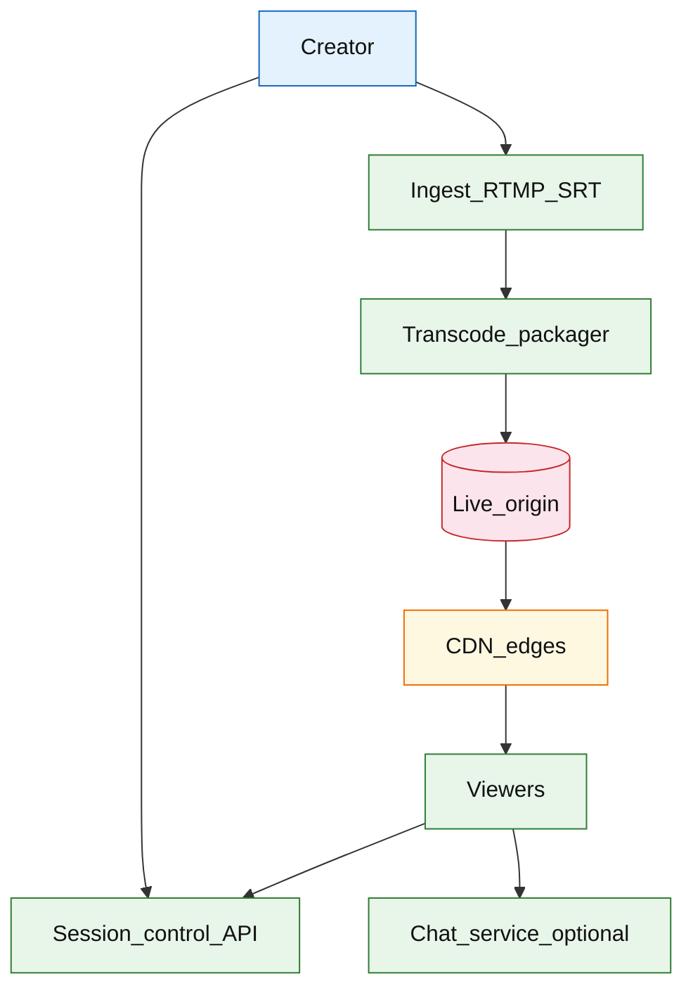

# Live video streaming

## Introduction

A live video platform ingests a **real-time stream** from a broadcaster, **transcodes** into adaptive bitrates (HLS/DASH), and **fans out** through CDN edges to many concurrent viewers with target end-to-end latency from **3–30 seconds** depending on protocol choice.

**Primary users:** creators (go live, health metrics), viewers (watch, rebuffer on loss), operators (transcode capacity, CDN cache hit), moderators (optional live chat via separate service).

**Interview pacing:** Use [60-minute runbook](../../prep/interview-runbook-60m.md) — ~10 min requirements theater (below), ~18–32 min diagram + API/DB, ~46–56 min deep dive on **ingest/transcode/live fanout**.

VOD upload/transcode path: [video on demand platform](./video-on-demand-platform.md). Live chat: [chat messenger](../social/chat-messenger.md).

## Requirements discovery (interview theater)

### Question bank

| Topic | You ask | If they push back | Example answer (reasonable default) |
| --- | --- | --- | --- |
| Latency | Ultra-low or broadcast? | "Twitch-like" | **5–10s** glass-to-glass with HLS low-latency; mention WebRTC **&lt;1s** as alternate track |
| Viewers | Concurrent per stream? | "Millions one event" | **2M** concurrent one mega-stream; **50k** typical |
| Ingest | RTMP/WebRTC? | "RTMP" | **RTMP/SRT** ingest from creator tools |
| ABR | Multi-bitrate? | "Single quality" | **4 renditions** (1080p→360p) ladder |
| Interactive | Live chat in scope? | "Yes" | Chat via separate WS service — not in video bytes |
| Recording | DVR/replay? | "Live only" | Optional **4h rolling DVR** window on origin |
| Out of scope | User-generated VOD catalog? | "Included" | Live session only; VOD pipeline separate |

### Example dialogue

> **You:** Let's scope v1: one happy path and what's out of scope?
> **Them:** …
> **You:** For scale, prototype vs 12-month target?
> **Them:** …
> **You:** What does each actor do per day on the hot path?
> **Them:** …
> **You:** I'll lock the **target** column assumptions unless you want different numbers — next I'll map fleet totals to monthly AWS meters in **billable volume**.

### Parsed requirements

| Field | Source question | Parsed value (target) | Drives |
| --- | --- | --- | --- |
| `viewer_dau_u` | Viewer DAU (`U`) | **200M** | Scale tiers, input model, fleet totals |
| `live_watch_sessions_/_dau_/_day` | Live watch sessions / DAU / day | **0.5** | Scale tiers, input model, fleet totals |
| `avg_watch_duration_/_session` | Avg watch duration / session | **30 min** | Scale tiers, input model, fleet totals |
| `concurrent_live_streams_global` | Concurrent live streams (global) | **100k** | Scale tiers, input model, fleet totals |
| `mega-stream_peak_viewers` | Mega-stream peak viewers | **2M** | Scale tiers, input model, fleet totals |
| `ingest_source_bitrate` | Ingest source bitrate | **6 Mbps** | Scale tiers, input model, fleet totals |
| `abr_renditions` | ABR renditions | **4** | Scale tiers, input model, fleet totals |
| `segment_duration_ll-hls` | Segment duration (LL-HLS) | **2s** | Scale tiers, input model, fleet totals |
| `target_glass-to-glass_latency` | Target glass-to-glass latency | **8s** | Hot path, deep dive |

### Locked assumptions

| Assumption | Prototype (MVP) | Growth | Target (anchor) |
| --- | --- | --- | --- |
| Viewer DAU (`U`) | 10k | 1M | **200M** |
| Live watch sessions / DAU / day | 0.5 | 0.5 | 0.5 |
| Avg watch duration / session | 30 min | 30 min | 30 min |
| Concurrent live streams (global) | 10 | 1k | **100k** |
| Mega-stream peak viewers | 200 | 20k | **2M** |
| Ingest source bitrate | 6 Mbps | 6 Mbps | 6 Mbps |
| ABR renditions | 4 | 4 | 4 |
| Segment duration (LL-HLS) | 2s | 2s | 2s |
| Target glass-to-glass latency | 8s p50 | 8s | 8s |

*After ~10 minutes, proceed with the **target** column and state latency protocol (LL-HLS vs WebRTC) explicitly.*

### Interview Q&A cheat sheet

Say aloud in order (~10 min). Write locks into **parsed requirements** before capacity math.

| Step | You ask | Lock if vague (target) |
| --- | --- | --- |
| 1 — Latency | Ultra-low or broadcast? | **5–10s** glass-to-glass with HLS low-latency; mention WebRTC **&lt;1s** as alternate track |
| 2 — Viewers | Concurrent per stream? | **2M** concurrent one mega-stream; **50k** typical |
| 3 — Ingest | RTMP/WebRTC? | **RTMP/SRT** ingest from creator tools |
| 4 — ABR | Multi-bitrate? | **4 renditions** (1080p→360p) ladder |
| 5 — Interactive | Live chat in scope? | Chat via separate WS service — not in video bytes |
| 6 — Recording | DVR/replay? | Optional **4h rolling DVR** window on origin |
| 7 — Out of scope | User-generated VOD catalog? | Live session only; VOD pipeline separate |

## Capacity sketch

### User input model

| Action | % of DAU | Per user / day | API | ~Req size | Durable write / user / day |
| --- | --- | --- | --- | --- | --- |
| Watch live (playback) | 50% | 0.5 sessions | CDN manifest + segments | 2 Mbps avg | **0** OLTP (CDN egress) |
| Join / poll manifest | 50% | 900 polls | `GET master.m3u8` | 2 KB | 0 |
| Creator go live | 1% | 0.02 | `POST /v1/live/sessions` | 1 KB | **~500 B** registry |
| Health / stats beacon | 50% | 30 | `GET .../health` | 0.5 KB | 0 |

**Watch timeline math (target):** `0.5 sessions × 30 min × 2 Mbps ≈ **~450 MB egress/DAU/day**` (CDN, not OLTP).

### Fleet totals (target)

`U` = 200M viewer DAU (anchor tier).

| Metric | Formula | Value |
| --- | --- | --- |
| Watch sessions / day | `U × 0.5` | **100M** |
| Aggregate CDN egress / day | `100M × 450 MB` | **~45 PB/day** (theoretical; edge cached) |
| Concurrent streams | | **100k** |
| Origin ladder egress / stream | ~11 Mbps | **~1.1 Tbps** if all concurrent (shielded) |
| Session registry rows / day | `0.01 × U × 0.02` | **~40k** creates |

### Traffic profile (target tier)

Locked **target** assumptions: **200M** viewer DAU (`U`), **100M** watch sessions/day, **100k** concurrent streams.

| Metric | Value |
| --- | --- |
| **Read:write (API requests)** | **2000:1** (manifest/CDN reads : session registry writes) |
| **Read:write (durable bytes)** | **10⁶:1** (**~45 PB/day** CDN egress : **~20 MB** registry/day) |
| **Requests / day (fleet)** | **~90B** manifest polls + **40k** session creates (CDN + control API) |
| **Avg RPS** | **~1M/s** manifest (theoretical); control API **~0.5/s** |
| **Peak RPS** | **~50M/s** manifest (mega-event localized); **100k** concurrent streams |

| User / actor | Action | R/W | Per user / day | % of fleet requests |
| --- | --- | --- | --- | --- |
| Viewer (50% DAU) | Watch live + segment fetch | R | 0.5 sessions (**100M**) | **CDN** (~99.99%) |
| Viewer | Manifest poll | R | 900 / session | **~90B**/day |
| Creator (1% DAU) | Go live + health | W/R | 0.02 session + 30 beacons | **&lt;0.01%** |
| System | LL-HLS segment origin | R | — | origin **~1.1 Tbps** if all concurrent |

*Per-viewer poll rate fixed; fleet scales with `U` and concurrent streams.*

### AWS service map (target deployment)

| Diagram component | AWS service | Role in this design | Monthly meter (target) |
| --- | --- | --- | |
| Creator | — (client) | RTMP/SRT publish; not AWS |
| Ingest_RTMP_SRT | **AWS Elemental MediaLive** + **AWS Elemental MediaConnect** | Ingest at nearest POP; **1080p30** ladder |
| Transcode_packager | **Elemental MediaLive** / **ECS** workers | ABR ladder + **LL-HLS** segment packaging |
| Live_origin | **Amazon S3** | Segment + manifest objects; origin for CDN |
| CDN_edges | **Amazon CloudFront** | Edge cache; **~45 PB/day** theoretical egress |
| Viewers | — (clients) | HLS playback via CloudFront |
| Chat_service_optional | **Amazon API Gateway** (WebSocket) + **Amazon DynamoDB** | Parallel chat channel (optional) |
| Session_control_API | **Amazon API Gateway** + **AWS Lambda** / **ECS** | Start/stop session; publish tokens; health |
| Session registry | **Amazon DynamoDB** | **~40k** creates/day; live session metadata |
| Observability | **Amazon CloudWatch**, **AWS X-Ray** | Concurrent viewers, origin 5xx, rebuffer proxy |

### Scale tiers

| Tier | `U` | Watch sessions/day | Concurrent streams | Manifest RPS (peak est.) |
| --- | --- | --- | --- | --- |
| Prototype | 10k | 5k | 10 | **~1k** |
| Growth | 1M | 500k | 1k | **~100k** |
| Target | 200M | 100M | 100k | **~50M** (mega-event localized) |

### Symbols

| Symbol | Meaning |
| --- | --- |
| `U` | Viewer daily active users |
| `L_watch` | Live watch sessions per DAU per day (0.5) |
| `T_sess` | Avg watch minutes per session (30) |
| `B_client` | Avg playback bitrate (2 Mbps) |
| `V_mega` | Peak concurrent viewers one mega-stream (2M) |
| `I` | Concurrent live ingests globally (100k) |

### Derivation (traffic)

**CDN (dominant):** naive unicast `V × bitrate` **impossible** at 2M viewers — **CDN fanout**; origin **~11 Mbps** per stream to mid-tier.

**Mega-stream POP:** `2M × 2 Mbps ≈ **4 Tbps**` one hot region — many edges + pre-warm.

**Manifest polls:** every 2s → `0.5 RPS/viewer` → 2M viewers = **1M manifest RPS** — edge-cache manifests (TTL 1–2s).

**Transcode:** 1 ingest → 4 renditions ≈ **1–2 GPU slots**/stream; **100k** concurrent ingests → large GPU pool.

**OLTP:** session registry **&lt;1 GB/day** — not the cost driver.

### Storage and growth over time

| Tier | ~Unit size | Rate (target) | Retention | Steady-state | Per viewer-hour |
| --- | --- | --- | --- | --- | --- |
| Ingest buffer | 750 KB/2s seg | per stream | minutes | ephemeral | — |
| Origin ladder | 4 renditions | 0.5 seg/s each | 1h DVR | **~5 GB/hr**/stream | — |
| CDN edge | segments | 100M sessions/day | seconds | **PB egress** | **~450 MB/DAU-day** |
| `live_sessions` | 500 B | 40k/day | metadata | **&lt;100 MB** | — |

**Mega-event (2M viewers, 2h):** origin **~5.4 Gbps**; CDN **~12 Tbps** aggregate — call out in interview.

### Per-user economics (target)

| Metric | Value | Notes |
| --- | --- | --- |
| Watch sessions / DAU / day | **0.5** | |
| CDN egress / DAU / day | **~450 MB** | dominant cost |
| Manifest requests / DAU / day | **~900** | 30 min × 30 polls/min |
| OLTP bytes / creator / day | **~50 B** | 1% creators × 0.02 |

### Service footprint (instances)

| Service | Scales with | Prototype | Growth | Target |
| --- | --- | --- | --- | --- |
| Ingest (RTMP/SRT) | concurrent `I` | 2 | 200 | **~2k** |
| Transcode GPU | active ingests | 2 | 200 | **~5k** GPUs |
| Live origin | segment write | 2 | 20 | **~100** |
| CDN | egress Tbps | 1 POP | multi | **global** |
| Session API | registry QPS | 2 | 10 | **~30** |

**First cliff:** **~1M viewer DAU** — CDN contract + manifest cache; origin shield before mega-events.

### Billable volume (target month)

Convert **fleet totals** to AWS billing meters before dollar math. *List-price ballparks — not a quote.*

| Design quantity (target) | Formula | Monthly billable unit |
| --- | --- | --- |
| API requests | `requests_day × 30` | **derive from fleet** (**~90B** manifest polls + **40k** session creates (CDN + control API)) |
| OLTP storage steady | storage table | **___ GB-mo** |
| Cache / Redis RAM | footprint | **___ GB** (node tier) |
| Egress / CDN | `egress_day × 30` | **___ GB / mo** |
| Stream / queue events | `events_day × 30` | **___ million events / mo** |
| Log ingest (if full capture) | `log_GB_day × 30` | **___ GB ingest / mo** |
| **Per unit** | `total / scale driver` | **$…/unit/mo** |

*Reconcile rows in **Cloud cost ballpark** (9a) with these meters.*

### Cost at a glance

Interview sound bite — reconcile with **billable volume** and **cloud cost** below.

| Tier | Scale | ~Monthly $ (core) | Per unit |
| --- | --- | --- | --- |
| Prototype (MVP) | see locked assumptions | **~$2k** | platform tax dominates |
| Target (anchor) | `U` or `Q` = **see locked assumptions** | **see cloud cost** | **see cloud cost** |

**First payment block:** smallest prod footprint (load balancer + database + compute) before per-million traffic dominates.

### Cloud cost ballpark (target)

| Line item | Driver | ~Monthly |
| --- | --- | --- |
| CDN egress | ~45 PB/day theoretical | **~$5M+** (tiered/committed) |
| Transcode GPU | 100k streams peak | **~$400k** |
| Origin + ingest | 100k RTMP | **~$150k** |
| Session OLTP | negligible | **~$5k** |
| **Viewer platform (CDN-heavy)** | | **~$5.5M/mo** |
| **Per viewer DAU** | `5.5M/200M` | **~$0.028/DAU/mo** |

CDN dominates — contrast **metadata ~$0.0001/DAU** vs **egress ~$0.028/DAU**.

### Timeline (per-user rates fixed; `U` grows)

| Milestone | `U` | Watch sessions/day | ~CDN egress/day | ~Monthly $ |
| --- | --- | --- | --- | --- |
| Launch | 10k | 5k | **~2 TB** | **~$2k** |
| Month 3 | 80k | 40k | **~18 TB** | **~$15k** |
| Month 6 | 320k | 160k | **~72 TB** | **~$60k** |
| Month 12 | 1.3M | 650k | **~290 TB** | **~$250k** |

Month 12 is **growth tier** — multi-POP CDN before **200M viewer DAU**.

### Sensitivity

- **10× viewers on one stream** — CDN/edge only; origin transcode unchanged.
- **WebRTC** — SFU limits; use for &lt;1s rooms, not 2M broadcast.
- **10× concurrent ingests** — GPU transcode pool scales linearly.
- **4K source** — transcode slots ×2–3 per stream.

## High-level design

### Architecture (user → database)



**Narrative:** Creator obtains **publish token**, streams to **ingest** (nearest POP). **Transcode** produces ABR ladder + packages **LL-HLS** segments to **origin** bucket. **CDN** caches segments/manifests close to viewers. **Session API** starts/stops sessions, returns playback URL. **Chat** optional parallel channel.

## User-visible surface

- **Creator:** go live, preview health (bitrate, dropped frames), end stream.
- **Viewer:** join URL, adaptive quality, rebuffer on network blip, optional DVR scrub within window.
- **Operator:** concurrent viewer chart, transcode backlog, origin 5xx rate.

## API contract and input model

### UX → API traceability

| UX / UI action | User intent | API or event | Sync/async | Idempotent? | Validates |
| --- | --- | --- | --- | --- | --- |
| **Creator:** go live, preview health (bitrate, dropped frame | Create session | `POST` `/v1/live/sessions` | sync | yes | domain rules |
| **Viewer:** join URL, adaptive quality, rebuffer on network | RTMP publish credentials | `POST` `/v1/live/sessions/{id}/publis | sync | yes | domain rules |
| **Operator:** concurrent viewer chart, transcode backlog, or | HLS master playlist URL | `GET` `/v1/live/sessions/{id}/manife | sync | read | domain rules |
| See user-visible surface | Stop live | `POST` `/v1/live/sessions/{id}/end` | sync | yes | domain rules |
| See user-visible surface | Creator health metrics | `GET` `/v1/live/sessions/{id}/health | sync | read | domain rules |
### Endpoints

| Method | Path | Purpose |
| --- | --- | --- |
| `POST` | `/v1/live/sessions` | Create session |
| `POST` | `/v1/live/sessions/{id}/publish-token` | RTMP publish credentials |
| `GET` | `/v1/live/sessions/{id}/manifest` | HLS master playlist URL |
| `POST` | `/v1/live/sessions/{id}/end` | Stop live |
| `GET` | `/v1/live/sessions/{id}/health` | Creator health metrics |

### Example payloads

`POST /v1/live/sessions`

```json
{
 "title": "Product launch live",
 "creator_id": "user_9912",
 "latency_mode": "low_latency_hls"
}
```

Response `201 Created`:

```json
{
 "session_id": "live_8f2a1c",
 "status": "CREATED",
 "ingest_url": "rtmp://ingest.example/live",
 "stream_key": "sk_obfuscated_...",
 "playback_url": "https://cdn.example/live/live_8f2a1c/master.m3u8"
}
```

`POST /v1/live/sessions/live_8f2a1c/publish-token`

```json
{
 "ttl_seconds": 3600,
 "allowed_ip": null
}
```

Response:

```json
{
 "publish_token": "pub_tok_7k2m",
 "expires_at": "2026-05-23T20:00:00Z"
}
```

`GET /v1/live/sessions/live_8f2a1c/manifest`

```json
{
 "master_playlist_url": "https://cdn.example/live/live_8f2a1c/master.m3u8",
 "renditions": [
 { "resolution": "1920x1080", "bitrate_kbps": 6000 },
 { "resolution": "1280x720", "bitrate_kbps": 3000 },
 { "resolution": "854x480", "bitrate_kbps": 1500 },
 { "resolution": "640x360", "bitrate_kbps": 500 }
 ],
 "target_latency_sec": 8
}
```

Health sample (`GET .../health`)

```json
{
 "session_id": "live_8f2a1c",
 "ingest_bitrate_kbps": 5800,
 "dropped_frames": 2,
 "transcode_lag_sec": 1.2,
 "concurrent_viewers": 185000
}
```

### Input validation

- Only creator may obtain publish token.
- Stream key maps 1:1 to `session_id`.
- End session idempotent; CDN short TTL on manifest after end.

## Database model

### Tables

| Table | Key fields | Notes |
| --- | --- | --- |
| `live_sessions` | `session_id`, `creator_id`, `status`, `latency_mode`, `started_at`, `ended_at` | CREATED/LIVE/ENDED |
| `stream_keys` | `stream_key_hash`, `session_id`, `expires_at` | Auth ingest |
| `stream_health` | `session_id`, `ts`, `bitrate`, `dropped_frames`, `transcode_lag` | Time series |
| `viewer_stats` | `session_id`, `ts_bucket`, `concurrent_viewers` | Aggregates from CDN logs |
| `origin_paths` | `session_id`, `cdn_path`, `dvr_window_sec` | |

Object storage / origin: segments at `s3://live-origin/{session_id}/{rendition}/segment_%06d.ts`

### Read/write paths

1. **Create session** — insert row → allocate stream key → return ingest URL.
2. **Ingest** — RTMP publish auth → route to transcode worker pool for `session_id`.
3. **Transcode** — write segments + playlist to origin → CDN pull or push invalidation.
4. **Playback** — viewer GET manifest from CDN → fetch segments (cache hit).
5. **End** — mark ENDED → stop ingest → finalize DVR optional → CDN purge policy.

## Interview deep dive: Ingest/transcode/live fanout

### Latency ladder (state your pick)

| Stack | Glass-to-glass | Scale to millions | Complexity |
| --- | --- | --- | --- |
| **LL-HLS/DASH** | 5–15s | Excellent via CDN | Moderate |
| **RTMP + CMAF** | Similar | Excellent | Common default |
| **WebRTC SFU** | &lt;1s | Hard at 2M viewers | High |

**Interview default:** LL-HLS + CDN for mega-stream; WebRTC for small interactive rooms.

### Ingest path

- **RTMP terminate** at regional ingest — authenticate stream key.
- **Backpressure:** if transcode saturated, drop policy or queue with creator-visible “degraded” flag.
- **SRT** for lossy networks — mention as improvement.

### Transcode / packaging

- **ABR ladder** — 4 renditions synchronized on **2s** segment boundaries.
- **Keyframe alignment** across renditions for clean switching.
- **Packager** writes manifest referencing latest N segments (live sliding window).

### CDN fanout (critical)

- Origin is **not** multi-terabit unicast — **CDN** is the distribution layer.
- **Cache key:** `session_id + rendition + segment_id`.
- **Manifest** short TTL (1–2s) at edge; segments immutable once written.

### Failure degradation

| Constraint | Fallback |
| --- | --- |
| Transcode overload | Passthrough single rendition copy |
| CDN miss storm | Origin shield / mid-tier |
| Ingest disconnect | Auto-end or pause with slate |

### Live chat (if asked)

Separate **WebSocket** path ([chat messenger](../social/chat-messenger.md) — do not multiplex chat in HLS segments.

## Scale and failure

### Correctness model

- Viewers see monotonically advancing media timeline (no backward jumps except DVR scrub).
- Only one active ingest per `session_id` (new publish kills old or rejects).
- Ended sessions return 404 on manifest after TTL.

### Failure cases

| Failure | Symptom | Mitigation |
| --- | --- | --- |
| Ingest flap | Viewer buffering | Player retry; slate image |
| Transcode lag | Latency grows | Scale GPU pool; reduce ladder |
| Origin overload | 5xx segments | CDN shield; rate limit new sessions |
| CDN edge hot | Rebuffer storm | Add POP capacity; pre-warm mega-event |
| Manifest stale | Stuck quality | Low manifest TTL; cache bust |
| Key leak | Hijack stream | Short-lived publish token; IP allowlist |
| Mega-viewer count | Metrics lag | Sample viewer stats from CDN logs |

### Key metrics

- Glass-to-glass latency p50/p95
- Ingest bitrate stability; dropped frames
- Transcode queue depth; GPU utilization
- CDN cache hit ratio; origin egress Mbps
- Concurrent viewers; rebuffer rate (client beacon)
- Session start success rate

### Interview deep dive talking points

- **CDN fanout** — origin 11 Mbps vs 2M × bitrate without CDN (impossible).
- Pick **LL-HLS ~8s** vs WebRTC for scale/latency tradeoff.
- ABR ladder + 2s segments + manifest poll rate.
- Ingest auth via stream key / publish token.
- Transcode backpressure and single-rendition fallback.

## Related

- [Examples hub](./README.md)
- [Video on demand platform](./video-on-demand-platform.md)
- [Chat messenger](../social/chat-messenger.md)
- [Object storage](../infra/object-storage.md)
- [AWS reference layout](../../patterns/aws-reference-layout.md) (CloudFront path)
- [60-minute runbook](../../prep/interview-runbook-60m.md)
