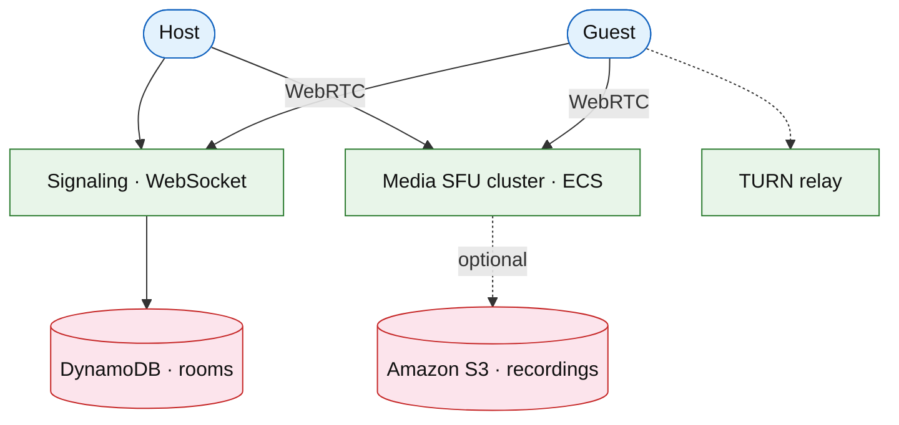

# Video conferencing platform (Zoom / Meet)

## Introduction

Video conferencing connects **many participants** in a **real-time room** with SFU/MCU routing, screen share, and recording — distinct from [live streaming](./live-video-streaming.md) (one-to-many broadcast) and [VOD](./video-on-demand-platform.md).

**Company anchors:** Zoom, Google Meet, Microsoft Teams meetings.

## Requirements discovery

| Lock (target) |
| --- |
| 100 participants / room |
| p99 join &lt; 3 s |
| Audio/video via SFU (no full mesh) |
| Optional cloud recording to S3 |

## Architecture (user → database)

**Narrative:** **Signaling** exchanges SDP/ICE via WebSocket. **SFU** forwards streams (no transcoding per peer). **TURN** punches NAT. **Recording** taps SFU output to **S3**.

## Deep dive

- **SFU vs MCU** tradeoff on whiteboard.
- **Simulcast** layers for bandwidth adaptation.
- Large webinar: hybrid with [live streaming](./live-video-streaming.md).

## Related

- [Live video streaming](./live-video-streaming.md)
- [Chat messenger](../social/chat-messenger.md)
- [Community chat](../social/community-chat-platform.md)
