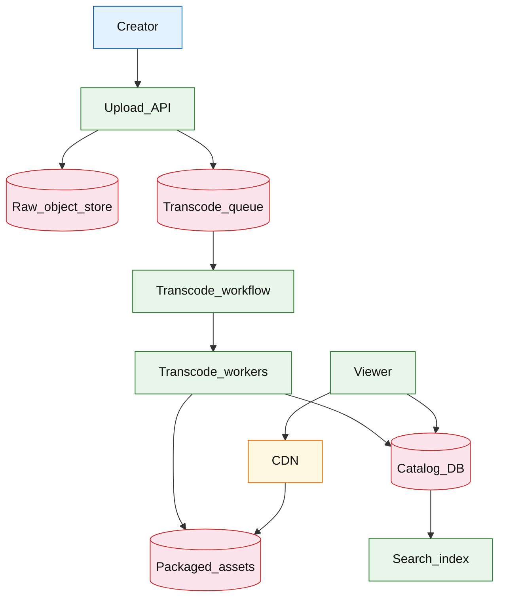

# Video on demand platform

## Introduction

A video-on-demand (VOD) platform lets creators **upload** long-form video, processes it through an **async transcode pipeline**, publishes a **catalog** entry, and serves **adaptive playback** via CDN from object storage. Unlike live streaming, the path optimizes for **upload-to-playable latency** and **batch transcode** throughput, not sub-second glass-to-glass delay.

**Primary users:** creators (upload, processing status), viewers (browse, playback, resume), operators (transcode queue, CDN hit ratio), rights (geo/DRM flags).

**Interview pacing:** Use [60-minute runbook](../../prep/interview-runbook-60m.md) — ~10 min requirements theater (below), ~18–32 min diagram + API/DB, ~46–56 min deep dive on **upload/transcode/CDN/catalog**.

Live path: [live video streaming](./live-video-streaming.md). Blob storage: [object storage](../infra/object-storage.md). Orchestration: [workflow orchestration](../infra/workflow-orchestration.md).

## Requirements discovery (interview theater)

### Question bank

| Topic | You ask | If they push back | Example answer (reasonable default) |
| --- | --- | --- | --- |
| Catalog size | How many titles? | "Netflix scale" | **500M** videos; **5M** new uploads/day |
| Upload size | Max file? | "10 GB" | **50 GB** max; multipart upload |
| Time to playable | SLA after upload? | "Hours" | **p90 &lt; 15 min** for 1080p 1h video |
| Playback peak | Concurrent streams? | "Moderate" | **10M** concurrent viewers global |
| DRM | Required? | "No" | Optional **Widevine** flag; geo restrictions on metadata |
| Visibility | Public/restricted? | "All public" | Public / unlisted / restricted + ACL |
| Out of scope | Live, recommendations ML? | "Add live" | VOD only; defer recommendation ranker |

### Example dialogue

> **You:** Let's scope v1: one happy path and what's out of scope?
> **Them:** …
> **You:** For scale, prototype vs 12-month target?
> **Them:** …
> **You:** What does each actor do per day on the hot path?
> **Them:** …
> **You:** I'll lock the **target** column assumptions unless you want different numbers — next I'll map fleet totals to monthly AWS meters in **billable volume**.

### Parsed requirements

| Field | Source question | Parsed value (target) | Drives |
| --- | --- | --- | --- |
| `viewer_dau_u` | Viewer DAU (`U`) | **300M** | Scale tiers, input model, fleet totals |
| `uploads_/_day_fleet` | Uploads / day (fleet) | **5M** | Scale tiers, input model, fleet totals |
| `uploaders_%_of_dau` | Uploaders (% of DAU) | **2%** | Scale tiers, input model, fleet totals |
| `uploads_per_uploader_/_day` | Uploads per uploader / day | **0.08** | Scale tiers, input model, fleet totals |
| `playback_sessions_/_dau_/_day` | Playback sessions / DAU / day | **1** | Scale tiers, input model, fleet totals |
| `avg_watch_duration_/_session` | Avg watch duration / session | **12 min** | Scale tiers, input model, fleet totals |
| `source_size_/_upload` | Source size / upload | **1.5 GB** | Scale tiers, input model, fleet totals |
| `packaged_outputs_/_upload` | Packaged outputs / upload | **3 GB** | Scale tiers, input model, fleet totals |
| `renditions` | Renditions | **5** | Scale tiers, input model, fleet totals |
| `playable_sla_p90` | Playable SLA p90 | **15 min** | Scale tiers, input model, fleet totals |
| `catalog_videos_steady` | Catalog videos (steady) | **500M** | Scale tiers, input model, fleet totals |

### Locked assumptions

| Assumption | Prototype (MVP) | Growth | Target (anchor) |
| --- | --- | --- | --- |
| Viewer DAU (`U`) | 10k | 1M | **300M** |
| Uploads / day (fleet) | 50 | 50k | **5M** |
| Uploaders (% of DAU) | 2% | 2% | 2% |
| Uploads per uploader / day | 0.08 | 0.08 | 0.08 |
| Playback sessions / DAU / day | 1 | 1 | 1 |
| Avg watch duration / session | 12 min | 12 min | 12 min |
| Source size / upload | 1.5 GB | 1.5 GB | 1.5 GB |
| Packaged outputs / upload | 3 GB | 3 GB | 3 GB |
| Renditions | 5 | 5 | 5 |
| Playable SLA p90 | 15 min | 15 min | 15 min |
| Catalog videos (steady) | 500k | 50M | **500M** |

*After ~10 minutes, proceed with the **target** column unless the interviewer changes scope.*

### Interview Q&A cheat sheet

Say aloud in order (~10 min). Write locks into **parsed requirements** before capacity math.

| Step | You ask | Lock if vague (target) |
| --- | --- | --- |
| 1 — Catalog size | How many titles? | **500M** videos; **5M** new uploads/day |
| 2 — Upload size | Max file? | **50 GB** max; multipart upload |
| 3 — Time to playable | SLA after upload? | **p90 &lt; 15 min** for 1080p 1h video |
| 4 — Playback peak | Concurrent streams? | **10M** concurrent viewers global |
| 5 — DRM | Required? | Optional **Widevine** flag; geo restrictions on metadata |
| 6 — Visibility | Public/restricted? | Public / unlisted / restricted + ACL |
| 7 — Out of scope | Live, recommendations ML? | VOD only; defer recommendation ranker |

## Capacity sketch

### User input model

| Action | % of DAU | Per user / day | API | ~Req size | Durable write / user / day |
| --- | --- | --- | --- | --- | --- |
| Watch VOD (playback) | 100% | 1 session | CDN manifest + segments | 2 Mbps avg | **0** OLTP |
| Browse / search catalog | 80% | 3 | `GET /v1/videos` | 5 KB | 0 |
| Upload complete | 2% | 0.08 | multipart + `upload/complete` | 1.5 GB source | **~120 MB** packaged amortized |
| Resume position | 50% | 1 | `PUT playback-position` | 0.2 KB | **~50 B** |

**Playback timeline math (target):** `1 session × 12 min × 2 Mbps ≈ **~180 MB CDN egress/DAU/day**`.

### Fleet totals (target)

`U` = 300M viewer DAU; **5M** uploads/day (anchor tier).

| Metric | Formula | Value |
| --- | --- | --- |
| Uploads / day | fleet | **5M** |
| Source ingest / day | `5M × 1.5 GB` | **~7.5 PB** |
| Packaged objects / day | `5M × 3 GB` | **~15 PB** |
| Playback sessions / day | `U × 1` | **300M** |
| CDN egress / day | `300M × 180 MB` | **~54 PB/day** (edge cached) |
| Catalog metadata / day | `5M × 2 KB` | **~10 GB** |

### Traffic profile (target tier)

Locked **target** assumptions: **300M** viewer DAU (`U`), **5M** uploads/day, **300M** playback sessions/day.

| Metric | Value |
| --- | --- |
| **Read:write (API requests)** | **60:1** (browse + playback metadata : upload complete) |
| **Read:write (durable bytes)** | **7:1** read (**~54 PB/day** CDN) : write (**~7.5 PB** source ingest) |
| **Requests / day (fleet)** | **~1B+** catalog reads + **300M** playbacks + **5M** uploads |
| **Avg RPS** | **~12k/s** API (excl. CDN segment fetches) |
| **Peak RPS** | **~500/s** upload complete; CDN segment peaks event-shaped |

| User / actor | Action | R/W | Per user / day | % of fleet requests |
| --- | --- | --- | --- | --- |
| Viewer (100% DAU) | VOD playback | R | 1 session (**300M**) | **CDN** (~95% bytes) |
| Viewer (80% DAU) | Browse / search | R | 3 | **~720M**/day |
| Creator (2% DAU) | Upload complete | W | 0.08 (**5M**/day) | **&lt;1%** |
| Viewer (50% DAU) | Resume position | W | 1 (**150M**/day) | **~15%** |

*Per-user session length (~12 min) fixed; fleet scales with `U` and upload rate.*

### AWS service map (target deployment)

| Diagram component | AWS service | Role in this design | Monthly meter (target) |
| --- | --- | --- | |
| Creator | — (client) | Multipart upload via pre-signed URLs |
| Upload_API | **Amazon API Gateway** + **AWS Lambda** / **ECS** | Start multipart; `upload/complete` → enqueue transcode |
| Raw_object_store | **Amazon S3** | Source mezzanine; **~7.5 PB/day** ingest |
| Transcode_queue | **Amazon SQS** (or **Amazon MSK**) | Job message per completed upload |
| Transcode_workflow | **AWS Step Functions** | Orchestrate renditions (see [workflow orchestration](../infra/workflow-orchestration.md) |
| Transcode_workers | **Amazon ECS on Fargate** / **AWS Elemental MediaConvert** | ABR renditions + thumbnails |
| Catalog_DB | **Amazon Aurora PostgreSQL** (or **DynamoDB**) | Title metadata; `PROCESSING → READY` |
| Packaged_assets | **Amazon S3** | HLS/DASH manifests + segments (**~15 PB/day**) |
| CDN | **Amazon CloudFront** | Viewer playback; **~54 PB/day** egress |
| Viewer | — (client) | Manifest + segments from CloudFront |
| Search_index | **Amazon OpenSearch Service** | Catalog search (**720M** reads/day) |
| Playback_position | **Amazon DynamoDB** | **~150M** resume writes/day |
| Observability | **Amazon CloudWatch**, **AWS X-Ray** | Transcode queue depth, CDN hit ratio |

### Scale tiers

| Tier | `U` | Uploads/day | Playback sessions/day | Upload peak RPS |
| --- | --- | --- | --- | --- |
| Prototype | 10k | 50 | 10k | **~0.06** |
| Growth | 1M | 50k | 1M | **~6** |
| Target | 300M | 5M | 300M | **~500** complete/s |

### Symbols

| Symbol | Meaning |
| --- | --- |
| `U` | Viewer daily active users |
| `U_up` | Uploads per day (fleet) |
| `p_up` | Fraction of DAU who upload (0.02) |
| `L_up` | Uploads per uploader per day (0.08) |
| `B_src` | Source object GB (1.5) |
| `B_pkg` | Packaged GB per video (3) |
| `V_peak` | Concurrent playback streams (10M) |

### Derivation (traffic)

**Upload ingress:** `U_up = 5M` → **~58/s** avg, **~500/s** peak completes; peak **~750 GB/s** ingress — regional multipart to [object storage](../infra/object-storage.md).

**Transcode:** ~20 GPU-min/video → **~100M GPU-min/day** — worker fleet + queue ([workflow orchestration](../infra/workflow-orchestration.md).

**Playback:** `V_peak = 10M` × 2 Mbps → **~20 Tbps** — **CDN** required (same lesson as [live video](./live-video-streaming.md).

**Catalog:** browse **~900M GETs/day** → **~10k QPS** peak on metadata; search index separate.

### Storage and growth over time

| Table / store | ~Row size | New / day (target) | Retention | Steady-state (target) | Per uploader / day |
| --- | --- | --- | --- | --- | --- |
| Source objects | 1.5 GB | 5M | until delete | **7.5 PB/day** ingest | 1.5 GB |
| Packaged assets | 3 GB | 5M | tiered | **15 PB/day** | 3 GB |
| `videos` metadata | 2 KB | 5M | permanent | **500M × 2 KB ≈ 1 TB** | 2 KB |
| Search index | 1 KB | 5M | permanent | **~500 GB** | 1 KB |

**Catalog metadata cumulative:**

| Horizon | Videos | Metadata (`× 2 KB`) |
| --- | --- | --- |
| 1 year | 1.8B | **~3.6 TB** |
| 5 years | 9.1B | **~18 TB** |

Object fleet at steady **5M uploads/day** ≈ **~22.5 PB/day** new — Glacier/IA for long tail.

### Per-user economics (target)

| Metric | Value | Notes |
| --- | --- | --- |
| Playback sessions / DAU / day | **1** | |
| CDN egress / DAU / day | **~180 MB** | dominant |
| Catalog requests / DAU / day | **~2.4** | browse |
| Packaged bytes / uploader / day | **~3 GB** | 2% × 0.08 uploads |
| Metadata bytes / uploader / day | **~160 B** | 2 KB × 0.08 |

### Service footprint (instances)

| Service | Scales with | Prototype | Growth | Target |
| --- | --- | --- | --- | --- |
| Upload API | multipart RPS | 2 | 20 | **~100** |
| Transcode GPU workers | GPU-min/day | 2 | 500 | **~10k** GPUs |
| Catalog API | 10k QPS | 2 | 20 | **~80** |
| Object store | PB ingest | 1 region | multi | **global** |
| CDN | 20 Tbps peak | 1 POP | multi | **global** |

**First cliff:** **~1M viewer DAU** — transcode queue SLA; CDN for playback before **100M DAU**.

### Billable volume (target month)

Convert **fleet totals** to AWS billing meters before dollar math. *List-price ballparks — not a quote.*

| Design quantity (target) | Formula | Monthly billable unit |
| --- | --- | --- |
| API requests | `requests_day × 30` | **derive from fleet** (**~1B+** catalog reads + **300M** playbacks + **5M** uploads) |
| OLTP storage steady | storage table | **___ GB-mo** |
| Cache / Redis RAM | footprint | **___ GB** (node tier) |
| Egress / CDN | `egress_day × 30` | **___ GB / mo** |
| Stream / queue events | `events_day × 30` | **___ million events / mo** |
| Log ingest (if full capture) | `log_GB_day × 30` | **___ GB ingest / mo** |
| **Per unit** | `total / scale driver` | **$…/unit/mo** |

*Reconcile rows in **Cloud cost ballpark** (9a) with these meters.*

### Cost at a glance

Interview sound bite — reconcile with **billable volume** and **cloud cost** below.

| Tier | Scale | ~Monthly $ (core) | Per unit |
| --- | --- | --- | --- |
| Prototype (MVP) | see locked assumptions | **~$3k** | platform tax dominates |
| Target (anchor) | `U` or `Q` = **see locked assumptions** | **see cloud cost** | **see cloud cost** |

**First payment block:** smallest prod footprint (load balancer + database + compute) before per-million traffic dominates.

### Cloud cost ballpark (target)

| Line item | Driver | ~Monthly |
| --- | --- | --- |
| Object ingest + storage | 22.5 PB/day new | **~$8M+** (tiered) |
| Transcode GPU | 100M GPU-min/day | **~$600k** |
| CDN playback | 54 PB/day | **~$6M+** |
| Catalog OLTP + search | 1 TB metadata | **~$30k** |
| **Platform total** | | **~$15M/mo** |
| **Per viewer DAU** | `15M/300M` | **~$0.05/DAU/mo** |

Upload/storage often split to **creator billing** — state both viewer and uploader economics in interview.

### Timeline (per-user rates fixed; `U` grows)

| Milestone | `U` | Uploads/day | Playback sessions/day | ~Monthly $ |
| --- | --- | --- | --- | --- |
| Launch | 10k | 50 | 10k | **~$3k** |
| Month 3 | 80k | 400 | 80k | **~$20k** |
| Month 6 | 320k | 1.6k | 320k | **~$80k** |
| Month 12 | 1.3M | 6.5k | 1.3M | **~$300k** |

Month 12 is **growth tier** — transcode pool + CDN commit before **300M viewer DAU**.

### Sensitivity

- **4K everywhere** — transcode SLA slips; storage **~3×**.
- **10× viral playback** — CDN + origin shield; catalog unchanged.
- **10× uploads** — GPU queue and ingress scale linearly.
- **DRM** — license server + encrypted packaging (extension).

## High-level design

### Architecture (user → database)



**Narrative:** Creator starts **multipart upload** to **raw object store** via **Upload API**. On complete, message enqueues **transcode workflow** (see [workflow orchestration](../infra/workflow-orchestration.md). **Workers** produce ABR renditions + thumbnails → **packaged assets** in object storage. **Catalog** row moves `PROCESSING → READY` with manifest URLs. **Viewers** fetch metadata from catalog/search and stream via **CDN**.

## User-visible surface

- **Creator:** upload progress; processing states (`UPLOADING`, `TRANSCODING`, `READY`, `FAILED`); retry failed transcode.
- **Viewer:** watch with quality auto-switch; resume position synced per account.
- **Operator:** queue depth, SLA breach alerts, top CDN titles.

## API contract and input model

### UX → API traceability

| UX / UI action | User intent | API or event | Sync/async | Idempotent? | Validates |
| --- | --- | --- | --- | --- | --- |
| **Creator:** upload progress; processing states (`UPLOADING` | Create video + start upload session | `POST` `/v1/videos` | sync | yes | domain rules |
| **Viewer:** watch with quality auto-switch; resume position | Multipart part URLs | `POST` `/v1/videos/{id}/upload/parts` | sync | yes | domain rules |
| **Operator:** queue depth, SLA breach alerts, top CDN titles | Finish upload, enqueue transcode | `POST` `/v1/videos/{id}/upload/comple | sync | yes | domain rules |
| See user-visible surface | Metadata + status | `GET` `/v1/videos/{id}` | sync | read | domain rules |
| See user-visible surface | HLS/DASH URL | `GET` `/v1/videos/{id}/playback-mani | sync | read | domain rules |
| See user-visible surface | Resume point | `PUT` `/v1/videos/{id}/playback-posi | sync | yes | domain rules |
### Endpoints

| Method | Path | Purpose |
| --- | --- | --- |
| `POST` | `/v1/videos` | Create video + start upload session |
| `POST` | `/v1/videos/{id}/upload/parts` | Multipart part URLs |
| `POST` | `/v1/videos/{id}/upload/complete` | Finish upload, enqueue transcode |
| `GET` | `/v1/videos/{id}` | Metadata + status |
| `GET` | `/v1/videos/{id}/playback-manifest` | HLS/DASH URL |
| `PUT` | `/v1/videos/{id}/playback-position` | Resume point |

### Example payloads

`POST /v1/videos`

```json
{
 "title": "How to bake sourdough",
 "owner_id": "user_9912",
 "visibility": "public"
}
```

Response `201 Created`:

```json
{
 "video_id": "vid_8f2a1c",
 "status": "UPLOADING",
 "upload_session_id": "up_sess_7k2m",
 "multipart_urls": ["https://upload.example/part/1?sig=..."]
}
```

`POST /v1/videos/vid_8f2a1c/upload/complete`

```json
{
 "upload_session_id": "up_sess_7k2m",
 "parts": [
 { "part_number": 1, "etag": "\"abc\"" },
 { "part_number": 2, "etag": "\"def\"" }
 ]
}
```

Response `202 Accepted`:

```json
{
 "video_id": "vid_8f2a1c",
 "status": "TRANSCODING",
 "workflow_id": "wf_9a1b"
}
```

`GET /v1/videos/vid_8f2a1c`

```json
{
 "video_id": "vid_8f2a1c",
 "title": "How to bake sourdough",
 "status": "READY",
 "duration_sec": 720,
 "owner_id": "user_9912",
 "created_at": "2026-05-23T12:00:00Z"
}
```

`GET /v1/videos/vid_8f2a1c/playback-manifest`

```json
{
 "video_id": "vid_8f2a1c",
 "manifest_url": "https://cdn.example/vod/vid_8f2a1c/master.m3u8",
 "drm": null,
 "expires_at": "2026-05-24T12:00:00Z"
}
```

### Input validation

- Owner-only upload complete; virus scan hook optional.
- Visibility enforced on playback token generation.
- Geo block: manifest URL denied if `country` in blocklist.

## Database model

### Tables

| Table | Key fields | Notes |
| --- | --- | --- |
| `videos` | `video_id`, `owner_id`, `status`, `visibility`, `created_at` | Lifecycle |
| `video_metadata` | `video_id`, `title`, `description`, `tags`, `language` | Search |
| `video_assets` | `video_id`, `rendition`, `uri`, `bitrate_kbps`, `duration_sec` | Per output |
| `upload_sessions` | `upload_session_id`, `video_id`, `raw_uri`, `state` | Multipart |
| `transcode_jobs` | `job_id`, `video_id`, `workflow_id`, `attempt`, `error` | Ops |
| `playback_state` | `user_id`, `video_id`, `position_sec`, `updated_at` | Resume |

Indexes:

- `videos(owner_id, created_at DESC)`
- `video_metadata` full-text / search index
- `videos(status)` for SLA monitors

### Read/write paths

1. **Create** — insert `videos` UPLOADING → return multipart URLs ([object storage](../infra/object-storage.md).
2. **Complete upload** — assemble raw object → enqueue transcode → status TRANSCODING.
3. **Transcode workflow** — probe → transcode renditions → upload segments → insert `video_assets` → READY.
4. **Playback** — auth check → signed CDN manifest URL → client ABR from edge.
5. **Resume** — `PUT playback-position` async; read on play start.

## Interview deep dive: Upload/transcode/CDN/catalog

### Upload path

| Step | Design choice |
| --- | --- |
| **Multipart** | Required &gt;100 MB; parallel parts |
| **Direct-to-S3** | Pre-signed URLs — API not in data path |
| **Raw vs packaged** | Separate buckets/prefixes |

**Idempotency:** `upload/complete` with same `upload_session_id` once.

### Transcode pipeline

- **Queue + workflow** — retries per stage (probe, transcode 1080p, …, thumbnail, package).
- **Priority:** premium creators higher queue — optional.
- **DLQ:** failed jobs → operator replay ([distributed job scheduler](../platform/distributed-job-scheduler.md) lease pattern on workers).
- **SLA:** track `ready_at - upload_complete_at`.

**Not synchronous** — never block HTTP until transcode done.

### Catalog vs bytes

| Layer | Holds |
| --- | --- |
| **Catalog DB** | Title, status, owner, manifest pointer |
| **Object store** | Segments, mezzanine files |
| **Search index** | Denormalized discovery |

Playback never hits catalog DB per segment — only manifest fetch + CDN.

### CDN strategy

- Long TTL on segments (immutable `segment_%06d.ts`).
- Short TTL on manifest or signed URL.
- Viral video: origin shield; prefetch hot POPs before announcement.

### DRM / geo (extension)

- DRM: separate license server; packaged encrypted HLS.
- Geo: edge function or manifest gate on `country`.

## Scale and failure

### Correctness model

- `READY` only when all required renditions exist and manifest validates.
- Playback URL time-limited; revocable on restricted/delete.
- Resume position per user best-effort eventual.

### Failure cases

| Failure | Symptom | Mitigation |
| --- | --- | --- |
| Transcode poison file | Job fail | DLQ; probe stage validation |
| Worker crash | Delay SLA | Retry lease; scale GPU |
| Partial renditions | Player quality cap | Gate READY on minimum ladder |
| CDN miss on viral | Origin spike | Shield; increase TTL after warm |
| Upload incomplete | Stuck UPLOADING | GC multipart after 7d |
| Catalog/search drift | Wrong metadata | Eventual index from outbox |

### Key metrics

- Upload complete rate; ingress Gbps
- Transcode queue age p90; SLA breach count
- Time to READY distribution
- Playback concurrent; CDN hit ratio; rebuffer rate
- Storage growth TB/day
- Failed transcode DLQ depth

### Interview deep dive talking points

- **5M uploads/day** — multipart to object store, async transcode.
- Separate **catalog** from **bytes**; CDN for playback scale.
- Workflow stages with retry/DLQ — not one giant transcode RPC.
- 15 min playable SLA — GPU fleet sizing story.
- Contrast with [live streaming](./live-video-streaming.md) latency goals.

## Related

- [Examples hub](./README.md)
- [Live video streaming](./live-video-streaming.md)
- [Object storage](../infra/object-storage.md)
- [Workflow orchestration](../infra/workflow-orchestration.md)
- [Distributed job scheduler](../platform/distributed-job-scheduler.md)
- [60-minute runbook](../../prep/interview-runbook-60m.md)
