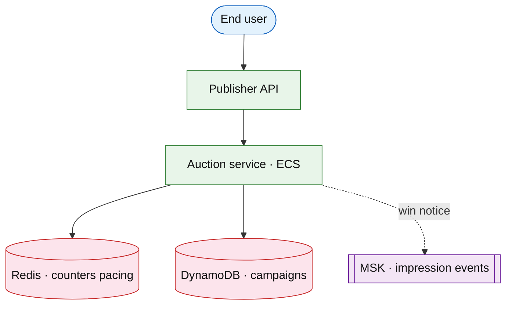

# Ads auction and pacing platform

## Introduction

Real-time **ad auction** selects sponsored placements in feed/search with **budget pacing**, **frequency caps**, and **billing events**. Latency budget is tens of milliseconds inside the request path.

**Primary users:** advertisers (campaigns), publishers (inventory), finance (billing).

**Interview pacing:** Deep dive **RTB auction + pacing + frequency cap**.

## Requirements discovery

| Lock (target) |
| --- |
| 500k ad requests/s peak |
| Auction p99 &lt; 50 ms |
| Daily budget pacing smooth |
| Frequency cap 3 impressions / user / day / campaign |

## Architecture (user → database)

**Narrative:** Each ad slot runs **second-price** or **first-price** auction among eligible campaigns passing **pacing** and **frequency** checks in Redis. **Impression/click** events stream to billing.

## Deep dive: pacing + auction

- **Pacing token bucket** per campaign per day.
- **Filter** ineligible (geo, device, budget exhausted).
- **eCPM rank** = bid × predicted CTR.

## Related

- [Feed ranking](../social/feed-ranking-service.md)
- [News feed](../social/news-feed.md)
- [ElastiCache drill](../aws/elasticache-redis.md)
