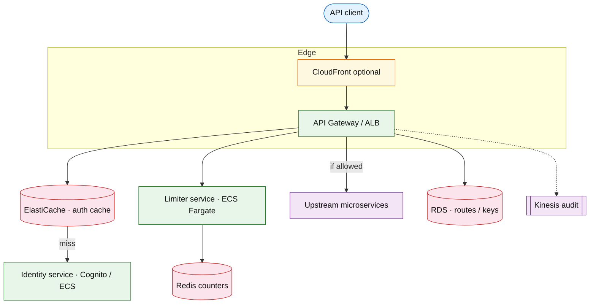

# API gateway with distributed rate limiting

## Introduction

An API gateway is the **single north-south entry** for client traffic: TLS termination, authentication, authorization, routing, and cross-cutting policies. This design places **distributed rate limiting** on the gateway hot path after identity is known, delegating counter logic to a shared limiter service while keeping **auth decisions** and **route policies** gateway-local with caching.

**Primary users:** API clients (API keys/OAuth), tenant admins (quotas per route), platform operators (429 dashboards, emergency bypass), upstream microservices (trust gateway identity headers).

**Interview pacing:** Use [60-minute runbook](../../prep/interview-runbook-60m.md) — ~10 min requirements theater (below), ~18–32 min diagram + API/DB, ~46–56 min deep dive on **auth chain + distributed throttling**.

Counter algorithms, Redis atomicity, and multi-region counter tradeoffs are detailed in [rate limiter](./rate-limiter.md) (standalone primitive). This doc focuses on **gateway composition**.

## Requirements discovery (interview theater)

### Question bank

| Topic | You ask | If they push back | Example answer (reasonable default) |
| --- | --- | --- | --- |
| Gateway role | L7 reverse proxy vs mesh? | "Service mesh only" | Managed **L7 API gateway** cluster + optional mesh mTLS inside |
| Auth | API key, JWT, mTLS? | "JWT only" | **API key** for B2B; **OAuth JWT** for user APIs; pass `tenant_id` to limiter |
| Rate limit scope | Per IP, tenant, route? | "Global cap" | **tenant_id + route**; stricter per `client_id` on sensitive routes |
| Limit strictness | 429 when Redis down? | "Fail open" | **Fail closed** at gateway for anonymous/abuse routes; configurable fail-open for premium tenants |
| Policy changes | How fast live? | "Immediate" | Policy cache TTL **60s**; bypass cache on admin write |
| Routing | Path-based to services? | "One backend" | Prefix routing `/v1/orders/*` → order service; transform paths |
| Out of scope | WAF, bot ML, GraphQL federation? | "Add WAF" | Mention WAF at CDN edge; defer GraphQL cost limits |

### Example dialogue

> **You:** Let's scope v1: one happy path and what's out of scope?
> **Them:** …
> **You:** For scale, prototype vs 12-month target?
> **Them:** …
> **You:** What does each actor do per day on the hot path?
> **Them:** …
> **You:** I'll lock **120k/s** peak ingress (~**10.4B requests/day) unless you want different numbers — next I'll convert that to monthly AWS meters in billable volume.

### Parsed requirements

| Field | Source question | Parsed value (target) | Drives |
| --- | --- | --- | --- |
| `peak_ingress_rps_q` | Peak ingress RPS (`Q`) | **120k/s** globally | Fleet totals, billable volume |
| `gateway_instances_g` | Gateway instances (`G`) | **200** stateless pods | Fleet totals, billable volume |
| `active_tenants_t` | Active tenants (`T`) | **10,000** | Fleet totals, billable volume |
| `auth_cache_hit_rate_h_auth` | Auth cache hit rate (`H_auth`) | **92%** | Fleet totals, billable volume |
| `limiter_check` | Limiter check | **`POST /v1/check` — see [rate-limiter](./rate-limiter.md)** | Fleet totals, billable volume |
| `counter_store` | Counter store | **same** | Fleet totals, billable volume |
| `gateway_p99_added_latency` | Gateway p99 added latency | **&lt; 15ms** (auth cache + limiter RTT) | Hot path, deep dive |
| `throttle_response` | Throttle response | **`Retry-After` + `X-RateLimit-*`** | Storage steady-state |

### Locked assumptions

Platform system — scale by **ingress RPS (`Q`)** and **tenants**; limiter math aligns with [rate-limiter](./rate-limiter.md). Use **target** column in interviews.

| Assumption | Prototype (MVP) | Growth | Target (anchor) |
| --- | --- | --- | --- |
| Peak ingress RPS (`Q`) | 12k/s | 60k/s | **120k/s** globally |
| Gateway instances (`G`) | 20 | 100 | **200** stateless pods |
| Active tenants (`T`) | 1,000 | 5,000 | **10,000** |
| Auth cache hit rate (`H_auth`) | 92% | 92% | **92%** |
| Limiter check | Out-of-process | same | `POST /v1/check` — see [rate-limiter](./rate-limiter.md) |
| Counter store | Redis via limiter | same | same |
| Gateway p99 added latency | &lt; 20ms | &lt; 15ms | **&lt; 15ms** (auth cache + limiter RTT) |
| Throttle response | 429 + headers | same | `Retry-After` + `X-RateLimit-*` |

*After ~10 minutes, proceed with the **target** column unless the interviewer changes scope.*

### Interview Q&A cheat sheet

Say aloud in order (~10 min). Write locks into **parsed requirements** before capacity math.

| Step | You ask | Lock if vague (target) |
| --- | --- | --- |
| 1 — Gateway role | L7 reverse proxy vs mesh? | Managed **L7 API gateway** cluster + optional mesh mTLS inside |
| 2 — Auth | API key, JWT, mTLS? | **API key** for B2B; **OAuth JWT** for user APIs; pass `tenant_id` to limiter |
| 3 — Rate limit scope | Per IP, tenant, route? | **tenant_id + route**; stricter per `client_id` on sensitive routes |
| 4 — Limit strictness | 429 when Redis down? | **Fail closed** at gateway for anonymous/abuse routes; configurable fail-open for premium tenants |
| 5 — Policy changes | How fast live? | Policy cache TTL **60s**; bypass cache on admin write |
| 6 — Routing | Path-based to services? | Prefix routing `/v1/orders/*` → order service; transform paths |
| 7 — Out of scope | WAF, bot ML, GraphQL federation? | Mention WAF at CDN edge; defer GraphQL cost limits |

## Capacity sketch

### User input model

Map **client API requests** through the gateway (not consumer DAU).

| Action | Actor | Per day (target) | Request | ~Size | Durable write |
| --- | --- | --- | --- | --- | --- |
| Ingress API call | API client | **~10.4B** (`Q × 86,400`) | proxied HTTP | 2–50 KB | none on hot path |
| Auth cache miss | gateway | **~8% of Q** | IdP lookup | 1 KB | cache fill |
| Limiter check | gateway | **100% authed** | `POST /v1/check` | 0.2 KB | see rate-limiter |
| Quota admin | tenant admin | ~500 | `PUT .../quota` | 0.5 KB | policy link row |
| Access log (optional) | gateway | sampled | log stream | 200 B | avoid full capture |

### Fleet totals (target, `Q` = 120k/s peak)

| Metric | Formula | Value |
| --- | --- | --- |
| Ingress requests / day | `Q × 86,400` | **~10.4B/day** |
| Limiter checks / s (peak) | `≈ Q` | **120k/s** |
| Auth origin lookups / s | `Q × (1 - H_auth)` | **~9.6k/s** |
| Route + key catalog | `T × ~60 KB` | **~600 MB–1 GB** |
| Gateway policy cache RAM / region | `T × 50 routes × 256 B` | **~128 MB** |

### Traffic profile (target tier)

| Metric | Value |
| --- | --- |
| **Read:write (API requests)** | **~20M:1** (ingress + limiter checks : quota admin writes) |
| **Read:write (durable bytes)** | **N/A** on hot path; route/key catalog **~1 GB** steady |
| **Requests / day (fleet)** | **~10.4B** |
| **Avg RPS** | **~120k** (`10.4B / 86,400`) |
| **Peak RPS** | **~120k** (scale tier `Q`) |

| User / actor | Action | R/W | Per user (or actor) / day | % of fleet requests |
| --- | --- | --- | --- | --- |
| API client | Ingress API call (proxied) | R | **~1.04M** / tenant (even split) | **~100%** |
| API gateway | Limiter check (per authed request) | R | 1 per ingress | (included above) |
| Tenant admin | Quota / route admin | W | **~500** fleet total | **&lt;0.001%** |

### AWS service map (target deployment)

| AWS service | Role in this design |
| --- | --- |
| Amazon CloudFront | `CDN_optional` — TLS edge, WAF attachment point |
| Amazon API Gateway (HTTP) or ALB | `API_gateway` — TLS, routing, plugin chain |
| Amazon ECS on Fargate | Gateway pods — auth, limit, proxy |
| Amazon ElastiCache (Redis) | `Auth_cache` — API key / JWT resolution |
| Amazon Cognito or ECS (IdP) | `Identity_service` — auth cache misses (~8%) |
| Amazon ECS on Fargate | `Limiter_service` — delegates to [rate-limiter](./rate-limiter.md) |
| Amazon ElastiCache (Redis) | `Counter_store` — shared limiter counters |
| Amazon RDS (PostgreSQL) | Route catalog + `api_keys` metadata |
| Amazon Kinesis | `Gateway_audit_stream` — sampled access / throttle events |
| Amazon CloudWatch / AWS X-Ray | Gateway p99, 429 by route, auth miss rate |

### Scale tiers

| Tier | Peak `Q` | Gateway pods `G` | Tenants `T` | RPS/pod | Limiter checks/s |
| --- | --- | --- | --- | --- | --- |
| Prototype | 12k/s | 20 | 1k | **600** | **12k** |
| Growth | 60k/s | 100 | 5k | **600** | **60k** |
| Target | 120k/s | 200 | 10k | **600** | **120k** |

### Symbols

| Symbol | Meaning |
| --- | --- |
| `Q` | Peak gateway ingress RPS |
| `G` | Gateway pods |
| `H_auth` | Auth cache hit ratio |
| `L` | Limiter check RTT (ms) |
| `T` | Tenants |

### Derivation (traffic)

**Per-gateway pod**

`Q / G = 120,000 / 200 = 600 RPS/pod` — moderate CPU for TLS + routing

**Auth origin load**

Miss rate `(1 - H_auth) = 8%` → `120k × 0.08 = 9,600 auth lookups/s` to identity service (cacheable)

**Limiter checks**

Assume **100%** of authenticated traffic checked → **120k checks/s** (aligns with rate-limiter doc ~100k — same order of magnitude; round to **120k** at gateway)

`L = 2ms` p99 RTT to limiter + Redis → **240ms aggregate CPU wait per second per pod** if serial — pipeline limiter call **async** or connection pool parallel; budget **~3–5ms** amortized p99 with colocation

**Policy cache RAM**

`T × routes × policy_size ≈ 10k × 50 avg routes × 256 B ≈ 128 MB` per region (gateway local cache)

**Egress**

Most traffic passes through — **multi-TB/day** — gateway scales on NIC; not unique to rate limiting

### Storage and growth over time

| Table / store | ~Row size | New rows/day | Retention | Steady-state | Per tenant |
| --- | --- | --- | --- | --- | --- |
| `api_keys` / JWT cache | 256 B | 500 | Indefinite | **10k tenants × 50 keys** → **~128 MB** | **~13 KB** |
| `route_catalog` | 300 B | 200 | versioned | **2M routes** → **~600 MB** | **~60 KB** |
| Access logs (optional) | 200 B | 10B if enabled | 7d | **~2 TB/week** | avoid on gateway |
| Limiter counters | — | — | — | See [rate-limiter](./rate-limiter.md) | — |

**Storage vs traffic (120k RPS):** Gateway **stateless** — durable footprint is **control metadata**, not per-request. **~1 GB** route + key catalog for **10k tenants**.

**Daily durable ingest:** Config **&lt; 5 MB/day**; if access logs enabled at 120k RPS: `120k × 86,400 × 200 B ≈ **2 TB/day**` (usually sampled to **&lt; 50 GB/day**).

**Per tenant-year:** **~60 KB** route metadata + **~50 KB** keys — independent of tenant's end-user count.

### Per-unit economics (target tier)

| Metric | Formula | Target value |
| --- | --- | --- |
| Ingress / tenant / day (even split) | `10.4B / T` | **~1.04M req/tenant/day** |
| Control metadata / tenant | keys + routes | **~73 KB** steady |
| Auth misses / tenant / day | `Q_day × 0.08 / T` | **~83k lookups/tenant/day** |
| Egress | dominated by payload | **multi-TB/day** fleet (not in gateway SKU) |

### Service footprint (instance count ballpark)

| Service | Scales with | Prototype | Growth | Target |
| --- | --- | --- | --- | --- |
| API gateway | `Q / G` | 20 pods | 100 pods | **200 pods** |
| Identity (auth misses) | `(1-H_auth)×Q` | 2 pods | 10 | **20** |
| Limiter service | `Q` | 5 | 25 | **50** (see rate-limiter) |
| Route catalog DB | `T` | 1 | 1 | **1** (+ replica) |

**First scale cliff:** **Growth (120k RPS)** — NIC/connection limits per pod; add pods before tuning limiter. **Auth cache cold** hits IdP before limiter.

### Billable volume (target month)

Convert **fleet totals** to AWS billing meters before dollar math. *List-price ballparks — not a quote.*

| Design quantity (target) | Formula | Monthly billable unit |
| --- | --- | --- |
| API requests | `requests_day × 30` | **derive from fleet** (**~10.4B**) |
| OLTP storage steady | storage table | **___ GB-mo** |
| Cache / Redis RAM | footprint | **___ GB** (node tier) |
| Egress / CDN | `egress_day × 30` | **___ GB / mo** |
| Stream / queue events | `events_day × 30` | **___ million events / mo** |
| Log ingest (if full capture) | `log_GB_day × 30` | **___ GB ingest / mo** |
| **Per DAU** | `total / U` (`U` = 120k/s) | **$…/DAU/mo** |

*Reconcile rows in **Cloud cost ballpark** (9a) with these meters.*

### Cost at a glance

Interview sound bite — reconcile with **billable volume** and **cloud cost** below.

| Tier | Scale | ~Monthly $ (core) | Per unit |
| --- | --- | --- | --- |
| Prototype (MVP) | `Q` = **12k/s** | **~$2k** | fixed ALB + gateway footprint |
| Growth | `Q` = **96k/s** | **~$15k** | scales with pods + limiter |
| Target (anchor) | `Q` = **120k/s**, **10k** tenants | **~$18k/mo** (gateway + limiter slice) | **~$1.80/tenant/mo** |

**First payment block:** smallest prod footprint (load balancer + database + compute) before per-million traffic dominates.

### Cloud cost ballpark (target tier)

| Line item | Driver | ~Monthly |
| --- | --- | --- |
| Gateway compute | 200 × 1 vCPU × $0.08/hr × 730h | **~$12k** |
| Limiter + Redis slice | 120k checks/s | **~$4k** (see rate-limiter) |
| IdP / auth cache backing | 9.6k miss/s peak | **~$2k** |
| Control metadata DB | ~1 GB | **~$300** |
| **Total (gateway + limiter slice)** | | **~$18k/mo** |
| **Per 1k ingress RPS** | `18k / 120` | **~$150/1k RPS/mo** |
| **Per tenant** | `18k / 10k` | **~$1.80/tenant/mo** |

Egress to upstream is usually **larger** than gateway compute — price separately in full product TCO.

### Timeline (prototype → early growth)

Assume **monthly ~2× ingress** as tenants onboard.

| Milestone | Peak `Q` | Tenants | Gateway pods | ~Monthly $ |
| --- | --- | --- | --- | --- |
| Launch | 12k/s | 1k | 20 | **~$2k** |
| Month 3 | 24k/s | 2k | 40 | **~$4k** |
| Month 6 | 48k/s | 4k | 80 | **~$8k** |
| Month 12 | 96k/s | 8k | 160 | **~$15k** |

Month 12 nears **target RPS** with half the tenant count — limiter sharding matches rate-limiter timeline.

### Sensitivity

- **10× Q** — gateway horizontal scale; limiter/Redis shard per [rate-limiter](./rate-limiter.md).
- **Auth cache cold** — identity service becomes bottleneck before limiter.
- **Fail open on outage** — upstream receives unprotected flood — explicit product risk.

## High-level design

### Architecture (user → database)



**Narrative:** Request hits **API gateway** → validate TLS → extract API key/JWT → resolve **tenant_id** and scopes (cache-first) → build limiter key `tenant:acme:route:/v1/search` → **limiter check** → if allowed, inject `X-Tenant-Id`, `X-Request-Id` and proxy to **upstream**. Denied requests return **429** without touching origin. Decisions stream to **audit** asynchronously.

### Gateway plugin chain (order matters)

```text
1. Request ID / tracing
2. TLS / HTTP normalization
3. Authentication (identity)
4. Authorization (route scope)
5. Rate limiting (tenant + route)
6. Routing / load balance
7. Response transform / logging
```

Rate limit **after** auth so keys are meaningful; **before** upstream to protect origins.

## User-visible surface

- **API client:** consistent `401`/`403`/`429`; rate limit headers on success and throttle.
- **Tenant admin:** set quotas per route tier via admin API (backed by limiter policies).
- **Operator:** global kill switch for abusive tenant; dashboard 429 by route; bypass token (audited).

## API contract and input model

### UX → API traceability

| UX / UI action | User intent | API or event | Sync/async | Idempotent? | Validates |
| --- | --- | --- | --- | --- | --- |
| Call protected API | invoke upstream route | Proxied `GET/POST …` via gateway | sync | read / idempotency-key on writes | auth + scope + quota |
| Receive throttle | stay under quota | `429` + `Retry-After` | sync | n/a | limiter policy |
| Set route quota | cap tenant traffic | `PUT …/quota` (admin) | sync | yes | tenant admin role |
| Emergency bypass | stop abuse wave | operator bypass flag | sync | yes | audit logged |
| (internal) limiter check | admission decision | `POST /v1/check` → [rate-limiter](./rate-limiter.md) | sync | read | composite key |

### Client-facing (ingress)

Clients call upstream routes through gateway base URL, e.g. `https://api.example.com/v1/orders`.

Required headers (example B2B)

```http
Authorization: Bearer <api_key_or_jwt>
X-Client-Request-Id: optional-uuid
```

Throttled response:

```http
HTTP/1.1 429 Too Many Requests
Retry-After: 12
X-RateLimit-Limit: 1000
X-RateLimit-Remaining: 0
X-RateLimit-Reset: 1716372060
Content-Type: application/json
```

```json
{
 "error": "rate_limit_exceeded",
 "message": "Tenant quota exceeded for route /v1/search",
 "tenant_id": "tenant_acme"
}
```

Allowed response (excerpt)

```http
HTTP/1.1 200 OK
X-RateLimit-Limit: 1000
X-RateLimit-Remaining: 847
X-RateLimit-Reset: 1716372060
```

Gateway injects to upstream:

```http
X-Tenant-Id: tenant_acme
X-Authenticated-Client-Id: client_2201
X-Gateway-Request-Id: gw_req_9f2a1c
X-RateLimit-Decision: allow
```

### Admin / control plane

| Method | Path | Purpose |
| --- | --- | --- |
| `PUT` | `/v1/admin/tenants/{tenant_id}/routes/{route}/quota` | Set limit/burst (proxies to limiter policy API) |
| `POST` | `/v1/admin/tenants/{tenant_id}/bypass` | Temporary throttle bypass (audit) |
| `GET` | `/v1/admin/tenants/{tenant_id}/usage` | Aggregated 429 and usage stats |

`PUT` quota example:

```json
{
 "limit": 2000,
 "window_seconds": 60,
 "burst": 400,
 "algorithm": "token_bucket"
}
```

### Internal limiter call (gateway → limiter)

From [rate-limiter](./rate-limiter.md)

```json
{
 "key": "tenant:tenant_acme:route:/v1/search",
 "cost": 1
}
```

### Input validation

- Reject missing/invalid credentials before limiter (401).
- Map unknown tenant to anonymous bucket with stricter limits.
- Normalize route template: `/v1/orders/{id}` not raw IDs in policy keys.
- Max request body size at gateway (protect upstream).

## Database model

Gateway-owned stores (limiter owns `rate_policies` / counters — see [rate-limiter](./rate-limiter.md)

| Store | Key fields | Notes |
| --- | --- | --- |
| `gateway_routes` | `route_id`, `path_prefix`, `upstream_cluster`, `auth_required`, `scopes` | Routing table |
| `api_keys` / `jwt_cache` | key → `tenant_id`, `client_id`, `scopes`, `expires_at` | Auth cache backing |
| `tenant_quota_bindings` | `tenant_id`, `route`, `policy_id` | Link to limiter policy |
| `gateway_audit` | `request_id`, `tenant_id`, `route`, `decision`, `latency_ms`, `at` | Async stream |

Indexes:

- `gateway_routes(path_prefix)` longest-prefix match
- `api_keys(key_hash)` UNIQUE

### Read/write paths

1. **Request ingress** — match route → authenticate (cache/IdP) → authorize scope → limiter check → proxy or 429.
2. **Policy admin** — write limiter policy via control API → invalidate gateway local policy cache entry.
3. **Audit** — emit allow/deny with latency breakdown (`auth_ms`, `limiter_ms`, `upstream_ms`).

## Interview deep dive: Auth chain + distributed throttling

### Auth chain latency

| Step | Typical cost | Cache |
| --- | --- | --- |
| API key lookup | 0.1ms hit / 5–20ms miss | Redis local to gateway |
| JWT verify (local) | 0.5–2ms | JWKS cache 1h |
| JWT introspection | 10–50ms | Cache `sub` → tenant 5 min |

**Interview point:** rate limiting keys off **stable tenant_id**, not raw IP (NAT/shared mobile).

### Authz before throttle

- Scope check: `orders:write` for `POST /v1/orders` — fail **403** before spending limiter budget on unauthorized callers.
- Optional **separate limiter buckets** for failed auth (brute-force protection on `/oauth/token`).

### Composing distributed throttling

| Concern | Gateway | Limiter service |
| --- | --- | --- |
| Key construction | `tenant + route template` | Atomic decrement |
| Policy CRUD | Admin UX | Source of truth |
| 429 body/headers | Standardize for clients | Returns remaining/limit |
| Fail closed/open | Per-tenant policy flag | Redis HA |

**Do not** embed Redis client in every gateway pod for counters — centralize in limiter for consistent Lua scripts ([rate-limiter deep dive](./rate-limiter.md).

### Local edge cache (optional)

- Gateway may cache **last allow** for 100–200ms for same key — risks slight overshoot — mention only if interviewer trades latency vs accuracy.
- Default: **no** local counter cache; every request checks limiter at 120k RPS with connection pooling.

### CDN / edge rate limit

- Coarse IP limits at CDN for DDoS; **fine tenant limits** at gateway — two layers, different keys.

## Scale and failure

### Correctness model

- Authenticated identity on upstream requests matches gateway validation (signed internal headers or mTLS hop).
- Throttle decision consistent with limiter service for a given key at check time (eventual consistency across regions per rate-limiter doc).
- Policy changes visible within cache TTL unless invalidated.

### Failure cases

| Failure | Symptom | Mitigation |
| --- | --- | --- |
| Identity service down | Auth cache miss failures | Extend cache TTL emergency; stale-while-revalidate |
| Limiter/Redis down | Mass 429 or fail-open flood | Fail closed default; tenant fail-open allowlist; limiter HA |
| Gateway pod loss | LB removes | Stateless pods |
| Hot tenant route | Noisy neighbor 429 | Per-tenant quota; dedicated shard in limiter |
| Policy cache stale | Wrong limit briefly | Invalidate on write; version header in policy |
| Upstream slow | Gateway thread exhaustion | Timeouts; max connections; circuit breaker independent of 429 |

### Key metrics

- Gateway p99 latency breakdown (auth / limiter / upstream)
- 429 rate by `tenant_id`, `route`
- Auth cache hit ratio
- Limiter check error rate and RTT
- Bypass usage count (should be rare)
- Upstream error rate vs gateway-generated 429

### Interview deep dive talking points

- Draw **plugin order**: auth → authz → limit → route.
- Split **gateway** vs [rate limiter](./rate-limiter.md) responsibilities — link, do not duplicate Redis deep dive.
- **Fail closed** at gateway for abuse; premium fail-open is explicit contract.
- Route template keys — avoid unbounded cardinality from raw IDs.
- Two-layer limits: CDN IP coarse + gateway tenant fine.

## Related

- [Examples hub](./README.md)
- [Rate limiter](./rate-limiter.md) (counter primitive)
- [Feature flag platform](./feature-flag-platform.md)
- [Cross-service audit logging](./cross-service-audit-logging.md)
- [HTTP error handling / API design](../../topics/api-design.md)
- [60-minute runbook](../../prep/interview-runbook-60m.md)
