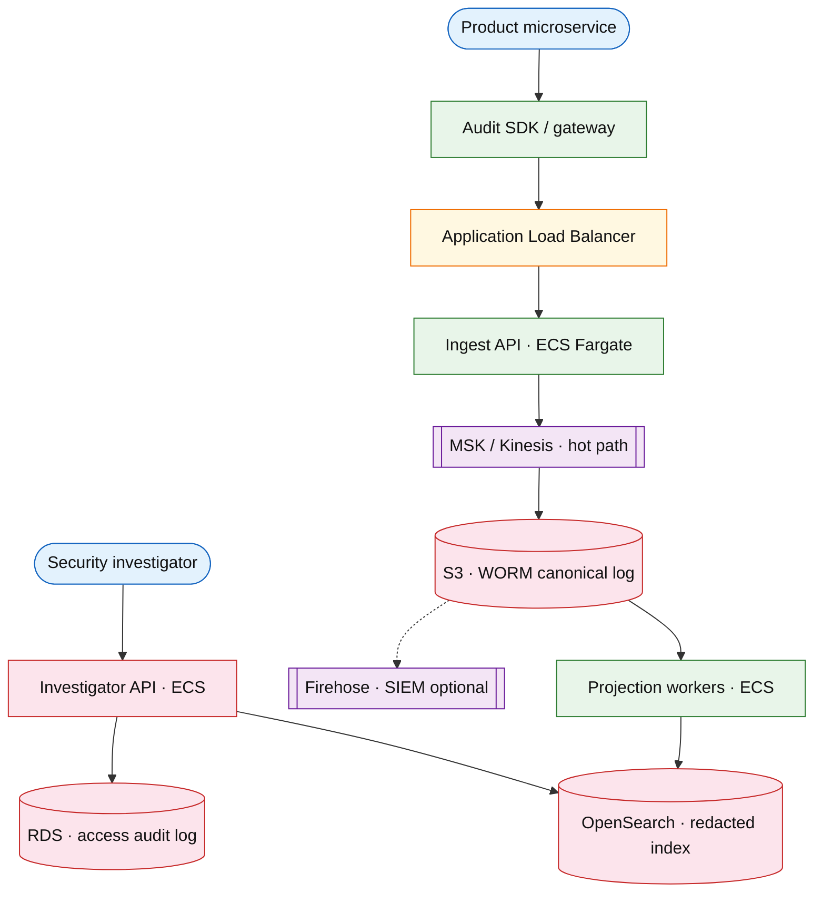

# Cross-service audit logging

## Introduction

Cross-service audit logging collects **normalized, immutable events** from many product services for compliance, security investigations, and operator forensics. Services emit via SDK; a central **append-only log** is the source of truth; **redacted projections** power investigator queries without exposing raw PII on the hot path.

**Primary users:** application services (emitters), security/compliance investigators (query), platform SRE (projection lag, retention), auditors (export bundles).

**Interview pacing:** Use [60-minute runbook](../../prep/interview-runbook-60m.md) — ~10 min requirements theater (below), ~18–32 min diagram + API/DB, ~46–56 min deep dive on **immutable event log + query projection**.

Application logs ≠ audit log: audit events are **business-meaningful actions** with actor/target, not debug traces. Overlaps [blockchain settlement and audit](../fintech/blockchain-settlement-audit.md) when interviewer asks for external anchoring — optional extension.

## Requirements discovery (interview theater)

### Question bank

| Topic | You ask | If they push back | Example answer (reasonable default) |
| --- | --- | --- | --- |
| Immutability | Can events be deleted/edited? | "GDPR erase" | **Append-only** canonical log; GDPR via **tombstone + projection redaction**, not silent delete |
| Retention | How long? | "Forever" | **7 years** hot queryable; cold archive after; legal hold pins |
| Volume | Events per day? | "Moderate" | **2B audit events/day** (~23k/s average) |
| Query patterns | By actor? Target? Time? | "Free text search" | Filter: `actor`, `action`, `target`, time range; full-text on redacted fields only |
| PII | What is stored? | "Everything" | Canonical stores **hashed/tokenized** sensitive fields; projection applies redaction policy |
| Latency | Real-time investigations? | "Batch is fine" | Ingest ack **&lt; 100ms**; query index **&lt; 60s** behind log |
| Out of scope | SIEM replacement, APM? | "Replace Splunk" | Structured audit platform; forward to SIEM as sink optional |

### Example dialogue

> **You:** Let's scope v1: one happy path and what's out of scope?
> **Them:** …
> **You:** For scale, prototype vs 12-month target?
> **Them:** …
> **You:** What does each actor do per day on the hot path?
> **Them:** …
> **You:** I'll lock **~2B** audit events/day (~**23k/s** avg) unless you want different numbers — next I'll convert that to monthly AWS meters in billable volume.

### Parsed requirements

| Field | Source question | Parsed value (target) | Drives |
| --- | --- | --- | --- |
| `events_/_day_e_day` | Events / day (`E_day`) | **2B** (~23k/s avg) | Scale tiers, input model, fleet totals |
| `peak_ingest_e_peak` | Peak ingest (`E_peak`) | **150k/s** | Scale tiers, input model, fleet totals |
| `emitting_services` | Emitting services | **400** | Scale tiers, input model, fleet totals |
| `canonical_event_size_b_canon` | Canonical event size (`B_canon`) | **hashed metadata, no raw PII** | Scale tiers, input model, fleet totals |
| `retention_queryable` | Retention (queryable) | **same** | Storage steady-state |
| `canonical_store` | Canonical store | **WORM / Kafka + object store** | Scale tiers, input model, fleet totals |
| `query_projection` | Query projection | **OpenSearch-style** | Scale tiers, input model, fleet totals |
| `investigator_access` | Investigator access | **audit every audit query** | Scale tiers, input model, fleet totals |

### Locked assumptions

Platform system — scale by **events/day (`E_day`)** and **emitting services**, not consumer DAU. Use **target** column in interviews.

| Assumption | Prototype (MVP) | Growth | Target (anchor) |
| --- | --- | --- | --- |
| Events / day (`E_day`) | 200M | 1B | **2B** (~23k/s avg) |
| Peak ingest (`E_peak`) | 15k/s | 75k/s | **150k/s** |
| Emitting services | 40 | 200 | **400** |
| Canonical event size (`B_canon`) | 512 B | same | hashed metadata, no raw PII |
| Retention (queryable) | 7 years | same | same |
| Canonical store | append-only log | same | WORM / Kafka + object store |
| Query projection | redacted index | same | OpenSearch-style |
| Investigator access | RBAC | same | **audit every audit query** |

*After ~10 minutes, proceed with the **target** column unless the interviewer changes scope.*

### Interview Q&A cheat sheet

Say aloud in order (~10 min). Write locks into **parsed requirements** before capacity math.

| Step | You ask | Lock if vague (target) |
| --- | --- | --- |
| 1 — Immutability | Can events be deleted/edited? | **Append-only** canonical log; GDPR via **tombstone + projection redaction**, not silent delete |
| 2 — Retention | How long? | **7 years** hot queryable; cold archive after; legal hold pins |
| 3 — Volume | Events per day? | **2B audit events/day** (~23k/s average) |
| 4 — Query patterns | By actor? Target? Time? | Filter: `actor`, `action`, `target`, time range; full-text on redacted fields only |
| 5 — PII | What is stored? | Canonical stores **hashed/tokenized** sensitive fields; projection applies redaction policy |
| 6 — Latency | Real-time investigations? | Ingest ack **&lt; 100ms**; query index **&lt; 60s** behind log |
| 7 — Out of scope | SIEM replacement, APM? | Structured audit platform; forward to SIEM as sink optional |

## Capacity sketch

### User input model

| Action | Actor | Per day (target) | API | ~Size | Durable write |
| --- | --- | --- | --- | --- | --- |
| Emit audit event | microservice SDK | **2B** | `POST /v1/audit/events` | 512 B canon | **400 B** compressed |
| Batch emit | SDK | subset | `:batch` | 512 B × N | same |
| Investigator search | investigator | **~10k queries** | `GET /v1/audit/events` | 4 KB resp | query audit row |
| Projection rebuild | admin | rare | replay job | — | re-index |

### Fleet totals (target)

| Metric | Formula | Value |
| --- | --- | --- |
| Events / day | `E_day` | **2B** |
| Avg ingest RPS | `E_day / 86,400` | **~23k/s** |
| Peak ingest RPS | `E_peak` | **150k/s** |
| Canonical ingest / day | `2B × 400 B` | **~800 GB/day** compressed |
| Events / emitting service / day | `E_day / 400` | **~5M** |
| 7y canonical (compressed) | `2B × 365 × 7 × 400 B` | **~2 PB** (+ replication **~5–7 PB**) |
| Search index growth | subset | **~400 TB** hot (2y) |

### Traffic profile (target tier)

| Metric | Value |
| --- | --- |
| **Read:write (API requests)** | **~200k:1** (emit : investigator search) |
| **Read:write (durable bytes)** | **~80k:1** (canonical ingest : query responses) |
| **Requests / day (fleet)** | **~2B** |
| **Avg RPS** | **~23k** (`E_day / 86,400`) |
| **Peak RPS** | **~150k** (scale tier `E_peak`) |

| User / actor | Action | R/W | Per user (or actor) / day | % of fleet requests |
| --- | --- | --- | --- | --- |
| Microservice (emitter) | Emit audit event | W | **~5M** / service (400 services) | **~100%** |
| Investigator | Search / export | R | **~10k** queries fleet | **&lt;0.001%** |
| Admin | Projection rebuild | W | rare | negligible |

### AWS service map (target deployment)

| AWS service | Role in this design | Monthly meter (target) |
| --- | --- | --- |
| Application Load Balancer | Ingest + investigator APIs | **~2B** events/mo ingest |
| Amazon ECS on Fargate | Ingest API + **40** projection workers | **~45** pods · vCPU-h |
| Amazon MSK (or Kinesis) | Hot path to canonical log | **~800 GB/day** ingress |
| Amazon S3 | WORM canonical — 7y retention | **~2 PB** steady (tiered) |
| Amazon OpenSearch Service | Redacted query index | **~400 TB** hot (2y) |
| Amazon Kinesis Data Firehose | Optional SIEM forwarder | egress GB |
| Amazon RDS (PostgreSQL) | Investigator access audit log | append-only |
| AWS KMS | Envelope encryption / hash chain | per-key |
| Amazon CloudWatch / AWS X-Ray | Ingest lag, projection freshness | metrics |

### Scale tiers

| Tier | `E_day` | `E_peak` | Services | Avg ingest RPS | Peak ingest RPS |
| --- | --- | --- | --- | --- | --- |
| Prototype | 200M | 15k/s | 40 | **~2.3k** | **15k** |
| Growth | 1B | 75k/s | 200 | **~11.6k** | **75k** |
| Target | 2B | 150k/s | 400 | **~23k** | **150k** |

### Symbols

| Symbol | Meaning |
| --- | --- |
| `E_day` | Audit events per day |
| `E_peak` | Peak ingest events/s |
| `B_canon` | Bytes per canonical event (avg) |
| `B_proj` | Bytes per projection doc (redacted) |
| `R` | Retention years |

### Derivation (traffic)

**Average ingest**

`E_day = 2B` → `23,150/s`

**Peak ingest**

`E_peak = 150,000/s` (security incident — many services logging denials)

**Ingress bandwidth**

`B_canon ≈ 512 B` (ids, action, target, metadata hash, no raw PII)
`150k × 512 B ≈ 77 MB/s` peak (+ replication → **~150–230 MB/s**)

**Canonical storage (7 years)**

`2B × 365 × 7 ≈ 5.1 × 10^12` events — **petabyte scale**
At 512 B → **~2.5 PB** raw (+ replication 3× → plan **~7 PB** interview ballpark)
**Tiering:** hot log 90 days, warm object store, cold glacier with manifest

**Projection index**

Index **30–50%** of fields; `B_proj ≈ 1 KB` redacted doc
If index 100% events: **~2 TB/day** index growth → shard by time; ILM delete per policy

**Query load**

Investigations rare vs ingest — **100 QPS** peak complex queries; cache frequent filters

### Storage and growth over time

| Tier | ~Record size | Ingest/day | Retention | Steady-state | Per emitting service |
| --- | --- | --- | --- | --- | --- |
| Canonical log (WORM/S3) | 400 B compressed | 2B | 7 years | **~2 TB/day** → **~5 PB** 7y | **~5M events/day** |
| Search projection | 600 B indexed | 2B (subset fields) | 2y hot | **~400 TB** hot index | same |
| Query audit | 300 B | 10k | 7 years | **&lt; 10 GB** | investigator actions |

**Cumulative canonical:**

| Horizon | Events | Compressed (`× 400 B`) |
| --- | --- | --- |
| 1 year | 730B | **~290 TB** |
| 5 years | 3.65T | **~1.5 PB** |

**Storage vs fleet (400 services):** **~5 GB/service/day** ingest (**~2 TB / 400**). **Not** tied to end-user count — scales with **microservice action rate**.

**Daily durable ingest:** **~800 GB/day** compressed log; search tier **~1.2 TB/day** if indexing 100% fields (usually sample/redact).

### Per-unit economics (target tier)

| Metric | Formula | Target value |
| --- | --- | --- |
| Events / emitting service / day | `E_day / 400` | **~5M** |
| Canonical bytes / service / day | `5M × 400 B` | **~2 GB** |
| Canonical bytes / event | compressed | **~400 B** |
| Projection bytes / event (indexed) | `B_proj` | **~600 B–1 KB** |
| Investigator queries / day | rare | **~10k** |

### Service footprint (instance count ballpark)

| Service | Scales with | Prototype | Growth | Target |
| --- | --- | --- | --- | --- |
| Ingest API | `E_peak` | 5 pods | 20 | **40** |
| Canonical log partitions | `E_day` | 10 | 50 | **100+** |
| Projection consumers | lag SLA | 5 | 20 | **40** |
| Search cluster | index size | 3 nodes | 15 | **30+ nodes** |
| Investigator API | query QPS | 2 | 5 | **10** |

**First scale cliff:** **Growth (1B events/day)** — projection consumer lag; shard log by `tenant_id` + day before expanding search nodes blindly.

### Billable volume (target month)

Convert **fleet totals** to AWS billing meters before dollar math. *List-price ballparks — not a quote.*

| Design quantity (target) | Formula | Monthly billable unit |
| --- | --- | --- |
| API requests | `requests_day × 30` | **derive from fleet** (**~2B**) |
| OLTP storage steady | storage table | **___ GB-mo** |
| Cache / Redis RAM | footprint | **___ GB** (node tier) |
| Egress / CDN | `egress_day × 30` | **___ GB / mo** |
| Stream / queue events | `events_day × 30` | **___ million events / mo** |
| Log ingest (if full capture) | `log_GB_day × 30` | **___ GB ingest / mo** |
| **Per unit** | `total / scale driver` | **$…/unit/mo** |

*Reconcile rows in **Cloud cost ballpark** (9a) with these meters.*

### Cost at a glance

Interview sound bite — reconcile with **billable volume** and **cloud cost** below.

| Tier | Scale | ~Monthly $ (core) | Per unit |
| --- | --- | --- | --- |
| Prototype (MVP) | **200M** events/day | **~$15k** | small ingest + index |
| Growth | **1B**/day, **75k/s** peak | **~$50k** | S3 + OpenSearch grow |
| Target (anchor) | **2B**/day, **150k/s** peak, **400** services | **~$130k/mo** | **~$65/B events** (tiering critical) |

**First payment block:** smallest prod footprint (load balancer + database + compute) before per-million traffic dominates.

### Cloud cost ballpark (target tier)

| Line item | Driver | ~Monthly |
| --- | --- | --- |
| Ingest compute | 40 pods | **~$5k** |
| Canonical object (800 GB/day tiered) | 2 PB over 7y amortized | **~$80k** (heavy; tiering critical) |
| Search hot index | 400 TB | **~$40k** |
| Projection workers | 40 consumers | **~$8k** |
| **Total (order-of-magnitude)** | | **~$130k/mo** |
| **Per 1B events** | `130k / 2` | **~$65/B events/mo** |
| **Per emitting service** | `130k / 400` | **~$325/service/mo** |

Interview: **tiering + sampling** can drop canonical/search cost **5–10×** — state assumptions explicitly.

### Timeline (prototype → early growth)

Assume **monthly ~2× event volume** as more services adopt the SDK.

| Milestone | `E_day` | `E_peak` | Canonical / day | ~Monthly $ |
| --- | --- | --- | --- | --- |
| Launch | 200M | 15k/s | **~80 GB** | **~$15k** |
| Month 3 | 400M | 30k/s | **~160 GB** | **~$25k** |
| Month 6 | 800M | 60k/s | **~320 GB** | **~$50k** |
| Month 12 | 1.6B | 120k/s | **~640 GB** | **~$90k** |

Month 12 is **growth-tier** ingest — enforce hashed canonical fields before **2B/day** target.

### Sensitivity

- **10× ingest** — partition log by `tenant_id` + time; SDK backpressure.
- **Full payload in canonical** — storage and compliance risk explode — stay hashed.
- **Sub-second query freshness** — more projection consumers; cost ↑.

## High-level design

### Architecture (user → database)



**Narrative:** Services call **Audit SDK** (batch + async) → **Ingest API** validates schema, assigns `event_id`, appends to **canonical log** (immutable). **Projection workers** read the log, apply redaction policy, write **query index**. **Investigator API** runs RBAC-filtered searches and logs every query to **audit access log**. Optional forwarder ships copy to SIEM.

## User-visible surface

- **Engineer:** SDK call `audit.emit({ actor, action, target, metadata })` — non-blocking with local buffer.
- **Investigator:** search UI / API — filter by actor, action, target, time; export signed bundle for legal.
- **Security:** replay projection from offset after bug; detect ingest tamper via hash chain (optional).

## API contract and input model

### UX → API traceability

| UX / UI action | User intent | API or event | Sync/async | Idempotent? | Validates |
| --- | --- | --- | --- | --- | --- |
| **Engineer:** SDK call `audit.emit({ actor, action, target, | Ingest (SDK / gateway) | `POST` `/v1/audit/events` | sync | yes | domain rules |
| **Investigator:** search UI / API — filter by actor, action, | Batch ingest | `POST` `/v1/audit/events:batch` | sync | yes | domain rules |
| **Security:** replay projection from offset after bug; detec | Investigator search (RBAC) | `GET` `/v1/audit/events` | sync | read | domain rules |
| See user-visible surface | Single event (redacted view) | `GET` `/v1/audit/events/{event_id}` | async | read | domain rules |
| See user-visible surface | Rebuild projection from offset (internal) | `POST` `/v1/admin/audit/replay` | sync | yes | domain rules |
### Endpoints

| Method | Path | Purpose |
| --- | --- | --- |
| `POST` | `/v1/audit/events` | Ingest (SDK / gateway) |
| `POST` | `/v1/audit/events:batch` | Batch ingest |
| `GET` | `/v1/audit/events` | Investigator search (RBAC) |
| `GET` | `/v1/audit/events/{event_id}` | Single event (redacted view) |
| `POST` | `/v1/admin/audit/replay` | Rebuild projection from offset (internal) |

### Example payloads

`POST /v1/audit/events`

```json
{
 "event_id": "evt_01HZXK9Q2M3N4P5Q6R7S8T9U0",
 "schema_version": 3,
 "occurred_at": "2026-05-22T20:00:00.123Z",
 "tenant_id": "tenant_acme",
 "actor": {
 "type": "user",
 "id": "cust_9912",
 "ip_hash": "sha256:ab12..."
 },
 "action": "payment.refund.created",
 "target": {
 "type": "payment",
 "id": "pay_7d3e9b"
 },
 "metadata": {
 "amount_cents": 3998,
 "reason_code": "customer_request",
 "order_id": "ord_8f2a1c"
 },
 "trace_id": "trace_abc123",
 "correlation_id": "corr_7b3c"
}
```

Response `202 Accepted`:

```json
{
 "accepted": true,
 "event_id": "evt_01HZXK9Q2M3N4P5Q6R7S8T9U0",
 "seq": 918273645
}
```

`GET /v1/audit/events?actor_id=cust_9912&action=payment.*&from=2026-05-01T00:00:00Z&to=2026-05-22T23:59:59Z&limit=50`

```json
{
 "query_id": "qry_8f2a",
 "events": [
 {
 "event_id": "evt_01HZXK9Q2M3N4P5Q6R7S8T9U0",
 "occurred_at": "2026-05-22T20:00:00.123Z",
 "actor_id": "cust_9912",
 "action": "payment.refund.created",
 "target_id": "pay_7d3e9b",
 "metadata_redacted": {
 "amount_cents": 3998,
 "reason_code": "customer_request"
 }
 }
 ],
 "next_cursor": "eyJvZmZzZXQiOjUwfQ"
}
```

### Input validation

- `event_id`: client-generated UUID OK if idempotent; server may override on collision.
- `schema_version` must be registered; unknown version → reject or quarantine lane.
- `action`: namespaced string `domain.verb` pattern.
- `metadata` size cap (e.g. 8 KB); PII fields must use `*_hash` or token keys per schema.
- Investigator queries require OAuth + `investigator` role; log `query_id` + filter hash.

## Database model

### Stores

| Store | Key fields | Notes |
| --- | --- | --- |
| `audit_log` (canonical) | `seq`, `event_id`, `tenant_id`, `actor`, `action`, `target`, `metadata_canonical`, `occurred_at`, `schema_version`, `prev_hash` (optional) | Append-only; WORM |
| `audit_projection` | index keys → `event_id`, redacted payload | Search |
| `audit_access_log` | `query_id`, `investigator_id`, `filter_hash`, `result_count`, `at` | Who searched what |
| `schema_registry` | `action`, `version`, `json_schema` | Validation |
| `legal_holds` | `hold_id`, `target_predicate`, `until` | Blocks TTL delete |

Indexes (projection)

- `actor_id`, `action`, `target_id`, `occurred_at`, `tenant_id` — compound search

### Read/write paths

1. **Ingest** — validate schema → append to `audit_log` partition (`tenant_id` + day) → ack 202.
2. **Project** — consumer reads log offset → redact per policy → upsert search doc.
3. **Query** — investigator API → RBAC filter injection (tenant scope) → search index → write `audit_access_log`.
4. **Replay** — admin resets projection consumer offset → rebuild index (idempotent upsert by `event_id`).
5. **GDPR erasure** — tombstone event in registry + purge/redact projection docs; canonical retains hash-only record with erasure marker (legal policy dependent).

## Interview deep dive: Immutable event log + query projection

### Canonical log properties

| Property | Mechanism |
| --- | --- |
| Append-only | No UPDATE/DELETE on canonical; object-lock / WORM |
| Durability | Replicate 3 AZ; checksum per record |
| Ordering | Per-partition monotonic `seq` |
| Integrity (optional) | Hash chain `prev_hash` for tamper evidence |

**Why not query the log directly:** PB scale and full scans are too slow; projections optimize investigator access patterns.

### Projection vs canonical

| Layer | Content | Audience |
| --- | --- | --- |
| **Canonical** | Hashed/tokenized metadata; complete for legal export | Compliance archive |
| **Projection** | Redacted, indexed fields | Daily investigations |
| **SIEM sink** | Copy stream | Real-time alerting |

**Repair:** projection bug → replay from offset; canonical unchanged.

### PII and redaction

- Schema declares sensitivity per field (`email` → store `email_hash` only).
- Projection worker drops or masks fields per role — investigator never sees raw email in index.
- **Query audit:** meta-audit prevents insider trawling without trace.

### RBAC on read

- Tenant isolation enforced in API (not trusting client filter).
- Field-level security: junior investigator sees actions but not `metadata.amount` if policy says so.
- Export bundle: signed ZIP from canonical for legal — separate approval workflow.

## Scale and failure

### Correctness model

- Accepted ingest events are never lost after ack (durability SLA 11 nines on object store discussion).
- `event_id` idempotent ingest — duplicate SDK retry does not double-append (dedupe at ingest or unique in partition).
- Projections are **eventually consistent**; investigator sees lag bound (e.g. 60s p99).
- Query results respect RBAC at query time even if projection was built with richer fields (API filter).

### Failure cases

| Failure | Symptom | Mitigation |
| --- | --- | --- |
| SDK buffer full | App logs dropped locally | Backpressure; spill to disk queue; alert emitter |
| Ingest overload | 503 to SDK | Autoscale ingest; rate limit per service |
| Projection lag | Stale investigations | Scale consumers; priority lane for security actions |
| Bad schema deploy | Quarantine events | Schema registry versioning; reject unknown |
| Index corruption | Wrong search hits | Replay projection from last known good offset |
| Insider query abuse | Undetected browsing | `audit_access_log` alerts on broad filters |
| Retention job bug | Early delete | Legal hold pins; two-person rule for admin deletes |

### Key metrics

- Ingest RPS; ack latency p99
- Canonical lag vs ingest; storage growth per tenant
- Projection consumer lag (seconds behind log tail)
- Query latency; queries per investigator
- Quarantine rate; replay job duration
- Meta-audit: broad query pattern detections

### Interview deep dive talking points

- Walk **2B/day, PB retention, 150k/s peak** before boxes.
- Split **canonical immutable** vs **redacted projection** — repair via replay.
- PII: hash in canonical, redact in index; GDPR tombstone without pretending delete never happened.
- **Audit the auditor** — `audit_access_log` on every investigator query.
- Optional: hash chain / WORM for tamper evidence if interviewer pushes compliance.

## Related

- [Examples hub](./README.md)
- [Event-driven order pipeline](../event-driven/event-driven-order-pipeline.md)
- [Notification platform](./notification-platform.md)
- [Blockchain settlement and audit](../fintech/blockchain-settlement-audit.md)
- [Payment workflow platform](../fintech/payment-workflow-platform.md)
- [60-minute runbook](../../prep/interview-runbook-60m.md)
