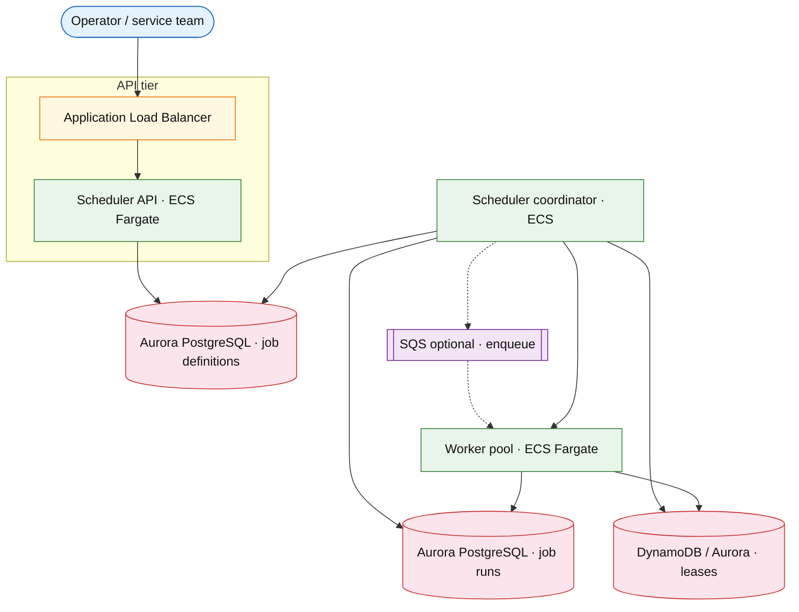

# Distributed job scheduler

## Introduction

A distributed job scheduler runs **recurring (cron-like)** and **one-off** background work across a pool of workers. Coordinators enqueue runs at schedule time; workers **claim leases** so duplicate execution stays rare and observable. Jobs may last seconds to hours, so leases support **heartbeats** and safe retry after crashes.

**Primary users:** service teams (register jobs), operators (pause, inspect runs, replay failures), platform SRE (queue lag, duplicate-run alerts).

**Interview pacing:** Use [60-minute runbook](../../topics/interview-runbook-60m.md) — ~10 min requirements theater (below), ~18–32 min diagram + API/DB, ~46–56 min deep dive on **lease model + duplicate suppression**.

Distinct from [stream processing platform](../event-driven/stream-processing-platform.md) (continuous partitioned streams) and from [notification platform](./notification-platform.md) (fanout deliveries).

## Requirements discovery (interview theater)

### Question bank

| Topic | You ask | If they push back | Example answer (reasonable default) |
| --- | --- | --- | --- |
| Job types | Cron only or DAG workflows? | "Simple cron" | Cron + one-off; **no DAG** v1 (mention extension) |
| Execution guarantee | Exactly-once? | "Never duplicate" | **At-least-once**; duplicates rare via lease; idempotent job handlers |
| Schedule precision | Missed fire OK? | "Hard real-time" | **Within ~30s** of `next_run_at` p99; not sub-second |
| Duration | Short vs long jobs? | "All quick" | 1s–2h; heartbeats every 30s; lease TTL 90s default |
| Tenancy | Single or multi-tenant? | "Internal only" | 5k tenants; fair scheduling per tenant |
| Scale | Jobs defined? Runs per day? | "Thousands" | 50k active job definitions; **10M runs/day** |
| Out of scope | Full workflow UI, K8s CronJob? | "Use K8s" | Platform scheduler product; K8s is deployment detail |

### Example dialogue

> **You:** Let's scope v1: one happy path and what's out of scope?
> **Them:** …
> **You:** For scale, prototype vs 12-month target?
> **Them:** …
> **You:** What does each actor do per day on the hot path?
> **Them:** …
> **You:** I'll lock the **target** column assumptions unless you want different numbers — next I'll map fleet totals to monthly AWS meters in **billable volume**.

### Parsed requirements

| Field | Source question | Parsed value (target) | Drives |
| --- | --- | --- | --- |
| `active_job_definitions_j` | Active job definitions (`J`) | **50,000** | Scale tiers, input model, fleet totals |
| `runs_/_day_r_day` | Runs / day (`R_day`) | **10M** (~116/s avg) | Scale tiers, input model, fleet totals |
| `peak_enqueue_r_peak` | Peak enqueue (`R_peak`) | **2,000/s** (cron alignment) | Scale tiers, input model, fleet totals |
| `tenants` | Tenants | **5,000** | Scale tiers, input model, fleet totals |
| `coordinators` | Coordinators | **3–5** (leader election) | Scale tiers, input model, fleet totals |
| `workers_w` | Workers (`W`) | **500** elastic pool | Scale tiers, input model, fleet totals |
| `lease_ttl_/_heartbeat` | Lease TTL / heartbeat | **same** | Storage steady-state |
| `max_retries` | Max retries | **same** | Scale tiers, input model, fleet totals |
| `duplicate_runs_target` | Duplicate runs target | **lease + idempotent handlers** | Scale tiers, input model, fleet totals |

### Locked assumptions

Platform system — scale by **runs/day (`R_day`)** and **job definitions (`J`)**, not consumer DAU. Use **target** column in interviews.

| Assumption | Prototype (MVP) | Growth | Target (anchor) |
| --- | --- | --- | --- |
| Active job definitions (`J`) | 5,000 | 25,000 | **50,000** |
| Runs / day (`R_day`) | 1M | 5M | **10M** (~116/s avg) |
| Peak enqueue (`R_peak`) | 200/s | 1,000/s | **2,000/s** (cron alignment) |
| Tenants | 500 | 2,500 | **5,000** |
| Coordinators | 1 | 3 | **3–5** (leader election) |
| Workers (`W`) | 50 | 250 | **500** elastic pool |
| Lease TTL / heartbeat | 90s / 30s | same | same |
| Max retries | 3 exponential | same | same |
| Duplicate runs target | &lt; 0.01% | same | lease + idempotent handlers |

*After ~10 minutes, proceed with the **target** column unless the interviewer changes scope.*

### Interview Q&A cheat sheet

Say aloud in order (~10 min). Write locks into **parsed requirements** before capacity math.

| Step | You ask | Lock if vague (target) |
| --- | --- | --- |
| 1 — Job types | Cron only or DAG workflows? | Cron + one-off; **no DAG** v1 (mention extension) |
| 2 — Execution guarantee | Exactly-once? | **At-least-once**; duplicates rare via lease; idempotent job handlers |
| 3 — Schedule precision | Missed fire OK? | **Within ~30s** of `next_run_at` p99; not sub-second |
| 4 — Duration | Short vs long jobs? | 1s–2h; heartbeats every 30s; lease TTL 90s default |
| 5 — Tenancy | Single or multi-tenant? | 5k tenants; fair scheduling per tenant |
| 6 — Scale | Jobs defined? Runs per day? | 50k active job definitions; **10M runs/day** |
| 7 — Out of scope | Full workflow UI, K8s CronJob? | Platform scheduler product; K8s is deployment detail |

## Capacity sketch

### User input model

| Action | Actor | Per day (target) | API / work unit | ~Size | Durable write |
| --- | --- | --- | --- | --- | --- |
| Scheduled run enqueue | coordinator | **10M** | internal | 1 KB | `job_runs` row |
| Worker execute | worker | 10M+ attempts | lease claim | — | state updates |
| Job definition CRUD | service team | ~100 net | `POST /v1/jobs` | 2 KB | `jobs` row |
| Operator replay | operator | rare | replay API | — | new run row |
| Heartbeat | worker | **~20M** (`2× runs`) | lease extend | 128 B | ephemeral |

### Fleet totals (target)

| Metric | Formula | Value |
| --- | --- | --- |
| Runs / day | `R_day` | **10M** |
| Avg enqueue RPS | `R_day / 86,400` | **~116/s** |
| Peak enqueue RPS | `R_peak` | **2,000/s** |
| Runs / job / day (avg) | `R_day / J` | **200** |
| Hot `job_runs` (90d) | `10M × 90` | **~900M rows** → **~900 GB** |
| Active leases | concurrent runs | **~2k–10k** during busy hour |

### Traffic profile (target tier)

| Metric | Value |
| --- | --- |
| **Read:write (API requests)** | **~100k:1** (run enqueue : job-definition CRUD) |
| **Read:write (durable bytes)** | **~10:1** (`job_runs` + attempts : definition rows) |
| **Requests / day (fleet)** | **~10M** scheduled runs (+ **~12M** attempts; heartbeats internal) |
| **Avg RPS** | **~116** (`R_day / 86,400`) |
| **Peak RPS** | **~2k** (cron alignment `R_peak`) |

| User / actor | Action | R/W | Per user (or actor) / day | % of fleet requests |
| --- | --- | --- | --- | --- |
| Coordinator | Scheduled run enqueue | W | **10M** fleet | **~45%** |
| Worker | Execute + heartbeat | W | **~10M** runs + **~20M** heartbeats | **~55%** |
| Service team | Job definition CRUD | W | **~100** net | **&lt;0.001%** |
| Operator | Manual replay | W | rare | negligible |

### AWS service map (target deployment)

| AWS service | Role in this design | Monthly meter (target) |
| --- | --- | --- |
| Application Load Balancer | Scheduler API — job CRUD and run history | **~10M** runs/mo API |
| Amazon ECS on Fargate | API + coordinator + **500** workers | **~505** pods · vCPU-h |
| Amazon Aurora (PostgreSQL) | Job definitions + run history | **~900 GB-mo** hot (90d) |
| Amazon DynamoDB (or Aurora) | Lease store — claim / heartbeat / TTL | **~2k–10k** active leases |
| Amazon SQS (optional) | Coordinator → worker decoupling | **~10M** messages/mo |
| AWS Step Functions (optional) | Long-running orchestration extension | transitions/mo |
| Amazon CloudWatch / AWS X-Ray | Missed schedules, duplicate runs | metrics + alarms |

### Scale tiers

| Tier | `J` definitions | `R_day` | `R_peak` | Workers `W` | Avg enqueue RPS |
| --- | --- | --- | --- | --- | --- |
| Prototype | 5k | 1M | 200/s | 50 | **~12** |
| Growth | 25k | 5M | 1k/s | 250 | **~58** |
| Target | 50k | 10M | 2k/s | 500 | **~116** |

### Symbols

| Symbol | Meaning |
| --- | --- |
| `J` | Active job definitions |
| `R_day` | Runs per day |
| `R_peak` | Peak runs enqueued per second |
| `W` | Worker count at peak |
| `T_avg` | Average job duration (seconds) |
| `S_job` | Bytes per `jobs` row |

### Derivation (traffic)

**Average enqueue rate**

`R_day = 10M` → `116/s`

**Peak enqueue**

Cron alignment → `R_peak = 2,000/s` (many jobs share `0 * * * *`)

**Concurrent running jobs**

`concurrent ≈ R_peak × T_avg` — if `T_avg = 60s` and burst enqueue then drain: **~2k–10k** concurrent runs during busy hour (workers scale)

**Worker capacity**

If worker handles 1 short job/s → 500 workers ≈ **500/s** sustained; long jobs reduce throughput — size pool on **running lease count** metric

**Storage**

`job_runs` 90-day retention: `10M × 90 ≈ 900M` rows → partition by month; **~200 GB** ballpark at 200 B/row

`jobs` table: 50k rows — negligible

**Coordinator scan**

Due-job scan every 1s across 50k definitions — index `jobs(next_run_at)` where `status=active`; **&lt; 100ms** query with proper index

### Storage and growth over time

| Table / store | ~Row size | New rows/day | Retention | Steady-state size | Per job definition |
| --- | --- | --- | --- | --- | --- |
| `job_definitions` | 2 KB | ~100 net | Indefinite | **50k → ~100 MB** | **~2 KB** |
| `job_runs` | 1 KB | 10M | 90d online | **~900M rows** hot | 200 runs/day avg |
| `run_attempts` | 400 B | 12M (retries) | 90d | **~1.1B** | 1.2× runs |
| `leases` | 128 B | ephemeral | TTL 90s | **~50k** active | — |

**Cumulative runs:**

| Horizon | Runs | Size (`× 1 KB`) |
| --- | --- | --- |
| 1 year | 3.65B | **~3.6 TB** (archive after 90d) |
| 5 years | 18B | **~18 TB** cold |

**Storage vs tenants (5k teams):** Definitions **~20 KB/team**. **Per run:** **~1 KB** history. Hot 90d window **~900M × 1 KB ≈ 900 GB**.

**Daily durable ingest:** **~10 GB/day** runs + attempts; definitions **negligible**.

### Per-unit economics (target tier)

| Metric | Formula | Target value |
| --- | --- | --- |
| Runs / tenant / day | `R_day / 5000` | **2,000** |
| Runs / job definition / day | `R_day / J` | **200** |
| History bytes / run | row + attempts | **~1.4 KB** |
| Definitions / tenant | `J / 5000` | **~10 jobs** |
| Coordinator scan rows | `J` active | **50k** (indexed) |

### Service footprint (instance count ballpark)

| Service | Scales with | Prototype | Growth | Target |
| --- | --- | --- | --- | --- |
| Coordinators | `J`, `R_peak` | 1 | 3 | **3–5** |
| Workers | concurrent leases | 50 | 250 | **500** |
| Run store | `R_day` writes | 1 primary | 2 shards | **4–8 shards** |
| Lease store | active runs | colocated | colocated | **sharded with runs** |

**First scale cliff:** **Growth (5M runs/day)** — **2k/s peak** enqueue and `job_runs` write IOPS; add cron **jitter** before sharding coordinators.

### Billable volume (target month)

Convert **fleet totals** to AWS billing meters before dollar math. *List-price ballparks — not a quote.*

| Design quantity (target) | Formula | Monthly billable unit |
| --- | --- | --- |
| API requests | `requests_day × 30` | **derive from fleet** (**~10M** scheduled runs (+ **~12M** attempts; heartbeats internal)) |
| OLTP storage steady | storage table | **___ GB-mo** |
| Cache / Redis RAM | footprint | **___ GB** (node tier) |
| Egress / CDN | `egress_day × 30` | **___ GB / mo** |
| Stream / queue events | `events_day × 30` | **___ million events / mo** |
| Log ingest (if full capture) | `log_GB_day × 30` | **___ GB ingest / mo** |
| **Per unit** | `total / scale driver` | **$…/unit/mo** |

*Reconcile rows in **Cloud cost ballpark** (9a) with these meters.*

### Cost at a glance

Interview sound bite — reconcile with **billable volume** and **cloud cost** below.

| Tier | Scale | ~Monthly $ (core) | Per unit |
| --- | --- | --- | --- |
| Prototype (MVP) | **1M** runs/day, **200/s** peak | **~$2k** | fixed Aurora + small worker pool |
| Growth | **5M** runs/day, **1k/s** peak | **~$8k** | OLTP + workers scale |
| Target (anchor) | **10M** runs/day, **2k/s** peak, **5k** tenants | **~$20k/mo** | **~$2k/M runs/mo** · **~$4/tenant/mo** |

**First payment block:** smallest prod footprint (load balancer + database + compute) before per-million traffic dominates.

### Cloud cost ballpark (target tier)

| Line item | Driver | ~Monthly |
| --- | --- | --- |
| Worker compute | 500 × 0.5 vCPU avg | **~$15k** |
| Coordinators | 5 × 1 vCPU | **~$1.5k** |
| Run store (900 GB hot) | OLTP + IOPS | **~$3k** |
| API + metrics | — | **~$1k** |
| **Total** | | **~$20k/mo** |
| **Per 1M runs** | `20k / 10` | **~$2k/M runs/mo** |
| **Per tenant** | `20k / 5k` | **~$4/tenant/mo** |

Long-running jobs with **large payloads** are not included — handlers use external object stores.

### Timeline (prototype → early growth)

Assume **monthly ~2× runs** as more teams register cron jobs.

| Milestone | `R_day` | `R_peak` | Hot run history | ~Monthly $ |
| --- | --- | --- | --- | --- |
| Launch | 1M | 200/s | **~90 GB** | **~$2k** |
| Month 3 | 2M | 400/s | **~180 GB** | **~$4k** |
| Month 6 | 4M | 800/s | **~360 GB** | **~$8k** |
| Month 12 | 8M | 1.6k/s | **~720 GB** | **~$16k** |

Month 12 is **growth-tier** — shard run store and add jitter before **10M runs/day** target.

### Sensitivity

- **10× job definitions** — coordinator scan cost rises; shard coordinators by tenant hash.
- **10× peak enqueue** — run store write IOPS; worker pool; lease contention on coordinator failover.
- **Long jobs (hours)** — heartbeats mandatory; fewer concurrent slots per worker.

## High-level design

### Architecture (user → database)



**Narrative:** Clients define schedules in `Job_definition_store`. `Scheduler_coordinator` (one logical leader or sharded scanners) finds due jobs, creates `job_runs`, and grants a **lease** in `Lease_store`. `Worker_pool` workers claim runs, heartbeat while executing, and terminal states flow back to `Run_store`. Failed runs re-enter the queue per retry policy when the lease expires or explicitly fails.

## User-visible surface

- **Operator / service:** create, pause, update cron jobs; see `next_run_at` and retry policy.
- **Operator:** run timeline — `QUEUED` → `RUNNING` → `SUCCEEDED` / `FAILED`; manual replay after investigation.
- **SRE:** alerts on missed schedules, duplicate run detector, queue delay p99.

## API contract and input model

### UX → API traceability

| UX / UI action | User intent | API or event | Sync/async | Idempotent? | Validates |
| --- | --- | --- | --- | --- | --- |
| **Operator / service:** create, pause, update cron jobs; see | Create job definition | `POST` `/v1/jobs` | sync | yes | domain rules |
| **Operator:** run timeline — `QUEUED` → `RUNNING` → `SUCCEED | Update schedule, retries, pause | `PATCH` `/v1/jobs/{job_id}` | sync | yes | domain rules |
| **SRE:** alerts on missed schedules, duplicate run detector, | Definition + next run | `GET` `/v1/jobs/{job_id}` | sync | read | domain rules |
| See user-visible surface | Run history | `GET` `/v1/jobs/{job_id}/runs` | sync | read | domain rules |
| See user-visible surface | Manual replay | `POST` `/v1/jobs/{job_id}/runs/{run_i | sync | yes | domain rules |
### Endpoints

| Method | Path | Purpose |
| --- | --- | --- |
| `POST` | `/v1/jobs` | Create job definition |
| `PATCH` | `/v1/jobs/{job_id}` | Update schedule, retries, pause |
| `GET` | `/v1/jobs/{job_id}` | Definition + next run |
| `GET` | `/v1/jobs/{job_id}/runs` | Run history |
| `POST` | `/v1/jobs/{job_id}/runs/{run_id}/replay` | Manual replay |

### Example payloads

`POST /v1/jobs`

```json
{
 "name": "daily-billing-rollup",
 "tenant_id": "tenant_acme",
 "schedule": "0 2 * * *",
 "timezone": "UTC",
 "max_retries": 3,
 "timeout_seconds": 1800,
 "payload": {
 "region": "us-east-1"
 }
}
```

Response `201 Created`:

```json
{
 "job_id": "job_123",
 "status": "active",
 "next_run_at": "2026-05-23T02:00:00Z",
 "retry_policy": {
 "max_retries": 3,
 "backoff": "exponential"
 }
}
```

`GET /v1/jobs/job_123`

```json
{
 "job_id": "job_123",
 "name": "daily-billing-rollup",
 "status": "active",
 "schedule": "0 2 * * *",
 "next_run_at": "2026-05-23T02:00:00Z",
 "retry_policy": {
 "max_retries": 3,
 "backoff": "exponential"
 }
}
```

`GET /v1/jobs/job_123/runs?limit=2`

```json
{
 "runs": [
 {
 "run_id": "run_9f2a",
 "scheduled_at": "2026-05-22T02:00:00Z",
 "started_at": "2026-05-22T02:00:04Z",
 "state": "SUCCEEDED",
 "attempt": 1,
 "worker_id": "worker_44"
 },
 {
 "run_id": "run_8e1b",
 "scheduled_at": "2026-05-21T02:00:00Z",
 "state": "FAILED",
 "attempt": 3,
 "error": "timeout"
 }
 ]
}
```

`POST /v1/jobs/job_123/runs/run_8e1b/replay`

```json
{
 "reason": "operator_investigated_upstream_outage"
}
```

Response `202 Accepted`:

```json
{
 "run_id": "run_replay_01",
 "state": "QUEUED",
 "scheduled_at": "2026-05-22T19:30:00Z"
}
```

### Input validation

- `schedule`: cron expression or ISO8601 one-shot `run_at`.
- `timeout_seconds`: 1–86400; worker kills run after timeout (lease released).
- `max_retries`: 0–10; backoff `exponential` | `fixed`.
- Pause: `status=paused` skips due scan until resumed.
- Replay: only from `FAILED` or `SUCCEEDED` with operator role; new `run_id`.

## Database model

### Tables / stores

| Store | Key fields | Notes |
| --- | --- | --- |
| `jobs` | `job_id` (PK), `tenant_id`, `schedule`, `status`, `retry_policy`, `payload`, `next_run_at` | Definition |
| `job_runs` | `run_id` (PK), `job_id`, `scheduled_at`, `state`, `attempt`, `worker_id`, `error`, `finished_at` | Execution history |
| `run_leases` | `run_id` (PK), `lease_owner`, `lease_expires_at`, `heartbeat_at` | Mutual exclusion |

Indexes:

- `jobs(next_run_at)` where `status='active'` — coordinator due scan
- `job_runs(job_id, scheduled_at DESC)` — history API
- `job_runs(state, scheduled_at)` — retry queue

### Read/write paths

1. **API** writes `jobs` on create/update; recomputes `next_run_at` from cron library.
2. **Coordinator** — scan due jobs → insert `job_runs` (`QUEUED`) → insert `run_leases` (coordinator as owner) → dispatch to worker queue.
3. **Worker claim** — conditional update lease to `worker_id` if `lease_expires_at` expired or owner matches → `RUNNING`.
4. **Heartbeat** — extend `lease_expires_at` every 30s while `RUNNING`.
5. **Complete** — worker sets `SUCCEEDED` / `FAILED`; delete or expire lease; on failure under retry budget, enqueue new attempt with `attempt+1`.
6. **Replay** — operator API creates new `job_runs` row linked to `replay_of`.

## Interview deep dive: Lease model + duplicate suppression

### Why leases (not naive polling)

| Approach | Duplicate risk | Crash behavior |
| --- | --- | --- |
| Fire-and-forget queue | High without idempotency | Lost work |
| DB row lock per run | Low | Lock held until commit — long jobs block |
| **Lease + heartbeat** | Low with TTL | Expired lease → retry |
| Exactly-once broker | Hard across DB + worker | Overkill for cron platform |

**Lease invariant:** at most one `lease_owner` may execute `run_id` while `lease_expires_at > now`.

### Claim flow (compare-and-swap)

```text
Worker: UPDATE run_leases
 SET lease_owner = self, lease_expires_at = now + TTL
 WHERE run_id = ?
 AND (lease_expires_at < now OR lease_owner = self)
```

If zero rows updated → another worker owns lease → back off.

### Duplicate suppression layers

1. **Coordinator:** only one active leader creates run for `job_id` + `scheduled_at` slot — `UNIQUE(job_id, scheduled_at)` on `job_runs`.
2. **Lease:** prevents two workers executing same `run_id`.
3. **Handler idempotency:** job payload includes `run_id`; side effects keyed by `run_id` (interview must mention).

**Observable duplicate:** metric when two `SUCCEEDED` for same `(job_id, scheduled_at)` — should fire rarely.

### Coordinator failover

- Leader election (etcd/ZK) or **lease on scan cursor** — new leader resumes due scan.
- Stuck `QUEUED` runs with expired coordinator lease picked up by new leader.
- **Clock skew:** use DB `now` for `next_run_at` comparison; workers use monotonic timers for heartbeat intervals only.

### vs stream processing

| Scheduler | Stream processor |
| --- | --- |
| Discrete run per schedule | Continuous records |
| Lease per run | Partition offset |
| Retry per run attempt | Replay from offset |

## Scale and failure

### Correctness model

- At-least-once execution: every due schedule eventually gets a run attempt unless job paused.
- At-most-one **active lease** per `run_id` at any instant.
- Missed schedule: if coordinator down &lt; lease window, run starts late; if down &gt; one cron period, policy: **catch up one** vs **skip** (state in interview — default catch-up one).

### Failure cases

| Failure | Symptom | Mitigation |
| --- | --- | --- |
| Coordinator crash | Delayed enqueues | Leader failover; scan `next_run_at < now` |
| Worker crash mid-run | Stuck `RUNNING` | Lease expiry → retry |
| Heartbeat lost | False retry while still running | Grace period + idempotent handler; extend TTL on slow jobs |
| Cron thundering herd | 2k runs/s spike | Jitter `next_run_at` within minute bucket |
| DB write hot spot | Lease update contention | Shard `run_leases` by `run_id` hash |
| Duplicate run | Two successes same slot | UNIQUE constraint; alert; fix coordinator bug |
| Long job &gt; timeout | Killed mid-work | Raise timeout; checkpoint pattern in handler |

### Key metrics

- **Missed run count** (`scheduled_at` + SLA &lt; start)
- **Duplicate run count** (same slot twice succeeded)
- **Retry depth** distribution
- **Queue delay** = `started_at - scheduled_at` p99
- Active leases; coordinator scan duration
- Worker utilization vs queue depth

### Interview deep dive talking points

- Walk **10M runs/day, 2k/s peak, lease 90s / heartbeat 30s** before diagram.
- Draw **coordinator → run row → lease → worker** claim sequence.
- Three-layer dedupe: unique slot, lease, handler idempotency.
- Failover: leader election + expired lease retry — not exactly-once.
- Close with cron jitter and long-job heartbeats.

## Related

- [Examples hub](./README.md)
- [Stream processing platform](../event-driven/stream-processing-platform.md)
- [Notification platform](./notification-platform.md)
- [Event-driven order pipeline](../event-driven/event-driven-order-pipeline.md)
- [60-minute runbook](../../topics/interview-runbook-60m.md)
