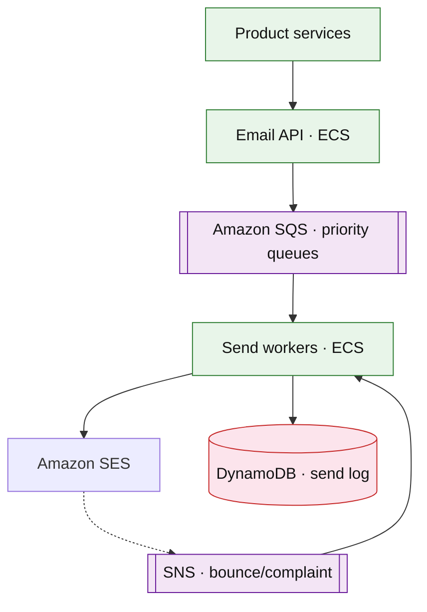

# Transactional email delivery platform

## Introduction

High-volume **transactional email** (receipts, password reset, notifications) with **queueing**, **provider failover**, **bounce/complaint** handling, and **reputation** protection.

**Primary users:** product teams (send API), deliverability ops (domain warmup), compliance (unsubscribe).

Distinct from [notification platform](./notification-platform.md) (**push/SMS** channels).

**Interview pacing:** Deep dive **queue + reputation + idempotent send**.

## Requirements discovery

| Lock (target) |
| --- |
| 500M emails / day |
| p99 enqueue &lt; 100 ms |
| At-least-once send with dedupe |
| Separate IP pools per domain reputation |

## Architecture (user → database)

**Narrative:** **API** enqueues templated jobs; **workers** render and send via **SES** with per-recipient dedupe key. **Bounces** suppress future sends to bad addresses.

## Deep dive: deliverability

- **Dedicated vs shared** IPs; warmup schedule.
- **Suppression list** global; complaint rate alarms.
- **Template versioning** and sandbox for new senders.

## Related

- [Notification platform](./notification-platform.md)
- [SQS/SNS drill](../aws/sqs-sns.md)
- [Identity service](./identity-session-service.md)
