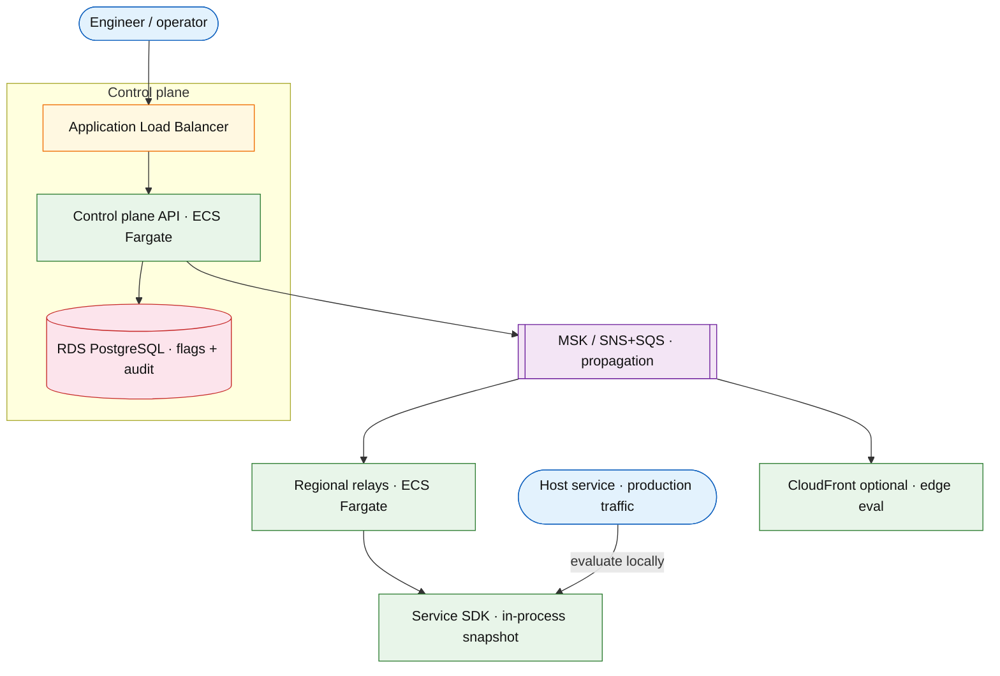

# Feature flag platform

## Introduction

A feature flag platform lets teams **roll out**, **target**, and **kill** behavior without redeploying binaries. A **control plane** stores versioned flag definitions; a **propagation stream** pushes updates to SDKs and edge evaluators; runtime services call **low-latency evaluate** with stable fallbacks when the control plane is stale or down.

**Primary users:** product engineers (define rules), runtime services (SDK evaluate), operators (kill switch, rollback), compliance (audit who changed what).

**Interview pacing:** Use [60-minute runbook](../../prep/interview-runbook-60m.md) — ~10 min requirements theater (below), ~18–32 min diagram + API/DB, ~46–56 min deep dive on **control-plane propagation + rollback**.

Distinct from [API gateway rate limiting](./api-gateway-rate-limiting.md) (traffic policy) and [notification platform](./notification-platform.md) (user messages).

## Requirements discovery (interview theater)

### Question bank

| Topic | You ask | If they push back | Example answer (reasonable default) |
| --- | --- | --- | --- |
| Eval location | Server, edge, mobile? | "Server only" | **Server SDK** primary; optional edge CDN eval for web experiments |
| Propagation SLA | How fast is flag live? | "Instant globally" | **p99 &lt; 10s** worldwide; kill switch **&lt; 5s** |
| Evaluate latency | Per-request budget? | "Don't care" | **&lt; 1ms p99** local evaluate (in-memory rules) |
| Targeting | User segments? | "Boolean only" | Boolean + %-rollout + attribute rules (`country`, `tenant`) |
| Availability | Flags down = ? | "Fail open" | **Fail closed to `default_off`** for risky flags; **fail open to last snapshot** for UX flags (state per flag) |
| Audit | SOC2? | "No" | Immutable `flag_audit`; who/when/old→new hash |
| Out of scope | Full A/B stats, ML bandits? | "Add analytics" | Export exposure events async; defer built-in experimentation engine |

### Example dialogue

> **You:** Let's scope v1: one happy path and what's out of scope?
> **Them:** …
> **You:** For scale, prototype vs 12-month target?
> **Them:** …
> **You:** What does each actor do per day on the hot path?
> **Them:** …
> **You:** I'll lock the **target** column assumptions unless you want different numbers — next I'll map fleet totals to monthly AWS meters in **billable volume**.

### Parsed requirements

| Field | Source question | Parsed value (target) | Drives |
| --- | --- | --- | --- |
| `active_flags_f` | Active flags (`F`) | **25,000** | Scale tiers, input model, fleet totals |
| `evaluate_rps_e_peak,_local` | Evaluate RPS (`E_peak`, local) | **500k/s** fleet aggregate | Scale tiers, input model, fleet totals |
| `connected_sdk_instances_s` | Connected SDK instances (`S`) | **80,000** | Scale tiers, input model, fleet totals |
| `config_changes_/_day_c_day` | Config changes / day (`C_day`) | **2,000** | Scale tiers, input model, fleet totals |
| `propagation_p99` | Propagation p99 | **10s** | Hot path, deep dive |
| `kill_switch_p99` | Kill switch p99 | **5s** | Hot path, deep dive |
| `sdk_snapshot_refresh` | SDK snapshot refresh | **long-poll/SSE + **60s** backup poll | Scale tiers, input model, fleet totals |
| `versioning` | Versioning | **SDK pins `config_hash`** | Scale tiers, input model, fleet totals |

### Locked assumptions

Platform system — scale by **local evaluate RPS (`E_peak`)** and **connected SDK instances (`S`)**, not consumer DAU. Use **target** column in interviews.

| Assumption | Prototype (MVP) | Growth | Target (anchor) |
| --- | --- | --- | --- |
| Active flags (`F`) | 2,500 | 12,500 | **25,000** |
| Evaluate RPS (`E_peak`, local) | 50k/s | 250k/s | **500k/s** fleet aggregate |
| Connected SDK instances (`S`) | 8,000 | 40,000 | **80,000** |
| Config changes / day (`C_day`) | 200 | 1,000 | **2,000** |
| Propagation p99 | 30s | 15s | **10s** |
| Kill switch p99 | 15s | 8s | **5s** |
| SDK snapshot refresh | stream + poll | same | long-poll/SSE + **60s** backup poll |
| Versioning | monotonic `version` | same | SDK pins `config_hash` |

*After ~10 minutes, proceed with the **target** column unless the interviewer changes scope.*

### Interview Q&A cheat sheet

Say aloud in order (~10 min). Write locks into **parsed requirements** before capacity math.

| Step | You ask | Lock if vague (target) |
| --- | --- | --- |
| 1 — Eval location | Server, edge, mobile? | **Server SDK** primary; optional edge CDN eval for web experiments |
| 2 — Propagation SLA | How fast is flag live? | **p99 &lt; 10s** worldwide; kill switch **&lt; 5s** |
| 3 — Evaluate latency | Per-request budget? | **&lt; 1ms p99** local evaluate (in-memory rules) |
| 4 — Targeting | User segments? | Boolean + %-rollout + attribute rules (`country`, `tenant`) |
| 5 — Availability | Flags down = ? | **Fail closed to `default_off`** for risky flags; **fail open to last snapshot** for UX flags (state per flag) |
| 6 — Audit | SOC2? | Immutable `flag_audit`; who/when/old→new hash |
| 7 — Out of scope | Full A/B stats, ML bandits? | Export exposure events async; defer built-in experimentation engine |

## Capacity sketch

### User input model

| Action | Actor | Per day (target) | Request / unit | ~Size | Durable write |
| --- | --- | --- | --- | --- | --- |
| `evaluate(flag, user)` | host service SDK | **43B+** (local) | in-process | 0 | none |
| Control plane write | engineer | 2,000 | `PATCH /v1/flags` | 1 KB | **400 B** version row |
| SDK snapshot fetch | SDK boot | ~80k/day reconnects | `GET /v1/sdk/snapshot` | 5 MB max | none |
| Stream delta | SDK | 2,000 change bursts | SSE message | 500 B | ephemeral |
| Kill switch | operator | rare | `POST .../kill-switch` | 0.5 KB | audit + version |

### Fleet totals (target)

| Metric | Formula | Value |
| --- | --- | --- |
| Local evaluates / s (peak) | `E_peak` | **500k/s** (host CPU, not control plane) |
| Control writes / day | `C_day` | **2,000** |
| Full snapshot bytes | `F × 200 B` | **~5 MB** |
| Fleet snapshot RAM | `S × 5 MB` | **~400 GB** in-memory across SDKs |
| Propagation burst (one flag) | `S × 500 B` | **~40 MB** wave |
| Control plane DB | defs + audit | **~7 MB** defs + **~2 GB** audit (7y) |

### Traffic profile (target tier)

| Metric | Value |
| --- | --- |
| **Read:write (API requests)** | **~40:1** (SDK snapshot fetch : control-plane writes) |
| **Read:write (durable bytes)** | **N/A** on evaluate path — **~800 KB/day** control-plane ingest |
| **Requests / day (fleet)** | **~84k** control-plane API (**500k/s** evaluates are in-process, not counted) |
| **Avg RPS** | **~1** (control API) |
| **Peak RPS** | **~500** (snapshot reconnect bursts; propagation waves on change) |

| User / actor | Action | R/W | Per user (or actor) / day | % of fleet requests |
| --- | --- | --- | --- | --- |
| Host service SDK | `evaluate` (local) | R | **~540k** / hot service (not fleet API) | — |
| SDK instance | Snapshot fetch | R | **~1** / reconnect | **~95%** |
| Engineer | Control-plane write | W | **~2k** fleet | **~2%** |
| Operator | Kill switch / rollback | W | rare | **&lt;0.1%** |

### AWS service map (target deployment)

| AWS service | Role in this design | Monthly meter (target) |
| --- | --- | --- |
| Application Load Balancer | Control plane API — flag CRUD, audit | **~84k** API req/mo |
| Amazon ECS on Fargate | Control plane + **12** regional relays | **~17** pods · vCPU-h |
| Amazon RDS (PostgreSQL) | Flag definitions + audit log | **~3 GB-mo** steady |
| Amazon MSK (or SNS + SQS) | Propagation stream — deltas to SDKs | **~40 MB** burst × **2k** writes/day |
| Amazon API Gateway (WebSocket) or ALB + ECS | SDK long-poll / SSE stream | **80k** connections |
| Amazon CloudFront | Optional edge eval for web flags | egress GB |
| AWS Secrets Manager | Admin and relay credentials | per-secret |
| Amazon CloudWatch / AWS X-Ray | Propagation p99, kill-switch latency | metrics |

### Scale tiers

| Tier | `F` flags | `E_peak` | SDK instances `S` | Control writes/day | Snapshot RAM (fleet) |
| --- | --- | --- | --- | --- | --- |
| Prototype | 2.5k | 50k/s | 8k | 200 | **~40 GB** |
| Growth | 12.5k | 250k/s | 40k | 1k | **~200 GB** |
| Target | 25k | 500k/s | 80k | 2k | **~400 GB** |

### Symbols

| Symbol | Meaning |
| --- | --- |
| `F` | Active flags |
| `E_peak` | Peak evaluate RPS (local) |
| `S` | SDK instances |
| `C_day` | Control plane writes per day |
| `B_snap` | Bytes per full snapshot per SDK |

### Derivation (traffic)

**Evaluate path (hot)**

`E_peak = 500,000/s` — **in-process** hash lookup + rule eval; no network on steady state (snapshot in memory)

**Propagation fanout**

On flag change: notify `S = 80,000` subscribers
Control message small (`~2 KB` per changed flag) → **~160 MB** burst per widespread change if all flags refresh (rare)
Incremental: only changed `flag_id` → **~80k × 500 B ≈ 40 MB** push wave

**Control plane writes**

`C_day = 2,000` — low; PostgreSQL source of truth is not hot path

**Snapshot size**

`F = 25k` flags × ~200 B rules avg → **~5 MB** full snapshot
SDK holds one snapshot + delta buffer — **~5–10 MB RAM** per instance

**Audit storage**

`2,000 changes/day × 7 years` — small vs audit logging platform

### Storage and growth over time

| Table / store | ~Row size | New rows/day | Retention | Steady-state size | Per SDK instance |
| --- | --- | --- | --- | --- | --- |
| `flags` + rules | 200 B | ~50 net | Indefinite | **25k → ~5 MB** | — |
| `flag_versions` / audit | 400 B | 2,000 | 7 years | **~2 GB** | — |
| SDK snapshot (memory) | 5 MB full | refresh on change | in-process | **80k × 5 MB** fleet | **~5–10 MB** RAM |
| Propagation deltas | 500 B | 2,000 bursts | seconds | ephemeral | push wave |

**Cumulative audit:**

| Horizon | Change events | Size (`× 400 B`) |
| --- | --- | --- |
| 1 year | 730k | **~290 MB** |
| 5 years | 3.65M | **~1.5 GB** |

**Storage vs fleet (`S` = 80k SDK instances):** Control plane **~7 MB** definitions — **negligible per instance** in DB. **Per connected instance:** **~5 MB** snapshot RAM (**~400 GB** fleet-wide in-memory, not durable DB).

**Daily durable ingest:** PostgreSQL **~800 KB/day** audit + **&lt; 100 KB/day** flag defs. **No growth** with evaluate RPS (eval is local).

### Per-unit economics (target tier)

| Metric | Formula | Target value |
| --- | --- | --- |
| Evaluates / SDK / s (even) | `E_peak / S` | **~6.25/s** (most eval is on fewer hot services) |
| Snapshot RAM / SDK | `B_snap` | **~5–10 MB** |
| Control writes / flag / day | `C_day / F` | **~0.08** (low churn) |
| Propagation fanout / change | `S × 500 B` | **~40 MB** incremental wave |

### Service footprint (instance count ballpark)

| Service | Scales with | Prototype | Growth | Target |
| --- | --- | --- | --- | --- |
| Control plane API | `C_day` | 2 pods | 3 | **3–5** |
| Propagation relays | `S`, regions | 2 | 6 | **12** (multi-region) |
| Config DB | `F` | 1 primary | 1 | **1** (+ replica) |
| Stream bus | fanout | 1 broker | 3 | **3-node cluster** |

**First scale cliff:** **Growth (~40k SDK connections)** — relay connection count and **40 MB** push waves; prioritize delta-only sync.

### Billable volume (target month)

Convert **fleet totals** to AWS billing meters before dollar math. *List-price ballparks — not a quote.*

| Design quantity (target) | Formula | Monthly billable unit |
| --- | --- | --- |
| API requests | `requests_day × 30` | **derive from fleet** (**~84k** control-plane API (**500k/s** evaluates are in-process, not counted)) |
| OLTP storage steady | storage table | **___ GB-mo** |
| Cache / Redis RAM | footprint | **___ GB** (node tier) |
| Egress / CDN | `egress_day × 30` | **___ GB / mo** |
| Stream / queue events | `events_day × 30` | **___ million events / mo** |
| Log ingest (if full capture) | `log_GB_day × 30` | **___ GB ingest / mo** |
| **Per unit** | `total / scale driver` | **$…/unit/mo** |

*Reconcile rows in **Cloud cost ballpark** (9a) with these meters.*

### Cost at a glance

Interview sound bite — reconcile with **billable volume** and **cloud cost** below.

| Tier | Scale | ~Monthly $ (core) | Per unit |
| --- | --- | --- | --- |
| Prototype (MVP) | **8k** SDKs, **50k/s** eval (host CPU) | **~$1k** | control-plane footprint |
| Growth | **40k** SDKs, **250k/s** eval | **~$2.5k** | relays + stream grow |
| Target (anchor) | **80k** SDKs, **500k/s** eval, **25k** flags | **~$5k/mo** | **~$0.06/SDK/mo** (platform only) |

**First payment block:** smallest prod footprint (load balancer + database + compute) before per-million traffic dominates.

### Cloud cost ballpark (target tier)

| Line item | Driver | ~Monthly |
| --- | --- | --- |
| Control plane + relays | 5 + 12 pods × 0.5 vCPU | **~$3k** |
| Stream / message bus | 2k bursts/day × 40 MB | **~$1k** |
| Config DB + audit | &lt; 3 GB | **~$500** |
| **Total (flag platform slice)** | | **~$5k/mo** |
| **Per 100k evaluate RPS** | `5k / 5` | **~$1k/100k eval RPS/mo** (control plane only; eval CPU is on host services) |
| **Per connected SDK** | `5k / 80k` | **~$0.06/SDK/mo** |

Host-service CPU for **500k local eval/s** is **not** billed to the flag platform SKU.

### Timeline (prototype → early growth)

Assume **monthly ~2× SDK connections** and **~2× evaluate RPS** on adopting services.

| Milestone | `S` SDKs | `E_peak` | Flags `F` | ~Monthly $ |
| --- | --- | --- | --- | --- |
| Launch | 8k | 50k/s | 2.5k | **~$1k** |
| Month 3 | 16k | 100k/s | 5k | **~$2k** |
| Month 6 | 32k | 200k/s | 10k | **~$3.5k** |
| Month 12 | 64k | 400k/s | 20k | **~$4.5k** |

Month 12 is near **target connection count**; kill-switch relay capacity should be tested before **80k** SDK mesh.

### Sensitivity

- **10× evaluate RPS** — CPU on host service, not flag service (local eval scales horizontally).
- **10× flags** — snapshot size grows; delta sync or shard snapshots by `tenant`.
- **1s propagation SLA** — requires push to all regions + connection mesh cost.

## High-level design

### Architecture (user → database)



**Narrative:** Engineers mutate flags via **Control plane API** → durable write to **Flag config store** + append **audit** → publish change event on **Propagation stream**. **Regional relays** fan out to connected SDKs. SDKs apply **versioned snapshot** in memory; `evaluate(user, flag_key)` is local. **Kill switch** sets `state=off` globally with highest priority propagation tier.

## User-visible surface

- **Engineer:** create flag, set rollout %, targeting rules, schedule; view evaluation exposure (async).
- **Runtime:** `if (flags.isEnabled("new_checkout", user))` — sub-ms.
- **Operator:** one-click kill switch; rollback to `version N-1`; diff viewer.

## API contract and input model

### UX → API traceability

| UX / UI action | User intent | API or event | Sync/async | Idempotent? | Validates |
| --- | --- | --- | --- | --- | --- |
| Create flag | ship guarded feature | `POST /v1/flags` | sync | yes (`flag_id`) | schema, targeting rules |
| Tune rollout | gradual exposure | `PATCH /v1/flags/{flag_id}` | sync | yes | version bump |
| Kill switch | instant off | `POST …/kill-switch` | sync | yes | audit + propagation tier |
| Rollback | revert bad change | `POST …/rollback` | sync | yes | prior version exists |
| Runtime gate | branch in code | `evaluate(flag_key, context)` | sync (in-process) | read | snapshot version |
| SDK refresh | pick up changes | `GET /v1/sdk/snapshot` or stream | sync / long-poll | read | version monotonic |

### Control plane

| Method | Path | Purpose |
| --- | --- | --- |
| `POST` | `/v1/flags` | Create flag |
| `PATCH` | `/v1/flags/{flag_id}` | Update rules / rollout |
| `GET` | `/v1/flags/{flag_id}` | Read definition + version |
| `POST` | `/v1/flags/{flag_id}/kill-switch` | Emergency off |
| `POST` | `/v1/flags/{flag_id}/rollback` | Pin previous version |
| `GET` | `/v1/flags/{flag_id}/audit` | Change history |

### SDK / data plane (internal)

| Method | Path | Purpose |
| --- | --- | --- |
| `GET` | `/v1/sdk/snapshot` | Full or delta snapshot |
| `GET` | `/v1/sdk/stream` | Long-poll / SSE changes |
| N/A | `evaluate(flag_key, context)` | In-process only |

### Example payloads

`POST /v1/flags`

```json
{
 "key": "new_checkout",
 "tenant_id": "tenant_acme",
 "type": "boolean",
 "default": false,
 "fail_mode": "closed",
 "targeting": {
 "rules": [
 {
 "if": { "country": "US", "tenant_id": "tenant_acme" },
 "then": { "enabled": true, "percentage": 10 }
 }
 ]
 }
}
```

Response `201 Created`:

```json
{
 "flag_id": "flg_8f2a",
 "key": "new_checkout",
 "version": 1,
 "state": "active",
 "config_hash": "sha256:config_v1...",
 "updated_at": "2026-05-22T21:00:00Z"
}
```

`PATCH /v1/flags/flg_8f2a`

```json
{
 "targeting": {
 "rules": [
 {
 "if": { "country": "US" },
 "then": { "enabled": true, "percentage": 50 }
 }
 ]
 },
 "expected_version": 1
}
```

Response `200 OK` with `version: 2` or `409` if version mismatch.

`POST /v1/flags/flg_8f2a/kill-switch`

```json
{
 "reason": "checkout_error_spike",
 "actor_id": "op_4412"
}
```

Response `200 OK`:

```json
{
 "flag_id": "flg_8f2a",
 "version": 3,
 "state": "killed",
 "config_hash": "sha256:kill_v3..."
}
```

SDK stream message:

```json
{
 "type": "flag_updated",
 "flag_id": "flg_8f2a",
 "version": 3,
 "config_hash": "sha256:kill_v3...",
 "payload": { "... compact rule ..." }
}
```

### Input validation

- `key`: unique per `tenant_id`; `[a-z0-9_.-]` max 128 chars.
- `percentage`: 0–100; sticky assignment on `user_id` hash (mention in interview).
- Optimistic concurrency: `expected_version` on PATCH.
- Kill switch: bypasses rules; forces `false` (or `default` for multivariate).

## Database model

### Tables

| Table | Key fields | Notes |
| --- | --- | --- |
| `flags` | `flag_id`, `tenant_id`, `key`, `state`, `type`, `default`, `fail_mode`, `updated_at` | Current head |
| `flag_versions` | `flag_id`, `version`, `targeting_json`, `config_hash`, `created_at` | Immutable history |
| `flag_audit` | `audit_id`, `flag_id`, `actor_id`, `action`, `from_version`, `to_version`, `at` | Compliance |
| `sdk_connections` | `instance_id`, `region`, `last_snapshot_hash`, `connected_at` | Propagation registry (optional) |

Indexes:

- `flags(tenant_id, key)` UNIQUE
- `flag_versions(flag_id, version DESC)`

### Read/write paths

1. **Create/update** — txn: insert `flag_versions` → update `flags` head → audit → publish stream event.
2. **SDK boot** — `GET snapshot` with `If-None-Match: config_hash` → 304 or full 5 MB body.
3. **SDK stream** — receive deltas → apply to in-memory map → swap `config_hash`.
4. **Evaluate** — hash `user_id` + `flag_key` for rollout bucket; evaluate rules chain; on missing flag use `default` + `fail_mode`.
5. **Rollback** — set head to `version N-1` row (new version number N+1 pointing at old config); publish.

## Interview deep dive: Control-plane propagation + rollback

### Propagation tiers

| Tier | Latency target | Mechanism |
| --- | --- | --- |
| Normal update | &lt; 10s p99 | Stream fanout + regional relay |
| Kill switch | &lt; 5s p99 | Priority topic + push to all connections |
| SDK offline | On reconnect | Snapshot GET with hash |

**Why stream not poll-only:** 60s poll misses kill-switch SLA; long-poll/SSE gives push latency with fewer wasted bytes than full snapshot each time.

### Consistency model

- Control plane: **strong** per `flag_id` via versioning.
- Runtime: **eventually consistent** — different pods may differ for seconds; acceptable for feature flags, not for financial balances.
- **Sticky rollout:** same `user_id` always maps to same bucket while `percentage` stable (hash salt + version).

### Rollback strategies

| Strategy | Use |
| --- | --- |
| **Version pin** | Repoint head to `N-1` config (audit trail keeps N) |
| **Kill switch** | Fast off without deleting rules |
| **Snapshot hash mismatch** | SDK refuses partial apply; keep last good snapshot |

Never mutate history rows in `flag_versions` — append-only versions.

### Fail modes

| `fail_mode` | Control plane down | Stale snapshot |
| --- | --- | --- |
| `closed` | Return `default` (usually off) | Keep last snapshot + metric |
| `open` | Return last known on | Same |

Interview: payment-risk flags → `closed`; UI tint → `open`.

### Edge evaluation (optional)

- CDN worker evaluates flags for static web — snapshot replicated to edge KV.
- Risk: stale edge longer than origin — cap TTL; kill switch propagates to edge purge API.

## Scale and failure

### Correctness model

- Version monotonic per flag; PATCH with wrong `expected_version` rejected.
- Kill switch visible to all SDKs within SLA with high probability (connection count metric).
- Evaluate deterministic for same `(user_id, flag_key, version)` inputs.

### Failure cases

| Failure | Symptom | Mitigation |
| --- | --- | --- |
| Relay partition | Subset of pods stale | Regional relays; SDK backup poll; alert on hash divergence |
| Bad rule deploy | Logic errors in prod | Rollback version; kill switch |
| Full snapshot corrupt | SDK eval wrong | Hash verify; reject apply; fetch snapshot |
| Thundering herd on change | 80k snapshot GETs | Delta stream only; 304 by hash |
| Stream disconnect storm | Temporary staleness | Exponential reconnect; poll fallback |
| Audit gap | Compliance fail | Audit in same txn as version insert |

### Key metrics

- Evaluate latency (local timer in SDK — should be sub-ms)
- Propagation delay: `control_write_at` → `sdk_applied_at` p99
- SDK snapshot age; `config_hash` mismatch count
- Kill switch activation count; rollback count
- Connection count per region; stream lag

### Interview deep dive talking points

- **500k eval/s local** vs **2k writes/day control** — separate hot/cold paths.
- Propagation: stream + hash snapshot + kill-switch priority lane.
- Optimistic versioning on PATCH; append-only `flag_versions`.
- Sticky percentage rollout hash — prevents flicker.
- Fail closed vs open per flag — tie to risk.

## Related

- [Examples hub](./README.md)
- [API gateway rate limiting](./api-gateway-rate-limiting.md)
- [Rate limiter](./rate-limiter.md)
- [Cross-service audit logging](./cross-service-audit-logging.md)
- [Notification platform](./notification-platform.md)
- [60-minute runbook](../../prep/interview-runbook-60m.md)
