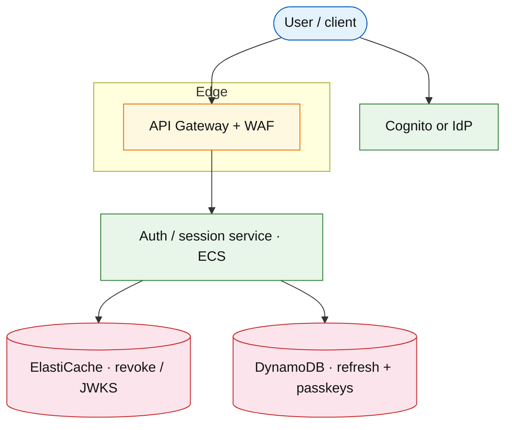

# Identity and session service

## Introduction

Central **identity** handles sign-up, login, federation, **sessions**, and logout. **Nowadays** interviews expect more than Cognito+JWT: **passkeys/WebAuthn**, **refresh-family reuse detection**, **risk/step-up**, **JWKS caching**, **canary of the token issuer**, and fast **global revoke**.

**Primary users:** end users, clients, microservices (JWT validate), security.

**Interview pacing:** [60-minute runbook](../../topics/interview-runbook-60m.md) — deep dive **sessions + OAuth + token rotation + passkeys**.

## Requirements discovery

### Interview Q&A cheat sheet

| Step | Lock (target) |
| --- | --- |
| Scale | 100M MAU; peak login ~50k RPS (flash) |
| Tokens | Access JWT 5–15 min; refresh 30 days rotating |
| Auth factors | Password + social; **passkeys** as primary on modern clients |
| Revocation | Global logout &lt; 30 s |
| Risk | Step-up on new device / impossible travel |
| Out of scope | Full enterprise SAML mesh v1 |

### Parsed requirements

| Field | Target |
| --- | --- |
| MAU | 100M |
| p99 validate | &lt; 5 ms (local JWKS; deny-list check optional) |
| Session store | Redis denylist + DynamoDB refresh families |

## Capacity sketch

| AWS service | Role |
| --- | --- |
| Amazon Cognito **or** custom auth service | User pool / credentials |
| DynamoDB | Refresh families, devices, WebAuthn credentials |
| ElastiCache | Revocation denylist, JWKS, rate limits |
| API Gateway + WAF | Public auth; bot resistance |
| KMS | Signing keys; rotation |
| CloudWatch / OTel | Login success, step-up rate, revoke lag |

### Store comparison

| Store | Why |
| --- | --- |
| DynamoDB | Durable refresh + passkey public keys |
| Redis | Hot revoke + login rate limit |
| Cognito | Managed IdP when ops preference is low; still design rotation yourself in the answer |

### Cost at a glance (target)

~$15k–40k/mo depending on managed IdP vs custom.

## Architecture (user → database)

**Narrative:** Clients authenticate via password, social, or **WebAuthn**. Auth service issues JWTs (KMS-backed), stores **refresh families** in DynamoDB, and publishes revocations to Redis. Resource APIs validate JWT locally with **cached JWKS**; optional denylist for emergency revoke.

## API contract

| Action | API |
| --- | --- |
| Login / token | `POST /v1/oauth/token` |
| Passkey register/assert | `POST /v1/webauthn/*` |
| Refresh | `POST /v1/oauth/refresh` |
| Logout all | `POST /v1/sessions/revoke` |
| JWKS | `GET /.well-known/jwks.json` (CDN-cacheable) |

## Deep dive: rotation, reuse, passkeys

- **Refresh family** per device; rotate on each refresh; **reuse of old refresh → kill family** (theft signal).
- Short access TTL; prefer **opaque refresh** server-side.
- **Passkeys:** store credential id + public key; challenge/response; phishing resistant.
- **Step-up:** MFA/passkey on risk; never block all logins on risk-service outage (fail open vs closed by product).
- Propagate `trace_id` / `session_id` on all auth events ([observability](../../topics/observability.md)).

## Scale, failure, and modern ops

| Failure | Detection | Mitigation |
| --- | --- | --- |
| Signing key leak | Security process | Rotate KMS key; short JWT TTL already limits blast |
| Refresh DB hotspot | Throttle / latency | Shard by `user_id`; cache latest refresh hash |
| Auth deploy regression | Canary login success SLO | Auto-rollback issuer ([deployment](../../topics/deployment.md)) |
| Credential stuffing | WAF + login rate | CAPTCHA / lockout; alarm → tighten rules ([on-call](../../topics/oncall-operations.md)) |

Auth is **highest blast radius**—canary and flags before full rollout ([feature flags](./feature-flag-platform.md)).

## Related

- [Cognito / IAM drill](../aws/cognito-iam.md)
- [API gateway rate limiting](./api-gateway-rate-limiting.md)
- [Security networking](../../topics/security-networking.md)
- [Frontend strategies](../../topics/frontend-strategies.md) (cookie vs token storage)
- [Deployment](../../topics/deployment.md)
- [Topics index](../../topics-index.md)
