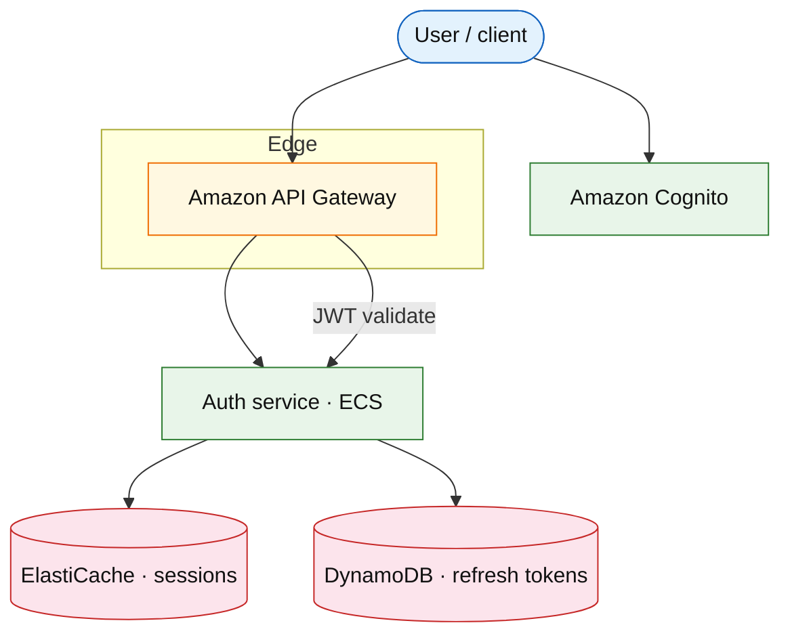

# Identity and session service

## Introduction

Central **identity** service handles sign-up, login, OAuth federation, **session tokens**, and device logout. APIs validate **JWT access tokens** on every request; refresh tokens rotate with reuse detection.

**Primary users:** end users (login), mobile/web clients, microservices (token validation), security (revoke, audit).

**Interview pacing:** [60-minute runbook](../../prep/interview-runbook-60m.md) — deep dive **sessions + OAuth + token rotation**.

## Requirements discovery

### Interview Q&A cheat sheet

| Step | Lock (target) |
| --- | --- |
| Scale | 100M MAU; 10 logins / MAU / month |
| Token shape | JWT access 15 min; refresh 30 days |
| Federation | Google + Apple OAuth; email/password |
| Revocation | Global logout &lt; 30 s visible |
| Out of scope | Full B2B SAML v1 | Defer to IdP proxy |

### Parsed requirements

| Field | Target |
| --- | --- |
| MAU | 100M |
| Peak login RPS | ~50k/s (flash events) |
| Session store | Redis + DynamoDB audit |
| p99 validate | &lt; 5 ms (local JWKS cache) |

## Capacity sketch

| AWS service | Role |
| --- | --- |
| Amazon Cognito | User pool, hosted UI, social IdP |
| Amazon DynamoDB | Refresh token families, device registry |
| Amazon ElastiCache | Session denylist, JWKS cache |
| AWS Lambda | Pre-token generation hooks |
| Amazon API Gateway | Public auth routes |

### Cost at a glance (target)

~$15k–40k/mo (Cognito MAU + Redis + API scale)

## Architecture (user → database)

**Narrative:** **Cognito** handles credentials and social login; **Auth service** issues JWTs, stores **refresh** families in **DynamoDB**, and maintains **revocation** in Redis. Resource servers validate JWT locally with cached JWKS.

## API contract

| Action | API |
| --- | --- |
| Login | `POST /v1/oauth/token` |
| Refresh | `POST /v1/oauth/refresh` |
| Logout | `POST /v1/sessions/revoke` |
| Validate (internal) | `POST /v1/introspect` (optional) |

## Deep dive: refresh rotation + reuse detection

- Store `family_id` per device; rotation on each refresh.
- **Reuse** of old refresh → revoke entire family (stolen token).
- Short access TTL limits blast radius.

## Related

- [Cognito / IAM drill](../aws/cognito-iam.md)
- [API gateway rate limiting](./api-gateway-rate-limiting.md)
- [Security networking](../../topics/security-networking.md)
