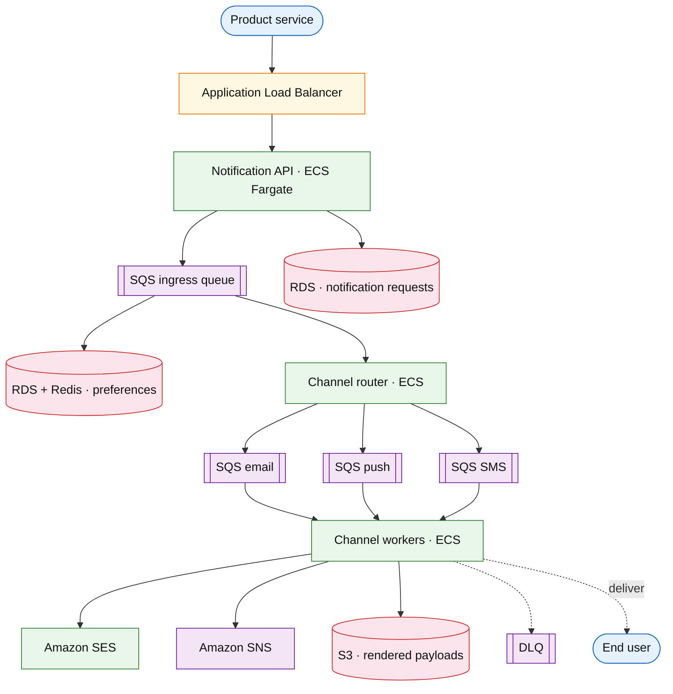

# Notification platform

## Introduction

A notification platform delivers **multi-channel messages** (email, push, SMS, in-app) triggered by product events or explicit API calls. It resolves **user preferences** and quiet hours, renders templates, fans out to **channel workers**, and handles **provider rate limits** with backoff and deduplication.

**Primary users:** product services (send notifications), end users (preference center), operators (DLQ replay, provider health dashboards), compliance (suppression lists, audit).

**Interview pacing:** Use [60-minute runbook](../../topics/interview-runbook-60m.md) — ~10 min requirements theater (below), ~18–32 min diagram + API/DB, ~46–56 min deep dive on **fanout + preference + provider backoff**.

Order pipeline consumers often emit events handled here — see [event-driven order pipeline](../event-driven/event-driven-order-pipeline.md).

## Requirements discovery (interview theater)

### Question bank

| Topic | You ask | If they push back | Example answer (reasonable default) |
| --- | --- | --- | --- |
| Channels | Which channels day one? | "Email only" | Email, mobile push, SMS, in-app inbox |
| Volume | Notifications per day? Peak? | "High volume product" | 500M notifications/day; **10× peak** for campaigns |
| Preferences | Global opt-out? Per category? | "All or nothing" | Per **category** (marketing, transactional, security); channel overrides |
| Quiet hours | Suppress or queue? | "Drop them" | **Queue** transactional; **suppress** marketing until window ends |
| Priority | OTP vs promo? | "Same queue" | **P0** security/OTP, **P1** transactional, **P2** marketing |
| SLA | Delivery time? | "Instant" | P0 p99 **&lt; 30s**; P2 best-effort minutes |
| Dedupe | Same event twice? | "Rare" | Dedupe key `(user_id, template_id, dedupe_id)` |
| Out of scope | Full CDP, A/B content ML? | "Add journeys" | Single-shot send + batch; defer visual journey builder |

### Example dialogue

> **You:** Let's scope v1: one happy path and what's out of scope?
> **Them:** …
> **You:** For scale, prototype vs 12-month target?
> **Them:** …
> **You:** What does each actor do per day on the hot path?
> **Them:** …
> **You:** I'll lock **~500M** notification API requests/day (~**5.8k/s** avg) unless you want different numbers — next I'll convert that to monthly AWS meters in billable volume.

### Parsed requirements

| Field | Source question | Parsed value (target) | Drives |
| --- | --- | --- | --- |
| `notifications_/_day_n_day` | Notifications / day (`N_day`) | **500M** (~5.8k/s avg) | Scale tiers, input model, fleet totals |
| `peak_enqueue_rps_n_peak` | Peak enqueue RPS (`N_peak`) | **60k/s** | Scale tiers, input model, fleet totals |
| `b2b_tenants` | B2B tenants | **2,000** | Scale tiers, input model, fleet totals |
| `recipients_/_day_u_r` | Recipients / day (`U_r`) | **50M** | Scale tiers, input model, fleet totals |
| `channels` | Channels | **same** | Scale tiers, input model, fleet totals |
| `fanout_factor_c` | Fanout factor (`C`) | **same (avg)** | Scale tiers, input model, fleet totals |
| `preference_model` | Preference model | **same** | Scale tiers, input model, fleet totals |
| `provider_limits` | Provider limits | **e.g. SMS **100/s** per sender ID | Scale tiers, input model, fleet totals |
| `dedupe_window` | Dedupe window | **business dedupe key** | Scale tiers, input model, fleet totals |

### Locked assumptions

Platform system — scale by **notifications/day** and **peak enqueue RPS**, with **recipients/day (`U_r`)** for per-user prefs. Use **target** column in interviews.

| Assumption | Prototype (MVP) | Growth | Target (anchor) |
| --- | --- | --- | --- |
| Notifications / day (`N_day`) | 50M | 250M | **500M** (~5.8k/s avg) |
| Peak enqueue RPS (`N_peak`) | 6k/s | 30k/s | **60k/s** |
| B2B tenants | 200 | 1,000 | **2,000** |
| Recipients / day (`U_r`) | 5M | 25M | **50M** |
| Channels | email, push, sms, in_app | same | same |
| Fanout factor (`C`) | 1.6 channels / request | same | same (avg) |
| Preference model | category × channel + quiet hours | same | same |
| Provider limits | per-channel token buckets | same | e.g. SMS **100/s** per sender ID |
| Dedupe window | 24h | same | business dedupe key |

*After ~10 minutes, proceed with the **target** column unless the interviewer changes scope.*

### Interview Q&A cheat sheet

Say aloud in order (~10 min). Write locks into **parsed requirements** before capacity math.

| Step | You ask | Lock if vague (target) |
| --- | --- | --- |
| 1 — Channels | Which channels day one? | Email, mobile push, SMS, in-app inbox |
| 2 — Volume | Notifications per day? Peak? | 500M notifications/day; **10× peak** for campaigns |
| 3 — Preferences | Global opt-out? Per category? | Per **category** (marketing, transactional, security); channel overrides |
| 4 — Quiet hours | Suppress or queue? | **Queue** transactional; **suppress** marketing until window ends |
| 5 — Priority | OTP vs promo? | **P0** security/OTP, **P1** transactional, **P2** marketing |
| 6 — SLA | Delivery time? | P0 p99 **&lt; 30s**; P2 best-effort minutes |
| 7 — Dedupe | Same event twice? | Dedupe key `(user_id, template_id, dedupe_id)` |
| 8 — Out of scope | Full CDP, A/B content ML? | Single-shot send + batch; defer visual journey builder |

## Capacity sketch

### User input model

| Action | Actor | Per user / day (target) | API | ~Size | Durable write |
| --- | --- | --- | --- | --- | --- |
| Receive notification | end user | **10** (`N_day / U_r`) | async delivery | 15 KB email | **400 B** request row |
| Producer enqueue | product service | varies | `POST /v1/notifications` | 1 KB | **400 B** |
| Update preferences | end user | rare | `PUT .../preferences` | 2 KB | **2 KB** |
| Campaign blast | tenant | bursts | batch API | — | many rows |

### Fleet totals (target)

| Metric | Formula | Value |
| --- | --- | --- |
| Notifications / day | `N_day` | **500M** |
| Avg enqueue RPS | `N_day / 86,400` | **~5,800/s** |
| Peak enqueue RPS | `N_peak` | **60k/s** |
| Channel jobs / s (peak) | `N_peak × C` | **~96k/s** |
| Request metadata / day | `500M × 400 B` | **~200 GB/day** |
| Hot 30d window rows | `500M × 30` | **~15B** → **~6 TB** |
| Recipients with prefs | `U_r` (growing) | **50M/day active**; **~200M** profiles steady |

### Traffic profile (target tier)

| Metric | Value |
| --- | --- |
| **Read:write (API requests)** | **~50k:1** (enqueue : preference updates) |
| **Read:write (durable bytes)** | **~1:0** hot path — **~200 GB/day** request metadata writes; prefs **read-mostly** |
| **Requests / day (fleet)** | **~500M** |
| **Avg RPS** | **~5.8k** (`N_day / 86,400`) |
| **Peak RPS** | **~60k** (scale tier `N_peak`) |

| User / actor | Action | R/W | Per user (or actor) / day | % of fleet requests |
| --- | --- | --- | --- | --- |
| Product service | Enqueue notification | W | varies by tenant | **~100%** |
| End user (recipient) | Receive (async delivery) | W | **10** (`N_day / U_r`) | (downstream; not API) |
| End user | Update preferences | W | rare | **&lt;0.1%** |

### AWS service map (target deployment)

| AWS service | Role in this design | Monthly meter (target) |
| --- | --- | --- |
| Application Load Balancer | Notification API ingress | **~500M** enqueue/mo |
| Amazon ECS on Fargate | API, resolver, renderer, router, channel workers | **~200** pods · vCPU-h |
| Amazon SQS | Ingress + per-channel queues + DLQ | **~500M+** messages/mo |
| Amazon RDS (PostgreSQL) | Preferences + notification metadata | **~6 TB** hot window |
| Amazon ElastiCache (Redis) | Preference cache; provider rate tokens | **~400 GB** RAM |
| Amazon SES | Email channel delivery | **~200M** emails/mo (excl. pass-through $) |
| Amazon SNS | Mobile push | publish requests |
| Amazon S3 | Rendered HTML / payload blobs | **~200 GB/day** ingest |
| Amazon CloudWatch / AWS X-Ray | Queue lag, provider 429s, DLQ depth | logs + metrics |

### Scale tiers

| Tier | `N_day` | `N_peak` | `U_r` | Avg RPS | Channel jobs/s (peak) |
| --- | --- | --- | --- | --- | --- |
| Prototype | 50M | 6k/s | 5M | **~580** | **~9.6k** |
| Growth | 250M | 30k/s | 25M | **~2.9k** | **~48k** |
| Target | 500M | 60k/s | 50M | **~5.8k** | **~96k** |

### Symbols

| Symbol | Meaning |
| --- | --- |
| `N_day` | Notification requests per day |
| `N_peak` | Peak enqueue RPS |
| `U_r` | Distinct recipients per day |
| `C` | Channels per request (fanout factor) |
| `B` | Bytes per rendered message (avg) |

### Derivation (traffic)

**Average enqueue RPS**

`N_day = 500M` → `5,800/s`

**Peak enqueue RPS**

`N_peak = 60,000/s` (marketing blast + transactional stack)

**Fanout to channel jobs**

If average **1.6 channels** per request (many email-only transactional, some multi-channel):
`channel_jobs_peak ≈ 60k × 1.6 ≈ 96k/s` into channel-specific queues

**Egress bandwidth (email-heavy)**

Email HTML `B ≈ 15 KB` → at 40k email/s peak → **~600 MB/s** egress to SMTP/API provider (provider is usually the bottleneck)

**SMS cost path**

SMS peak capped by **provider + budget** — e.g. 5k SMS/s → separate rate limiter shard per sender ID

**Storage**

`notification_requests` 30-day retention: `500M × 30 ≈ 15B rows/month` — partition by time; hot index 7 days.
`delivery_attempts` ~2× requests → plan **petabyte-scale** archive or aggregate after 90 days (interview: tiered storage)

**Preference reads**

Cache `user_preferences` in Redis; **95% hit** → DB read `5k/s` at 100k resolve/s peak

### Storage and growth over time

| Table / store | ~Row size | New rows/day | Retention | Steady-state size | Per recipient |
| --- | --- | --- | --- | --- | --- |
| `notification_requests` | 400 B | 500M | 30d hot | **~15B rows/mo** window → **~6 TB** hot | **~10 requests/user-day** (500M / 50M users) |
| `delivery_attempts` | 350 B | ~800M | 90d aggregate | **~2× requests** | per channel try |
| `user_preferences` | 2 KB | rare updates | permanent | 200M users → **~400 GB** | **~2 KB/user** |
| Rendered payloads (blob) | 15 KB (email HTML) | ephemeral | hours | queue buffers | not long-term OLTP |

**Cumulative requests (30d rolling only in OLTP):**

| Horizon | Rows if kept | Size |
| --- | --- | --- |
| 30 days | 15B | **~6 TB** |
| 1 year (archive tier) | 182B | **~70 TB** cold object store |

**Storage vs user base (~50M recipients/day):** **~120 B/request-day** metadata in hot window → **~6 TB / 30d / 50M ≈ 4 KB/user-month** hot. Preferences **~2 KB/user** steady.

**Daily durable ingest:** `500M × 400 B ≈ **200 GB/day**` request metadata; **~7.5 TB/day** if storing full HTML bodies in DB (avoid — use provider + S3 pointers).

### Per-unit economics (target tier)

| Metric | Formula | Target value |
| --- | --- | --- |
| Notifications / recipient / day | `N_day / U_r` | **10** |
| Request metadata / recipient / day | `10 × 400 B` | **~4 KB** |
| Channel deliveries / request | `C` | **~1.6** |
| Prefs storage / user (steady) | row size | **~2 KB** |
| Email egress / notification (email path) | `B` | **~15 KB** (provider billed separately) |

### Service footprint (instance count ballpark)

| Service | Scales with | Prototype | Growth | Target |
| --- | --- | --- | --- | --- |
| Ingress API | `N_peak` | 5 pods | 25 | **50** |
| Preference resolver | resolve RPS | 3 | 15 | **30** |
| Channel workers (per channel) | `N_peak × C` | 10 each | 40 each | **80+ each** |
| Kafka / queues | backlog | 3 brokers | 9 | **12+ brokers** |
| Provider rate limiter | SMS/email caps | 1 Redis | 3 | **sharded** |

**First scale cliff:** **Growth (30k/s peak)** — **provider 429s** before worker CPU; token buckets per sender ID.

### Billable volume (target month)

Convert **fleet totals** to AWS billing meters before dollar math. *List-price ballparks — not a quote.*

| Design quantity (target) | Formula | Monthly billable unit |
| --- | --- | --- |
| API requests | `requests_day × 30` | **derive from fleet** (**~500M**) |
| OLTP storage steady | storage table | **___ GB-mo** |
| Cache / Redis RAM | footprint | **___ GB** (node tier) |
| Egress / CDN | `egress_day × 30` | **___ GB / mo** |
| Stream / queue events | `events_day × 30` | **___ million events / mo** |
| Log ingest (if full capture) | `log_GB_day × 30` | **___ GB ingest / mo** |
| **Per unit** | `total / scale driver` | **$…/unit/mo** |

*Reconcile rows in **Cloud cost ballpark** (9a) with these meters.*

### Cost at a glance

Interview sound bite — reconcile with **billable volume** and **cloud cost** below.

| Tier | Scale | ~Monthly $ (core) | Per unit |
| --- | --- | --- | --- |
| Prototype (MVP) | **50M** notifications/day | **~$3k** | SQS + small worker pool |
| Growth | **250M**/day, **30k/s** peak | **~$12k** | OLTP window grows |
| Target (anchor) | **500M**/day, **60k/s** peak, **50M** recipients | **~$27k/mo** infra | **~$54/M notifications** (excl. ESP/SMS fees) |

**First payment block:** smallest prod footprint (load balancer + database + compute) before per-million traffic dominates.

### Cloud cost ballpark (target tier)

| Line item | Driver | ~Monthly |
| --- | --- | --- |
| Compute (ingress + workers) | ~200 pods × 0.5 vCPU | **~$15k** |
| Queue / Kafka | 200 GB/day ingress | **~$8k** |
| Hot OLTP (6 TB window) | partitioned | **~$1.5k** |
| Prefs Redis + DB | 400 GB | **~$2k** |
| **Platform infra (excl. ESP/SMS fees)** | | **~$27k/mo** |
| **Per 1M notifications** | `27k / 500` | **~$54/M notifications/mo** |
| **Per recipient / month** | `27k / 50M` (daily actives) | **~$0.0005/recipient-day** metadata tier |

ESP/SMS pass-through often **dominates** COGS — call out separately (~$0.001–0.01 per SMS).

### Timeline (prototype → early growth)

Assume **monthly ~2× notification volume** as tenants launch campaigns.

| Milestone | `N_day` | `N_peak` | Hot OLTP window | ~Monthly $ (infra) |
| --- | --- | --- | --- | --- |
| Launch | 50M | 6k/s | **~600 GB** | **~$3k** |
| Month 3 | 100M | 12k/s | **~1.2 TB** | **~$6k** |
| Month 6 | 200M | 24k/s | **~2.4 TB** | **~$12k** |
| Month 12 | 400M | 48k/s | **~4.8 TB** | **~$22k** |

Month 12 is **growth-tier** peak — provider limits and queue isolation should be in place before **500M/day** target.

### Sensitivity

- **10× peak** — queue depth and channel workers scale; **provider rate limits** bite first on SMS/email.
- **Multi-channel fanout** — workers scale per channel, not monolith.
- **Global quiet hours** — delayed queue volume grows at UTC boundaries.

## High-level design

### Architecture (user → database)



**Narrative:** Producers call `Notification_API` or publish domain events consumed by the platform. **Ingress** persists `notification_requests` and enqueues work. **Preference_resolver** applies category/channel rules and quiet hours (suppress, delay, or allow). **Template_renderer** localizes content. **Channel_router** fans out one job per channel into dedicated queues. **Channel_workers** send via providers with per-provider rate limiting and retries; poison messages go to **DLQ** for operator replay.

## User-visible surface

- **End user:** preference center — toggle categories per channel; set quiet hours; view in-app inbox.
- **Product team:** send API with template + audience; query delivery status `sent | suppressed | failed`.
- **Operator:** provider error dashboards; replay DLQ batch with dry-run; global kill switch per template/tenant.

## API contract and input model

### UX → API traceability

| UX / UI action | User intent | API or event | Sync/async | Idempotent? | Validates |
| --- | --- | --- | --- | --- | --- |
| **End user:** preference center — toggle categories per chan | Enqueue notification (idempotent) | `POST` `/v1/notifications` | sync | yes | domain rules |
| **Product team:** send API with template + audience; query d | Delivery status aggregate | `GET` `/v1/notifications/{request_id | sync | read | domain rules |
| **Operator:** provider error dashboards; replay DLQ batch wi | Update prefs | `PUT` `/v1/users/{user_id}/notificat | sync | yes | domain rules |
| See user-visible surface | Read prefs | `GET` `/v1/users/{user_id}/notificat | sync | read | domain rules |
| See user-visible surface | Operator replay (internal) | `POST` `/v1/admin/dlq/replay` | sync | yes | domain rules |
### Endpoints

| Method | Path | Purpose |
| --- | --- | --- |
| `POST` | `/v1/notifications` | Enqueue notification (idempotent) |
| `GET` | `/v1/notifications/{request_id}` | Delivery status aggregate |
| `PUT` | `/v1/users/{user_id}/notification-preferences` | Update prefs |
| `GET` | `/v1/users/{user_id}/notification-preferences` | Read prefs |
| `POST` | `/v1/admin/dlq/replay` | Operator replay (internal) |

### Example payloads

`POST /v1/notifications`

```http
Idempotency-Key: notif-ord-8f2a1c-001
```

```json
{
 "tenant_id": "tenant_acme",
 "template_id": "order_shipped_v2",
 "dedupe_id": "ord_8f2a1c-shipped",
 "priority": "P1",
 "audience": {
 "user_id": "cust_9912"
 },
 "data": {
 "order_id": "ord_8f2a1c",
 "tracking_url": "https://track.example/del_9f2a1c"
 },
 "channels": ["email", "push", "in_app"]
}
```

Response `202 Accepted`:

```json
{
 "request_id": "ntf_7k2m9p",
 "status": "ACCEPTED",
 "created_at": "2026-05-22T19:00:00Z"
}
```

Duplicate `dedupe_id` within window → `200 OK` with same `request_id`.

`GET /v1/notifications/ntf_7k2m9p`

```json
{
 "request_id": "ntf_7k2m9p",
 "status": "PARTIALLY_DELIVERED",
 "channels": [
 { "channel": "email", "status": "SENT", "provider_ref": "ses_abc", "at": "2026-05-22T19:00:02Z" },
 { "channel": "push", "status": "SENT", "provider_ref": "fcm_xyz", "at": "2026-05-22T19:00:01Z" },
 { "channel": "in_app", "status": "SUPPRESSED", "reason": "quiet_hours" }
 ]
}
```

`PUT /v1/users/cust_9912/notification-preferences`

```json
{
 "timezone": "America/Los_Angeles",
 "quiet_hours": { "start": "22:00", "end": "08:00" },
 "categories": {
 "marketing": { "email": false, "push": false, "sms": false, "in_app": true },
 "transactional": { "email": true, "push": true, "sms": true, "in_app": true },
 "security": { "email": true, "push": true, "sms": true, "in_app": true }
 }
}
```

### Input validation

- `template_id` must exist for tenant; `data` fields validated against template schema.
- `priority`: `P0` | `P1` | `P2`; P0 may bypass marketing quiet-hour suppress (not legal quiet hours for SMS — mention compliance).
- `channels` subset of supported; if omitted, use template defaults + preference filter.
- `dedupe_id` + `audience.user_id` + `template_id` uniqueness within 24h.
- SMS requires E.164 phone on user profile; push requires device tokens.

## Database model

### Tables

| Table | Key fields | Notes |
| --- | --- | --- |
| `notification_requests` | `request_id`, `tenant_id`, `template_id`, `dedupe_id`, `priority`, `audience_json`, `status`, `created_at` | Ingress record |
| `delivery_attempts` | `attempt_id`, `request_id`, `channel`, `status`, `provider_ref`, `error`, `attempt_no`, `updated_at` | Per channel try |
| `user_preferences` | `user_id`, `tenant_id`, `prefs_json`, `updated_at` | Source of truth |
| `templates` | `template_id`, `tenant_id`, `locale`, `channel`, `version`, `body` | Versioned content |
| `suppression_list` | `user_id`, `channel`, `reason`, `at` | Hard stops (bounce, STOP) |
| `delayed_queue` | `request_id`, `deliver_after`, `channel` | Quiet-hour queue |

Indexes:

- `notification_requests(dedupe_id, audience_user_id, template_id)` UNIQUE (partial window via app or time bucket)
- `delivery_attempts(request_id, channel)`
- `delayed_queue(deliver_after)` — scheduler sweep
- `user_preferences(user_id)`

### Read/write paths

1. **Accept** — insert `notification_requests` → dedupe check → enqueue ingress job → `202`.
2. **Resolve** — load prefs (cache) → if suppressed, mark channel `SUPPRESSED` → if quiet hours and P2, insert `delayed_queue` → else render template per channel.
3. **Route** — publish channel job with `request_id`, rendered payload, priority.
4. **Deliver** — worker acquires provider rate token → call provider → insert `delivery_attempts` → on 429/5xx, backoff retry → DLQ after max attempts.
5. **Delayed flush** — cron reads `deliver_after <= now` → re-enter router.

## Interview deep dive: Fanout + preference + provider backoff

### Fanout architecture

| Stage | Scales by | Bottleneck |
| --- | --- | --- |
| Ingress API | RPS, DB write | Accept rate |
| Preference resolve | User cache hit | Cold prefs DB |
| Render | CPU | Template complexity |
| **Per-channel queues** | Independent | **Provider limits** |

**Why separate queues:** SMS throttling must not block OTP email. Priority queues: P0 dedicated consumer pool per channel.

### Preference resolution order

1. **Suppression list** (hard stop — legal/opt-out)
2. **Category channel toggle** (user choice)
3. **Quiet hours** — P2 suppress or delay; P1 delay optional; P0 bypass marketing quiet only (interview: transactional still sends for “your order shipped”)
4. **Tenant policy** caps (max SMS/day)

Document **timezone** on user profile; never use server UTC blindly.

### Provider backoff

| Signal | Action |
| --- | --- |
| 429 / rate limit | Exponential backoff + jitter; respect `Retry-After` |
| 5xx | Retry up to N |
| 4xx invalid recipient | No retry; mark failed; add suppression |
| Provider outage | Circuit breaker; spill to DLQ; alert |

**Token bucket per provider account** — shared across workers via Redis; mirrors [rate limiter](./rate-limiter.md) primitive.

### Dedupe

- **Ingress dedupe:** same `dedupe_id` → same `request_id` (protects against duplicate event bus delivery).
- **Campaign dedupe:** `(user_id, template_id, campaign_id)` for marketing blasts.
- Dedupe is **not** a substitute for idempotent provider APIs where available (e.g. SES idempotency keys).

## Scale and failure

### Correctness model

- At-most-once **user-visible** duplicate if dedupe window missed — target zero with dedupe + provider idempotency.
- Preference changes apply to **new** requests; in-flight jobs use prefs at resolve time (version stamp in job payload).
- Suppressed channels never call provider (audit `SUPPRESSED`).

### Failure cases

| Failure | Symptom | Mitigation |
| --- | --- | --- |
| Provider 429 storm | Backlog growth | Rate limiter; scale workers only helps until provider cap |
| Template render error | Request fails fast | Schema validation at API; DLQ with alert |
| Quiet hour queue flood | Delay at 8am local | Shard delayed flush; rate-limit dequeue |
| Hot tenant campaign | Noisy neighbor | Per-tenant quotas; fair queue scheduling |
| Push token stale | High 4xx | Prune tokens; fallback to email if policy allows |
| DB dedupe race | Double send | UNIQUE constraint on dedupe key |
| DLQ replay mistake | Duplicate blast | Replay requires dry-run + dedupe on `replay_id` |

### Key metrics

- Enqueue RPS; end-to-end delivery latency by priority/channel
- Suppress vs delay vs send counts by category
- Provider 429/5xx rate; circuit breaker state
- Queue lag per channel; DLQ depth
- Dedupe hit rate; bounce/STOP additions to suppression

### Interview deep dive talking points

- Walk **500M/day → 60k/s peak** and **fanout to channel queues** first.
- Preference order: suppression → category → quiet hours → tenant cap.
- Provider backoff + **token bucket** — separate from worker count scaling.
- P0/P1/P2 queue isolation — OTP must not sit behind marketing blast.
- Close with dedupe at ingress + compliance suppression list.

## Related

- [Examples hub](./README.md)
- [Event-driven order pipeline](../event-driven/event-driven-order-pipeline.md)
- [Rate limiter](./rate-limiter.md)
- [Distributed job scheduler](./distributed-job-scheduler.md)
- [Cross-service audit logging](./cross-service-audit-logging.md)
- [60-minute runbook](../../topics/interview-runbook-60m.md)
