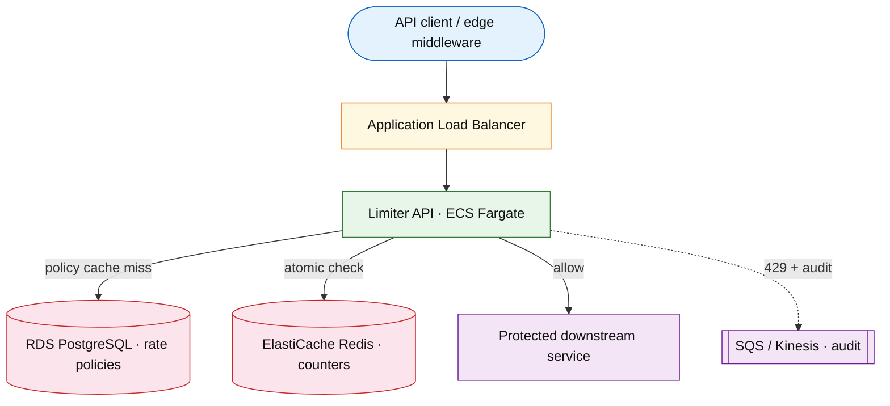

# Rate limiter

## Introduction

A distributed rate limiter enforces per-key request budgets on a **synchronous hot path** before expensive work (API handlers, DB queries, third-party calls). Every protected request needs a fast allow/deny decision with predictable **429** behavior when over quota.

**Primary users:** service owners (policy configuration), API clients (transparent allow vs throttle), operators (SLO dashboards, emergency bypass).

**Interview pacing:** Use [60-minute runbook](../../topics/interview-runbook-60m.md) — ~10 min requirements theater (below), ~18–32 min diagram + API/DB, ~46–56 min deep dive on **distributed counters + consistency**.

Often asked as a **standalone service** or as **middleware** in front of other systems; this doc centers the limiter primitive (check API + counter store). Gateway auth and routing live in [api-gateway-rate-limiting](./api-gateway-rate-limiting.md).

## Requirements discovery (interview theater)

### Question bank

| Topic | You ask | If they push back | Example answer (reasonable default) |
| --- | --- | --- | --- |
| Users & scale | How many protected requests per second fleet-wide? How many tenants? | "We don't know yet" | ~100k RPS peak across services; 10k active tenants; 200 routes per tenant on average |
| Dimension | Per user, IP, API key, route, tenant? | "Global only" | Composite key: `tenant_id` + `route`; optional `user_id` for finer caps |
| Algorithm | Fixed window, sliding window, token bucket? | "Simplest wins" | Token bucket with burst for smoothness; mention fixed-window boundary spike |
| Strictness | Hard cap or soft throttle? Behavior if store is down? | "Never block revenue" | Hard cap on quota; **fail closed** when counter store unavailable (defensible for abuse protection) |
| Deployment | Library in-process vs shared service? | "Just use Redis" | Dedicated limiter service + Redis counter store; optional edge cache for policy metadata |
| Multi-region | Global cap or per-region? | "One number worldwide" | Per-region counters (lower RTT); global cap is soft sum unless interviewer demands strict global |
| Observability | Sync audit on hot path? | "Full request log" | Async audit stream only; metrics on allow/deny |
| Out of scope | Auth gateway, billing, ML abuse? | "Add OAuth" | Defer full gateway, payments, ML scoring; basic policy CRUD only |

### Example dialogue

> **You:** Let's scope v1: one happy path and what's out of scope?
> **Them:** …
> **You:** For scale, prototype vs 12-month target?
> **Them:** …
> **You:** What does each actor do per day on the hot path?
> **Them:** …
> **You:** I'll lock **100k/s** fleet-wide peak checks (~**4.3B**/day at **50k/s** avg; **~8.6B** at sustained `Q`) unless you want different numbers — next I'll map that to monthly AWS meters in billable volume.

### Parsed requirements

| Field | Source question | Parsed value (target) | Drives |
| --- | --- | --- | --- |
| `peak_protected_rps_q` | Peak protected RPS (`Q`) | **100k/s** fleet-wide | Fleet totals, billable volume |
| `limiter_instances_n` | Limiter instances (`N`) | **50** stateless nodes behind LB | Fleet totals, billable volume |
| `active_tenants_t` | Active tenants (`T`) | **10,000** | Fleet totals, billable volume |
| `routes_per_tenant_r` | Routes per tenant (`R`) | **200** (average) | Fleet totals, billable volume |
| `policy_dimensions` | Policy dimensions | **same (composite counter key)** | Fleet totals, billable volume |
| `algorithm` | Algorithm | **`limit=1000`, `window_sec=60`, `burst=200` per key (example)** | Fleet totals, billable volume |
| `counter_store` | Counter store | **one atomic op per check** | Fleet totals, billable volume |
| `store_outage` | Store outage | **deny when counter store unreachable** | Fleet totals, billable volume |
| `multi-region` | Multi-region | **no cross-region Redis on hot path** | Fleet totals, billable volume |
| `edge_policy_cache_ttl` | Edge policy cache TTL | **invalidate on policy write** | Storage steady-state |

### Locked assumptions

Platform system — scale by **peak check RPS (`Q`)** and **tenants × routes**, not consumer DAU. Use **target** column in interviews.

| Assumption | Prototype (MVP) | Growth | Target (anchor) |
| --- | --- | --- | --- |
| Peak protected RPS (`Q`) | 10k/s | 50k/s | **100k/s** fleet-wide |
| Limiter instances (`N`) | 5 | 15 | **50** stateless nodes behind LB |
| Active tenants (`T`) | 1,000 | 5,000 | **10,000** |
| Routes per tenant (`R`) | 200 | 200 | **200** (average) |
| Policy dimensions | `tenant_id` + `route` | same | same (composite counter key) |
| Algorithm | Token bucket | same | `limit=1000`, `window_sec=60`, `burst=200` per key (example) |
| Counter store | Redis cluster | same | one atomic op per check |
| Store outage | Fail closed | same | deny when counter store unreachable |
| Multi-region | Per-region counters | same | no cross-region Redis on hot path |
| Edge policy cache TTL | 60s | same | invalidate on policy write |

*After ~10 minutes, proceed with the **target** column unless the interviewer changes scope.*

### Interview Q&A cheat sheet

Say aloud in order (~10 min). Write locks into **parsed requirements** before capacity math.

| Step | You ask | Lock if vague (target) |
| --- | --- | --- |
| 1 — Users & scale | How many protected requests per second fleet-wide? How many tenants? | ~100k RPS peak across services; 10k active tenants; 200 routes per tenant on average |
| 2 — Dimension | Per user, IP, API key, route, tenant? | Composite key: `tenant_id` + `route`; optional `user_id` for finer caps |
| 3 — Algorithm | Fixed window, sliding window, token bucket? | Token bucket with burst for smoothness; mention fixed-window boundary spike |
| 4 — Strictness | Hard cap or soft throttle? Behavior if store is down? | Hard cap on quota; **fail closed** when counter store unavailable (defensible for abuse protection) |
| 5 — Deployment | Library in-process vs shared service? | Dedicated limiter service + Redis counter store; optional edge cache for policy metadata |
| 6 — Multi-region | Global cap or per-region? | Per-region counters (lower RTT); global cap is soft sum unless interviewer demands strict global |
| 7 — Observability | Sync audit on hot path? | Async audit stream only; metrics on allow/deny |
| 8 — Out of scope | Auth gateway, billing, ML abuse? | Defer full gateway, payments, ML scoring; basic policy CRUD only |

## Capacity sketch

### User input model

No end-user DAU — model **protected API traffic** (check calls) and **control-plane** policy writes.

| Action | Actor | Per day (target) | API / work unit | ~Size | Durable write |
| --- | --- | --- | --- | --- | --- |
| Rate limit check | edge / service | **8.6B** (`Q × 86,400`) | `POST /v1/check` | 0.2 KB | none (Redis counter) |
| Policy create/update | service owner | ~50 net | `POST/PATCH /v1/policies` | 1 KB | **500 B** (`rate_policies`) |
| Audit sample | limiter | ~2,000 | async stream | 300 B | **300 B** (`limiter_audit`) |
| Operator bypass | operator | rare | admin flag | — | audit row |

### Fleet totals (target, `Q` = 100k/s peak)

| Metric | Formula | Value |
| --- | --- | --- |
| Checks / day (at peak sustained) | `Q × 86,400` | **~8.6B/day** (interview: use **avg ~50k/s** → **~4.3B/day**) |
| Redis ops / s (peak) | `≈ Q` | **~100k/s** |
| Policy rows (steady) | `T × R` | **~2M** |
| Active counter keys `K` | hot policies | **≤ ~2M** |
| Policy OLTP | `2M × 500 B` | **~1 GB** |
| Counter RAM | `K × 80 B` | **~160 MB** payload (+ overhead **~250–400 MB**) |

### Traffic profile (target tier)

| Metric | Value |
| --- | --- |
| **Read:write (API requests)** | **~86M:1** (limiter checks : policy writes) |
| **Read:write (durable bytes)** | **N/A** — counters ephemeral in Redis; policy OLTP **&lt; 1 MB/day** |
| **Requests / day (fleet)** | **~4.3B** checks (avg **~50k/s**); **~8.6B** at sustained `Q` |
| **Avg RPS** | **~50k** (checks) |
| **Peak RPS** | **~100k** (scale tier `Q`) |

| User / actor | Action | R/W | Per user (or actor) / day | % of fleet requests |
| --- | --- | --- | --- | --- |
| Edge / protected service | Rate limit check | R | **~430k** / tenant (even split) | **~100%** |
| Service owner | Policy create / update | W | **~50** fleet total | **&lt;0.001%** |
| Operator | Emergency bypass | W | rare | negligible |

### AWS service map (target deployment)

| AWS service | Role in this design | Monthly meter (target) |
| --- | --- | --- |
| Application Load Balancer | Ingress to limiter fleet | **~100k/s** peak checks · LCU-h |
| Amazon ECS on Fargate | Limiter API — policy cache + `POST /v1/check` | **50** pods · **~36k** vCPU-h/mo |
| Amazon ElastiCache (Redis) | Atomic token-bucket / window counters | **~400 MB** RAM · **~100k** ops/s |
| Amazon RDS (PostgreSQL) | `rate_policies` control plane | **~1 GB-mo** steady |
| Amazon Kinesis (or SQS) | Async allow/deny audit samples | **&lt; 2 GB** ingest/mo |
| AWS Secrets Manager | Policy signing / admin credentials | per-secret |
| Amazon CloudWatch / AWS X-Ray | Check p99, Redis op rate, 429 ratio | metrics + logs |

### Scale tiers

| Tier | Peak `Q` | Tenants `T` | Policy rows | Limiter pods `N` | Peak check RPS | Redis ops/s (peak) |
| --- | --- | --- | --- | --- | --- | --- |
| Prototype | 10k/s | 1k | 200k | 5 | **10k** | **10k** |
| Growth | 50k/s | 5k | 1M | 15 | **50k** | **50k** |
| Target | 100k/s | 10k | 2M | 50 | **100k** | **100k** |

### Symbols

| Symbol | Meaning |
| --- | --- |
| `Q` | Peak protected (check) requests per second |
| `N` | Limiter service instances |
| `T` | Active tenants |
| `R` | Routes per tenant (average) |
| `K` | Active counter keys (composite dimensions × windows) |
| `S_key` | Bytes per Redis counter key + value |
| `hit_edge` | Share of checks served from in-process policy cache (metadata only) |

### Derivation (traffic)

**Check QPS**

`check_qps = Q` — every protected request calls the limiter → target peak **100k/s**.

**Per-instance load**

`qps_per_instance = Q / N` → target `100,000 / 50 = **2,000/s**` per limiter pod (CPU bound on Lua + network).

**Counter operations per second**

One atomic Redis op per check → **~100k Redis ops/s** at peak. Token-bucket Lua may touch one key per check; sliding window can be 2–4× key ops — call out in interview if algorithm changes.

**Active key cardinality (order of magnitude)**

Distinct policies ≈ `T × R = 10,000 × 200 = 2M` policy rows. Active counter keys ≈ policies currently seeing traffic in the current window; upper bound near **2M keys** if all routes are hot.

`redis_ram ≈ K × S_key`; with `K = 2M`, `S_key ≈ 80 B` (key + token state + TTL metadata) → **~160 MB** counter payload + Redis overhead → plan **~250–400 MB** per shard generation (interview ballpark). Scale shards when `Q` or `K` grows 10×.

**Policy store (control plane)**

`rate_policies` rows ≈ 2M; ~500 B/row → **~1 GB** relational data + indexes — not on hot path.

**Hot key sensitivity**

If one tenant/route absorbs 30% of `Q`, a single Redis hash slot can see **~30k ops/s** on one key — likely bottleneck before cluster aggregate CPU.

**Edge cache (policy metadata)**

`hit_edge = 0.9` → 90% of checks skip policy DB read; still need Redis for counters unless using local token cache (eventual consistency tradeoff).

### Storage and growth over time

| Table / store | ~Row size | New rows/day | Retention | Steady-state size | Per unit |
| --- | --- | --- | --- | --- | --- |
| `rate_policies` | 500 B | ~50 net growth | Indefinite | **2M rows ≈ 1 GB** | **~100 KB/tenant** (10k tenants) |
| `rate_limit_audit` | 300 B | 2,000 | 7 years | **~1.5 GB** (5y) | ~150 KB/day |
| Redis counters | 80 B/key | Window TTL | 1–60 min | **~160–400 MB** | ~16 B/tenant hot keys |

**Storage vs protected traffic (not end-user rows):** Policy metadata scales with **tenants × routes**, not DAU. At `T=10k`, `R=200`, policies are **~2M rows / 1 GB** — tiny vs **100k checks/s**.

**Daily durable ingest (PostgreSQL):** **&lt; 1 MB/day** net policy growth + **~600 KB/day** audit. Redis is **ephemeral** (no multi-year growth).

**5-year cumulative audit:** `2,000 × 365 × 5 × 300 B ≈ **1.1 GB**`.

### Per-unit economics (target tier)

Sound bite: cost scales with **checks** and **tenant×route cardinality**, not end-user count.

| Metric | Formula | Target value |
| --- | --- | --- |
| Checks / tenant / day (if evenly spread) | `Q_avg × 86,400 / T` | **~430k checks/tenant/day** at 50k avg RPS |
| Policy OLTP / tenant | `R × 500 B` | **~100 KB** |
| Counter keys / tenant (upper) | `R` hot | **≤ 200** |
| Redis RAM / 1k checks/s sustained | ballpark | **~1.6 MB** counter payload per 1k RPS |

### Service footprint (instance count ballpark)

| Service | Scales with | Prototype | Growth | Target |
| --- | --- | --- | --- | --- |
| Limiter API | `Q / N` | 5 pods | 25 pods | **50 pods** |
| Redis counter cluster | `Q`, `K` | 1 × 1 GB | 3-node | **6–8 shards** |
| Policy DB | `T × R` | 1 primary | 1 primary | **1 primary** (+ replica) |
| Audit ingest | 2k events/day | 1 consumer | 1 | **1** |

**First scale cliff:** **Growth (~100k RPS)** — single Redis shard hot keys; shard by `counter_key` before adding limiter pods alone.

### Billable volume (target month)

Convert **fleet totals** to AWS billing meters before dollar math. *List-price ballparks — not a quote.*

| Design quantity (target) | Formula | Monthly billable unit |
| --- | --- | --- |
| API requests | `requests_day × 30` | **derive from fleet** (**~4.3B** checks (avg **~50k/s**); **~8.6B** at sustained `Q`) |
| OLTP storage steady | storage table | **___ GB-mo** |
| Cache / Redis RAM | footprint | **___ GB** (node tier) |
| Egress / CDN | `egress_day × 30` | **___ GB / mo** |
| Stream / queue events | `events_day × 30` | **___ million events / mo** |
| Log ingest (if full capture) | `log_GB_day × 30` | **___ GB ingest / mo** |
| **Per DAU** | `total / U` (`U` = 100k/s) | **$…/DAU/mo** |

*Reconcile rows in **Cloud cost ballpark** (9a) with these meters.*

### Cost at a glance

Interview sound bite — reconcile with **billable volume** and **cloud cost** below.

| Tier | Scale | ~Monthly $ (core) | Per unit |
| --- | --- | --- | --- |
| Prototype (MVP) | `Q` = **10k/s**, **1k** tenants | **~$400** | **~$0.40/tenant/mo** |
| Growth | `Q` = **50k/s**, **5k** tenants | **~$1.6k** | scales with Redis + pods |
| Target (anchor) | `Q` = **100k/s**, **10k** tenants | **~$4k/mo** | **~$40/1k checks/s/mo** · **~$0.40/tenant/mo** |

**First payment block:** smallest prod footprint (load balancer + database + compute) before per-million traffic dominates.

### Cloud cost ballpark (target tier)

| Line item | Driver | ~Monthly |
| --- | --- | --- |
| Limiter compute | 50 × 1 vCPU × $0.08/hr × 730h | **~$3k** |
| Redis | 400 MB + IOPS | **~$500** |
| Policy OLTP | 1 GB | **~$200** |
| Audit / logs | &lt; 2 GB | **~$100** |
| **Total** | | **~$4k/mo** |
| **Per 1k checks/s** | `4k / 100` | **~$40/1k checks/s/mo** |
| **Per tenant** | `4k / 10k` | **~$0.40/tenant/mo** |

### Timeline (prototype → early growth)

Assume **monthly ~2× protected RPS** as more services adopt the limiter.

| Milestone | Peak `Q` | Tenants | Policy rows | ~Monthly $ |
| --- | --- | --- | --- | --- |
| Launch | 10k/s | 1k | 200k | **~$400** |
| Month 3 | 20k/s | 2k | 400k | **~$800** |
| Month 6 | 40k/s | 4k | 800k | **~$1.6k** |
| Month 12 | 80k/s | 8k | 1.6M | **~$3.2k** |

Month 12 is still below **target-tier** Redis sharding — plan shard split as `Q` crosses **~50k/s** sustained.

### Sensitivity

- **10× `Q`** — Redis op rate and limiter CPU scale linearly; shard counter store and add limiter pods.
- **10× tenants/routes** — `K` and policy store grow; memory per Redis shard becomes the constraint.
- **Strict global cap across regions** — cross-region Redis or sync lag dominates latency; per-region counters stay simpler.
- **Fail open instead of closed** — availability improves; abuse/spike risk during outages (explicit product tradeoff).

## High-level design

### Architecture (user → database)



**Narrative:** `Edge_or_middleware` forwards each request to `LimiterService` with a resolved counter key (from headers/route/tenant). The limiter loads policy from an in-memory cache (backed by `PolicyStore` on miss), runs an **atomic** increment/refill against `CounterStore_Redis`, and returns allow or **429** before `Protected_service` runs. Deny/allow decisions are emitted to `AuditStream` asynchronously; the check path does not wait on audit.

## User-visible surface

- **API client:** request succeeds normally, or receives **429 Too Many Requests** with `Retry-After` and optional `X-RateLimit-Limit`, `X-RateLimit-Remaining`, `X-RateLimit-Reset`.
- **Service owner:** create/update policies (limit, window, burst, algorithm); view effective quota for a key; disable policy without redeploying consumers.
- **Operator:** dashboard of 429 rate by tenant/route; counter-store latency and error rate; overshoot vs configured limit; emergency bypass flag per tenant (audit logged).

## API contract and input model

### UX → API traceability

| UX / UI action | User intent | API or event | Sync/async | Idempotent? | Validates |
| --- | --- | --- | --- | --- | --- |
| **API client:** request succeeds normally, or receives **429 | Create rate limit policy | `POST` `/v1/policies` | sync | yes | domain rules |
| **Service owner:** create/update policies (limit, window, bu | Read policy | `GET` `/v1/policies/{policy_id}` | sync | read | domain rules |
| **Operator:** dashboard of 429 rate by tenant/route; counter | Update limit, burst, or status | `PATCH` `/v1/policies/{policy_id}` | sync | yes | domain rules |
| See user-visible surface | Disable policy | `DELETE` `/v1/policies/{policy_id}` | sync | yes | domain rules |
| See user-visible surface | Synchronous admission decision (hot path) | `POST` `/v1/check` | sync | yes | domain rules |
### Endpoints

| Method | Path | Purpose |
| --- | --- | --- |
| `POST` | `/v1/policies` | Create rate limit policy |
| `GET` | `/v1/policies/{policy_id}` | Read policy |
| `PATCH` | `/v1/policies/{policy_id}` | Update limit, burst, or status |
| `DELETE` | `/v1/policies/{policy_id}` | Disable policy |
| `POST` | `/v1/check` | Synchronous admission decision (hot path) |

### Example payloads

`POST /v1/policies`

Request:

```json
{
 "name": "search-api-tenant-acme",
 "dimension": {
 "tenant_id": "acme",
 "route": "/v1/search"
 },
 "algorithm": "token_bucket",
 "limit": 1000,
 "window_seconds": 60,
 "burst": 200,
 "status": "active"
}
```

Response `201 Created`:

```json
{
 "policy_id": "pol_8f2a1c",
 "name": "search-api-tenant-acme",
 "dimension": {
 "tenant_id": "acme",
 "route": "/v1/search"
 },
 "algorithm": "token_bucket",
 "limit": 1000,
 "window_seconds": 60,
 "burst": 200,
 "status": "active",
 "created_at": "2026-05-22T10:00:00Z"
}
```

`POST /v1/check`

Request:

```json
{
 "key": "tenant:acme:route:/v1/search",
 "cost": 1
}
```

Response `200 OK` (allowed)

```json
{
 "allowed": true,
 "remaining": 847,
 "limit": 1000,
 "reset_at": "2026-05-22T10:01:00Z"
}
```

Response `429 Too Many Requests` (denied)

```json
{
 "allowed": false,
 "remaining": 0,
 "limit": 1000,
 "retry_after_sec": 12,
 "reset_at": "2026-05-22T10:01:00Z"
}
```

```http
Retry-After: 12
X-RateLimit-Limit: 1000
X-RateLimit-Remaining: 0
X-RateLimit-Reset: 1716372060
```

`GET /v1/policies/pol_8f2a1c`

```json
{
 "policy_id": "pol_8f2a1c",
 "name": "search-api-tenant-acme",
 "dimension": {
 "tenant_id": "acme",
 "route": "/v1/search"
 },
 "algorithm": "token_bucket",
 "limit": 1000,
 "window_seconds": 60,
 "burst": 200,
 "status": "active",
 "updated_at": "2026-05-22T10:00:00Z"
}
```

### Input validation

- `key`: max 256 chars; pattern `^[a-zA-Z0-9:_/.-]+$`; reject empty.
- `cost`: integer ≥ 1; default 1; max 1000 per check (prevent abuse of weighted decrement).
- `limit`: 1–1,000,000; `window_seconds`: 1–86400; `burst`: 0–`limit` for token bucket.
- `algorithm`: `token_bucket` | `sliding_window` | `fixed_window` (document tradeoffs if interviewer picks).
- Policy writes require owner auth; `check` may use mTLS or signed service token between edge and limiter.

## Database model

### Tables / stores

| Table / store | Key fields | Notes |
| --- | --- | --- |
| `rate_policies` | `policy_id` (PK), `dimension_json`, `algorithm`, `limit`, `window_sec`, `burst`, `status`, `updated_at` | Control plane; source of truth |
| `rate_counters` | `counter_key` (PK in Redis), `tokens` or `count`, `window_start`, TTL | Hot path; ephemeral |
| `limiter_audit` | `event_id`, `request_id`, `key`, `decision`, `remaining`, `at` | Append-only stream; async |

Indexes:

- `rate_policies(tenant_id, route)` — policy lookup by dimension.
- `rate_policies(status)` — active policy scans for cache warmers.

### Read/write paths

1. **Policy create/update** — validate → `INSERT`/`UPDATE rate_policies` → invalidate limiter policy cache → optional warm cache entry.
2. **Check (hot path)** — resolve policy from cache → build `counter_key` → atomic Redis op (token refill + decrement) → return allow/deny + headers → enqueue `limiter_audit` (non-blocking).
3. **Window rollover** — Redis TTL expires counter keys; new window starts on next check (fixed window) or continuous refill (token bucket).
4. **Operator bypass** — set `status=paused` on policy or flip bypass flag → cache delete → checks allow without counter increment (audit tagged `bypass`).

## Interview deep dive: Distributed counters + consistency

### Counter placement

| Approach | Consistency | Latency | Notes |
| --- | --- | --- | --- |
| Central Redis `INCR` / Lua | Strong per key (single shard) | +1 RTT (~1–3 ms) | Default distributed design; no cross-instance races |
| Local token + async sync to Redis | Eventual | Lowest on steady state | Overshoot possible during partition or sync lag |
| Probabilistic (Count-Min Sketch) | Approximate | Low memory | Good for coarse global caps; not for strict per-tenant billing |

**Interview default:** centralized atomic op per check; mention local cache only if interviewer optimizes for RTT and accepts overshoot budget.

### Algorithms on a shared store

| Algorithm | Redis pattern | Burst behavior | Pitfall |
| --- | --- | --- | --- |
| Fixed window | `INCR` + `EXPIRE` on window key | Allows burst up to `limit` anytime; **2× spike** at window boundary (last second + first second) | Simplest; explain boundary artifact |
| Sliding window | Sorted set of timestamps or N sub-windows | Smoother than fixed | Higher memory/CPU; more ops per check |
| Token bucket | Lua: refill tokens by elapsed time, deduct `cost` | Controlled burst up to `burst` | Best UX for APIs; script must be atomic |

**Atomicity:** use Lua script or `INCR` with single key — never read counter in app memory then write back (race across limiter instances).

**Clocks:** window boundaries driven by Redis TTL or time in Lua; do not rely on per-host wall clocks for global keys.

### Multi-region consistency

- **Per-region counters:** each region enforces `limit` independently → global traffic can approach `regions × limit` (soft global cap). Low RTT, no cross-region Redis on hot path.
- **Strict global counter:** one Redis primary or CRDT-style merge; adds RTT and failure domains; justify only when product demands hard global ceiling.
- **Sticky routing:** route tenant to home region for counter key locality; still document soft cap unless using global store.

### Failure policy (preview of scale section)

- **Fail closed** (locked assumption): if Redis unreachable, return 429/503 deny — protects downstream; discuss revenue APIs that might choose fail open with audit.
- **Hot key:** hash-tag shard `counter_key`, replicate hot entry to read replicas (careful: writes must stay primary), or local LRU token cache with short TTL for top-N keys.

## Scale and failure

### Correctness model

- Per `counter_key`, concurrent checks see linearizable updates on a single Redis primary shard (Lua/`INCR`).
- Allowed requests ≤ `limit + burst` per window for token bucket (burst is explicit); fixed window may briefly allow up to **2× limit** at boundary without sliding correction.
- Policy cache is optimization; `rate_policies` is authoritative — stale cache may use old limit until TTL/invalidation (bound staleness in SLO).
- Local-token mode (if adopted): define **overshoot_budget** (e.g. 5% over limit) under partition.

### Failure cases

| Failure | Symptom | Mitigation |
| --- | --- | --- |
| Counter store outage | All checks fail closed; elevated 429/503 | Redis HA (multi-AZ); circuit breaker; runbook for emergency bypass per tenant |
| Hot counter key | Single shard CPU/latency spike; p99 check latency | Key splitting (`key#shard`), local token cache for celebrity keys, dedicated Redis shard |
| Fixed-window boundary spike | 2× traffic allowed for one key at rollover | Prefer token bucket or sliding window; dual-window guard in Lua |
| Policy cache stale | Wrong limit applied briefly | Short TTL; delete-on-write; version field in cache entry |
| Multi-region drift | Global traffic exceeds intended cap | Sum regional counters in monitoring; tighten per-region limit; or global Redis if required |
| Thundering herd after throttle | Clients retry in sync | Clients use jittered backoff; `Retry-After` honored |
| Lua script timeout | Sporadic deny or error | Optimize script; increase timeout; shed load on limiter |

### Key metrics

- Check p50/p99 latency; Redis op latency and error rate
- Allow vs deny ratio; **429 rate** by `tenant_id` / `route`
- Overshoot ratio (allowed count above policy in window)
- Policy cache hit ratio; counter key memory and evictions
- Hot-key concentration (top 10 keys' share of ops)

### Interview deep dive talking points

- Walk **locked assumptions → ~100k check RPS / ~2M active keys / ~160 MB counter RAM** before drawing boxes.
- Defend **token bucket + Redis Lua** vs fixed window (boundary spike) vs sliding window (cost).
- Explain **atomic single-key op** as the consistency core — no read-modify-write in application memory.
- State **fail closed** vs fail open with product context; tie to counter store HA.
- Close with **hot keys** and **per-region soft global cap** as the two scale traps.

## Related

- [Examples hub](./README.md)
- [API gateway rate limiting](./api-gateway-rate-limiting.md) (consumer of limiter primitive)
- [HTTP error handling](../../topics/api-design.md)
- [Caching](../../topics/caching.md)
- [60-minute runbook](../../topics/interview-runbook-60m.md)
