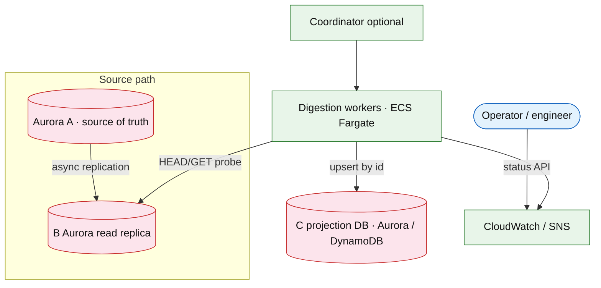

# Sequential replica digestion worker

## Introduction

A **sequential replica digestion worker** closes gaps between two databases: **B** (async replica of authoritative **A**) and **C** (downstream projection built by polling B). Records appear on B in monotonic ID order; C must catch up by discovering IDs present on B but missing on C, ingesting payloads idempotently, and exposing **lag** (gap count and estimated catch-up time).

**Primary users:** platform operators (lag dashboards, alerts, tuning), data engineers (backfill after outages), SRE (capacity and store protection).

**Interview pacing:** Use [60-minute runbook](../../topics/interview-runbook-60m.md) — ~10 min requirements theater (below), ~18–32 min diagram + API/DB, ~46–56 min deep dive on **MEX discovery + adaptive polling + lag estimation**.

Distinct from [stream processing platform](../event-driven/stream-processing-platform.md) (continuous partitioned streams with windowed state) and from [distributed job scheduler](./distributed-job-scheduler.md) (lease-based job runs, not ID-gap closure on a replica).

## Requirements discovery (interview theater)

### Question bank

| Topic | You ask | If they push back | Example answer (reasonable default) |
| --- | --- | --- | --- |
| Topology | How many stores? Who is source of truth? | "Just sync B to C" | **A** (SoT) → **B** (async replica) → worker polls **B**, writes **C** (projection) |
| ID model | Random UUIDs or sequential? | "UUIDv4 everywhere" | **Monotonic sequential** IDs (bigint, UUIDv7, or comparable); clarify **holes** from deletes vs dense sequences |
| Consistency | Exactly-once into C? | "Never duplicate" | **At-least-once** ingest with **idempotent upserts** on C; optional dedupe key for exactly-once |
| Probe economics | How does the worker wait when B is behind A? | "Spin forever" | Sleep **X** on B miss (adaptive backpressure); single-thread catch-up ≈ `gap × (X + latency)` for contiguous tail |
| SLA | Time or count lag? | "Best effort" | **B→C lag ≤ 120 s** at p99 *or* max gap ≤ 10k IDs; p99 per-record ingest ≤ 5 s |
| Scale | Row count? Payload size? Gap size? | "Small DB" | 100M rows on B; **800k** worst-shard gap after outage; payloads 2 KB–80 KB |
| Parallelism | More threads or more pods? | "Infinite threads" | **Workers** = ID-range shards; **threads** = I/O inside shard until B/C knee |
| Large gaps | Probe one ID at a time forever? | "Batch is fine" | **Bulk backfill** for millions of IDs, then **tail prober** for last mile |
| Out of scope | Change data capture from A? | "Fix replication" | Worker assumes B is the read surface; A→B lag is upstream ops |

### Example dialogue

> **You:** How many rows on the replica B, and how big is the worst gap after an outage?
> **Them:** 100M rows; we once had 800k IDs missing on one shard.
> **You:** Sequential IDs? Mean payload size?
> **Them:** Monotonic bigint; mostly 8 KB, some 80 KB blobs.
> **You:** SLA to close that gap?
> **Them:** Two minutes p99 — 120 seconds.
> **You:** I'll model 8 shards, adaptive sleep on B miss, bulk backfill for large gaps, idempotent upsert into C.

### Parsed requirements

| Field | Source question | Parsed value (target) | Drives |
| --- | --- | --- | --- |
| `N` | Rows on B | **100M** | Storage steady-state |
| `G` | Worst-shard gap IDs | **800k** | Catch-up SLA, bulk vs tail |
| `S` | Mean payload bytes | **8 KB** (stress **80 KB**) | Ingest bytes, `L_hit` |
| `R_day` | New rows/day A→B | **1M** | Steady ingest |
| `SLA` | Max time to close `G` | **120 s** | Required probe/ingest rate |
| `W` | Worker shards | **8** | Per-shard `G/W` |
| `T` | Threads per worker | **4–8** | `λ_T ≈ T × λ_1` |
| `h` | B probe hit ratio | **0.98** | `L_eff`, adaptive `X` |
| `X` | Sleep on B miss | **20–200 ms** | Tail catch-up duration |
| `id_model` | ID ordering | Monotonic sequential | MEX algorithm |
| `consistency` | Into C | At-least-once + upsert | Dedupe on `id` |

### Locked assumptions

Infra system — scale by **rows on B** and **worst-shard gap `G`**, not consumer DAU. Use **target** column in interviews.

| Assumption | Prototype (MVP) | Growth | Target (anchor) |
| --- | --- | --- | --- |
| Rows on B (`N`) | 1M | 10M | **100M** |
| New rows/day (A→B) | 10k | 100k | **1M** |
| Worst-shard gap `G` (after outage) | 5k | 50k | **800k** |
| Mean payload `S` | 2 KB | 8 KB | **8 KB** typical; **80 KB** stress |
| SLA: close `G` (time) | 300 s | 180 s | **120 s** |
| Shards `W` | 1 | 4 | **8** |
| Threads / worker `T` | 1 | 2 | **4–8** (benchmark knee) |
| Miss rate on probe (B behind A) | 5% | 3% | **2%** |
| Adaptive sleep `X` on miss | 50–200 ms | 20–200 ms | **20–200 ms** |
| Idempotency into C | Upsert by `id` | same | same |

*After ~10 minutes, proceed with the **target** column unless the interviewer changes scope.*

### Interview Q&A cheat sheet

Say aloud in order (~10 min). Write locks into **parsed requirements** before capacity math.

| Step | You ask | Lock if vague (target) |
| --- | --- | --- |
| 1 — Topology | How many stores? Who is source of truth? | **A** (SoT) → **B** (async replica) → worker polls **B**, writes **C** (projection) |
| 2 — ID model | Random UUIDs or sequential? | **Monotonic sequential** IDs (bigint, UUIDv7, or comparable); clarify **holes** from deletes vs dense sequences |
| 3 — Consistency | Exactly-once into C? | **At-least-once** ingest with **idempotent upserts** on C; optional dedupe key for exactly-once |
| 4 — Probe economics | How does the worker wait when B is behind A? | Sleep **X** on B miss (adaptive backpressure); single-thread catch-up ≈ `gap × (X + latency)` for contiguous tail |
| 5 — SLA | Time or count lag? | **B→C lag ≤ 120 s** at p99 *or* max gap ≤ 10k IDs; p99 per-record ingest ≤ 5 s |
| 6 — Scale | Row count? Payload size? Gap size? | 100M rows on B; **800k** worst-shard gap after outage; payloads 2 KB–80 KB |
| 7 — Parallelism | More threads or more pods? | **Workers** = ID-range shards; **threads** = I/O inside shard until B/C knee |
| 8 — Large gaps | Probe one ID at a time forever? | **Bulk backfill** for millions of IDs, then **tail prober** for last mile |
| 9 — Out of scope | Change data capture from A? | Worker assumes B is the read surface; A→B lag is upstream ops |

## Capacity sketch

### User input model

No end-user DAU — model **data plane** (replication + digestion) and **control plane** (operators).

| Action | Actor | Per day (target) | Request / work unit | ~Size | Durable write |
| --- | --- | --- | --- | --- | --- |
| A→B replicate row | system | 1M | internal replication | `S` | 1 row on B |
| B existence probe | worker | **~50M** (catch-up + tail) | `HEAD /records/{id}` | 0.1 KB | none |
| B fetch + C upsert | worker | **~1.2M** (ingest closed gap + tail) | `GET` + upsert | `S` | 1 row on C |
| Operator status | operator | 2k | `GET /digestion/status` | 4 KB resp | metrics samples |
| Bulk backfill job | engineer | 2–5 jobs | `POST /digestion/bulk` | batch | many rows/job |

### Fleet totals (target)

| Metric | Formula | Value |
| --- | --- | --- |
| Probe requests/day | dominated by catch-up | **~50M/day** (~580/s avg) |
| Ingest rows/day (caught up) | ≈ new rows on B | **~1M/day** |
| Durable bytes/day (C) | `1M × 8 KB` | **~8 GB/day** steady |
| One-time catch-up bytes | `G × S` (worst shard) | `800k × 8 KB ≈ **6.4 GB**` (typical `S`) |

### Traffic profile (target tier)

Locked **target** assumptions: **100M** rows on B (`N`), worst-shard gap **800k** (`G`), **120s** SLA, **8** worker shards (`W`).

| Metric | Value |
| --- | --- |
| **Read:write (API requests)** | **40:1** (B probes : C upserts) |
| **Read:write (durable bytes)** | **1:1** steady (B replicate **~8 GB/day** → C ingest **~8 GB/day**) |
| **Requests / day (fleet)** | **~51M** (**50M** probes + **~1.2M** fetch/upsert + **2k** operator) |
| **Avg RPS** | **~590/s** (probe-dominated) |
| **Peak RPS** | **~6.7k/s** required on worst shard (`G/SLA`); burst via **8** shards × **8** threads |

| User / actor | Action | R/W | Per actor / day | % of fleet requests |
| --- | --- | --- | --- | --- |
| System (A→B) | Replicate row | W | **1M** | upstream |
| Worker | B existence probe | R | **~6.25M**/shard amortized | **~98%** |
| Worker | B fetch + C upsert | R/W | **~150k**/shard | **~2%** |
| Operator | Status API | R | **2k** | **&lt;0.01%** |
| Engineer | Bulk backfill | W | 2–5 jobs | catch-up path |

*Probe rate scales with gap `G` and SLA; per-row payload **8 KB** (`S`) anchors bytes.*

### AWS service map (target deployment)

| Diagram component | AWS service | Role in this design | Monthly meter (target) |
| --- | --- | --- | |
| Database_A_SoT | **Amazon Aurora PostgreSQL** (primary) | Source of truth; async replication to B |
| Database_B_replica | **Amazon Aurora PostgreSQL** (read replica) | Replica lag target; probe + fetch source |
| Database_C_projection | **Amazon Aurora PostgreSQL** / **DynamoDB** | Idempotent upsert by `id`; MEX cursor |
| Coordinator_optional | **Amazon ECS on Fargate** | Shard assign; skew detect; range splits |
| Worker_shard_N | **Amazon ECS on Fargate** | **8** pods; sequential probe loop per range |
| Metrics_and_alerts | **Amazon CloudWatch** + **Amazon SNS** | Global lag, gap count, SLA breach |
| Bulk_backfill | **AWS Batch** or **ECS** task | Close **800k** gaps when tail threads insufficient |
| Operator_API | **Amazon API Gateway** + **Lambda** | `GET /digestion/status` |
| Observability | **AWS X-Ray**, **CloudWatch** | Per-shard MEX, probe hit ratio `h`, ingest lag |

### Scale tiers

| Tier | Rows on B (`N`) | Gap `G` | Ingest/day | Probe avg RPS | Shards `W` |
| --- | --- | --- | --- | --- | --- |
| Prototype | 1M | 5k | 10k | **~1** | 1 |
| Growth | 10M | 50k | 100k | **~10** | 4 |
| Target | 100M | 800k | 1M | **~580** (bursts higher) | 8 |

### Symbols

| Symbol | Meaning |
| --- | --- |
| `N` | Row count on B |
| `G` | Gap IDs to close on worst shard |
| `SLA` | Max catch-up time (seconds) |
| `S` | Mean payload bytes per record |
| `X` | Sleep on B miss (seconds) |
| `L_hit`, `L_miss` | Mean latency hit vs miss path |
| `h` | Hit ratio on B probe |
| `L_eff` | `h × L_hit + (1 - h) × L_miss` |
| `λ_1` | Single-thread probe rate `1 / L_eff` |
| `T`, `W` | Threads per worker; worker shards |

### Derivation (traffic)

**Latencies (target, `S = 8 KB`):** `L_hit ≈ 25 ms`, `L_miss ≈ 12 ms + 35 ms sleep ≈ 47 ms`, `h = 0.98` → `L_eff ≈ 0.025 s` → **`λ_1 ≈ 40 probes/s`** per thread.

**SLA throughput required:** `λ_req = G / SLA = 800k / 120 ≈ **6,667/s**` on worst shard if tail-only.

**Per shard (8-way split):** `G_i ≈ 100k` → `λ_req_i ≈ 833/s`. With `T = 8`, `λ_T ≈ 320/s` — still short → **bulk backfill** then tail at `λ_T ≈ 200/s`.

**Stress payloads (`S = 80 KB`):** `L_hit ≈ 120 ms` → `λ_1 ≈ 8/s` per thread — bulk path mandatory.

**B connection pool:** plan **`≥ 2 × W × T`** concurrent calls (target **~128** connections).

### Storage and growth over time

| Table / store | ~Row size | New / day (target) | Retention | Steady-state (target) | Per unit |
| --- | --- | --- | --- | --- | --- |
| `records` (B) | 8 KB | 1M | policy | **100M × 8 KB ≈ 800 GB** | **8 KB/row** |
| `projected_records` (C) | 8 KB | 1M ingest | mirrors B | **~800 GB** | same |
| `digestion_cursor` | 128 B | 8 shards | permanent | **&lt; 2 KB** | — |
| `digestion_metrics` | 200 B | 7.5M samples | 30d | **~1.5 GB** | — |

**Catch-up burst (worst shard):** `800k × 8 KB ≈ **6.4 GB**` (+ ~30% indexes). Stress **`S = 80 KB`** → **~64 GB** one-time.

**Cumulative rows on B:**

| Horizon | New rows | Data (`× 8 KB`) |
| --- | --- | --- |
| 30 days | 30M | **~240 GB** |
| 1 year | 365M | **~2.9 TB** |

### Per-unit economics (target tier)

Sound bite: **~8 KB per replicated row** on B/C; digestion metadata is negligible vs data plane.

| Metric | Formula | Target value |
| --- | --- | --- |
| OLTP bytes / new row | `S` | **8 KB** |
| Probe requests / new row (steady tail) | probes / `1M` | **~50×** during catch-up; **~5–10×** steady |
| Worker metadata / row ingested | cursor + metrics | **&lt; 1 B** amortized |
| Gap close time (tail only, 1 thread) | `G × L_eff` | **~7.7 h** at 800k gap — why bulk+parallel |

### Service footprint (instance count ballpark)

| Service | Scales with | Prototype | Growth | Target |
| --- | --- | --- | --- | --- |
| Digestion workers | `W` shards | 1 pod | 4 pods | **8 pods** |
| Threads / worker | B p99 knee | 1 | 2 | **4–8** |
| Coordinator | shard skew | 0–1 | 1 | **1** (optional) |
| B read replicas | probe RPS | 1 | 2 | **2–4** |
| C write pool | ingest + upsert | 1 primary | 2 | **4 shards** |

**First scale cliff:** **Growth (~10M rows)** — single worker cannot close **50k** gap in **180 s** without **bulk** or **`T > 4`**.

### Billable volume (target month)

Convert **fleet totals** to AWS metering before dollar math. *List-price ballparks — not a quote.*

| Design quantity (target) | Formula | Monthly billable unit |
| --- | --- | --- |
| B probe + fetch API | `~51M/day × 30` | **~1.5B** requests / mo |
| C durable ingest | `1M rows/day × 8 KB` | **~240 GB/mo** new on C |
| Aurora B replicas | probe RPS | **read IOPS** + replica instance-h |
| Worker compute | `8` Fargate pods × 730 h | **~5.8k** vCPU-h / mo (order-of-magnitude) |
| Bulk backfill (rare) | `G × S` one-time | **~6.4 GB** per 800k gap event |
| **Per 1M rows ingested** | amortize fleet | **$…/M rows/mo** |

*Reconcile rows in **Cloud cost ballpark** below.*

### Cost at a glance

Interview sound bite — reconcile with **billable volume** and **cloud cost** below.

| Tier | Scale | ~Monthly $ (core) | Per unit |
| --- | --- | --- | --- |
| Prototype (MVP) | **1M** rows on B, gap **5k** | **~$150** | single worker + small B/C |
| Growth | **10M** rows, gap **50k** | **~$1.2k** | shard workers + bulk playbook |
| Target (anchor) | **100M** rows, gap **800k**, **8** shards | **~$2–4k/mo** | **~$30/M rows/mo** (B read amplification dominates) |

**First payment block:** smallest prod footprint (load balancer + database + compute) before per-million traffic dominates.

### Cloud cost ballpark (target tier)

| Line item | Driver | ~Monthly |
| --- | --- | --- |
| Worker compute | 8 pods × 2 vCPU | **~$600** |
| B extra read IOPS | probe load | **~$1–3k** (shared cluster) |
| C storage | 800 GB | **~$200** |
| C ingest compute | 1M upserts/day | included in workers |
| Metrics / logs | 1.5 GB | **~$50** |
| **Total (digestion slice)** | | **~$2–4k/mo** |
| **Per million rows on B** | `3k / 100` | **~$30/M rows/mo** |

Data **storage** on B/C dominates at scale (**~$200/TB-mo**); worker CPU is usually smaller than **B read amplification** from probes.

### Timeline (prototype → early growth)

Assume **monthly 2× row growth** on B and one **gap event** per quarter.

| Milestone | Rows on B | Typical `G` | C data plane | ~Monthly $ (digestion) |
| --- | --- | --- | --- | --- |
| Launch | 1M | 5k | **~8 GB** | **~$150** |
| Month 3 | 2M | 10k | **~16 GB** | **~$300** |
| Month 6 | 4M | 20k | **~32 GB** | **~$600** |
| Month 12 | 10M | 50k | **~80 GB** | **~$1.2k** |

Month 12 matches **growth tier** — add **4 shards** and bulk playbook before **100M** target.

### Sensitivity

| Change | Effect | Response |
| --- | --- | --- |
| 10× gap `G` | SLA miss on tail-only | Bulk backfill + repartition shards |
| 10× payload `S` | `L_hit` dominates; λ collapses | `HEAD` + bulk; lower `T` |
| A→B lag ↑ | Higher miss rate | Raise `X`; fix replication before more `T` |
| Sparse ID holes | MEX stalls | Hole skip list or dense-sequence cursor |

## High-level design

### Architecture (user → database)



**Narrative:** Each **worker** owns a contiguous ID range `[range_start, range_end)`. The hot loop reads **MEX** (max contiguous ID prefix present on C), probes `next = mex + 1` on B, sleeps **X** on miss, upserts on hit, advances MEX. **Coordinator** (optional) assigns shards, detects skew, and triggers range splits. **Global lag** = `max(watermark_b(shard) - mex_c(shard))` — not the sum of gaps.

### Per-shard probe loop (single thread)

1. Read `mex` from C.
2. `next = mex + 1` (or next dense ID if deletes create holes).
3. Probe B for `next`:
 - **Miss:** sleep `X`, retry (A→B still catching up).
 - **Hit, not on C:** fetch, upsert, advance `mex`.
 - **Hit, on C:** advance `mex` (repair cursor drift).
4. Stop near B watermark minus safety margin.

**Parallelism inside shard:** window batch or pipeline with **ordered commit** to C; uncoordinated threads racing `next` cause MEX races — use **range leases** when batching ahead of committed MEX.

## User-visible surface

| Surface | Actor | Trigger | Outcome |
| --- | --- | --- | --- |
| Lag dashboard | Operator | Open digestion status | Global + per-shard gap, ETA seconds, probe/ingest rates |
| Alert email | Operator | Gap &gt; SLO | Page with shard id and recommended bulk job |
| Tuning panel | Operator | Adjust sleep bounds / threads | Updated adaptive `X`, throughput estimate |
| Bulk backfill wizard | Engineer | Submit ID range after outage | Job id; tail worker resumes at MEX |
| (none) | End user | — | No consumer UI — data plane only |

## API contract and input model

### UX → API traceability

| UX / UI action | User intent | API | Sync/async | Idempotent? | Validates |
| --- | --- | --- | --- | --- | --- |
| (worker) advance MEX | probe next ID on B | `HEAD /records/{id}` | sync | read | `id` in shard lease |
| (worker) ingest gap row | copy B → C | `GET /records/{id}` + C upsert | sync | upsert by `id` | payload size cap |
| (worker) watermark check | bound scans | `GET /replication/watermark` | sync | read | — |
| View lag dashboard | operator status | `GET /digestion/status` | sync | read | auth: operator |
| Start bulk job | close large gap | `POST /digestion/bulk` | async job | `idempotency_key` | `from_id`–`to_id` in shard, max span |
| Tune backpressure | change sleep bounds | `PATCH /digestion/config` | sync | yes | guarded role |

### B (replica read surface)

| Method | Path | Purpose |
| --- | --- | --- |
| `GET` | `/records/{id}` | Existence + payload for digestion |
| `HEAD` | `/records/{id}` | Cheap existence when payload is large |
| `GET` | `/replication/watermark` | Max replicated ID on B |

### Control plane / status

| Method | Path | Purpose |
| --- | --- | --- |
| `GET` | `/digestion/status` | MEX, gap, catch-up estimate, per-shard breakdown |
| `POST` | `/digestion/bulk` | Start keyed pagination backfill for `[from, to]` (operator) |
| `PATCH` | `/digestion/config` | Tune `X_min`, `X_max`, `T`, shard map (guarded) |

**Validation:** `id` must fall in caller's shard range; bulk `to - from ≤ max_batch_span` (e.g. 500k); config changes require operator role.

**Example `GET /digestion/status`:**

```json
{
 "watermark_b": 12000450,
 "mex_c_global": 11989200,
 "gap_ids": 11250,
 "estimated_catch_up_sec": 48,
 "hit_ratio": 0.97,
 "adaptive_sleep_ms": 35,
 "shards": [
 {
 "shard_id": 0,
 "id_range": [0, 4000000],
 "mex_c": 3998100,
 "gap_ids": 1900,
 "probes_per_sec": 420,
 "ingest_per_sec": 405,
 "workers": 1,
 "threads": 4,
 "b_p99_ms": 42
 }
 ]
}
```

**Example bulk start `POST /digestion/bulk`:**

```json
{
 "shard_id": 3,
 "from_id": 9000000,
 "to_id": 9200000,
 "batch_size": 500,
 "idempotency_key": "bulk-2026-05-22-shard3"
}
```

## Database model

### `records` (A and B)

| Column | Type | Notes |
| --- | --- | --- |
| `id` | `bigint` PK | Monotonic |
| `payload` | `jsonb` / blob | Variable size `S` |
| `created_at` | `timestamptz` | Audit |

Index: PK only for point lookups by digestion worker.

### `projected_records` (C)

| Column | Type | Notes |
| --- | --- | --- |
| `id` | `bigint` PK | Same as B |
| `payload` | `jsonb` / blob | Idempotent upsert target |
| `ingested_at` | `timestamptz` | Observability |

### `digestion_cursor` (per shard)

| Column | Type | Notes |
| --- | --- | --- |
| `shard_id` | `int` PK | |
| `mex` | `bigint` | Max contiguous prefix on C |
| `next_probe_id` | `bigint` | Tail cursor |
| `updated_at` | `timestamptz` | Heartbeat |

### `digestion_range_lease` (parallel batches)

| Column | Type | Notes |
| --- | --- | --- |
| `shard_id`, `range_start`, `range_end` | composite PK | |
| `owner` | `text` | Worker instance |
| `expires_at` | `timestamptz` | Prevent zombie writers |

### `digestion_metrics` (time series)

| Column | Type | Notes |
| --- | --- | --- |
| `shard_id`, `at` | PK / partition | |
| `probe_hits`, `probe_misses` | `bigint` | |
| `lag_estimate_sec` | `float` | |
| `b_p99_ms` | `float` | Store protection |

**Read path:** status API aggregates `digestion_cursor` + live probe stats. **Write path:** upsert `projected_records` then advance `mex` in one transaction (or two-phase with careful ordering).

## Interview deep dive: MEX discovery + adaptive polling + lag estimation

### MEX (minimum excluded upper bound for contiguous prefix)

**MEX** on C is the largest `m` such that every ID in `[shard_start .. m]` exists on C. Global health is **`max(shard_gap)`** where `shard_gap = watermark_b - mex_c` — one slow shard breaches SLA for the whole pipeline.

**Why not sum gaps?** Shards are independent ranges; operators care about worst-case lag, not average.

**Holes from deletes:** If IDs are sparse, define MEX on **dense sequence** or maintain a **skip list** of known missing ranges so the cursor does not stall on immaterial holes.

### Adaptive sleep `X` vs throughput knobs `T` and `W`

| Knob | Protects | Risk if misused |
| --- | --- | --- |
| **`X`** | B (and A→B path) from miss storms | Gap grows when B is legitimately behind |
| **`T`** | Raises parallel I/O inside shard | B p99 explosion; MEX races without leases |
| **`W`** | Splits `G` across smaller ranges | Shard imbalance leaves one hot range |

**Control loop (simple):** `X ← clamp(X_min, X_max, X × (target_b_cpu / observed_b_cpu))` or PI on B p99. Increase `X` when miss streak indicates **upstream replication lag**; decrease `X` when hits dominate and gap is large.

### Workers vs threads

| Dimension | **Workers** (pods) | **Threads** (per worker) |
| --- | --- | --- |
| Partitioning | Natural **ID-range shards** | Parallelism **inside** one shard |
| State | One `digestion_cursor` per shard | Needs lease or window batching |
| Failure | Pod restart = one shard paused | Thread retry on in-flight IDs |
| Scale when | `G` too large per range | B/C still below knee |

**Rule of thumb:** scale **workers** with ID space and skew; scale **threads** only until benchmark shows &lt;10% gain or B p99 doubles.

### Lag estimation

`estimated_catch_up_sec ≈ gap_ids / ingest_rate` where `ingest_rate` is measured over last N minutes (not peak).

**SLA burn:** `gap / (ingest_rate × SLA_horizon)` should stay &lt; 1; alert when derivative `d(gap)/dt &gt; 0` for sustained window.

### Bulk + tail bifurcation

When `G` is millions and SLA is minutes, **tail probing alone** loses.

1. **Bulk:** `SELECT id, payload FROM B WHERE id &gt; :mex AND id &lt;= :watermark ORDER BY id LIMIT :batch` with non-overlapping key ranges across workers.
2. **Tail:** low `T` (1–4), low `X`, owns `mex .. watermark` after bulk completes.

Interview question: compare time-to-SLA for `(bulk + tail)` vs `(tail only)` at same `W × T`.

### Alternatives (when to leave polling)

| Approach | Pros | Cons | Use when |
| --- | --- | --- | --- |
| **Tail probe (this design)** | Simple; works with any B API | Load on B; weak for huge `G` | Gaps &lt; ~100k per shard or after bulk |
| **CDC / replication log** | Event-driven; efficient | Needs log on A/B; ordering contract | A or B exposes ordered changelog |
| **Batch backfill only** | Fast for large ranges | Not continuous tail | One-time migrations |
| **Stream consumer** | Scales horizontally | Different product ([stream processing](../event-driven/stream-processing-platform.md) | Continuous updates, not gap repair |

### Benchmark knee (how to pick `T*` and `X*`)

1. **Phase 1:** `W=1`, `T=1`, sweep `X` → plot ingest rate vs B p99; pick knee `X*`.
2. **Phase 2:** fix `X*`, sweep `T ∈ {1,2,4,8,16}` until gain &lt;10% or p99 exceeds budget → `T*`.
3. **Phase 3:** scale `W` shards; verify `max(shard lag)` meets SLA; repartition if imbalanced.
4. **Canary:** 5–10% of shards for 24h before fleet-wide promote.

Automate binary search on `T` given SLA: find minimum `T` such that `gap(t + SLA) - gap(t) ≤ 0`.

## Scale and failure

### Multi-worker coordination

- Partition ID ranges; per-shard MEX; **range leases** when threads batch ahead of committed MEX.
- Coordinator assigns shards, detects skew, triggers **dynamic split** of hot ranges.
- Global lag = `max(shard_gap)`; scale the slowest shard first.

### Failure modes

| Failure | Symptom | Mitigation |
| --- | --- | --- |
| B lag spikes (A→B slow) | Miss streak, gap on B side | Increase `X`; page replication; do not scale `T` blindly |
| Thundering herd on misses | B p99 explosion | Jitter sleep; cap `W×T`; circuit breaker |
| Worker crash mid-range | Duplicate probes | Lease expiry; idempotent upserts on C |
| Shard imbalance | One shard SLA breach | Rebalance ranges; split hot range |
| Large payloads | Low probes/s | `HEAD` existence; chunked fetch; bulk path |
| Hole density | MEX stalls | Skip list of missing ranges |

### Key metrics

- `gap_ids`, `estimated_catch_up_sec`, `ingest_rate`, `probes_per_sec`, `hit_ratio`, `adaptive_sleep_ms`
- Per-shard `mex`, `watermark_b`
- B/C: p50/p99 latency, pool wait, throttle errors

## Related

- [Authoring template (v3)](../../topics/example-authoring-template.md) — infra parsed requirements (`G`, `SLA`, `X`)
- [Topics index](../../topics-index.md)
- [Stream processing platform](../event-driven/stream-processing-platform.md) — continuous windows vs poll-based gap closure
- [Distributed job scheduler](./distributed-job-scheduler.md) — leases for job runs, analogous lease patterns for range batches
- [Cross-service audit logging](./cross-service-audit-logging.md) — immutable log vs mutable projection on C
- [System catalog](../../topics/system-catalog.md) — row for this worker
- [60-minute runbook](../../topics/interview-runbook-60m.md)
