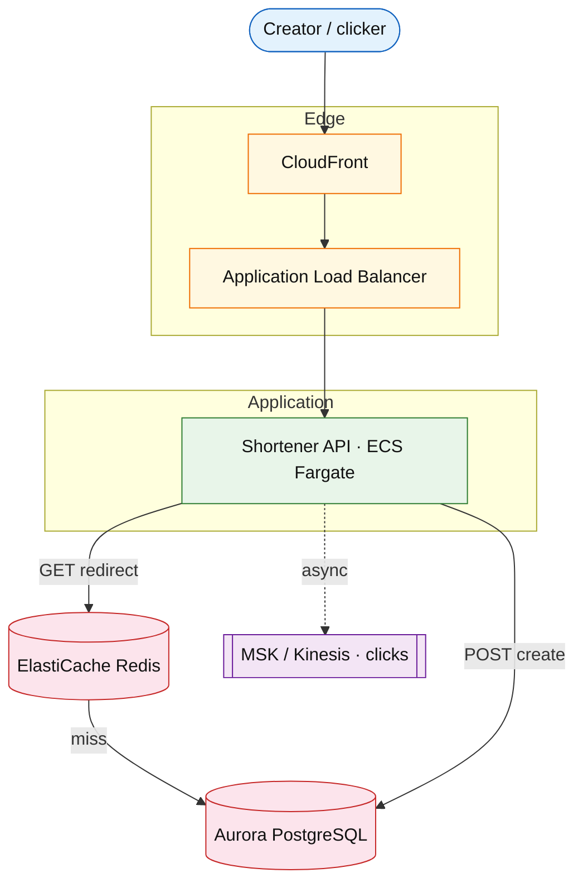

# URL shortener

## Introduction

A URL shortener maps long URLs to short, shareable codes. **Redirects** dominate traffic; **creates** are infrequent but must stay correct. The design centers on a fast read path (cache + O(1) lookup) and a safe keyspace for code generation.

**Primary users:** anonymous link creators, clickers (redirect-only), optional logged-in owners for link management.

**Interview pacing:** Use [60-minute runbook](../../topics/interview-runbook-60m.md) — ~10 min requirements theater (below), ~18–32 min diagram + API/DB, ~46–56 min deep dive on **keyspace + redirect cache**.

## Requirements discovery (interview theater)

### Question bank

| Topic | You ask | If they push back | Example answer (reasonable default) |
| --- | --- | --- | --- |
| Users & scale | How many daily active users? How many new short links per day? | "We don't know yet" | 100M DAU; 10% of users create 1 link/day → ~10M creates/day |
| Core actions | Create only, or also analytics and custom slugs? | "Keep it minimal" | Create short link, redirect, optional custom alias; analytics async |
| Read vs write | Redirects vs creates? Viral links? | "Mostly reads" | ~100:1 redirect:create; a few codes absorb most clicks |
| Consistency / latency | Must redirect work right after create? | "Eventual is fine" | Read-your-writes on create path; redirect p99 &lt; 50 ms at scale |
| Redirect semantics | 301 or 302? Count every click? | "SEO matters" | 302 default (fresh analytics); async click stream, not on hot path |
| Code format | Length? Charset? Custom alias? | "Short as possible" | 7-char base62 auto codes; optional custom slug with uniqueness check |
| Lifetime | TTL? Revoke/delete? | "Permanent links" | Mostly permanent; optional `expires_at`; soft-delete/revoke |
| Out of scope | Auth, billing, full BI warehouse? | "Add login" | Defer accounts, payments, ML abuse; basic rate limits only |

### Example dialogue

> **You:** How many daily active users, and what fraction create a short link?
> **Them:** About 100M DAU; maybe 10% create one link per day.
> **You:** So ~10M creates per day. How many times does a typical user click a short link—order of magnitude per day?
> **Them:** Call it 10 redirects per user per day; reads dominate.
> **You:** I'll lock 100:1 redirect:create, read-your-writes on create, 302 redirects, and async click analytics off the hot path unless you want otherwise.

### Parsed requirements

| Field | Source question | Parsed value (target) | Drives | Reality check |
| --- | --- | --- | --- | --- |
| `U` | DAU | **100M** | Scale tiers, fleet totals | Large consumer app tier |
| `p_creator` | % DAU creating links | **0.1** | Input model `% of DAU` for create | Typical creator % |
| `L_c` | Creates per creator / day | **1** | Creates/day = `p_creator × U × L_c` | |
| `L_r` | Redirects per DAU / day | **10** | Redirect RPS, egress | Read-heavy utility |
| `read:write` | Request ratio | **100:1** (redirect:create) | Cache-first deep dive | Matches redirect-heavy shape |
| `p99_redirect` | Hot-path latency | **&lt; 50 ms** | Redis + negative cache | Aggressive but common |
| `redirect_code` | 301 vs 302 | **302** | CDN/browser caching story | |
| `code_format` | Slug shape | **7-char base62**; optional custom alias | Keyspace deep dive | |
| `S_row` | Mapping row size | **200 B** | OLTP storage table | Small OLTP row |
| `S_click` | Analytics event | **80 B** (async) | Warehouse, not OLTP | |
| `retention` | Link lifetime | Churn → **~500M** live mappings | Steady-state GB | |
| `requests_day` | derived | **~1.01B** | RPS, AWS millions/mo | ~12k avg RPS |

### Locked assumptions

Use **target** for the interview anchor; prototype/growth rescale the same per-user behavior.

| Assumption | Prototype (MVP) | Growth | Target (anchor) |
| --- | --- | --- | --- |
| DAU (`U`) | 10k | 1M | **100M** |
| Creators (% of DAU) | 10% | 10% | 10% |
| Creates per creator per day | 1 | 1 | 1 |
| Redirects per DAU per day | 10 | 10 | 10 |
| Read:write (requests) | 100:1 | 100:1 | 100:1 (redirect:create) |
| `S_row` (`url_mappings`) | 200 B | 200 B | 200 B |
| Hot OLTP retention model | 90d TTL | 1y churn | ~500M live rows (churn) |
| Short code | 7-char base62 | same | same |

*After ~10 minutes, proceed with the **target** column unless the interviewer changes scope.*

### Interview Q&A cheat sheet

Say aloud in order (~10 min). Write locks into **parsed requirements** before capacity math.

| Step | You ask | Lock if vague (target) |
| --- | --- | --- |
| 1 — Users & scale | How many daily active users? How many new short links per day? | 100M DAU; 10% of users create 1 link/day → ~10M creates/day |
| 2 — Core actions | Create only, or also analytics and custom slugs? | Create short link, redirect, optional custom alias; analytics async |
| 3 — Read vs write | Redirects vs creates? Viral links? | ~100:1 redirect:create; a few codes absorb most clicks |
| 4 — Consistency / latency | Must redirect work right after create? | Read-your-writes on create path; redirect p99 &lt; 50 ms at scale |
| 5 — Redirect semantics | 301 or 302? Count every click? | 302 default (fresh analytics); async click stream, not on hot path |
| 6 — Code format | Length? Charset? Custom alias? | 7-char base62 auto codes; optional custom slug with uniqueness check |
| 7 — Lifetime | TTL? Revoke/delete? | Mostly permanent; optional `expires_at`; soft-delete/revoke |
| 8 — Out of scope | Auth, billing, full BI warehouse? | Defer accounts, payments, ML abuse; basic rate limits only |

## Capacity sketch

### User input model

| Action | % of DAU | Per user / day | API | ~Req size | Durable write / user / day |
| --- | --- | --- | --- | --- | --- |
| Create short link | 10% (creators) | 1 | `POST /v1/urls` | 1.5 KB | **200 B** (`url_mappings`) |
| Redirect (click) | 100% | 10 | `GET /{code}` | 0.5 KB resp | 0 OLTP (optional **80 B** click event async) |
| Manage / list (owner) | 2% | 2 | `GET /v1/links` | 3 KB | read-mostly |

### Fleet totals (target, `U` = 100M)

| Metric | Formula | Value |
| --- | --- | --- |
| Creates / day | `0.1 × U × 1` | **10M** |
| Redirects / day | `U × 10` | **1B** |
| Requests / day | `10M + 1B + 4M` ≈ | **~1.01B** |
| Durable OLTP bytes / day | `10M × 200 B` | **~2 GB** |
| Click analytics bytes / day | `1B × 80 B` | **~80 GB** (warehouse, not OLTP) |

### Traffic profile (target tier)

| Metric | Value |
| --- | --- |
| **Read:write (API requests)** | **~100:1** (redirect:create) |
| **Read:write (durable bytes)** | **~1:40** (OLTP mapping writes : async click stream) |
| **Requests / day (fleet)** | **~1.01B** |
| **Avg RPS** | **~12k** (`1.01B / 86,400`) |
| **Peak RPS** | **~120k** (scale tier ×10 on redirect path) |

| User / actor | Action | R/W | Per user (or actor) / day | % of fleet requests |
| --- | --- | --- | --- | --- |
| Clicker (DAU) | Redirect | R | 10 | **~99%** |
| Creator | Create short link | W | 1 (10% of DAU) | **~1%** |
| Owner | Manage / list links | R | 2 (2% of DAU) | **~0.4%** |

### AWS service map (target deployment)

| AWS service | Role in this design | Monthly meter (target) |
| --- | --- | --- |
| Amazon CloudFront | Optional edge cache for hot redirect paths | **~15k GB** egress (if not cached) |
| Application Load Balancer | Ingress to Shortener API | LCU-h + **~30.3B** req/mo |
| Amazon ECS on Fargate | Shortener API (create + redirect handlers) | **~200** pods · vCPU-h |
| Amazon ElastiCache (Redis) | Redirect cache — cache-aside, negative cache | **~20 GB** RAM |
| Amazon Aurora (PostgreSQL) | `url_mappings` source of truth | **~100 GB-mo** steady |
| Amazon MSK (or Kinesis) | Async click analytics ingest | **~2.4 PB/mo** if uncapped (**cliff**) |
| AWS Lambda or ECS | Stream consumers to warehouse | GB-s + invocations |
| Amazon CloudWatch / AWS X-Ray | Redirect p99, cache hit rate, create RPS | log/metric ingest |

### Scale tiers

| Tier | `U` | Creates/day | Redirects/day | Avg RPS | Peak RPS (×10) |
| --- | --- | --- | --- | --- | --- |
| Prototype | 10k | 1k | 100k | **~1.2** | **~12** |
| Growth | 1M | 100k | 10M | **~120** | **~1.2k** |
| Target | 100M | 10M | 1B | **~12k** | **~120k** |

### Symbols

| Symbol | Meaning |
| --- | --- |
| `U` | Daily active users (tier-dependent) |
| `L_c` | Creates per creator per day (1) |
| `L_r` | Redirects per DAU per day (10) |
| `S_row` | Bytes per `url_mappings` row |
| `p_creator` | Share of DAU who create (0.1) |

### Derivation (traffic)

**Creates:** `creates_day = p_creator × U × L_c` → target **10M/day** → **~116/s** avg, **~1.2k/s** peak.

**Redirects:** `redirects_day = U × L_r` → target **1B/day** → **~11.6k/s** avg, **~120k/s** peak.

**Egress (redirect tier):** `1B × 500 B ≈ 500 GB/day` → **~6 MB/s** avg, **~60 MB/s** peak.

**Keyspace:** `62^7 ≈ 3.5×10^12`; 5y naive cumulative **18B** codes — use churn/TTL in real deployments.

### Storage and growth over time

| Table / store | ~Row size | New rows/day (target) | Retention | Steady-state (target) | Per DAU (target) |
| --- | --- | --- | --- | --- | --- |
| `url_mappings` | 200 B | 10M | churn → ~500M live | **~100 GB** (+30% idx) | **~1.3 KB** OLTP |
| `click_events` | 80 B | 1B | 90d hot | **~80 GB** window | **~0.8 KB/day** analytics |
| Redirect cache | 100 B/key | — | minutes | **~15–20 GB** RAM | — |

**Cumulative mappings (no churn thought experiment):**

| Horizon | New rows | Raw (`× 200 B`) |
| --- | --- | --- |
| 30 days | 300M | **~60 GB** |
| 1 year | 3.65B | **~730 GB** |

### Per-user economics (target)

| Metric | Value | Notes |
| --- | --- | --- |
| Requests / DAU / day | **~10.1** | dominated by redirects |
| OLTP bytes / DAU / day | **~20 B** | only creators write (`200 B × 10%`) |
| OLTP bytes / DAU steady | **~1.3 KB** | amortized live mappings |
| Analytics bytes / DAU / day | **~800 B** | click stream |
| Egress / DAU / day | **~5 KB** | redirect responses |

### Service footprint (instances)

| Service | Scales with | Prototype | Growth | Target |
| --- | --- | --- | --- | --- |
| Shortener API | peak redirect RPS | 2 | 20 | **~200** pods |
| Redirect cache (Redis) | hot keys + RPS | 1 × 1 GB | 3-node | **~20 GB** cluster |
| Primary DB | create RPS + GB | 1 primary | 2 shards | **~8–16** shards |
| Click pipeline | 80 GB/day ingest | 1 consumer | small cluster | **Kafka + warehouse** |

**First scale cliff:** **~1M DAU** — single primary DB create path; add read replicas + Redis before sharding mappings.

### Billable volume (target month)

Convert **fleet totals** to AWS billing meters before dollar math. *List-price ballparks — not a quote.*

| Design quantity (target) | Formula | Monthly billable unit |
| --- | --- | --- |
| API requests | `1.01B/day × 30` | **~30.3B** requests / mo (**30,300 million**) |
| OLTP storage steady | `~500M × 200 B` | **~100 GB-mo** |
| Redirect cache RAM | footprint | **~20 GB** (node tier) |
| Redirect egress (theoretical) | `500 GB/day × 30` | **~15k GB / mo** (before CDN hit) |
| Click stream (if uncapped) | `80 GB/day × 30` | **~2.4 PB / mo** ingest (**cost cliff**) |
| **Per DAU** | `total / U` (`U` = 100M) | **$…/DAU/mo** (core excl. warehouse) |

*Reconcile rows in **Cloud cost ballpark** below.*

### Cost at a glance

Interview sound bite — reconcile with **billable volume** and **cloud cost** below.

| Tier | Scale | ~Monthly $ (core) | Per unit |
| --- | --- | --- | --- |
| Prototype (MVP) | `U` = **10k** | **~$200** | **~$0.02/DAU/mo** (fixed footprint) |
| Growth | `U` = **1M** | **~$18k** (month-12 order of magnitude) | **~$0.018/DAU/mo** |
| Target (anchor) | `U` = **100M** | **~$20k–25k/mo** (excl. full click warehouse) | **~$0.00025/DAU/mo** |

**First payment block:** smallest prod footprint (load balancer + database + compute) before per-million traffic dominates.

### Cloud cost ballpark (target, order-of-magnitude)

| Line item | Driver | ~Monthly |
| --- | --- | --- |
| Compute (API) | 200 pods × 0.5 vCPU | **~$15k** |
| OLTP | 130 GB + IOPS | **~$3k** |
| Redis | 20 GB | **~$1k** |
| Egress | ~15 TB/mo redirects | **~$1.5k** |
| Analytics ingest | 2.4 PB/mo raw clicks (tiered) | **~$50k+** without sampling |
| **Core product (excl. full click warehouse)** | | **~$20k–25k/mo** |
| **Per DAU** | `25k / 100M` | **~$0.00025/DAU/mo** (~$0.25 per 1k DAU) |

Sampling/aggregating clicks early drops analytics spend by **10–100×**.

### Timeline (same per-user rates, `U` doubles ~monthly)

| Milestone | `U` | OLTP steady | Requests/day | ~Monthly $ (core) |
| --- | --- | --- | --- | --- |
| Launch | 10k | **~2 MB** | 101k | **~$200** |
| Month 3 | 80k | **~16 MB** | 8.1M | **~$1.5k** |
| Month 6 | 320k | **~64 MB** | 32M | **~$5k** |
| Month 12 | 1.3M | **~260 MB** | 130M | **~$18k** |

At month 12 you are still on **growth tier** footprint (single-region DB + Redis); target-tier sharding starts as `U` approaches **10M+**.

### Sensitivity

- **10× redirects** — redirect/cache tier and hot-key handling saturate first; DB read load rises on cache miss.
- **10× creates** — DB write throughput and key-generation collision rate become the bottleneck.
- **10× `U` without ratio change** — both tiers scale linearly; revisit sharding count.

## High-level design

### Architecture (user → database)



**Narrative:** Creates validate input, allocate `short_code`, write `PrimaryDB`, then invalidate or populate `RedirectCache` so the next redirect is correct. Redirects read `RedirectCache` first; on miss, load from `PrimaryDB` and backfill cache. Click counting is async via `ClickQueue` so redirect latency stays low.

## User-visible surface

| Surface | Actor | Trigger | Outcome |
| --- | --- | --- | --- |
| Shorten form | Creator / anonymous | Paste URL, click **Shorten** | Short URL copied to clipboard |
| Short link open | Clicker | Open `go.example/{code}` in browser | **302** to long URL |
| Bad link | Clicker | Unknown or expired code | Friendly **404** HTML page |
| Custom slug | Creator | Optional alias field on create | Rejected or reserved-word error inline |
| Link stats (optional) | Owner | Open dashboard for a code | Click count (stale by seconds–minutes) |

## API contract and input model

### UX → API traceability

| UX / UI action | User intent | API | Sync/async | Idempotent? | Validates |
| --- | --- | --- | --- | --- | --- |
| Paste URL, click Shorten | create mapping | `POST /v1/urls` | sync | optional `Idempotency-Key` / `url_hash` dedupe | HTTPS `longUrl`, max 2048, rate limit |
| Open short link | resolve destination | `GET /{shortCode}` | sync | read | code format; 302 not 301 |
| View link details | inspect mapping | `GET /v1/urls/{shortCode}` | sync | read | owner auth if required |
| Revoke link | disable redirect | `DELETE /v1/urls/{shortCode}` | sync | yes | owner auth |
| (internal) click counted | analytics | `ClickQueue` event | async | at-least-once | non-blocking on redirect |

### Endpoints

| Method | Path | Purpose |
| --- | --- | --- |
| `POST` | `/v1/urls` | Create short link |
| `GET` | `/v1/urls/{shortCode}` | Metadata (owner/admin) |
| `GET` | `/{shortCode}` | Public redirect |
| `DELETE` | `/v1/urls/{shortCode}` | Revoke link (optional) |

### Example payloads

`POST /v1/urls`

Request:

```json
{
 "longUrl": "https://example.com/articles/system-design?id=42",
 "customAlias": null,
 "ttlSeconds": null
}
```

Response `201 Created`:

```json
{
 "shortCode": "a9Kx2Qp",
 "shortUrl": "https://go.example/a9Kx2Qp",
 "longUrl": "https://example.com/articles/system-design?id=42",
 "expiresAt": null,
 "createdAt": "2026-05-22T14:00:00Z"
}
```

`GET /a9Kx2Qp` (redirect)

Response `302 Found`:

```http
Location: https://example.com/articles/system-design?id=42
Cache-Control: no-store
```

Response `404 Not Found` (unknown code)

```json
{
 "error": "not_found",
 "message": "Short link does not exist or has expired"
}
```

`GET /v1/urls/a9Kx2Qp` (metadata)

```json
{
 "shortCode": "a9Kx2Qp",
 "longUrl": "https://example.com/articles/system-design?id=42",
 "status": "active",
 "clickCount": 18420,
 "createdAt": "2026-05-22T14:00:00Z"
}
```

**Idempotent create (product option):** `POST` with same `longUrl` returns existing mapping via `long_url_hash_index` unique on `url_hash`.

### Input validation

- `longUrl`: HTTPS only (or configurable allowlist); max length 2048; reject RFC1918 IP ranges if policy requires SSRF safety.
- `customAlias`: `^[A-Za-z0-9_-]{3,32}$`; reserved words blocklist (`admin`, `api`, …).
- Rate limits: create **per IP / API key**; redirect abuse detection on high 404 rate per IP.
- `ttlSeconds`: min 60, max 31536000 when set.

## Database model

### Tables

| Table / stream | Key fields | Notes |
| --- | --- | --- |
| `url_mappings` | `short_code` (PK), `long_url`, `status`, `created_at`, `expires_at`, `owner_id` | Source of truth for redirect target |
| `long_url_hash_index` | `url_hash` (PK), `short_code` | Optional; enables idempotent create |
| `click_events` | `event_id`, `short_code`, `ts`, `referrer`, `ua_hash` | Append-only stream or queue consumer |

Indexes:

- `url_mappings(short_code)` — PK, redirect lookup.
- `url_mappings(expires_at)` — TTL sweeper job.
- `long_url_hash_index(url_hash)` — unique for dedupe.

### Read/write paths

1. **Create** — validate → generate or reserve `short_code` → `INSERT url_mappings` (+ optional `long_url_hash_index`) → invalidate cache entry or write-through to `RedirectCache`.
2. **Redirect** — `GET short_code` from cache; on miss `SELECT` from `url_mappings` → populate cache → `302`; enqueue click event (non-blocking).
3. **Revoke / expiry** — mark `status=revoked` or delete row → delete cache key; sweeper removes expired rows.
4. **Analytics** — consumers read `click_events`; aggregate to counters or warehouse; never block step 2.

## Interview deep dive: Keyspace and redirect cache

### Keyspace (code generation and partitioning)

| Strategy | How it works | Pros | Cons |
| --- | --- | --- | --- |
| Random + retry | Random 7-char base62; retry on unique violation | Simple, no hot spot on counter | Rare collision storms under extreme create QPS |
| Monotonic counter + encode | DB/global counter → base62 | Predictable capacity | Counter shard hotspot; codes guessable in order |
| Hash prefix | `hash(longUrl)` truncated + salt on collision | Idempotent-friendly | Security/predictability concerns; skew if not salted |

**Capacity:** `62^7` codes vs ~1.8×10¹⁰ five-year inserts (locked assumptions) — safe; bump to 8 chars if product horizon or create rate jumps.

**Custom aliases:** separate namespace; `UNIQUE(short_code)`; rate-limit dictionary slugs; validate reserved paths.

**Sharding:** `shard = hash(short_code) mod N`; redirect router or gateway sends to correct DB shard; lookups stay O(1).

### Redirect cache (hottest path)

- **Pattern:** cache-aside — read Redis → on miss read DB → `SET` with TTL (e.g. 24h–7d).
- **Create consistency:** after DB commit, **delete** cache key or **write-through** so read-your-writes holds.
- **Negative cache:** cache short-lived "not found" for unknown codes to protect DB from scan attacks; keep TTL low (30–60s).
- **Hot keys:** in-process LRU in front of Redis for celebrity URLs; replicate hot entries; avoid single Redis hash slot overload.
- **302 vs 301:** 302 keeps click analytics honest; 301 lets browsers/CDNs cache redirects — usually wrong for mutable/expiring links.
- **Stampede:** single-flight (one DB load per `short_code` during miss storm) before populating cache.

## Scale and failure

### Correctness model

- `short_code` is globally unique; redirect never returns a revoked or expired mapping once cache and DB agree.
- At-most-one visible mapping per `url_hash` when idempotent create is enabled.
- Cache is an optimization; DB is authoritative on conflict.

### Failure cases

| Failure | Symptom | Mitigation |
| --- | --- | --- |
| Cache cluster outage | Redirect p99 spikes; DB read QPS surges | Fallback to DB; scale read replicas; circuit-breaker to shed load |
| Stale cache after failed invalidation | Old URL served briefly | Shorter TTL; delete-on-write; version field in cache value |
| DB primary unavailable | Creates fail; redirects may use replica (risk staleness) | Fail closed on create; read replicas with lag metric; health-check routing |
| Collision storm on create | Elevated retry latency | Random suffix extension; backoff; pre-allocate code blocks |
| Celebrity hot key | Single Redis CPU maxed | Local cache + replicate key; separate read path for top-N |
| 404 probe abuse | DB miss load | Negative cache + WAF rate limit per IP |

### Key metrics

- Redirect p50/p99 latency; cache hit ratio
- Create success rate and collision retry rate
- DB read QPS on cache miss; Redis memory and evictions
- 404 rate (total and per IP); async click ingest lag

### Interview deep dive talking points

- Walk **locked assumptions → ~12k redirect RPS / ~120 create RPS** before drawing boxes.
- Defend **7-char base62** with `62^7` vs cumulative inserts; when you would lengthen codes.
- Explain **cache-aside + delete-on-write** for read-your-writes without over-building consistency.
- Call out **hot-key** and **negative-cache** as the two redirect-tier traps at scale.
- Close with **302 + async clicks** keeping the hot path thin.

## Related

- [Examples hub](./README.md)
- [Authoring template (v3)](../../topics/example-authoring-template.md)
- [Topics index](../../topics-index.md)
- [AWS reference layout](../../topics/aws-reference-layout.md)
- [Caching](../../topics/caching.md)
- [60-minute runbook](../../topics/interview-runbook-60m.md)
