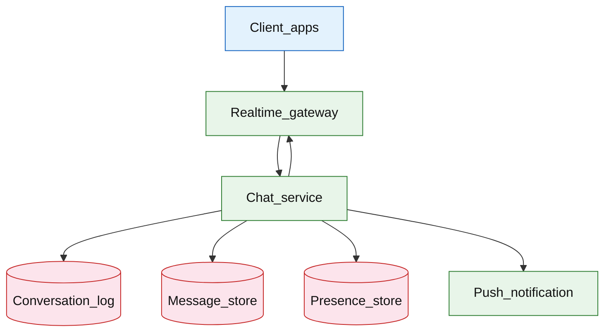

# Chat messenger

## Introduction

A chat messenger delivers **1:1 and group messages** with **per-conversation ordering**, **online presence**, **read receipts**, and **multi-device sync**. Clients connect over WebSocket; the server appends to a **conversation log**, fans out to participants, and persists history for catch-up on reconnect.

**Primary users:** end users (send/receive), moderators (report/abuse), operators (gateway scale, lag alerts).

**Interview pacing:** Use [60-minute runbook](../../prep/interview-runbook-60m.md) — ~10 min requirements theater (below), ~18–32 min diagram + API/DB, ~46–56 min deep dive on **presence + ordered delivery**.

Transport patterns overlap [collaborative document](./collaborative-document.md) and [real-time delivery tracking](../logistics/real-time-delivery-tracking.md); fan-out differs from [news feed](./news-feed.md).

## Requirements discovery (interview theater)

### Question bank

| Topic | You ask | If they push back | Example answer (reasonable default) |
| --- | --- | --- | --- |
| Users & scale | DAU? Messages/day? | "WhatsApp-scale" | 500M DAU; 50B messages/day |
| Groups | Max group size? | "Unlimited" | **256** members per group; 1:1 and groups |
| Ordering | Global order? | "Total order" | **Total order per `conversation_id`** |
| Delivery | At-least-once OK? | "Exactly once" | **At-least-once** transport; clients dedupe by `message_id` |
| Presence | Real-time? | "Optional" | Online/last seen + typing indicators (ephemeral) |
| Retention | Forever? | "Delete for all" | **7 years** store; user delete = tombstone per device sync |
| Out of scope | E2E encryption, voice/video? | "E2E required" | **Server-readable** model; E2E is separate deep track |

### Example dialogue

> **You:** Let's scope v1: one happy path and what's out of scope?
> **Them:** …
> **You:** For scale, prototype vs 12-month target?
> **Them:** …
> **You:** What does each actor do per day on the hot path?
> **Them:** …
> **You:** I'll lock **500M DAU** and **~74B requests/day (50B sends + 20B receipts + 3.7B reads) unless you want different numbers — next I'll convert that to monthly AWS meters in billable volume.

### Parsed requirements

| Field | Source question | Parsed value (target) | Drives |
| --- | --- | --- | --- |
| `dau_u` | DAU (`U`) | **500M** | Scale tiers, input model, fleet totals |
| `messages_per_dau_/_day_l_msg` | Messages per DAU / day (`L_msg`) | **100** | Scale tiers, input model, fleet totals |
| `avg_fan-out_deliveries_per_message_f` | Avg fan-out deliveries per message (`F`) | **6** | Scale tiers, input model, fleet totals |
| `concurrent_websocket_connections` | Concurrent WebSocket connections | **80M** (~16% of DAU) | Scale tiers, input model, fleet totals |
| `group_size_cap` | Group size cap | **256** | Scale tiers, input model, fleet totals |
| `ordering_key` | Ordering key | **partition in log** | Scale tiers, input model, fleet totals |
| `message_metadata_row_s_msg` | Message metadata row (`S_msg`) | **200 B** | Scale tiers, input model, fleet totals |
| `body_ref_object_store` | Body ref (object store) | **2 KB** | Scale tiers, input model, fleet totals |

### Locked assumptions

| Assumption | Prototype (MVP) | Growth | Target (anchor) |
| --- | --- | --- | --- |
| DAU (`U`) | 10k | 1M | **500M** |
| Messages per DAU / day (`L_msg`) | 100 | 100 | 100 |
| Avg fan-out deliveries per message (`F`) | 6 | 6 | 6 |
| Concurrent WebSocket connections | **~16** | **~1.6M** | **80M** (~16% of DAU) |
| Group size cap | 256 | 256 | 256 |
| Ordering key | `conversation_id` | same | partition in log |
| Message metadata row (`S_msg`) | 200 B | 200 B | 200 B |
| Body ref (object store) | 2 KB avg | 2 KB | 2 KB |

*After ~10 minutes, proceed with the **target** column unless the interviewer changes scope.*

### Interview Q&A cheat sheet

Say aloud in order (~10 min). Write locks into **parsed requirements** before capacity math.

| Step | You ask | Lock if vague (target) |
| --- | --- | --- |
| 1 — Users & scale | DAU? Messages/day? | 500M DAU; 50B messages/day |
| 2 — Groups | Max group size? | **256** members per group; 1:1 and groups |
| 3 — Ordering | Global order? | **Total order per `conversation_id`** |
| 4 — Delivery | At-least-once OK? | **At-least-once** transport; clients dedupe by `message_id` |
| 5 — Presence | Real-time? | Online/last seen + typing indicators (ephemeral) |
| 6 — Retention | Forever? | **7 years** store; user delete = tombstone per device sync |
| 7 — Out of scope | E2E encryption, voice/video? | **Server-readable** model; E2E is separate deep track |

## Capacity sketch

### User input model

| Action | % of DAU | Per user / day | API | ~Req size | Durable write / user / day |
| --- | --- | --- | --- | --- | --- |
| Send message | 100% | 100 | `POST` / WS `message` | 2 KB | **~20 KB** metadata (`100 × 200 B`) |
| History catch-up | 80% | 3 | `GET .../messages` | 50 KB resp | 0 |
| Read receipt | 80% | 50 | `POST .../read` | 0.3 KB | **~2.4 KB** (`50 × 48 B`) |
| Open conversation list | 100% | 5 | `GET inbox` | 8 KB | read-mostly |
| Presence heartbeat | 50% | 48 | `POST .../heartbeat` | 0.1 KB | 0 (Redis TTL) |

### Fleet totals (target)

`U` = 500M (anchor tier).

| Metric | Formula | Value |
| --- | --- | --- |
| Messages / day | `U × L_msg` | **50B** |
| Metadata OLTP bytes / day | `50B × 200 B` | **~10 TB** |
| Message bodies (object) / day | `50B × 2 KB` | **~100 TB** |
| Realtime fan-out pushes / day | `50B × F` | **~300B** (ephemeral WS) |
| WS connection-minutes (order-of-mag.) | `80M × 30 min` | gateway tier driver |

### Traffic profile (target tier)

| Metric | Value |
| --- | --- |
| **Read:write (API requests)** | **~1:20** (inbox/history reads vs send + read receipts) |
| **Read:write (durable bytes)** | **~10:1** metadata OLTP vs object bodies (**~10 TB** vs **~100 TB**/day) |
| **Requests / day (fleet)** | **~74B** (50B send + 20B receipts + 3.7B reads) |
| **Avg RPS** | **~580k/s** messages (`50B / 86,400`) |
| **Peak RPS** | **~3M/s** messages; **~18M/s** fan-out pushes |

| User / actor | Action | R/W | Per user (or actor) / day | % of fleet requests |
| --- | --- | --- | --- | --- |
| End user | Send message | W | 100 | **~68%** |
| End user | Read receipt | W | 50 | **~27%** |
| End user | History catch-up | R | 3 | **~2%** |
| End user | Inbox list | R | 5 | **~3%** |
| End user | Presence heartbeat | W | 48 | ephemeral (not in durable bytes) |

*Per-user rates stay fixed across prototype → target; only `U` scales fleet totals.*

### AWS service map (target deployment)

| AWS service | Role in this design |
| --- | --- |
| Amazon API Gateway (WebSocket) | Sticky realtime gateway (**80M** connections) |
| Amazon ECS on Fargate | Realtime gateway + chat service |
| Amazon MSK | `conversation_id`-partitioned conversation log |
| Amazon Aurora PostgreSQL | Message metadata (`messages`, `conversations`) |
| Amazon S3 | Message bodies + media refs |
| Amazon ElastiCache for Redis | Presence, typing, delivery state |
| Amazon SNS | Mobile push for offline devices |
| Amazon CloudFront | Media URL delivery (optional) |
| Amazon CloudWatch | Gateway conn count, fan-out lag, seq gaps |
| AWS X-Ray | Send → log → fan-out trace |
| Amazon VPC | Regional gateway pools |

### Scale tiers

| Tier | `U` | Messages/day | Avg msg RPS | Peak msg RPS (×10) | Peak fan-out push/s (×`F`) |
| --- | --- | --- | --- | --- | --- |
| Prototype | 10k | 1M | **~12** | **~120** | **~720** |
| Growth | 1M | 100M | **~1.2k** | **~12k** | **~72k** |
| Target | 500M | 50B | **~580k** | **~3M** | **~18M** |

### Symbols

| Symbol | Meaning |
| --- | --- |
| `U` | Daily active users |
| `L_msg` | Messages sent per DAU per day (100) |
| `F` | Avg realtime deliveries per message (fan-out) |
| `S_msg` | Metadata bytes per message row (200 B) |
| `C` | Concurrent WebSocket connections |
| `G` | Max group members (256) |

### Derivation (traffic)

**Messages:** `M_day = U × L_msg` → target **50B/day** → **~580k/s** avg, **~3M/s** peak (regional evening).

**Fan-out:** 1:1 `F≈2`; groups avg ~20 members → blended **F≈6**. Peak pushes ≈ `3M × 6 = **18M/s**` — **gateway** bottleneck, not DB append alone.

**Connections:** `C ≈ 0.16 × U` → **80M** at target; sticky gateway **~400k conn/pod** at 200 pods (ballpark).

**History reads:** `0.8 × U × 3 ≈ **1.2B** GETs/day** — pagination by `seq`.

**Egress (WS + HTTP):** dominated by live push + media URLs; text metadata **~10 TB/day** OLTP.

### Storage and growth over time

| Table / store | ~Row size | New / day (target) | Retention | Steady-state (target) | Per DAU (target) |
| --- | --- | --- | --- | --- | --- |
| `messages` (metadata) | 200 B | 50B | 30d hot / cold archive | **~300 TB** hot window | **20 KB/day** |
| Message bodies | 2 KB | 50B refs | object TTL | **~100 TB/day** ingest | **200 KB/day** |
| `conversations` | 300 B | 100M | permanent | **~1.5 TB** catalog | negligible |
| `presence` | 64 B | ephemeral | 60s TTL | **~5 GB** Redis | — |
| Delivery receipts | 48 B | 100B | 7d | **~5 TB/week** | **~9.6 KB/day** |

**Cumulative message metadata (cold archive):**

| Horizon | Messages | Metadata (`× 200 B`) |
| --- | --- | --- |
| 30 days | 1.5T | **~300 TB** hot |
| 1 year | 18.25T | **~3.6 PB** (tiered) |

### Per-user economics (target)

| Metric | Value | Notes |
| --- | --- | --- |
| Messages / DAU / day | **100** | locked |
| Metadata bytes / DAU / day | **~20 KB** | `100 × 200 B` |
| Body bytes / DAU / day | **~200 KB** | object store |
| Requests / DAU / day | **~160** | send + inbox + history |
| WS fan-out deliveries received / DAU / day | **~600** | `100 × F` blended |

### Service footprint (instances)

| Service | Scales with | Prototype | Growth | Target |
| --- | --- | --- | --- | --- |
| Realtime gateway | `C` connections | 2 | 40 | **~200** |
| Chat / seq service | msg RPS | 2 | 30 | **~300** |
| Conversation log (Kafka) | 50B/day | 1 broker | cluster | **~50** brokers |
| Message metadata DB | 10 TB/day ingest | 1 primary | 8 shards | **~100+** shards |
| Presence Redis | 80M keys | 1 node | 3-node | **~20** shards |

**First cliff:** **~1M DAU** — single-region gateway; partition `conversation_id` before viral group fan-out storms.

### Billable volume (target month)

Convert **fleet totals** to AWS billing meters before dollar math. *List-price ballparks — not a quote.*

| Design quantity (target) | Formula | Monthly billable unit |
| --- | --- | --- |
| API requests | `requests_day × 30` | **derive from fleet** (**~74B** (50B send + 20B receipts + 3.7B reads)) |
| OLTP storage steady | storage table | **___ GB-mo** |
| Cache / Redis RAM | footprint | **___ GB** (node tier) |
| Egress / CDN | `egress_day × 30` | **___ GB / mo** |
| Stream / queue events | `events_day × 30` | **___ million events / mo** |
| Log ingest (if full capture) | `log_GB_day × 30` | **___ GB ingest / mo** |
| **Per DAU** | `total / U` (`U` = 500M) | **$…/DAU/mo** |

*Reconcile rows in **Cloud cost ballpark** (9a) with these meters.*

### Cost at a glance

Interview sound bite — reconcile with **billable volume** and **cloud cost** below.

| Tier | Scale | ~Monthly $ (core) | Per unit |
| --- | --- | --- | --- |
| Prototype (MVP) | see locked assumptions | **~$800** | platform tax dominates |
| Target (anchor) | `U` or `Q` = **500M** | **see cloud cost** | **$…/DAU/mo** |

**First payment block:** smallest prod footprint (load balancer + database + compute) before per-million traffic dominates.

### Cloud cost ballpark (target)

| Line item | Driver | ~Monthly |
| --- | --- | --- |
| Gateway compute | 200 pods + egress | **~$120k** |
| Message OLTP + log | 10 TB/day metadata | **~$200k** |
| Object store (bodies) | 100 TB/day | **~$2M+** (tiered) |
| Kafka / fan-out | 50B events | **~$80k** |
| **Core chat (excl. media bodies)** | | **~$400k/mo** |
| **Per DAU (excl. media)** | `400k/500M` | **~$0.0008/DAU/mo** |

Media bodies often dominate — separate line item in interview.

### Timeline (per-user rates fixed; `U` grows)

| Milestone | `U` | Messages/day | Metadata ingest/day | ~Monthly $ (excl. media) |
| --- | --- | --- | --- | --- |
| Launch | 10k | 1M | **~200 MB** | **~$800** |
| Month 3 | 80k | 8M | **~1.6 GB** | **~$4k** |
| Month 6 | 320k | 32M | **~6.4 GB** | **~$15k** |
| Month 12 | 1.3M | 130M | **~26 GB** | **~$50k** |

Month 12 is **growth tier** — regional gateway pools before **100M+ DAU**.

### Sensitivity

- **10× `U`** — linear gateway and log; shard `conversation_id` early.
- **10× group size** — fan-out linear; cap at 256 or announcement channel type.
- **E2E encryption** — different trust/moderation model; server-blind ops.
- **3M/s single conversation** — impossible; partition or broadcast channel.

## High-level design

### Architecture (user → database)



**Narrative:** Client sends message on **WebSocket** → **gateway** (sticky session) → **chat service** validates membership, assigns monotonic `seq` per conversation, appends to **log** and **message store**, fans out to online participants via gateway, enqueues **push** for offline devices. **Presence** and typing are ephemeral in Redis. Reconnect loads snapshot + streams tail from `resume_token`.

## User-visible surface

- **User:** send text/media; see delivery checkmarks (sent/delivered/read); typing indicator; unread badge per conversation.
- **Multi-device:** message appears on all logged-in devices; read on one may sync to others.
- **Moderator:** report message; server can audit (non-E2E model).

## API contract and input model

### UX → API traceability

| UX / UI action | User intent | API or event | Sync/async | Idempotent? | Validates |
| --- | --- | --- | --- | --- | --- |
| **User:** send text/media; see delivery checkmarks (sent/del | Create 1:1 or group | `POST` `/v1/conversations` | sync | yes | domain rules |
| **Multi-device:** message appears on all logged-in devices; | Send (HTTP fallback) | `POST` `/v1/conversations/{id}/messag | sync | yes | domain rules |
| **Moderator:** report message; server can audit (non-E2E mod | History pagination | `GET` `/v1/conversations/{id}/messag | sync | read | domain rules |
| See user-visible surface | Live messages + presence | `WS` `/v1/conversations/{id}/stream | async | yes | domain rules |
| See user-visible surface | Mark read up to `message_id` | `POST` `/v1/conversations/{id}/read` | sync | yes | domain rules |
| See user-visible surface | Online state | `POST` `/v1/presence/heartbeat` | sync | yes | domain rules |
### Endpoints

| Method | Path | Purpose |
| --- | --- | --- |
| `POST` | `/v1/conversations` | Create 1:1 or group |
| `POST` | `/v1/conversations/{id}/messages` | Send (HTTP fallback) |
| `GET` | `/v1/conversations/{id}/messages` | History pagination |
| `WS` | `/v1/conversations/{id}/stream` | Live messages + presence |
| `POST` | `/v1/conversations/{id}/read` | Mark read up to `message_id` |
| `POST` | `/v1/presence/heartbeat` | Online state |

### Example payloads

`POST /v1/conversations/conv_8f2a/messages`

```json
{
 "client_message_id": "cli_msg_001",
 "body": "See you at 6?",
 "media_id": null
}
```

Response `201 Created`:

```json
{
 "message_id": "msg_7k2m9p",
 "conversation_id": "conv_8f2a",
 "seq": 1843,
 "sender_id": "user_9912",
 "created_at": "2026-05-23T16:00:00.123Z"
}
```

WebSocket delivery (server → client)

```json
{
 "type": "message",
 "message_id": "msg_7k2m9p",
 "conversation_id": "conv_8f2a",
 "seq": 1843,
 "sender_id": "user_9912",
 "body": "See you at 6?",
 "created_at": "2026-05-23T16:00:00.123Z"
}
```

`POST /v1/conversations/conv_8f2a/read`

```json
{
 "last_read_message_id": "msg_7k2m9p"
}
```

Read receipt fanout:

```json
{
 "type": "read_receipt",
 "conversation_id": "conv_8f2a",
 "user_id": "user_2201",
 "last_read_seq": 1843
}
```

Presence (ephemeral)

```json
{
 "type": "presence",
 "user_id": "user_2201",
 "status": "online",
 "last_seen_at": "2026-05-23T16:00:05Z"
}
```

`GET /v1/conversations/conv_8f2a/messages?cursor=seq:1800&limit=50`

Returns ascending messages; `next_cursor` for older.

### Input validation

- `client_message_id` UNIQUE per sender — dedupe retries → same `message_id`.
- User must be conversation member.
- `body` or `media_id` required; size caps.
- Group: max 256 members; rate limit 30 msg/min per user anti-spam.

## Database model

### Tables / stores

| Store | Key fields | Notes |
| --- | --- | --- |
| `conversations` | `conversation_id`, `type`, `created_at` | 1:1 or group |
| `conversation_members` | `conversation_id`, `user_id`, `role` | Membership |
| `messages` | `message_id`, `conversation_id`, `seq`, `sender_id`, `body`, `media_id`, `created_at` | Immutable log |
| `message_delivery` | `message_id`, `user_id`, `state`, `updated_at` | sent/delivered/read |
| `conversation_seq` | `conversation_id`, `next_seq` | Allocator (or from log broker) |
| `presence` | `user_id`, `status`, `ttl` | Redis |
| `user_inbox` | `user_id`, `conversation_id`, `unread_count`, `last_seq` | Inbox list |

Indexes:

- `messages(conversation_id, seq)` UNIQUE
- `user_inbox(user_id, updated_at DESC)`

### Read/write paths

1. **Send** — verify member → allocate `seq` → insert `messages` → append to conversation log topic → fanout WS → update recipients’ `unread_count` → push if offline.
2. **Delivered ack** — client ACK → update `message_delivery` → optional receipt to sender.
3. **Read** — update `last_read_seq` → fanout read receipt → zero unread for that user.
4. **Reconnect** — `GET messages` since `last_seq` + WS `resume_token` for live.
5. **History** — cursor by `seq` pagination.

## Interview deep dive: Presence + ordered delivery

### Ordering per conversation

| Mechanism | Pros | Cons |
| --- | --- | --- |
| DB `seq` allocator | Simple, strong order | Hot row on viral convo |
| **Kafka partition** keyed by `conversation_id` | Scales writes | Ordering only per partition (one convo = one partition) |
| Lamport clocks | No central seq | Harder UX for users |

**Interview default:** monotonic `seq` per conversation; partition log by `conversation_id`.

Clients apply messages in `seq` order; gap detection triggers resync.

### Delivery semantics

- Transport: **at-least-once** WS frames.
- Dedupe: `client_message_id` at send; `message_id` at receive.
- **Idempotent send:** retry same `client_message_id` → same `message_id`/`seq`.

### Presence vs messages

| Data | Channel | Durability |
| --- | --- | --- |
| Messages | Log + DB | Durable |
| Typing/presence | Redis pub/sub | Ephemeral TTL 30–60s |

Do not write typing indicators to message log.

### Group fan-out

- Online: gateway map `user_id → connection_id` per region.
- Offline: [notification platform](../platform/notification-platform.md) push with collapse key per conversation.
- Large group: fan-out worker batching; consider **announcement** conversation type with different delivery (read [news feed](./news-feed.md) hybrid).

### Multi-device read state

- Per-device or per-user read pointer — locked: **per-user** `last_read_seq` synced across devices.
- Sender sees **read** when all participants? 1:1: when other reads; group: optional “read by N”.

### Reconnect

1. Load inbox + `last_seq` per conv from client state.
2. HTTP catch-up `GET messages?since_seq=`
3. WS resume with token bound to log offset.

## Scale and failure

### Correctness model

- Messages in a conversation appear in strict `seq` order to all participants (eventual fan-out lag seconds max).
- No duplicate `seq` for same conversation.
- Membership changes versioned — messages after removal not delivered (policy).

### Failure cases

| Failure | Symptom | Mitigation |
| --- | --- | --- |
| Gateway disconnect | Message delay | Client resend with same `client_message_id`; catch-up |
| Hot conversation seq | Allocator bottleneck | Partition convo to dedicated seq service shard |
| Fan-out storm (large group) | CPU spike | Cap size; async fan-out queue |
| Presence false online | Stale status | Heartbeat TTL; grace offline |
| Log lag | Out-of-order at client | Buffer until seq contiguous |
| Push duplicate | Double notification | Collapse id `conversation_id` |
| Moderation delete | Tombstone event | Fanout `message_deleted` |

### Key metrics

- Message send p99; end-to-end delivery latency
- WS connection count; reconnect rate
- Fan-out queue lag; per-group fanout time
- Seq gap resync rate; duplicate client_message_id hit
- Presence heartbeat age; unread count drift

### Interview deep dive talking points

- **50B msgs/day, 3M/s peak** — partition by `conversation_id`.
- `seq` + dedupe keys — ordering vs at-least-once.
- Split **durable messages** vs **ephemeral presence**.
- Group fan-out cost — cap 256, push for offline.
- Reconnect: HTTP since_seq + WS resume.

## Related

- [Examples hub](./README.md)
- [Collaborative document](./collaborative-document.md)
- [News feed](./news-feed.md)
- [Notification platform](../platform/notification-platform.md)
- [Real-time delivery tracking](../logistics/real-time-delivery-tracking.md)
- [60-minute runbook](../../prep/interview-runbook-60m.md)
