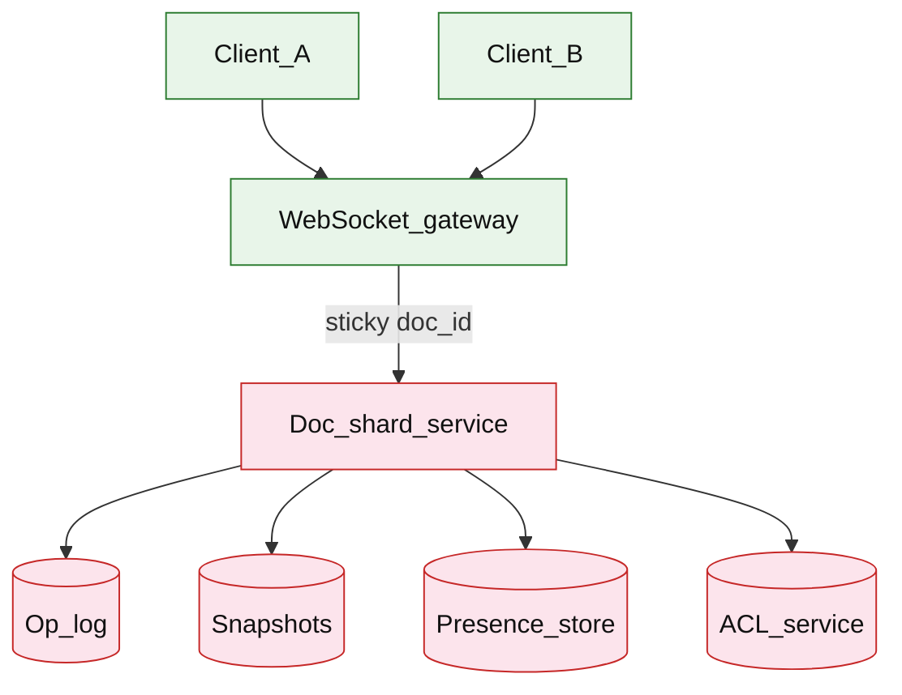

# Collaborative document

## Introduction

A collaborative document editor lets multiple users **edit the same doc in real time** with low latency, consistent merged text, and optional **offline** edits. Clients send **operations** over WebSocket; a **doc shard** orders or merges ops, persists **snapshot + op log**, and broadcasts updates and **presence** (cursors).

**Primary users:** editors (write/read), guests (comment/view), operators (shard health, large-doc migrations), security (ACL, share links).

**Interview pacing:** Use [60-minute runbook](../../prep/interview-runbook-60m.md) — ~10 min requirements theater (below), ~18–32 min diagram + API/DB, ~46–56 min deep dive on **OT/CRDT + session routing**.

Realtime transport patterns overlap [chat messenger](./chat-messenger.md); ordered sessions differ from [news feed](./news-feed.md) fan-out.

## Requirements discovery (interview theater)

### Question bank

| Topic | You ask | If they push back | Example answer (reasonable default) |
| --- | --- | --- | --- |
| Consistency | LWW for text? | "Last save wins" | **OT with server sequence** for body; LWW unacceptable for concurrent typing |
| Offline | Support offline edit? | "Online only" | **Brief offline** queue on client; server OT on reconnect (mention CRDT if offline-first) |
| Doc size | Max length? | "Unlimited" | **10 MB** text equivalent; larger → chunk/sharding by section (defer) |
| Concurrent editors | Per doc? | "2–3" | **50** peak per doc; **500k** active docs with editors |
| Latency | Target? | "Real-time" | **&lt; 100ms** p99 op round-trip in region |
| Rich text | Plain or formatted? | "Google Docs" | Rich ops (insert/delete, retain attributes); interview at **plain text + marks** depth |
| Security | E2E encryption? | "Required" | **Server-readable** model + ACL; E2E is separate hard problem |
| Out of scope | Video co-editing, comments thread? | "Full comments" | Inline text ops + basic presence; defer full comment CRDT tree |

### Example dialogue

> **You:** Let's scope v1: one happy path and what's out of scope?
> **Them:** …
> **You:** For scale, prototype vs 12-month target?
> **Them:** …
> **You:** What does each actor do per day on the hot path?
> **Them:** …
> **You:** I'll lock the **target** column assumptions unless you want different numbers — next I'll map fleet totals to monthly AWS meters in **billable volume**.

### Parsed requirements

| Field | Source question | Parsed value (target) | Drives |
| --- | --- | --- | --- |
| `editor_dau_u` | Editor DAU (`U`) | **20M** | Scale tiers, input model, fleet totals |
| `doc_open_sessions_/_dau_/_day` | Doc open sessions / DAU / day | **3** | Scale tiers, input model, fleet totals |
| `ops_per_active_session_/_min` | Ops per active session / min | **4** | Scale tiers, input model, fleet totals |
| `peak_concurrent_doc_sessions` | Peak concurrent doc sessions | **500k** | Scale tiers, input model, fleet totals |
| `editors_per_hot_doc_cap` | Editors per hot doc (cap) | **50** | Scale tiers, input model, fleet totals |
| `sync_model` | Sync model | **server transform** | Scale tiers, input model, fleet totals |
| `snapshot_interval` | Snapshot interval | **500 ops** | Scale tiers, input model, fleet totals |
| `op_row_size_s_op` | Op row size (`S_op`) | **200 B** | Scale tiers, input model, fleet totals |
| `snapshot_size_s_snap` | Snapshot size (`S_snap`) | **100 KB** | Scale tiers, input model, fleet totals |

### Locked assumptions

| Assumption | Prototype (MVP) | Growth | Target (anchor) |
| --- | --- | --- | --- |
| Editor DAU (`U`) | 10k | 1M | **20M** |
| Doc open sessions / DAU / day | 3 | 3 | 3 |
| Ops per active session / min | 4 | 4 | 4 |
| Peak concurrent doc sessions | **~50** | **~5k** | **500k** |
| Editors per hot doc (cap) | 50 | 50 | 50 |
| Sync model | OT + `revision` | same | server transform |
| Snapshot interval | 500 ops | 500 ops | 500 ops |
| Op row size (`S_op`) | 200 B | 200 B | 200 B |
| Snapshot size (`S_snap`) | 100 KB | 100 KB | 100 KB |

*After ~10 minutes, proceed with the **target** column unless the interviewer changes scope.*

### Interview Q&A cheat sheet

Say aloud in order (~10 min). Write locks into **parsed requirements** before capacity math.

| Step | You ask | Lock if vague (target) |
| --- | --- | --- |
| 1 — Consistency | LWW for text? | **OT with server sequence** for body; LWW unacceptable for concurrent typing |
| 2 — Offline | Support offline edit? | **Brief offline** queue on client; server OT on reconnect (mention CRDT if offline-first) |
| 3 — Doc size | Max length? | **10 MB** text equivalent; larger → chunk/sharding by section (defer) |
| 4 — Concurrent editors | Per doc? | **50** peak per doc; **500k** active docs with editors |
| 5 — Latency | Target? | **&lt; 100ms** p99 op round-trip in region |
| 6 — Rich text | Plain or formatted? | Rich ops (insert/delete, retain attributes); interview at **plain text + marks** depth |
| 7 — Security | E2E encryption? | **Server-readable** model + ACL; E2E is separate hard problem |
| 8 — Out of scope | Video co-editing, comments thread? | Inline text ops + basic presence; defer full comment CRDT tree |

## Capacity sketch

### User input model

| Action | % of DAU | Per user / day | API | ~Req size | Durable write / user / day |
| --- | --- | --- | --- | --- | --- |
| Submit text op | 100% | 720 | WS `op` | 300 B | **~144 KB** (`720 × 200 B`) |
| Open doc (snapshot + tail) | 100% | 3 | `GET snapshot` + WS | 120 KB | **0** read (hydrate) |
| Presence cursor | 80% | 200 | WS ephemeral | 0.2 KB | 0 |
| Create doc | 5% | 0.05 | `POST /v1/docs` | 1 KB | **~500 B** metadata |

**Session math (target):** `3 opens × ~4 min × 4 ops/min ≈ **48 ops/session**` typical; power users drive **720 ops/DAU/day** average across fleet.

### Fleet totals (target)

`U` = 20M editor DAU (anchor tier).

| Metric | Formula | Value |
| --- | --- | --- |
| Ops / day | `U × 720` | **~14.4B** |
| Op log bytes / day (raw) | `14.4B × 200 B` | **~2.9 TB** |
| After snapshot compaction | ~500 ops → snap | **~500 GB–1 TB/day** durable |
| Concurrent WS sessions | peak | **500k** |
| Peak fleet op/s | interview anchor | **~1M/s** |

### Traffic profile (target tier)

| Metric | Value |
| --- | --- |
| **Read:write (API requests)** | **~1:240** (doc open/snapshot reads vs text ops) |
| **Read:write (durable bytes)** | **~6:1** raw op log (**~2.9 TB**/day) vs compacted **~500 GB–1 TB**/day |
| **Requests / day (fleet)** | **~14.5B** (14.4B ops + 60M opens) |
| **Avg RPS** | **~167k/s** ops (`14.4B / 86,400`) |
| **Peak RPS** | **~1M/s** fleet ops; **200/s** per hot doc |

| User / actor | Action | R/W | Per user (or actor) / day | % of fleet requests |
| --- | --- | --- | --- | --- |
| Editor | Submit text op | W | 720 | **~99%** |
| Editor | Open doc (snapshot + tail) | R | 3 | **~0.4%** |
| Editor | Presence cursor | W | 200 | ephemeral |
| Editor | Create doc | W | 0.05 | **&lt;0.01%** |

*Per-user rates stay fixed across prototype → target; only `U` scales fleet totals.*

### AWS service map (target deployment)

| AWS service | Role in this design |
| --- | --- |
| Amazon API Gateway (WebSocket) | Sticky `doc_id` sessions (**500k** concurrent) |
| Amazon ECS on Fargate | WebSocket gateway + doc shard (OT transform) |
| Amazon MSK | Durable op log per shard |
| Amazon Aurora PostgreSQL | Op tail + document metadata |
| Amazon S3 | Periodic snapshots (~100 KB) |
| Amazon ElastiCache for Redis | Presence cursors + room membership |
| Amazon ECS on Fargate | ACL / share-link service |
| Amazon CloudWatch | Per-doc op rate, compaction lag, shard CPU |
| AWS X-Ray | Op round-trip p99 within region |
| Amazon VPC | Regional doc shards |

### Scale tiers

| Tier | `U` | Ops/day | Concurrent sessions | Avg op RPS | Peak op RPS (×10) |
| --- | --- | --- | --- | --- | --- |
| Prototype | 10k | 7.2M | 50 | **~83** | **~830** |
| Growth | 1M | 720M | 5k | **~8.3k** | **~83k** |
| Target | 20M | 14.4B | 500k | **~167k** | **~1M** |

### Symbols

| Symbol | Meaning |
| --- | --- |
| `U` | Editor daily active users |
| `L_op` | Ops submitted per editor per day (720) |
| `S_op` | Bytes per op log row (200 B) |
| `S_snap` | Snapshot blob size (~100 KB) |
| `O_doc` | Peak ops/s on hottest doc (200) |
| `D_sess` | Peak concurrent doc sessions (500k) |

### Derivation (traffic)

**Fleet ops:** `U × L_op` → **14.4B/day** → **~167k/s** avg; viral doc **`O_doc = 200/s`**; fleet peak **~1M ops/s** after distribution.

**Per shard:** ~2k active docs/shard → **~500 ops/s** transform+persist CPU.

**WebSocket:** **500k** sticky sessions on `doc_id`; gateway horizontal scale.

**Bandwidth:** `1M ops/s × 300 B ≈ **300 MB/s**` ingress (regional shards).

**Compaction:** every 500 ops → **~100 KB** snapshot; tail trimmed — steady **~200 KB/doc** not multi-GB/day.

### Storage and growth over time

| Table / store | ~Row size | New / day (target) | Retention | Steady-state (target) | Per editor (target) |
| --- | --- | --- | --- | --- | --- |
| `documents` | 500 B | 50k | permanent | **~25 GB** (50M docs) | — |
| Op log (compacted) | 200 B | 14.4B raw | 24h tail | **~500 GB–1 TB/day** net | **~144 KB/day** |
| Snapshots (object) | 100 KB | 1/500 ops | long-lived | **~5 TB** total | **~250 B/doc** amortized |
| `sessions` | 128 B | 500k live | ephemeral | **~64 MB** | — |

### Per-user economics (target)

| Metric | Value | Notes |
| --- | --- | --- |
| Ops / editor / day | **720** | ~48 per 3 sessions |
| Durable op bytes / editor / day | **~144 KB** | before compaction |
| Doc opens / editor / day | **3** | |
| WS presence msgs / editor / day | **~160** | ephemeral |
| Steady storage / active doc | **~200 KB** | snapshot + tail |

### Service footprint (instances)

| Service | Scales with | Prototype | Growth | Target |
| --- | --- | --- | --- | --- |
| WS gateway | concurrent sessions | 2 | 20 | **~100** |
| Doc shards (OT) | op RPS | 2 | 30 | **~200** |
| Op log / queue | 14.4B/day | 1 | cluster | **~30** brokers |
| Snapshot store | 5 TB | 1 bucket | multi | **S3-class** |
| Presence Redis | 500k keys | 1 | 3 | **~5** nodes |

**First cliff:** **~1M editor DAU** — sticky routing + shard map before hot-doc **200 ops/s** CPU saturation.

### Billable volume (target month)

Convert **fleet totals** to AWS billing meters before dollar math. *List-price ballparks — not a quote.*

| Design quantity (target) | Formula | Monthly billable unit |
| --- | --- | --- |
| API requests | `requests_day × 30` | **derive from fleet** (**~14.5B** (14.4B ops + 60M opens)) |
| OLTP storage steady | storage table | **___ GB-mo** |
| Cache / Redis RAM | footprint | **___ GB** (node tier) |
| Egress / CDN | `egress_day × 30` | **___ GB / mo** |
| Stream / queue events | `events_day × 30` | **___ million events / mo** |
| Log ingest (if full capture) | `log_GB_day × 30` | **___ GB ingest / mo** |
| **Per unit** | `total / scale driver` | **$…/unit/mo** |

*Reconcile rows in **Cloud cost ballpark** (9a) with these meters.*

### Cost at a glance

Interview sound bite — reconcile with **billable volume** and **cloud cost** below.

| Tier | Scale | ~Monthly $ (core) | Per unit |
| --- | --- | --- | --- |
| Prototype (MVP) | see locked assumptions | **~$1k** | platform tax dominates |
| Target (anchor) | `U` or `Q` = **see locked assumptions** | **see cloud cost** | **see cloud cost** |

**First payment block:** smallest prod footprint (load balancer + database + compute) before per-million traffic dominates.

### Cloud cost ballpark (target)

| Line item | Driver | ~Monthly |
| --- | --- | --- |
| Doc shard compute | 200 pods OT CPU | **~$80k** |
| Op log + DB tail | 1 TB/day net | **~$60k** |
| Object snapshots | 5 TB | **~$2k** |
| Gateway + presence | 500k WS | **~$25k** |
| **Total** | | **~$170k/mo** |
| **Per editor DAU** | `170k/20M` | **~$0.0085/DAU/mo** |

### Timeline (per-user rates fixed; `U` grows)

| Milestone | `U` | Ops/day | Compacted ingest/day | ~Monthly $ |
| --- | --- | --- | --- | --- |
| Launch | 10k | 7.2M | **~1.4 GB** | **~$1k** |
| Month 3 | 80k | 58M | **~12 GB** | **~$5k** |
| Month 6 | 320k | 230M | **~46 GB** | **~$18k** |
| Month 12 | 1.3M | 936M | **~190 GB** | **~$60k** |

Month 12 is **growth tier** — doc shard pools before **20M editor DAU**.

### Sensitivity

- **CRDT offline-first** — larger ops; more RAM per doc — swap model in interview.
- **50+ editors** — OT CPU hotspot; cap editors or partition doc.
- **10× `U`** — linear op log; regional shards.
- **10 MB doc** — snapshot load latency — lazy paragraph load.

## High-level design

### Architecture (user → database)



**Narrative:** Clients open doc → resolve shard via **gateway** (sticky on `doc_id`) → **ACL** check → load latest **snapshot** + tail **op log** since snapshot revision. Live edits send **ops**; shard assigns **revision**, transforms against concurrent ops (OT), appends log, broadcasts to room. **Presence** (cursors) on separate ephemeral channel. Periodic **snapshot** compaction truncates op log.

## User-visible surface

- **Editor:** typing appears to collaborators within ~100ms; remote cursors; reconnect resumes from last acked revision.
- **Viewer:** read-only stream without submitting ops.
- **Admin:** share link, role (edit/comment/view), revoke access.

## API contract and input model

### UX → API traceability

| UX / UI action | User intent | API or event | Sync/async | Idempotent? | Validates |
| --- | --- | --- | --- | --- | --- |
| **Editor:** typing appears to collaborators within ~100ms; r | Create document | `POST` `/v1/docs` | sync | yes | domain rules |
| **Viewer:** read-only stream without submitting ops. | Metadata + ACL | `GET` `/v1/docs/{doc_id}` | sync | read | domain rules |
| **Admin:** share link, role (edit/comment/view), revoke acce | Load snapshot + from_revision | `GET` `/v1/docs/{doc_id}/snapshot` | sync | read | domain rules |
| See user-visible surface | Realtime ops + presence | `WS` `/v1/docs/{doc_id}/session` | async | yes | domain rules |
| See user-visible surface | Create share link | `POST` `/v1/docs/{doc_id}/shares` | sync | yes | domain rules |
### Endpoints

| Method | Path | Purpose |
| --- | --- | --- |
| `POST` | `/v1/docs` | Create document |
| `GET` | `/v1/docs/{doc_id}` | Metadata + ACL |
| `GET` | `/v1/docs/{doc_id}/snapshot` | Load snapshot + from_revision |
| `WS` | `/v1/docs/{doc_id}/session` | Realtime ops + presence |
| `POST` | `/v1/docs/{doc_id}/shares` | Create share link |

### WebSocket messages (examples)

Client → server (operation)

```json
{
 "type": "op",
 "client_id": "cli_a1",
 "base_revision": 1842,
 "op": {
 "kind": "insert",
 "pos": 120,
 "text": "hello"
 }
}
```

Server → clients (ack + broadcast)

```json
{
 "type": "op_applied",
 "revision": 1843,
 "client_id": "cli_a1",
 "op": {
 "kind": "insert",
 "pos": 120,
 "text": "hello"
 },
 "transformed": false
}
```

Presence (ephemeral)

```json
{
 "type": "cursor",
 "client_id": "cli_b2",
 "user_id": "user_2201",
 "pos": 450,
 "selection": { "start": 450, "end": 455 }
}
```

`GET /v1/docs/doc_8f2a/snapshot?from_revision=1800`

```json
{
 "doc_id": "doc_8f2a",
 "snapshot_revision": 1800,
 "content": ".... full text ....",
 "ops_since": [
 { "revision": 1801, "op": { "kind": "delete", "pos": 10, "len": 2 } }
 ]
}
```

`POST /v1/docs`

```json
{
 "title": "Q3 Planning",
 "owner_id": "user_9912"
}
```

### Input validation

- Ops must reference `base_revision` equal to server’s last ack for client or be transformable.
- Max op payload 16 KB; rate limit 20 ops/s per client.
- ACL enforced on WS connect and REST.
- Share tokens scoped (view vs edit) with expiry.

## Database model

### Stores

| Store | Key fields | Notes |
| --- | --- | --- |
| `docs` | `doc_id`, `owner_id`, `title`, `created_at` | Metadata |
| `doc_acl` | `doc_id`, `principal_id`, `role` | edit/view |
| `op_log` | `doc_id`, `revision`, `op_json`, `client_id`, `at` | Append-only |
| `snapshots` | `doc_id`, `revision`, `content_ref`, `created_at` | S3 + pointer |
| `doc_shard_map` | `doc_id` → `shard_id` | Routing table |
| `presence` | `doc_id`, `user_id`, `cursor`, `ttl` | Redis |

Indexes:

- `op_log(doc_id, revision)` UNIQUE
- `snapshots(doc_id, revision DESC)` latest

### Read/write paths

1. **Open doc** — ACL → fetch latest snapshot + ops `revision > snapshot_revision`.
2. **Apply op** — OT against concurrent since `base_revision` → assign `revision++` → append `op_log` → broadcast.
3. **Ack client** — include transformed op if client was behind.
4. **Snapshot job** — every N ops/minutes, write content blob, trim op log tail kept for recovery.
5. **Reconnect** — client sends last acked revision; server streams missing ops.

## Interview deep dive: OT/CRDT + session routing

### OT vs CRDT (pick one in interview)

| Model | Authority | Offline | Complexity |
| --- | --- | --- | --- |
| **OT (server)** | Server orders/transforms | Queue ops; transform on reconnect | Well understood for text |
| **CRDT** | Commutative replicas | Strong offline | Rich text types harder |

**Default narrative:** central **OT** with monotonic `revision`; server transforms client op if `base_revision < head`.

Example: A inserts at 10, B deletes 5–8 concurrently — server produces transformed ops so both converge to same string.

### Session routing

- **Sticky gateway:** `hash(doc_id) → shard` — all editors on same shard → in-memory doc state + ordering.
- **Shard memory:** hot doc state in RAM; cold docs evicted — reload snapshot+log on next connect.
- **Failover:** shard dies → recovery from snapshot+log; clients reconnect with exponential backoff.

**Do not** broadcast ops through global pub/sub without ordering — shard is single writer per doc.

### Presence separation

- Cursors **not** in OT log — UDP-like ephemeral messages — loss OK.
- Reduces op log churn; **30s TTL** on presence keys.

### Permissions

- Server-readable content — ACL on WS handshake.
- Share link = capability token; role maps to op_allowed boolean.

## Scale and failure

### Correctness model

- Strong convergence: all clients applying same ordered revision stream reach identical document state.
- No lost acknowledged ops after durable append to `op_log`.
- Snapshot + tail replay reconstructs state exactly.

### Failure cases

| Failure | Symptom | Mitigation |
| --- | --- | --- |
| Shard crash | Disconnect storm | Persist op before ack; snapshot recovery |
| Hot doc 50 editors | CPU high | Editor cap; op rate limit; split doc sections (future) |
| Large snapshot load | Slow open | Progressive load; compress snapshots |
| Transform bug | Divergent clients | Revision checksum audit; feature flag rollback |
| Stale base_revision flood | Retry storm | Server batch transform; reject with catch-up burst |
| Gateway wrong shard | Split brain | Central shard map; redirect on mismatch |
| Offline queue flood | Reconnect spike | Client-side cap; server transform backlog queue |

### Key metrics

- Op round-trip p50/p99; transform CPU per shard
- Reconnect rate; catch-up ops sent per session
- Snapshot lag (head revision − snapshot revision)
- Active docs per shard; memory per shard
- ACL denial rate; presence fanout bandwidth

### Interview deep dive talking points

- Reject **LWW** for body text — use OT/CRDT.
- **Sticky doc_id → shard** — single orderer per doc.
- Revision log + periodic snapshot — how recovery works.
- Presence off hot path; ACL at connect.
- Compare OT (server authority) vs CRDT (offline) in one table.

## Related

- [Examples hub](./README.md)
- [Chat messenger](./chat-messenger.md)
- [Real-time delivery tracking](../logistics/real-time-delivery-tracking.md)
- [News feed](./news-feed.md)
- [Concurrency ](../../topics/concurrency.md)
- [API design ](../../topics/api-design.md)
- [60-minute runbook](../../prep/interview-runbook-60m.md)
