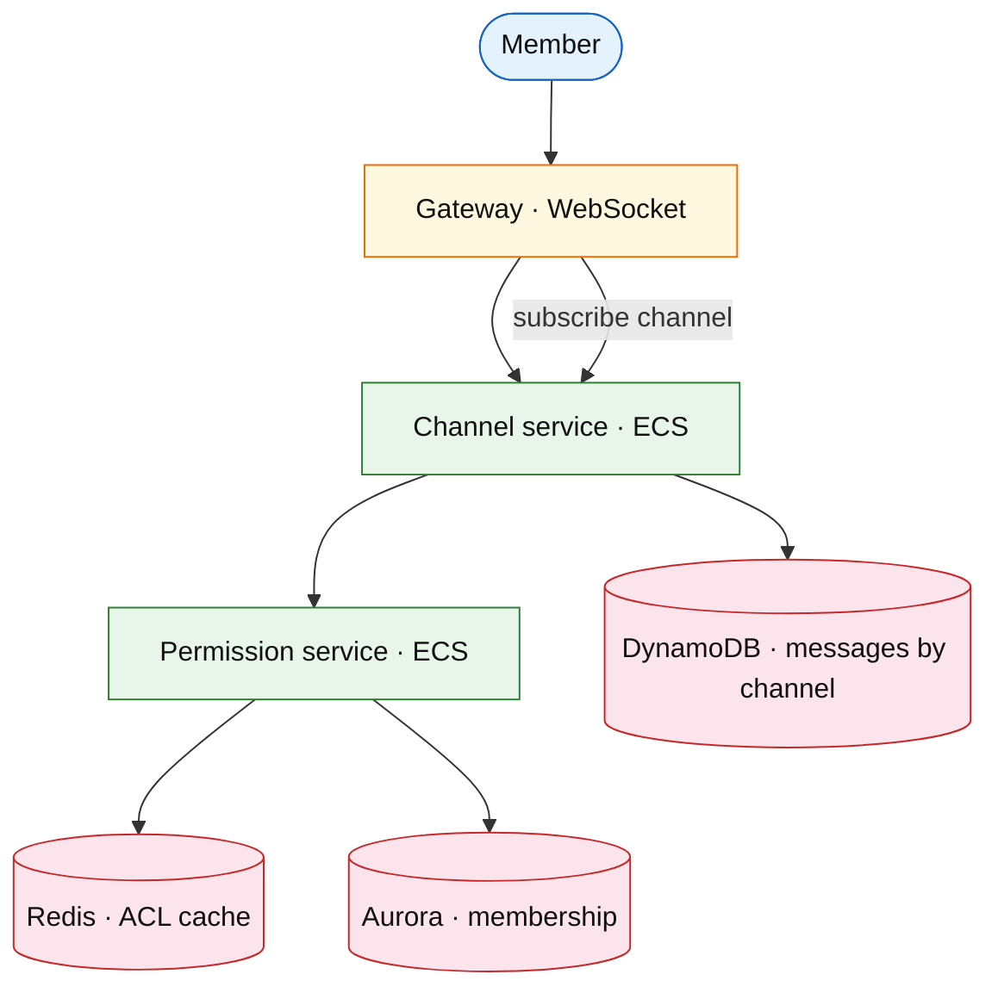

# Community chat platform (Discord / Slack)

## Introduction

Community chat adds **servers/workspaces**, **channels**, **roles**, and **permissions** on top of [chat messenger](./chat-messenger.md) 1:1/group semantics — interview focus is **permission cache** and **channel fanout**.

**Company anchors:** Discord, Slack, Microsoft Teams.

## Requirements discovery

| Lock (target) |
| --- |
| 200M MAU |
| 10M messages / minute peak |
| Channels per server up to 500 |
| Role-based read/post ACL |

## Architecture (user → database)

**Narrative:** **Gateway** authenticates and subscribes socket to `channel_id` list. **Permission service** resolves role → ACL (cached). **Channel service** appends messages with per-channel sequence.

## Deep dive

- **ACL cache** invalidation on role change (pub/sub).
- **Voice** (Discord): defer to [video conferencing](../media/video-conferencing-platform.md).
- Full message ordering: [chat messenger](./chat-messenger.md).

## Related

- [Chat messenger](./chat-messenger.md)
- [CRUD data manager](../infra/crud-data-manager.md) (multi-tenant SaaS)
- [Global messaging](./global-messaging-platform.md)
