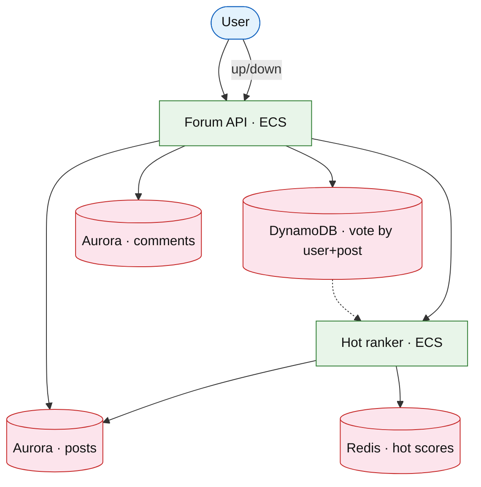

# Community forum platform (Reddit)

## Introduction

A forum organizes content into **subreddits** (communities), ranks posts by **votes** and **time decay**, and serves **comments** as trees — different from [news feed](./news-feed.md) (social graph) and [microblog timeline](./microblog-timeline.md) (follow-based).

**Company anchors:** Reddit, Hacker News (simpler), Stack Overflow (Q&A variant).

**Interview pacing:** Deep dive **vote aggregation + hot rank formula + comment tree**.

## Requirements discovery

| Lock (target) |
| --- |
| 100M WAU |
| Hot feed p99 &lt; 150 ms per subreddit |
| Vote writes: 1B / day |
| Comments: tree depth cap 10 |

## Architecture (user → database)

**Narrative:** **Votes** are idempotent per `(user_id, post_id)`. **Ranker** recomputes hot score `log(upvotes) + time_decay` into **Redis** sorted sets per subreddit. **Feed read** is `ZRANGE` + hydrate post bodies.

## Deep dive

- **Wilson score** or Reddit **hot** algorithm on whiteboard.
- **Comment tree:** `parent_id` index; load top N branches.
- Moderation queue: defer to [notification platform](../platform/notification-platform.md).

## Related

- [News feed](./news-feed.md)
- [Reviews aggregates](../commerce/reviews-ratings.md)
- [ElastiCache drill](../aws/elasticache-redis.md)
