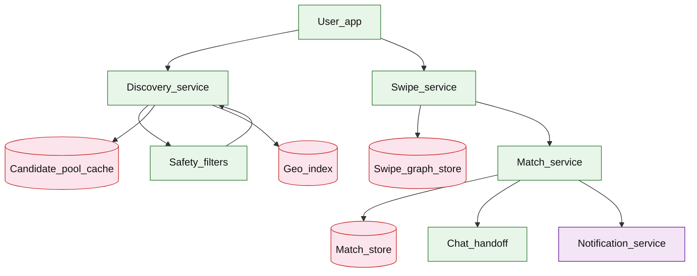

# Dating discovery and matching

## Introduction

A dating app shows users a **personalized candidate queue** to swipe on (like/pass), creates a **match** only on **mutual like** (double opt-in), then **hands off** to chat. The design splits **discovery** (who to show) from **swipe/match** (stateful mutual intent) with safety filters and anti-abuse limits.

**Primary users:** daters (swipe, match, chat), trust/safety (blocklist, reports), operators (candidate quality, match rate dashboards).

**Interview pacing:** Use [60-minute runbook](../../prep/interview-runbook-60m.md) — ~10 min requirements theater (below), ~18–32 min diagram + API/DB, ~46–56 min deep dive on **candidate generation + mutual match**.

Geo indexing overlaps [maps navigation routing](../logistics/maps-navigation-routing.md); post-match: [chat messenger](./chat-messenger.md); notifications: [notification platform](../platform/notification-platform.md).

## Requirements discovery (interview theater)

### Question bank

| Topic | You ask | If they push back | Example answer (reasonable default) |
| --- | --- | --- | --- |
| Users & scale | DAU? Swipes/day? | "Tinder-scale" | 50M DAU; **1B swipes/day** |
| Discovery | How pick candidates? | "Random" | **Geo radius** + preference filters + exclude seen/blocked |
| Match rule | Mutual only? | "Super-like forces match" | **Double opt-in** like→like creates match |
| Queue size | Precompute or realtime? | "Realtime ML" | **Precomputed candidate pool** per user refreshed hourly + online filters |
| Safety | Block/report? | "Ignore" | Blocklist removes from pool; rate limits on swipes |
| Freshness | Reshow profiles? | "Never" | Exclude swiped users; recycle after 30 days if pass (product tunable) |
| Out of scope | Full ML ranker training? | "Deep ranker" | Scoring features + weights; defer training pipeline |

### Example dialogue

> **You:** Let's scope v1: one happy path and what's out of scope?
> **Them:** …
> **You:** For scale, prototype vs 12-month target?
> **Them:** …
> **You:** What does each actor do per day on the hot path?
> **Them:** …
> **You:** I'll lock the **target** column assumptions unless you want different numbers — next I'll map fleet totals to monthly AWS meters in **billable volume**.

### Parsed requirements

| Field | Source question | Parsed value (target) | Drives |
| --- | --- | --- | --- |
| `dau_u` | DAU (`U`) | **50M** | Scale tiers, input model, fleet totals |
| `swipes_per_dau_/_day_l_swipe` | Swipes per DAU / day (`L_swipe`) | **20** | Scale tiers, input model, fleet totals |
| `discovery_sessions_/_dau_/_day` | Discovery sessions / DAU / day | **5** | Scale tiers, input model, fleet totals |
| `candidates_per_pull_n_batch` | Candidates per pull (`N_batch`) | **20** | Scale tiers, input model, fleet totals |
| `precomputed_pool_size_p` | Precomputed pool size `P` | **200** | Scale tiers, input model, fleet totals |
| `match_rate_of_swipes` | Match rate (of swipes) | **2%** | Scale tiers, input model, fleet totals |
| `discovery_radius` | Discovery radius | **50 km (geo index)** | Scale tiers, input model, fleet totals |
| `s_swipe_row_size` | `S_swipe` row size | **48 B** | Scale tiers, input model, fleet totals |

### Locked assumptions

| Assumption | Prototype (MVP) | Growth | Target (anchor) |
| --- | --- | --- | --- |
| DAU (`U`) | 10k | 1M | **50M** |
| Swipes per DAU / day (`L_swipe`) | 20 | 20 | 20 |
| Discovery sessions / DAU / day | 5 | 5 | 5 |
| Candidates per pull (`N_batch`) | 20 | 20 | 20 |
| Precomputed pool size `P` | 200 | 200 | 200 |
| Match rate (of swipes) | 2% | 2% | 2% |
| Discovery radius | 50 km | 50 km | 50 km (geo index) |
| `S_swipe` row size | 48 B | 48 B | 48 B |

*After ~10 minutes, proceed with the **target** column unless the interviewer changes scope.*

### Interview Q&A cheat sheet

Say aloud in order (~10 min). Write locks into **parsed requirements** before capacity math.

| Step | You ask | Lock if vague (target) |
| --- | --- | --- |
| 1 — Users & scale | DAU? Swipes/day? | 50M DAU; **1B swipes/day** |
| 2 — Discovery | How pick candidates? | **Geo radius** + preference filters + exclude seen/blocked |
| 3 — Match rule | Mutual only? | **Double opt-in** like→like creates match |
| 4 — Queue size | Precompute or realtime? | **Precomputed candidate pool** per user refreshed hourly + online filters |
| 5 — Safety | Block/report? | Blocklist removes from pool; rate limits on swipes |
| 6 — Freshness | Reshow profiles? | Exclude swiped users; recycle after 30 days if pass (product tunable) |
| 7 — Out of scope | Full ML ranker training? | Scoring features + weights; defer training pipeline |

## Capacity sketch

### User input model

| Action | % of DAU | Per user / day | API | ~Req size | Durable write / user / day |
| --- | --- | --- | --- | --- | --- |
| Swipe (like/pass) | 100% | 20 | `POST /v1/swipes` | 0.5 KB | **~960 B** (`20 × 48 B`) |
| Discovery pull (card stack) | 100% | 5 | `GET /v1/discovery/candidates` | 25 KB resp | **0** read (`candidate_pools` cache) |
| List matches | 30% | 2 | `GET /v1/matches` | 5 KB | read-mostly |
| Update profile | 10% | 0.1 | `PATCH /v1/profiles/me` | 3 KB | **~200 B** amortized |

**Discovery timeline math (target):**

- **Profiles surfaced / DAU / day** ≈ `5 sessions × 20 candidates = **100**` (overlap across sessions; pool `P=200` refreshed hourly).
- **Swipes / DAU / day** = **20** → **1B/day** at 50M DAU.

### Fleet totals (target)

`U` = 50M (anchor tier).

| Metric | Formula | Value |
| --- | --- | --- |
| Swipes / day | `U × L_swipe` | **1B** |
| Discovery GETs / day | `U × 5` | **250M** |
| Matches / day | `1B × 2%` | **~20M** |
| Swipe OLTP bytes / day | `1B × 48 B` | **~48 GB** |
| Pool refresh bytes / day | `U × 1.6 KB` | **~80 GB** |

### Traffic profile (target tier)

| Metric | Value |
| --- | --- |
| **Read:write (API requests)** | **~1:4** (discovery + match list reads vs swipes) |
| **Read:write (durable bytes)** | **~1:1** swipe OLTP **~48 GB**/day vs pool refresh **~80 GB**/day |
| **Requests / day (fleet)** | **~1.28B** |
| **Avg RPS** | **~14.8k/s** (`1.28B / 86,400`) |
| **Peak RPS** | **~150k/s** swipes (evening spike) |

| User / actor | Action | R/W | Per user (or actor) / day | % of fleet requests |
| --- | --- | --- | --- | --- |
| Dater | Swipe (like/pass) | W | 20 | **~78%** |
| Dater | Discovery pull | R | 5 | **~20%** |
| Dater | List matches | R | 0.6 | **~2%** |
| Dater | Update profile | W | 0.1 | **&lt;1%** |

*Per-user rates stay fixed across prototype → target; only `U` scales fleet totals.*

### AWS service map (target deployment)

| AWS service | Role in this design |
| --- | --- |
| Amazon API Gateway | Discovery, swipe, match REST |
| Application Load Balancer | Discovery + swipe + match services |
| Amazon ECS on Fargate | Discovery, swipe, match, safety filter services |
| Amazon ElastiCache for Redis | Per-user `candidate_pools` (hourly refresh) |
| Amazon OpenSearch Service | Geo radius + preference filters |
| Amazon Aurora PostgreSQL | `swipes`, `matches`, `profiles` |
| Amazon DynamoDB | Reciprocal like index (hot path) |
| AWS Batch | Hourly pool builder (offline ranking) |
| Amazon SNS | Match push notifications |
| Amazon ECS on Fargate | Chat handoff client to [chat messenger](./chat-messenger.md) |
| Amazon CloudWatch | Match rate, swipe velocity, pool freshness lag |
| Amazon VPC | Regional discovery shards |

### Scale tiers

| Tier | `U` | Swipes/day | Discovery GETs/day | Avg swipe RPS | Peak swipe RPS (×10) |
| --- | --- | --- | --- | --- | --- |
| Prototype | 10k | 200k | 50k | **~2.3** | **~23** |
| Growth | 1M | 20M | 5M | **~230** | **~2.3k** |
| Target | 50M | 1B | 250M | **~11.6k** | **~150k** |

### Symbols

| Symbol | Meaning |
| --- | --- |
| `U` | Daily active users |
| `L_swipe` | Swipes per DAU per day (20) |
| `N_batch` | Candidates returned per discovery pull (20) |
| `P` | Precomputed pool size per user (200) |
| `S_swipe` | Bytes per swipe row (48 B) |
| `r_match` | Match rate as fraction of swipes (0.02) |

### Derivation (traffic)

**Swipes:** `S_day = U × L_swipe` → **1B/day** → **~11.6k/s** avg, **~150k/s** evening peak.

**Reciprocal like checks:** ~50% swipes are likes → **~75k/s** indexed lookups at peak.

**Matches:** `S_day × r_match` → **~20M/day** → **~230/s** avg.

**Discovery reads:** `U × 5` → **250M/day** → **~3k/s** avg; pool served from Redis — online path filters blocklist + already-swiped.

**Pool builder:** hourly refresh **U** pools × `P` ids — batch, not on swipe hot path.

### Storage and growth over time

| Table / store | ~Row size | New / day (target) | Retention | Steady-state (target) | Per DAU (target) |
| --- | --- | --- | --- | --- | --- |
| `profiles` | 2 KB | 200k signups | permanent | **~100 GB** (50M) | **~2 KB** |
| `swipes` | 48 B | 1B | 90d hot | **~45 GB** hot window | **960 B/day** |
| `candidate_pools` | 1.6 KB | `U` refresh | 24h | **~80 GB** | **1.6 KB** |
| `matches` | 128 B | 20M | permanent | **~80 GB/yr** | **~512 B/day** |

**Cumulative swipes (cold):**

| Horizon | Swipes | Size (`× 48 B`) |
| --- | --- | --- |
| 1 year | 365B | **~17 TB** |
| 5 years | 1.8T | **~88 TB** |

### Per-user economics (target)

| Metric | Value | Notes |
| --- | --- | --- |
| Swipes / DAU / day | **20** | |
| Profiles surfaced / DAU / day | **~100** | 5×20; pool cap 200 |
| Requests / DAU / day | **~27** | swipes + discovery + matches |
| Durable bytes / DAU / day | **~2.5 KB** | swipes + pool amortized |
| Matches / DAU / day | **~0.4** | 2% of 20 swipes |

### Service footprint (instances)

| Service | Scales with | Prototype | Growth | Target |
| --- | --- | --- | --- | --- |
| Swipe API | peak swipe RPS | 2 | 20 | **~80** |
| Discovery API | discovery RPS | 2 | 10 | **~30** |
| Match service | reciprocal QPS | 2 | 10 | **~40** |
| Pool cache (Redis) | 80 GB | 1 node | cluster | **~10** shards |
| Geo index | 50M profiles | 1 | 3 | **~15** |
| Pool builder (batch) | `U` hourly | 1 job | 10 workers | **~50** workers |

**First cliff:** **~1M DAU** — swipe write shard + reciprocal index before **10M** evening peaks.

### Billable volume (target month)

Convert **fleet totals** to AWS billing meters before dollar math. *List-price ballparks — not a quote.*

| Design quantity (target) | Formula | Monthly billable unit |
| --- | --- | --- |
| API requests | `requests_day × 30` | **derive from fleet** (**~1.28B**) |
| OLTP storage steady | storage table | **___ GB-mo** |
| Cache / Redis RAM | footprint | **___ GB** (node tier) |
| Egress / CDN | `egress_day × 30` | **___ GB / mo** |
| Stream / queue events | `events_day × 30` | **___ million events / mo** |
| Log ingest (if full capture) | `log_GB_day × 30` | **___ GB ingest / mo** |
| **Per DAU** | `total / U` (`U` = 50M) | **$…/DAU/mo** |

*Reconcile rows in **Cloud cost ballpark** (9a) with these meters.*

### Cost at a glance

Interview sound bite — reconcile with **billable volume** and **cloud cost** below.

| Tier | Scale | ~Monthly $ (core) | Per unit |
| --- | --- | --- | --- |
| Prototype (MVP) | see locked assumptions | **~$500** | platform tax dominates |
| Target (anchor) | `U` or `Q` = **50M** | **see cloud cost** | **$…/DAU/mo** |

**First payment block:** smallest prod footprint (load balancer + database + compute) before per-million traffic dominates.

### Cloud cost ballpark (target)

| Line item | Driver | ~Monthly |
| --- | --- | --- |
| Swipe + match compute | 150 pods | **~$40k** |
| Redis pools + geo | 80 GB + index | **~$15k** |
| Swipe OLTP (90d hot) | 48 GB/day ingest | **~$25k** |
| Pool builder / ML features | hourly batch | **~$20k** |
| **Total (core product)** | | **~$100k/mo** |
| **Per DAU** | `100k/50M` | **~$0.002/DAU/mo** |

### Timeline (per-user rates fixed; `U` grows)

| Milestone | `U` | Swipes/day | Pool RAM | ~Monthly $ |
| --- | --- | --- | --- | --- |
| Launch | 10k | 200k | **~16 MB** | **~$500** |
| Month 3 | 80k | 1.6M | **~128 MB** | **~$2k** |
| Month 6 | 320k | 6.4M | **~512 MB** | **~$8k** |
| Month 12 | 1.3M | 26M | **~2 GB** | **~$25k** |

Month 12 is **growth tier** — geo sharding and swipe partitions before **50M DAU**.

### Sensitivity

- **10× `U`** — linear swipes; shard by region + `actor_id`.
- **10× peak swipes** — swipe service + reciprocal index first.
- **Heavy ML ranker** — offline features to pool builder; online re-rank top 50 only.
- **2× candidates per pull** — discovery egress ↑; pool `P` may need 400.

## High-level design

### Architecture (user → database)



**Narrative:** **Discovery** returns next candidates from per-user **pool** (precomputed) intersected with **geo** radius and **safety** blocklists. **Swipe service** records like/pass idempotently. On **like**, check if target already liked actor → **match service** creates mutual match row and triggers **chat** conversation + push **notification**. Pass removes from local session queue only.

## User-visible surface

- **User:** card stack; like/pass/super-like; “It’s a match!” screen; enter chat.
- **Safety:** block user → never appears again; report flow (async review).
- **Operator:** match rate, swipe velocity anomalies, pool freshness lag.

## API contract and input model

### UX → API traceability

| UX / UI action | User intent | API or event | Sync/async | Idempotent? | Validates |
| --- | --- | --- | --- | --- | --- |
| **User:** card stack; like/pass/super-like; “It’s a match!” | Next batch of profiles | `GET` `/v1/discovery/candidates` | sync | read | domain rules |
| **Safety:** block user → never appears again; report flow (a | Like or pass | `POST` `/v1/swipes` | sync | yes | domain rules |
| **Operator:** match rate, swipe velocity anomalies, pool fre | List matches | `GET` `/v1/matches` | sync | read | domain rules |
| See user-visible surface | Safety block | `POST` `/v1/users/{id}/block` | sync | yes | domain rules |
| See user-visible surface | Own profile | `GET` `/v1/profiles/me` | sync | read | domain rules |
### Endpoints

| Method | Path | Purpose |
| --- | --- | --- |
| `GET` | `/v1/discovery/candidates` | Next batch of profiles |
| `POST` | `/v1/swipes` | Like or pass |
| `GET` | `/v1/matches` | List matches |
| `POST` | `/v1/users/{id}/block` | Safety block |
| `GET` | `/v1/profiles/me` | Own profile |

### Example payloads

`GET /v1/discovery/candidates?limit=20`

```json
{
 "candidates": [
 {
 "user_id": "user_2201",
 "display_name": "Sam",
 "age": 29,
 "distance_km": 3.2,
 "photo_url": "https://cdn.example/p/2201.jpg"
 }
 ],
 "pool_refreshed_at": "2026-05-23T19:00:00Z"
}
```

`POST /v1/swipes`

```http
Idempotency-Key: swipe-user9912-user2201-001
```

```json
{
 "target_user_id": "user_2201",
 "action": "like"
}
```

Response `200 OK` (no match yet)

```json
{
 "swipe_id": "swp_7k2m",
 "action": "like",
 "match": null
}
```

Response when mutual like creates match:

```json
{
 "swipe_id": "swp_7k2m9p",
 "action": "like",
 "match": {
 "match_id": "match_8f2a1c",
 "conversation_id": "conv_4412",
 "created_at": "2026-05-23T19:05:00Z"
 }
}
```

`GET /v1/matches?cursor=...`

```json
{
 "matches": [
 {
 "match_id": "match_8f2a1c",
 "other_user": { "user_id": "user_2201", "display_name": "Sam" },
 "created_at": "2026-05-23T19:05:00Z"
 }
 ],
 "next_cursor": "eyJtYXRjaF9pZCI6Im1hdGNoXzcwMDAifQ"
}
```

### Input validation

- Cannot swipe self; block if blocked either direction.
- `Idempotency-Key` per `(actor, target, action)` window.
- Rate limit: 100 swipes/min per user; 50 likes/min.
- `action`: `like` | `pass` | `super_like` (optional one per day).

## Database model

### Tables

| Table | Key fields | Notes |
| --- | --- | --- |
| `profiles` | `user_id`, `attributes_json`, `lat`, `lon`, `visibility`, `updated_at` | Discovery input |
| `candidate_pools` | `user_id`, `candidate_ids`, `generated_at`, `version` | Precomputed |
| `swipes` | `actor_id`, `target_id`, `action`, `created_at` | Partition by date |
| `likes_pending` | `liker_id`, `liked_id`, `created_at` | Or derive from swipes |
| `matches` | `match_id`, `user_a`, `user_b`, `conversation_id`, `created_at` | `UNIQUE` unordered pair |
| `blocks` | `blocker_id`, `blocked_id` | Safety |

Indexes:

- `swipes(actor_id, target_id)` UNIQUE per day bucket (idempotency)
- `swipes(target_id, actor_id, action)` where `action=like` — reciprocal check
- `matches(user_a, user_b)` canonical sorted pair
- Geo index: geohash → `user_id` (external Redis/ES)

### Read/write paths

1. **Discovery** — load pool → filter blocklist + already swiped today → geo distance sort → return top N.
2. **Swipe** — insert swipe idempotent → if `pass`, done → if `like`, check reverse like exists → if yes **create match** txn.
3. **Match create** — insert `matches` with `user_a < user_b` ordering → call chat create conversation → enqueue notification.
4. **Pool builder (batch)** — hourly job: geo + preferences + ML score → write `candidate_pools`.

## Interview deep dive: Candidate generation + mutual match

### Candidate generation pipeline

| Stage | Output |
| --- | --- |
| **Hard filters** | Age range, distance, gender prefs, blocklist |
| **Anti-repeat** | Exclude prior swipes (pass/l like) |
| **Scoring** | Weighted features (activity, interests, popularity cap) |
| **Pool cache** | Top 200 stored per user |

**Why precompute:** swipe peak **150k/s** cannot run heavy ranker per `GET /discovery`. Online path only filters cached pool.

**Popularity cap:** avoid showing same mega-popular users to everyone — fairness term in score.

### Mutual match (double opt-in)

```text
A likes B → record like(A→B)
B likes A → see like(B→A); query like(A→B) exists → create match
```

**Race:** A and B like simultaneously — `UNIQUE(match pair)` + txn — one wins, other idempotent返回 same match.

**Not** notification on one-sided like (reduces harassment); optional “someone liked you” paid feature out of scope.

### Idempotent swipes

- `Idempotency-Key` or `UNIQUE(actor, target, day)`.
- Retry network → same response body.

### Chat handoff

- Match row stores `conversation_id`.
- [Chat messenger](./chat-messenger.md) creates 1:1 conversation — match service calls synchronously or via event (interview: sync for simpler UX).

### Safety velocity

- Rate limits at API gateway.
- New accounts: lower like caps.
- Report spikes → downgrade in pool builder score.

## Scale and failure

### Correctness model

- At most one `match` per unordered user pair.
- Blocked users never appear in discovery or accept swipes.
- Swipe idempotent under retry.

### Failure cases

| Failure | Symptom | Mitigation |
| --- | --- | --- |
| Stale pool | Repeated candidates | TTL pool; exclude swiped in online filter |
| Reciprocal check miss | Match not created | Index on reverse like; txn retry |
| Double match race | Duplicate rows | UNIQUE canonical pair |
| Pool builder lag | Poor relevance | Fallback geo-only online query |
| Hot influencer | Queue dominated | Popularity cap in scorer |
| Chat handoff fail | Match without chat | Reconcile job; repair conversation |
| Geo shard hot | Slow discovery | Regional pools |

### Key metrics

- Swipes/s; like rate; match rate
- Discovery empty-queue rate
- Pool age p95; builder job duration
- Reciprocal check latency p99
- Block/report rate; rate-limit hits
- Chat handoff success rate

### Interview deep dive talking points

- **1B swipes/day** — separate discovery (read pool) from swipe write path.
- Precompute **200 candidates**; online = filters not full ranker.
- **Double opt-in** reciprocal like with race-safe UNIQUE pair.
- Idempotent swipes + blocklist everywhere.
- Hand off to chat + notification on match only.

## Related

- [Examples hub](./README.md)
- [Chat messenger](./chat-messenger.md)
- [News feed](./news-feed.md)
- [Maps navigation routing](../logistics/maps-navigation-routing.md)
- [Notification platform](../platform/notification-platform.md)
- [60-minute runbook](../../prep/interview-runbook-60m.md)
