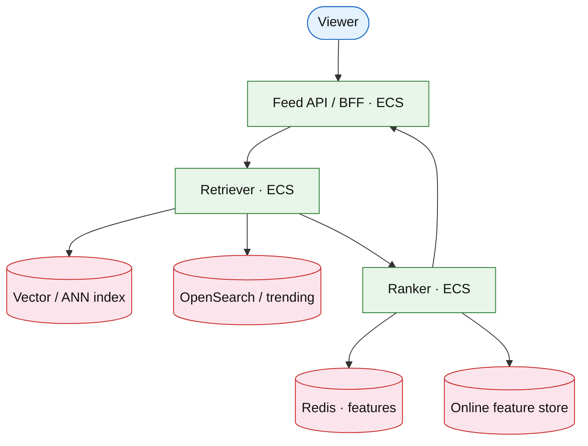

# Home feed ranking service

## Introduction

The **ranking service** scores candidates for “For You” after **retrieval**. **Nowadays** this means **two-tower / ANN retrieval**, a **feature store** with freshness SLIs, **shadow traffic** for models, and **flag-gated** ranking—not a single logistic regression box.

**Primary users:** viewers, ML/data, operators (explore/exploit).

**Interview pacing:** Deep dive **retrieval + scoring + feature freshness**. Pair with [news-feed](./news-feed.md) for fanout/write path.

## Requirements discovery

| Lock (target) |
| --- |
| 200M DAU; ~20 home loads / DAU / day |
| Retrieve ~500–1000 candidates; show top ~50 |
| p99 rank &lt; 120 ms after retrieval |
| Feature freshness SLI &lt; 5 min for online features |
| Ads / organic lanes separated |

## Capacity sketch

| Component | Role |
| --- | --- |
| Retriever | Graph + ANN/vector + trending inverted index |
| Ranker | Heavy features + model ensemble |
| Feature store | Online (DynamoDB/Redis) + offline (lake) |
| Redis | User/item feature cache |
| Flags | Model version / diversity knobs |

## Architecture (user → database)

**Narrative:** **Retriever** merges follow-graph, ANN similar items, and trending. **Ranker** loads features (cached), scores with production model, applies diversity/integrity rules, returns ordered IDs to **BFF** for hydrate ([frontend](../../topics/frontend-strategies.md)).

## Deep dive: retrieval vs ranking (modern)

- **Retrieval:** multi-source; ANN (HNSW/IVF) for embedding recall; budget N candidates.
- **Ranking:** gradient-boosted / neural ranker; **calibrated** explore bucket for cold start.
- **Features:** online store TTL; publish freshness metric; never block feed on offline lag—degrade features.
- **Shadow / canary:** new model scores in parallel; compare AUC/online metrics before traffic ([deployment](../../topics/deployment.md), [feature flags](../platform/feature-flag-platform.md)).
- **Ads:** separate auction lane ([ads](../platform/ads-auction-platform.md)); do not mix scoring objectives silently.
- **Cache:** per-user feature vector; stampede locks ([caching](../../topics/caching.md)).

## Scale, failure, and modern ops

| Failure | Mitigation |
| --- | --- |
| Ranker p99 spike | Return retrieval order; page on burn |
| Feature store outage | Cached features / defaults |
| Bad model | Flag rollback &lt; 1 min |
| ANN index lag | Fall back to graph + trending |

**Observability:** OTel `retrieve → feature_load → score`; SLO on rank latency + feature freshness ([observability](../../topics/observability.md), [on-call](../../topics/oncall-operations.md)).

## Related

- [News feed](./news-feed.md)
- [Ads auction](../platform/ads-auction-platform.md)
- [Product search](../commerce/product-search.md) (hybrid retrieval cousin)
- [OpenSearch drill](../aws/opensearch.md)
- [Caching](../../topics/caching.md)
- [Topics index](../../topics-index.md)
