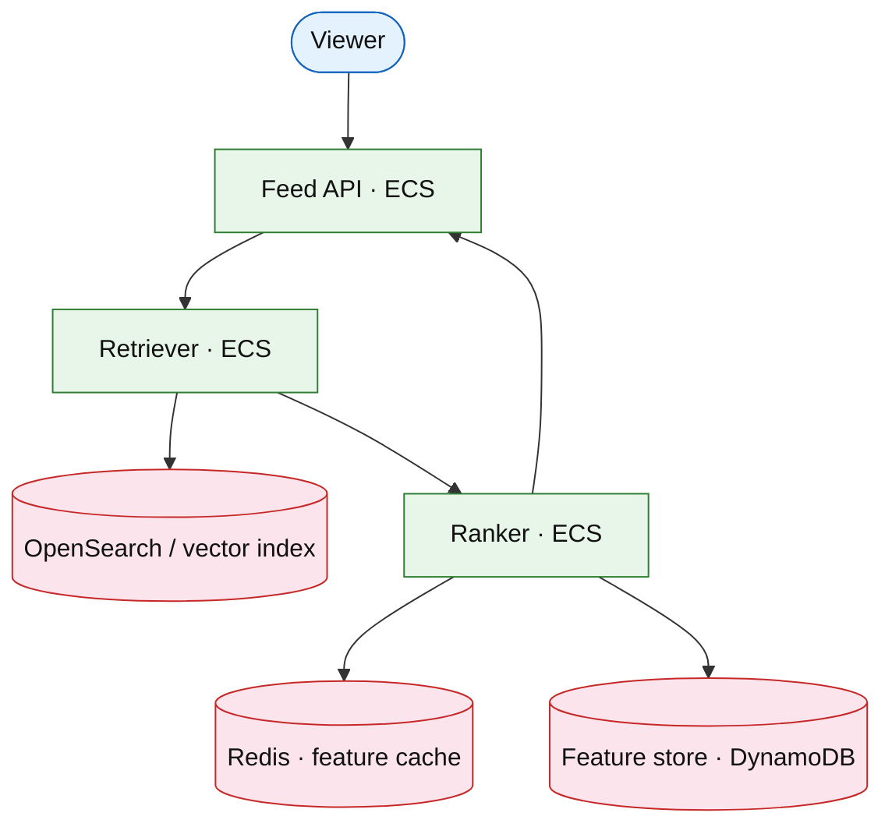

# Home feed ranking service

## Introduction

The **ranking service** scores and orders candidates for “For You” feeds after **retrieval** returns hundreds of items. It separates **candidate generation** (cheap, broad) from **heavy scoring** (ML features, business rules).

**Primary users:** viewers (personalized feed), data science (feature pipelines), operators (explore/exploit knobs).

**Interview pacing:** Deep dive **candidate retrieval + scoring + feature freshness**.

Pair with [news-feed](./news-feed.md) (fanout/write path) — this doc is **ranking read path**, not post delivery.

## Requirements discovery

| Lock (target) |
| --- |
| 200M DAU; 20 home loads / DAU / day |
| 500 candidates retrieved; top 50 shown |
| p99 rank &lt; 120 ms after retrieval |
| Feature store lag &lt; 5 min acceptable |

## Architecture (user → database)

**Narrative:** **Retriever** pulls candidate IDs from social graph + trending index. **Ranker** loads features, applies weighted model + diversity rules, returns ordered list to **Feed API**.

## Deep dive: retrieval vs ranking

- **Retrieval sources:** follow graph, trending, ads slot (separate).
- **Scoring:** logistic/regression blend; explore bucket for cold start.
- **Caching:** per-user feature vector TTL; invalidate on follow block.

## Related

- [News feed](./news-feed.md)
- [Ads auction](../platform/ads-auction-platform.md)
- [OpenSearch drill](../aws/opensearch.md)
