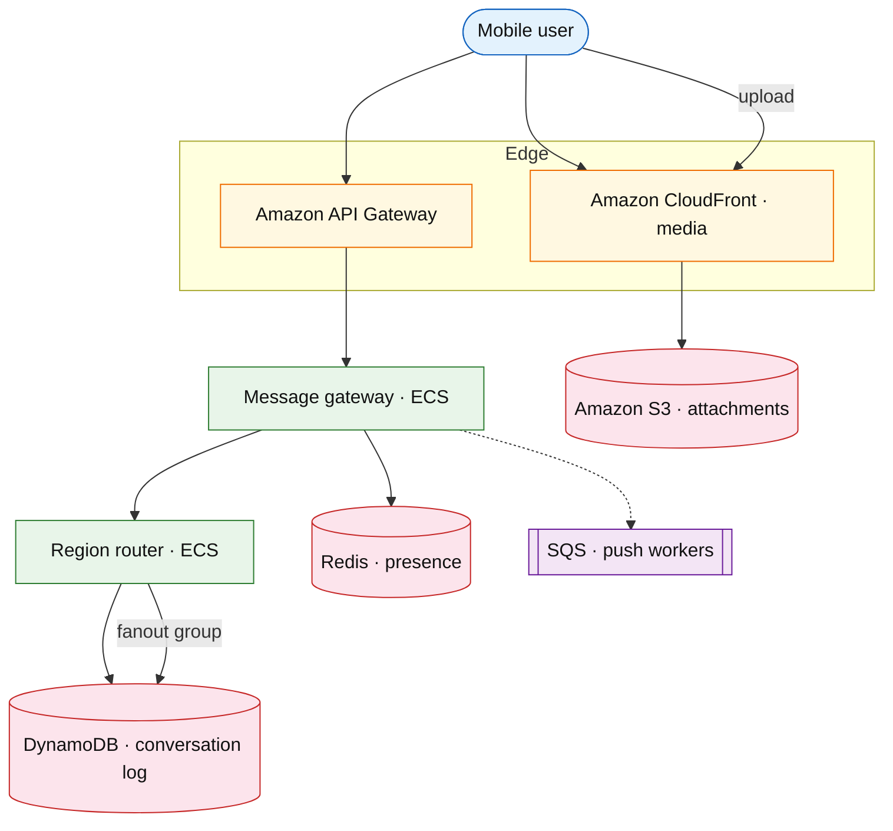

# Global messaging platform

## Introduction

A global messaging platform (WhatsApp / iMessage scale) optimizes **multi-region delivery**, **group fanout**, **media attachments**, and optional **E2E encryption** — extends [chat messenger](./chat-messenger.md) with **phone-number identity**, **low-bandwidth** clients, and **cross-region** presence.

**Primary users:** consumers (1:1, groups), businesses (API templates), operators (region failover).

**Interview pacing:** [60-minute runbook](../../prep/interview-runbook-60m.md) — deep dive **per-conversation ordering + group fanout + media CDN**.

Use [chat messenger](./chat-messenger.md) for full v3 depth; this doc is the **WhatsApp interview routing** variant.

## Requirements discovery

### Interview Q&A cheat sheet

| Lock (target) |
| --- |
| 2B users; 100B messages / day |
| Groups up to 1024 members |
| Media: images/video via CDN; metadata in DB |
| Multi-region: user home region for storage |
| E2E: optional deep dive (key distribution out of v1 API) |

## Architecture (user → database)

**Narrative:** **Region router** pins conversation partition to user’s home region. **Gateway** appends message with monotonic `seq`; **group fanout** writes recipient inboxes in parallel batches. **Media** uploaded to S3 via presigned URL; message carries `media_key` only.

## Deep dive: delivery guarantees

- **Ordering:** total order per `conversation_id`; clients discard `seq <= last_ack`.
- **Offline:** store-and-forward; push via [notification platform](../platform/notification-platform.md).
- **E2E (optional):** server stores ciphertext blob; key exchange via Signal protocol — mention, don’t design full crypto unless asked.

## Related

- [Chat messenger](./chat-messenger.md) (gold-depth reference)
- [Notification platform](../platform/notification-platform.md)
- [S3 drill](../aws/s3.md)
- [DynamoDB drill](../aws/dynamodb.md)
