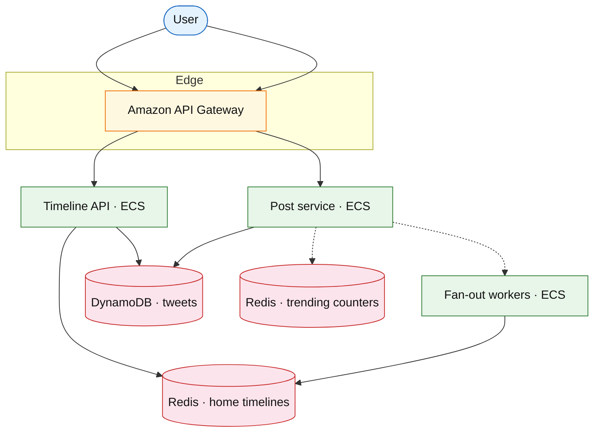

# Microblog timeline (X / Twitter)

## Introduction

A microblog serves a **home timeline** of short posts from follows, plus **global trending** and **search**. Unlike generic [news feed](./news-feed.md), emphasize **chronological vs ranked** modes, **retweet/quote** fanout, and **write-heavy celebrities**.

**Company anchors:** X (Twitter), Threads (Meta).

**Interview pacing:** [60-minute runbook](../../prep/interview-runbook-60m.md) — deep dive **timeline merge + hot-key fanout**.

## Requirements discovery

| Lock (target) |
| --- |
| 500M MAU; 500M posts / day |
| Home timeline p99 &lt; 200 ms |
| Celebrity with 100M followers: async fanout |
| Trending: top 50 topics / region |

## Architecture (user → database)

**Narrative:** **Post** persists tweet; **fan-out** pushes `tweet_id` into follower home lists (Redis) or marks celebrity for **read-merge**. **Timeline API** merges follow list + ranking signals. **Trending** increments hashtag counters in Redis with TTL.

## Deep dive

- **Fanout on write** vs **merge on read** threshold by follower count.
- **Retweet:** pointer to original `tweet_id`; avoid duplicate storage.
- Compare [feed ranking](./feed-ranking-service.md) for For You mode.

## Related

- [News feed](./news-feed.md)
- [Feed ranking](./feed-ranking-service.md)
- [DynamoDB drill](../aws/dynamodb.md)
