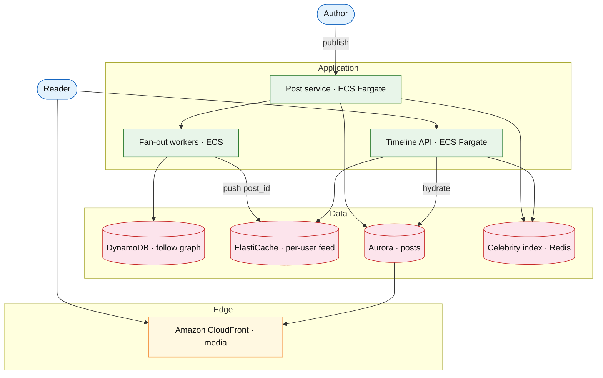

# News feed

## Introduction

A news feed (home timeline) shows **posts from people you follow**, ordered by time or rank. The defining design choice is **fan-out on write** (precompute each user’s feed) versus **fan-out on read** (merge at request time), plus a **hybrid** for celebrities with millions of followers.

**Primary users:** authors (post content), readers (scroll home/profile feeds), operators (fan-out lag, celebrity tier config).

**Interview pacing:** Use [60-minute runbook](../../topics/interview-runbook-60m.md) — ~10 min requirements theater (below), ~18–32 min diagram + API/DB, ~46–56 min deep dive on **fanout strategy (read vs write)**.

## Requirements discovery (interview theater)

### Question bank

| Topic | You ask | If they push back | Example answer (reasonable default) |
| --- | --- | --- | --- |
| Users & scale | DAU? Posts/day? | "Twitter-scale" | 300M DAU; 10% post 2×/day → **60M posts/day** |
| Read:write | Feed reads vs posts? | "Mostly posts" | **100:1** home feed reads to new posts |
| Follow graph | Avg / max followers? | "Everyone famous" | Avg **200** followees; max **50M** (celebrity tier) |
| Ordering | Chronological vs ranked? | "ML rank" | **Chronological** v1; ranked feed async pipeline later |
| Latency | Home feed p99? | "Instant" | **&lt; 200ms** p99 for cached materialized feed |
| Media | Inline video/images? | "Text only" | Post stores **media refs**; CDN serves blobs |
| Out of scope | DMs, ads, full search? | "Add stories" | Home + profile timelines only; defer search index |

### Example dialogue

> **You:** DAU and how often does a typical user open the home feed?
> **Them:** 300M DAU; maybe 20 home loads per day.
> **You:** Posts per day?
> **Them:** 10% of users post twice a day — so 60M posts.
> **You:** Average followees per user, and anyone with a million followers?
> **Them:** ~200 followees; celebrities above 1M get special handling.
> **You:** I'll use chronological home feed, materialized cap **K = 1000** ids, hybrid fan-out for celebrities, p99 **&lt; 200ms** on read.

### Parsed requirements

| Field | Source question | Parsed value (target) | Drives | Reality check |
| --- | --- | --- | --- | --- |
| `U` | DAU | **300M** | Tiers, feed read volume | Top-tier social scale |
| `p_post` | % DAU posting | **0.1** | `P_day` | Typical poster share |
| `L_post` | Posts per poster / day | **2** | Write fan-out load | |
| `L_feed` | Home loads / DAU / day | **20** | `6B` feed reads/day | |
| `N_page` | Posts per load (avg) | **50** | Hydration volume; overlaps `K` | |
| `K` | Materialized feed cap | **1000** `post_id`s | Redis **8 KB**/active reader | |
| `f_avg` | Avg followers per author | **200** | Fan-out writes/post | |
| `f_celeb` | Celebrity threshold | **1M** followers | Hybrid read merge | |
| `p_active_feed` | DAU with hot materialized feed | **0.3** | Redis footprint | |
| `read:write` | Feed reads : new posts | **100:1** | Read path + cache emphasis | Read-heavy social |
| `p99_feed` | Home timeline latency | **&lt; 200 ms** | Materialized feed design | |
| `S_post` | Post row size | **~1.5 KB** | OLTP growth | |
| `requests_day` | derived | **~6.2B** | RPS, AWS millions/mo | ~72k avg RPS |

### Locked assumptions

| Assumption | Prototype (MVP) | Growth | Target (anchor) |
| --- | --- | --- | --- |
| DAU (`U`) | 10k | 1M | **300M** |
| Posters (% of DAU) | 10% | 10% | 10% |
| Posts per poster / day | 2 | 2 | 2 |
| Home feed loads / DAU / day | 20 | 20 | 20 |
| Posts surfaced per load (avg) | 50 | 50 | 50 |
| Avg followees | 200 | 200 | 200 |
| Materialized feed cap `K` | 1000 ids | 1000 | 1000 |
| Celebrity threshold | 100k followers | 500k | **1M** (hybrid read fan-out) |
| Active feed materialization | 50% of DAU | 40% | **30%** of DAU keep hot feed |

*After ~10 minutes, proceed with the **target** column unless the interviewer changes scope.*

### Interview Q&A cheat sheet

Say aloud in order (~10 min). Write locks into **parsed requirements** before capacity math.

| Step | You ask | Lock if vague (target) |
| --- | --- | --- |
| 1 — Users & scale | DAU? Posts/day? | 300M DAU; 10% post 2×/day → **60M posts/day** |
| 2 — Read:write | Feed reads vs posts? | **100:1** home feed reads to new posts |
| 3 — Follow graph | Avg / max followers? | Avg **200** followees; max **50M** (celebrity tier) |
| 4 — Ordering | Chronological vs ranked? | **Chronological** v1; ranked feed async pipeline later |
| 5 — Latency | Home feed p99? | **&lt; 200ms** p99 for cached materialized feed |
| 6 — Media | Inline video/images? | Post stores **media refs**; CDN serves blobs |
| 7 — Out of scope | DMs, ads, full search? | Home + profile timelines only; defer search index |

## Capacity sketch

### User input model

| Action | % of DAU | Per user / day | API | ~Req size | Durable write / user / day |
| --- | --- | --- | --- | --- | --- |
| Publish post | 10% | 2 | `POST /v1/posts` | 2 KB req | **~1.5 KB** (`posts` row) |
| Home feed load | 100% | 20 | `GET /v1/feed/home` | 40 KB resp | **0** OLTP write (Redis feed ids + hydrate) |
| Profile timeline | 30% | 5 | `GET /v1/users/{id}/posts` | 30 KB | read-mostly |
| Follow / unfollow | 5% | 0.2 | `POST /v1/follow` | 0.5 KB | **~24 B** edge (amortized) |

**Feed timeline math (target):**

- **Post-views / DAU / day** ≈ `20 loads × 50 posts = **1000**` (matches cap `K`; user may see overlap across loads).
- **Posts created / DAU / day** = `0.1 × 2 = **0.2**` (60M posts for 300M DAU).
- **Fan-out writes per post (avg)** ≈ `200` follower feed pushes (non-celebrity); celebrities **0** write fan-out.

### Fleet totals (target)

`U` = 300M (anchor tier).

| Metric | Formula | Value |
| --- | --- | --- |
| Posts / day | `0.1 × U × 2` | **60M** |
| Home feed requests / day | `U × 20` | **6B** |
| Total API requests / day | ≈ posts + feeds + profiles | **~6.2B** |
| OLTP post bytes / day | `60M × 1.5 KB` | **~90 GB** |
| Fan-out Redis churn / day | `60M × 200 pushes × 8 B` | **~96 GB** written (trimmed in place) |

### Traffic profile (target tier)

| Metric | Value |
| --- | --- |
| **Read:write (API requests)** | **~100:1** (home feed loads : new posts) |
| **Read:write (durable bytes)** | **N/A** on hot feed path (Redis ids + hydrate reads; **~90 GB/day** post OLTP writes) |
| **Requests / day (fleet)** | **~6.2B** |
| **Avg RPS** | **~72k** (`6.2B / 86,400`) |
| **Peak RPS** | **~720k** (scale tier ×10) |

| User / actor | Action | R/W | Per user (or actor) / day | % of fleet requests |
| --- | --- | --- | --- | --- |
| Reader (DAU) | Home feed load | R | 20 | **~97%** |
| Author | Publish post | W | 2 (10% of DAU) | **~1%** |
| Reader | Profile timeline | R | 5 (30% of DAU) | **~2%** |
| Reader | Follow / unfollow | W | 0.2 (5% of DAU) | **~0.5%** |

### AWS service map (target deployment)

| AWS service | Role in this design |
| --- | --- |
| Application Load Balancer | Ingress to post and timeline services |
| Amazon ECS on Fargate | `Post_service`, `Timeline_read_service`, `Fanout_worker` |
| Amazon ElastiCache (Redis) | `Per_user_feed_store` — materialized feed ids (cap `K`) |
| Amazon Aurora (PostgreSQL) | `Posts_DB` — post bodies and metadata |
| Amazon Aurora or DynamoDB | `Follow_graph` — follow edges |
| Amazon ElastiCache (Redis) | `Celebrity_post_index` — celebrity tier read-merge |
| Amazon SQS | Fan-out work queue between post API and workers |
| Amazon S3 + Amazon CloudFront | `Media_CDN` — images/video blobs |
| Amazon CloudWatch / AWS X-Ray | Fan-out lag, feed p99, hydration batch size |

### Scale tiers

| Tier | `U` | Posts/day | Feed reads/day | Avg RPS | Peak RPS (×10) |
| --- | --- | --- | --- | --- | --- |
| Prototype | 10k | 2k | 200k | **~2.6** | **~26** |
| Growth | 1M | 200k | 20M | **~260** | **~2.6k** |
| Target | 300M | 60M | 6B | **~72k** | **~720k** |

### Symbols

| Symbol | Meaning |
| --- | --- |
| `U` | Daily active users |
| `p_post` | Fraction of DAU who post (0.1) |
| `L_post` | Posts per poster per day (2) |
| `L_feed` | Home feed loads per DAU per day (20) |
| `N_page` | Posts returned per load (50) |
| `K` | Max `post_id`s stored per user feed (1000) |
| `f_avg` | Average followers per author (200) |

### Derivation (traffic)

**Posts:** `P_day = p_post × U × L_post` → **60M/day** → **~700/s** avg, **~7k/s** peak.

**Fan-out (write path):** `P_avg × f_avg ≈ 700 × 200 = **140k feed entry writes/s**` average — async workers; celebrities bypass.

**Feed reads:** `U × L_feed` → **6B/day** → **~70k/s** avg, **~500k/s** peak (evening).

**Hydration:** `6B × 50 posts × 1.5 KB` logical read volume → **batch** `GET posts?ids=` (~120B post-views/day); cache hot authors.

**Egress:** `6B × 40 KB ≈ **240 PB/day** theoretical JSON** — CDN + compression + pagination → discuss **~1–2 KB effective** per post body at edge (**~TB/day** realistic at API).

### Storage and growth over time

| Table / store | ~Row size | New / day (target) | Retention | Steady-state (target) | Per DAU |
| --- | --- | --- | --- | --- | --- |
| `posts` | 1.5 KB | 60M | 3y hot | **~32 TB/yr** ingest | **0.3 KB/day** writers only |
| `home_feed` (Redis) | 8 KB (`K×8 B`) | fan-out | trim `K` | **90M × 8 KB ≈ 720 GB** | **8 KB** per active reader |
| `follow_edges` | 24 B | 50M | long-lived | **10–20B edges → 240–480 GB** | **~0.17 edge/day** |
| Media (CDN) | 2 MB | 40M files | CDN | not OLTP | **~0.27 MB/DAU/day** |

**Post metadata cumulative:**

| Horizon | Posts | OLTP (`× 1.5 KB`) |
| --- | --- | --- |
| 30 days | 1.8B | **~2.7 TB** |
| 1 year | 21.9B | **~32 TB** |

### Per-user economics (target)

| Metric | Value | Notes |
| --- | --- | --- |
| Requests / DAU / day | **~20.7** | mostly home feed |
| Posts created / DAU / day | **0.2** | |
| Post-views / DAU / day | **~1000** | 20×50; overlap across loads |
| OLTP bytes / DAU / day (writers) | **~300 B** | `1.5 KB × 0.2 posts` |
| Feed Redis / active reader | **8 KB** | 30% DAU materialized → **~2.4 KB/DAU** fleet avg |
| Media egress / DAU / day | **~270 KB** | order-of-magnitude with 1/3 posts having media |

### Service footprint (instances)

| Service | Scales with | Prototype | Growth | Target |
| --- | --- | --- | --- | --- |
| Timeline read API | feed RPS | 2 | 30 | **~500** |
| Post + fan-out workers | fan-out lag | 2 workers | 50 | **~500** workers |
| Feed Redis | 720 GB | 1 node | cluster | **~10–20** shards |
| Posts DB | 32 TB/yr | 1 primary | 4 shards | **~50+** shards |
| Graph store | edges | 1 | 3 | **~20** |

**First cliff:** **~1M DAU** — fan-out queue depth; add celebrity hybrid tier before **100k** follower authors go viral.

### Billable volume (target month)

Convert **fleet totals** to AWS billing meters before dollar math. *List-price ballparks — not a quote.*

| Design quantity (target) | Formula | Monthly billable unit |
| --- | --- | --- |
| API requests | `6.2B/day × 30` | **~186B** requests / mo |
| Feed Redis RAM | `720 GB` steady | **~720 GB** (node-hours) |
| Posts OLTP new bytes | `90 GB/day × 30` | **~2.7 TB/mo** ingest + steady catalog |
| Fan-out churn | `96 GB/day` writes | **~2.9 TB/mo** Redis write volume |
| CDN media egress | per-user media model | **PB/mo** (**cost cliff** — often dominates) |
| **Per DAU** | `total / U` (`U` = 300M) | **$…/DAU/mo** (excl. media unless stated) |

*Reconcile rows in **Cloud cost ballpark** below.*

### Cost at a glance

Interview sound bite — reconcile with **billable volume** and **cloud cost** below.

| Tier | Scale | ~Monthly $ (core) | Per unit |
| --- | --- | --- | --- |
| Prototype (MVP) | `U` = **10k** | **~$500** | tiny Redis + single API |
| Growth | `U` = **1M** | **~$45k** | fan-out workers + Redis cluster |
| Target (anchor) | `U` = **300M** | **~$200k/mo** (excl. media CDN) | **~$0.0007/DAU/mo** |

**First payment block:** smallest prod footprint (load balancer + database + compute) before per-million traffic dominates.

### Cloud cost ballpark (target)

| Line item | Driver | ~Monthly |
| --- | --- | --- |
| Feed Redis | 720 GB RAM | **~$40k** |
| Posts OLTP + cold | 32 TB/yr new | **~$80k** (mixed tiers) |
| Fan-out / API compute | 500+500 pods | **~$80k** |
| CDN media | PB egress | **~$200k+** (dominant) |
| **Metadata + feed (excl. media)** | | **~$200k/mo** |
| **Per DAU (excl. media)** | `200k/300M` | **~$0.0007/DAU/mo** |

Media CDN often exceeds social-graph OLTP — call out in interview.

### Timeline (per-user rates fixed; `U` grows)

| Milestone | `U` | Posts/day | Feed reads/day | Feed Redis | ~Monthly $ (no CDN) |
| --- | --- | --- | --- | --- | --- |
| Launch | 10k | 2k | 200k | **4 MB** | **~$500** |
| Month 3 | 80k | 16k | 1.6M | **32 MB** | **~$3k** |
| Month 6 | 320k | 64k | 6.4M | **128 MB** | **~$12k** |
| Month 12 | 1.3M | 260k | 26M | **520 MB** | **~$45k** |

Month 12 is **growth tier** — celebrity hybrid and Redis clusterization typically land before **10M DAU**.

### Sensitivity

- **10× reads** — Redis cluster for `home_feed`; post hydration batch cache.
- **More celebrities posting** — read-merge path CPU rises.
- **Ranked feed** — offline scoring job reorders ids — still materialized list.

## High-level design

### Architecture (user → database)



**Narrative:** **Post service** persists post, then enqueues **fan-out** for non-celebrity authors: for each follower, push `post_id` into `Per_user_feed_store` (trim to K). **Celebrity** posts only update `Celebrity_post_index` (recent posts per celeb). **Timeline read** loads materialized feed, **merges** celebrity posts from followed celebs at read time, batch-hydrates post bodies from `Posts_DB`, returns paginated JSON.

## User-visible surface

| Surface | Actor | Trigger | Outcome |
| --- | --- | --- | --- |
| Compose post | Author | Submit post (+ optional media) | Post on profile; followers see in feed within fan-out SLA |
| Home timeline | Reader | Open app / pull-to-refresh / infinite scroll | Next page of posts (cursor) |
| Profile timeline | Reader | Visit user profile | Chronological posts by that author |
| Follow | Reader | Tap Follow | Graph edge; future posts fan out |
| Ops dashboard | Operator | Open fan-out health | Queue depth, celebrity tier, lag alerts |

## API contract and input model

### UX → API traceability

| UX / UI action | User intent | API or event | Sync/async | Idempotent? | Validates |
| --- | --- | --- | --- | --- | --- |
| Submit post | publish content | `POST /v1/posts` | sync + async fan-out | `post_id` UUID | content length, media refs exist |
| Scroll home feed | load timeline page | `GET /v1/feed/home` | sync | read (cursor) | `limit` ≤ 50 |
| View profile | author timeline | `GET /v1/users/{id}/posts` | sync | read | user exists |
| Follow user | subscribe to posts | `POST /v1/users/{id}/follow` | sync | yes | no self-follow; restricted account rules |
| Unfollow | stop fan-out to feed | `DELETE /v1/users/{id}/follow` | sync | yes | edge must exist |
| (internal) fan-out | push `post_id` to followers | `FanoutJob` queue | async | worker idempotent per `(post_id, follower)` | celebrity skip write fan-out |

### Endpoints

| Method | Path | Purpose |
| --- | --- | --- |
| `POST` | `/v1/posts` | Create post |
| `GET` | `/v1/feed/home` | Paginated home timeline |
| `GET` | `/v1/users/{user_id}/posts` | Profile timeline |
| `POST` | `/v1/users/{user_id}/follow` | Follow |
| `DELETE` | `/v1/users/{user_id}/follow` | Unfollow |

### Example payloads

`POST /v1/posts`

```json
{
 "content": "Launch day!",
 "media_ids": ["media_abc123"]
}
```

Response `201 Created`:

```json
{
 "post_id": "post_8f2a1c",
 "author_id": "user_9912",
 "created_at": "2026-05-23T10:00:00Z"
}
```

`GET /v1/feed/home?cursor=eyJsYXN0X3Bvc3RfaWQiOiJwb3N0XzcwMDAifQ&limit=20`

```json
{
 "posts": [
 {
 "post_id": "post_8f2a1c",
 "author_id": "user_9912",
 "content": "Launch day!",
 "media_urls": ["https://cdn.example/media_abc123.jpg"],
 "created_at": "2026-05-23T10:00:00Z"
 }
 ],
 "next_cursor": "eyJsYXN0X3Bvc3RfaWQiOiJwb3N0XzY5OTkifQ"
}
```

`POST /v1/users/user_2201/follow`

Response `204 No Content`

### Input validation

- Post max 4,000 chars; media refs must exist.
- Pagination: cursor-based; `limit` ≤ 50.
- Restricted account: fan-out only to approved followers (graph edge type).

## Database model

### Stores

| Store | Key fields | Notes |
| --- | --- | --- |
| `posts` | `post_id`, `author_id`, `content`, `media_ids`, `created_at` | Shard by `post_id` |
| `follow_graph` | `follower_id`, `followee_id`, `created_at` | Or adjacency service |
| `home_feed` | `user_id` → sorted list/set of `post_id` (cap K) | Redis ZSET by timestamp |
| `celebrity_posts` | `author_id` → recent `post_id`s | For read merge |
| `fanout_jobs` | `post_id`, `author_id`, `status`, `progress` | Async worker queue |

Indexes:

- `posts(author_id, created_at DESC)` — profile timeline
- `follow_graph(follower_id)` — who I follow (read merge celebs)
- `follow_graph(followee_id)` — fan-out enumeration

### Read/write paths

1. **Create post** — insert `posts` → if `follower_count &lt; 1M`, enqueue `fanout_jobs` → else update `celebrity_posts` only.
2. **Fan-out worker** — paginate followers → `ZADD home_feed:{follower} post_id timestamp` → trim to K.
3. **Home feed read** — `ZRANGE home_feed:{user}` → list celeb followees → fetch each celeb’s recent posts → merge sort by time → take page → batch `GET posts` by id.
4. **Follow** — insert graph edge → optional backfill recent posts into follower feed (async).

## Interview deep dive: Fanout strategy (read vs write)

### Comparison

| Strategy | Write cost | Read cost | Best for |
| --- | --- | --- | --- |
| **Fan-out on write** | O(followers) per post | O(page size) | Normal users |
| **Fan-out on read** | O(1) post insert | O(followees) per read | Small graphs only |
| **Hybrid** | O(normal followers) + O(1) celeb | O(followees + celeb merge) | Production social |

### Celebrity problem

Post from user with 50M followers:

- Write fan-out: **50M Redis ZADDs** — minutes and TB of churn — **reject**.
- Hybrid: post enters `celebrity_posts`; each reader merges **last N** posts from followed celebs at read time — **50M reads × small merge** manageable if N small and celeb count per user low (most users follow few celebs).

**Tier config:** `follower_count` threshold (1M) or manual celebrity flag.

### Fan-out lag vs consistency

- Fan-out async → follower may see post **2–10s** after author — acceptable for social.
- Author’s own timeline: read own posts directly from `posts` table — immediate.

### Hot keys

- Celebrity post still creates hot read on `celebrity_posts:{id}` — CDN-cache post payload; read replicas.
- Viral normal user crossing 1M followers mid-flight → migrate to celebrity tier (stop write fan-out).

### Trim and pagination

- Cap K=1000 prevents unbounded Redis growth.
- Cursor pagination on stable sort key (`post_id` or timestamp).

## Scale and failure

### Correctness model

- Home feed eventually includes post after fan-out completes (eventual).
- Unfollow removes future fan-out; optional prune existing ids async.
- Merge sort deterministic: `(created_at, post_id)` tie-break.

### Failure cases

| Failure | Symptom | Mitigation |
| --- | --- | --- |
| Fan-out queue backlog | Delayed appearance | Scale workers; priority tiers |
| Partial fan-out | Some followers miss post | Retry job; idempotent ZADD |
| Redis loss | Empty feed | Rebuild from graph + posts (slow path) |
| Celebrity merge CPU | Read p99 spike | Limit celebs merged; cache merged view 30s |
| Hot post hydration | DB spike | Post cache by `post_id` |
| Follow backfill storm | User follows celeb | Rate-limit backfill job |

### Key metrics

- Fan-out lag p99; queue depth
- Home feed read p99; hydration batch size
- Write fan-out ops/s; celebrity merge time
- Feed store memory; trim rate
- Missed fan-out rate (audit)

### Interview deep dive talking points

- **60M posts/day, 500k reads/s** — reads dominate; optimize read path.
- Draw hybrid: write fan-out for normal, read merge for celebrity — quantify 50M follower impossibility.
- Materialized `home_feed` in Redis ZSET, cap K.
- Async fan-out acceptable; author profile direct read.
- Ranked feed as async reorder — optional extension.

## Related

- [Examples hub](./README.md)
- [Authoring template (v3)](../../topics/example-authoring-template.md)
- [Topics index](../../topics-index.md)
- [Chat messenger](./chat-messenger.md)
- [Dating discovery matching](./dating-discovery-matching.md)
- [AWS reference layout](../../topics/aws-reference-layout.md)
- [Caching](../../topics/caching.md)
- [60-minute runbook](../../topics/interview-runbook-60m.md)
