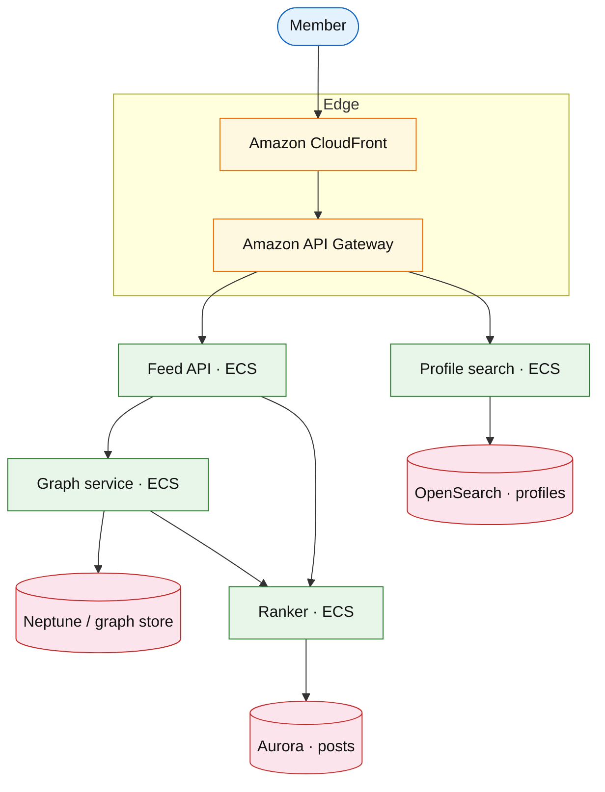

# Professional network platform

## Introduction

A professional network (LinkedIn-shaped) combines a **connection graph**, **feed** of posts/jobs, **search** over profiles, and **messaging** — graph queries and ranked feed differ from pure [news feed](./news-feed.md) or [dating discovery](./dating-discovery-matching.md).

**Primary users:** members (post, connect), recruiters (search, InMail), ads (sponsored jobs).

**Interview pacing:** [60-minute runbook](../../prep/interview-runbook-60m.md) — deep dive **2nd/3rd-degree feed candidate generation + connection graph**.

**Company anchors:** LinkedIn, Xing, Handshake.

## Requirements discovery

### Interview Q&A cheat sheet

| Lock (target) |
| --- |
| 900M members; 300M MAU |
| Feed: 500 candidates → top 50 |
| Connection request idempotent |
| Profile search p99 &lt; 300 ms |
| Jobs module: separate index (defer detail) |

## Architecture (user → database)

**Narrative:** **Graph service** returns 1st/2nd-degree author IDs for feed retrieval. **Ranker** scores by affinity, recency, job relevance. **OpenSearch** powers recruiter **profile search** with facets (title, geo, company).

## Deep dive: feed from social graph

- **Write path:** post → fanout to followers’ feed lists (hybrid with read-merge for influencers).
- **Connection:** mutual accept → symmetric edge; block removes edge both ways.
- **Messaging:** defer to [chat messenger](./chat-messenger.md) (InMail = paid edge case).

## Related

- [News feed](./news-feed.md) (fanout mechanics)
- [Feed ranking service](./feed-ranking-service.md) (scoring)
- [Dating discovery](./dating-discovery-matching.md) (mutual match pattern)
- [Product search](../commerce/product-search.md) (OpenSearch)
- [OpenSearch drill](../aws/opensearch.md)
