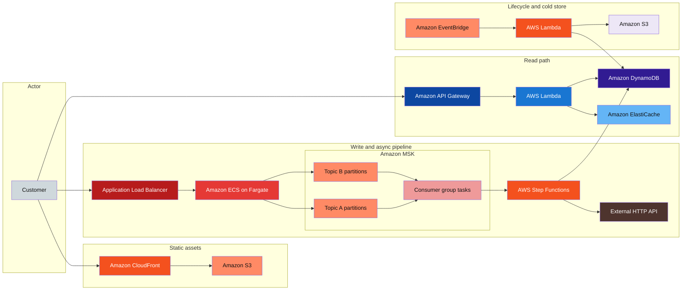

# AWS reference layout

**Parent:** [`README.md`](./README.md)

## Introduction

**Pattern reference.** This page is an **interview-shaped AWS reference pattern** for systems with **high write volume**, a **durable event log**, **async orchestration**, a **cached read path**, and **tiered storage**. It is a reusable topology map—not a single product design and not a claim about any company’s production stack.

**Primary users:** interview candidates (map boxes to tradeoffs), architects (compare managed services), operators (runbooks per path).

**Interview pacing:** Use [60-minute runbook](../prep/interview-runbook-60m.md) — ~10 min scoping (below), ~15–25 min walk the diagram paths, ~40–50 min deep dive on **async cloud topology** (MSK, Step Functions, read/write split).

Apply the pattern to concrete systems: [event ticketing](../examples/commerce/event-ticketing.md), [news feed](../examples/social/news-feed.md), [event-driven order pipeline](../examples/event-driven/event-driven-order-pipeline.md). Portable vocabulary: [topics index](../topics-index.md), [messaging & async](../topics/messaging-async.md).

## Requirements discovery (interview theater)

Use these questions to decide if this layout fits—the “locked assumptions” row is a **reference workload**, not mandatory.

### Question bank

| Topic | You ask | If they push back | Example answer (when pattern applies) |
| --- | --- | --- | --- |
| Traffic shape | Read-heavy or write-heavy? | "Balanced" | **Write spikes** ingested fast; **reads** need low latency on hot keys |
| Consistency | Strong sync on write API? | "Eventual OK" | API returns after durable append to log; downstream **seconds** behind |
| Ordering | Global order? | "Total order" | **Per-partition** order in Kafka; key by `user_id` or `order_id` |
| Orchestration | Multi-step side effects? | "One Lambda enough" | **Step Functions** for retries, timers, human steps |
| Read model | Complex joins? | "SQL reports" | **DynamoDB access patterns** on read path; warehouse off async export |
| Geography | Multi-region active-active? | "Single region" | Single primary region; **CloudFront** global for static |
| Out of scope | Full data lake, ML training? | "Add Spark" | Mention **S3 export**; defer Flink/warehouse unless asked |

### Example dialogue

> **You:** Let's scope v1: one happy path and what's out of scope?
> **Them:** …
> **You:** For scale, prototype vs 12-month target?
> **Them:** …
> **You:** What does each actor do per day on the hot path?
> **Them:** …
> **You:** I'll lock **5M** for the target column unless you want different numbers.

### Parsed requirements

| Field | Source question | Parsed value (target) | Drives |
| --- | --- | --- | --- |
| `mau_u` | MAU (`U`) | **5M** | Scale tiers, input model, fleet totals |
| `write_api_peak_w_peak` | Write API peak (`W_peak`) | **5k/s** | Scale tiers, input model, fleet totals |
| `events_to_msk_e_peak` | Events to MSK (`E_peak`) | **5k/s**; **20k/s** burst | Scale tiers, input model, fleet totals |
| `msk_partitions_p` | MSK partitions (`P`) | **64** | Scale tiers, input model, fleet totals |
| `read_api_peak_r_peak` | Read API peak (`R_peak`) | **50k/s** | Scale tiers, input model, fleet totals |
| `cache_hit_h` | Cache hit (`H`) | **90%** | Scale tiers, input model, fleet totals |
| `dynamodb_item_size` | DynamoDB item size | **2 KB** | Scale tiers, input model, fleet totals |
| `hot_ttl_→_s3_archive` | Hot TTL → S3 archive | **90d** | Storage steady-state |
| `sfn_starts_%_of_events` | SFN starts (% of events) | **50%** | Scale tiers, input model, fleet totals |

### Locked assumptions (reference workload)

**Reference workload** — illustrative product with **write spikes**, **event log**, and **cached reads**. Use **target**; omit paths you do not need.

| Assumption | Prototype (MVP) | Growth | Target (anchor) |
| --- | --- | --- | --- |
| MAU (`U`) | 50k | 500k | **5M** |
| Write API peak (`W_peak`) | 50/s | 500/s | **5k/s** |
| Events to MSK (`E_peak`) | 50/s avg; 200/s burst | 500/s; 2k burst | **5k/s**; **20k/s** burst |
| MSK partitions (`P`) | 8 | 32 | **64** |
| Read API peak (`R_peak`) | 500/s | 5k/s | **50k/s** |
| Cache hit (`H`) | 80% | 85% | **90%** |
| DynamoDB item size | 2 KB | 2 KB | **2 KB** |
| Hot TTL → S3 archive | 30d | 60d | **90d** |
| SFN starts (% of events) | 30% | 40% | **50%** |

*After scoping, draw only the paths you need—omit Step Functions if the flow is single-step.*

## Capacity sketch

### User input model

| Action | % of MAU | Per user / day | Path | ~Size | Durable write |
| --- | --- | --- | --- | --- | --- |
| Write command | 20% | 2 | ALB → ECS → outbox | 2 KB | Dynamo + event |
| Read hot entity | 100% | 20 | API GW → Lambda → cache | 1 KB | read (90% cache) |
| Async side effect | system | 2× writes | MSK → consumer → SFN | 500 B | workflow |
| Archive sweep | system | daily | EventBridge → S3 | 2 KB | cold store |

### Fleet totals (target, `U` = 5M)

| Metric | Formula | Value |
| --- | --- | --- |
| Writes / day | `0.2 × U × 2` | **~2M** (avg **~23/s**; peak **5k/s**) |
| Reads / day | `U × 20` | **100M** |
| Events / day | `5k × 86,400` sustained lower | **~0.43B** (burst-shaped) |
| Dynamo hot (90d) | `5k/s × 90d × 2KB` | **~78 TB** |
| MSK 7d retention | RF3 | **~300 TB** |
| Dynamo reads peak | `R_peak × (1-H)` | **5k/s** |

### Traffic profile (target tier)

Locked **target** assumptions from [Locked assumptions](#locked-assumptions-reference-workload) — anchor the capacity sketch and diagram walkthrough.

| Metric | Value |
| --- | --- |
| **MAU (`U`)** | **5M** |
| **Write API peak (`W_peak`)** | **5k/s** |
| **Read API peak (`R_peak`)** | **50k/s** |
| **Read:write (API RPS)** | **10:1** (50k read : 5k write) |
| **Events to MSK (`E_peak`)** | **5k/s** sustained; **20k/s** burst |
| **MSK partitions (`P`)** | **64** |
| **Cache hit (`H`)** | **90%** |
| **Writes / day** | **~2M** (avg **~23/s**; peak **5k/s**) |
| **Reads / day** | **100M** |
| **DynamoDB reads at peak** | **5k/s** (`R_peak × (1-H)`) |
| **Step Functions starts** | **~50%** of events → **~2.5k/s** at burst |

| User / actor | Action | R/W | Per user / day | Path |
| --- | --- | --- | --- | --- |
| Active writer | Write command | W | 2 | ALB → ECS → MSK |
| All MAU | Read hot entity | R | 20 | API Gateway → Lambda → ElastiCache → DynamoDB |
| System | Async side effect | — | 2× writes | MSK → consumer → Step Functions |
| System | Archive sweep | — | daily | EventBridge → Lambda → S3 |

*Per-user rates stay fixed across prototype → target; only `U` and fleet peaks scale with tier.*

### AWS service map (target deployment)

Canonical mapping of every box in the [reference diagram](#high-level-design) to managed AWS services (this page **is** the AWS reference). Third-party boxes noted for completeness.

| Diagram component | AWS service | Role in this design |
| --- | --- | --- |
| Customer | — (actor) | End user; HTTPS to CDN, write ALB, read API Gateway |
| CloudFront | **Amazon CloudFront** | Global CDN for static UI; TLS termination at edge |
| S3 (static assets) | **Amazon S3** | Versioned app assets (`s3://app-assets/`); origin behind CloudFront |
| Application Load Balancer | **Application Load Balancer** | L7 ingress for write API; health checks; routes to ECS tasks |
| ECS (write service) | **Amazon ECS on Fargate** | Stateful-less write containers; validate, outbox/Dynamo, produce to MSK |
| Topic A / Topic B | **Amazon MSK** (Kafka) | Durable partitioned event log; **Topic A/B** keyed by business id; shock absorber for spikes |
| Consumer group | **Amazon ECS on Fargate** (or **AWS Lambda** event source) | Pull from MSK; at-least-once processing; scale on consumer lag |
| Step Functions | **AWS Step Functions** | Multi-step saga (validate → partner API → DynamoDB projection); Standard vs Express by volume |
| External HTTP API | — (third party) | Partner/webhook calls from Step Functions activities (not AWS) |
| API Gateway | **Amazon API Gateway** | Public read API front door; throttling, auth, routing to Lambda |
| Lambda (read) | **AWS Lambda** | Read handler; cache-aside orchestration; horizontal scale with `R_peak` |
| ElastiCache | **Amazon ElastiCache for Redis** | Hot entity cache (`entity:{id}`); reduces DynamoDB read load (~90% hit) |
| DynamoDB (hot) | **Amazon DynamoDB** | Hot entity projection + optional outbox; TTL **90d**; on-demand at target |
| EventBridge | **Amazon EventBridge** | Scheduled rules (cron) for archival sweep and lifecycle jobs |
| Lambda (archive) | **AWS Lambda** | Export aged DynamoDB items to cold store; verify then TTL/delete |
| S3 (cold archive) | **Amazon S3** | Long-term archive (`s3://archive/yyyy/mm/dd/`); Parquet exports; compliance retention |
| Observability (diagram omitted) | **Amazon CloudWatch**, **AWS X-Ray** | Dashboards: MSK lag, SFN failures, cache hit rate, API p99; distributed traces |
| Poison / DLQ (narrative) | **Amazon MSK** (DLQ topic) or **Amazon SQS** | Failed consumer/SFN messages for operator replay |

### Scale tiers

| Tier | `U` | `W_peak` | `R_peak` | `E_peak` burst | Dynamo hot |
| --- | --- | --- | --- | --- | --- |
| Prototype | 50k | 50/s | 500/s | 200/s | **~0.8 TB** |
| Growth | 500k | 500/s | 5k/s | 2k/s | **~8 TB** |
| Target | 5M | 5k/s | 50k/s | 20k/s | **~78 TB** |

### Symbols

| Symbol | Meaning |
| --- | --- |
| `U` | Monthly active users (reference app) |
| `W_peak`, `R_peak` | Peak write/read RPS |
| `E_peak` | Peak events/s to MSK |
| `P` | MSK partitions |
| `H` | ElastiCache hit ratio |
| `S_item` | DynamoDB item bytes |

### Derivation (traffic)

**Write path:** `W_peak = 5,000/s` → ECS scale-out; **1 event/write** → `E_peak = 5k–20k/s`.

**MSK:** `20k / 64 ≈ **312 msgs/s/partition**` at burst — within comfort zone.

**Step Functions:** 50% of events → **2.5k executions/s** at burst — prefer **Express** or batching; **Standard** for durable low-volume sagas.

**Read path:** `R_peak = 50,000/s`; cache hit 90% → **5,000 DynamoDB reads/s** peak.

**Archive:** TTL **90d** on Dynamo → **S3** cold; **7y** compliance **~450 TB** cumulative.

### Storage and growth over time

| Store | ~Item size | Write rate (target) | Retention | Steady-state (target) | Per 1k writes |
| --- | --- | --- | --- | --- | --- |
| DynamoDB (hot) | 2 KB | 5k/s | 90d | **~78 TB** | **~2 MB** |
| S3 archive | 2 KB | 5k/s | 7y | **~450 TB** | same |
| MSK events | 500 B | 5k/s | 7d | **~300 TB** RF3 | audit |
| ElastiCache | 1 KB | derived | 1h | **~10 GB** | read cache |

**90d rolling items:** `5k/s × 86,400 × 90 ≈ **38.9B**` items.

### Per-user economics (target reference)

| Metric | Formula | Target value |
| --- | --- | --- |
| Writes / MAU / day | `2M / 5M` | **0.4** |
| Reads / MAU / day | `100M / 5M` | **20** |
| Hot Dynamo bytes / MAU | `78TB / 5M` | **~15.6 KB** |
| S3 archive bytes / MAU / year | `450TB / 5M / 7` | **~13 KB/yr** |
| Log bytes / MAU / day | amortized | **~0.5 KB** |

### Service footprint (instance count ballpark)

| Service | Scales with | Prototype | Growth | Target |
| --- | --- | --- | --- | --- |
| ECS write tasks | `W_peak` | 4 | 40 | **~200** |
| MSK brokers | retention GB | 3 | 6 | **~12** |
| MSK consumers | `E_peak` | 4 | 20 | **~80** |
| Lambda read | `R_peak` | 10 | 100 | **~500** concurrent |
| ElastiCache | hot keys | 1 | 3 | **~6** nodes |
| Step Functions | 2.5k/s burst | Express | mixed | **Express + Standard** |

**First scale cliff:** **Growth (500 write/s)** — MSK partitions and consumer lag before **5k/s** write peak.

### Billable volume (target month)

Reference workload — convert fleet totals to AWS meters before dollar math. *List-price ballparks — not a quote.*

| Design quantity (target) | Formula | Monthly billable unit |
| --- | --- | --- |
| Write API requests | `W_peak × 86,400 × 30` (sustained) | **~13B** requests / mo (order-of-magnitude) |
| MSK ingress | `E_peak` sustained | **~13B** events / mo + **500 B** × events |
| Read API requests | `R_peak` × utilization | **~130B** reads / mo (if **50k/s** sustained) |
| DynamoDB storage | hot + GSI | **___ GB-mo** (from storage table) |
| S3 archive | cold tier | **___ GB-mo** |
| Step Functions transitions | **50%** of events | **~6.5B** transitions / mo (illustrative) |

*Reconcile rows in **Cloud cost ballpark** below.*

### Cloud cost ballpark (target reference)

| Line item | Driver | ~Monthly |
| --- | --- | --- |
| ECS Fargate (write) | 200 tasks | **~$35k** |
| MSK (300 TB) | RF3 7d | **~$25k** |
| DynamoDB on-demand | 78 TB + 5k RCU peak | **~$45k** |
| Lambda reads | 50k/s | **~$30k** |
| ElastiCache | 10 GB | **~$1k** |
| S3 archive (amortized) | 450 TB / 7y | **~$5k** |
| Step Functions | 2.5k/s burst equiv. | **~$15k** |
| **Total (reference stack)** | | **~$156k/mo** |
| **Per MAU** | `156k / 5M` | **~$0.031/MAU/mo** |
| **Per 1k writes** | amortized | **~$0.05/1k writes** |

### Timeline (prototype → early growth)

| Milestone | `U` | `W_peak` | Dynamo hot | ~Monthly $ |
| --- | --- | --- | --- | --- |
| Launch | 50k | 50/s | 0.8 TB | **~$3k** |
| Month 3 | 150k | 120/s | 2 TB | **~$8k** |
| Month 6 | 350k | 280/s | 5 TB | **~$20k** |
| Month 12 | 500k | 500/s | 8 TB | **~$35k** |

Month 12 is **growth tier** — MSK partition expansion and Express workflows before **5M MAU** target.

### Sensitivity

| Change | Effect | Response |
| --- | --- | --- |
| **10× writes** | MSK + Dynamo hot | More partitions; on-demand autoscale |
| **Heavy relational invariants** | Dynamo awkward | Aurora on write/read path |
| **No ordering** | MSK overkill | SQS fan-out |
| **10× reads** | Lambda + cache | Raise `H`; DAX/ElastiCache cluster |

## High-level design

### Diagram legend

| Class | Role | Example boxes |
| --- | --- | --- |
| Actor | Caller | Customer |
| Write path | Ingestion + async | ALB, ECS, MSK consumers |
| Read path | Query + cache | API Gateway, Lambda, ElastiCache |
| Managed AWS | Edge, orchestration, lifecycle | CloudFront, Step Functions, EventBridge |
| Data | Durable / cold | DynamoDB, S3 |
| External | Third party | Partner HTTP API |



**Narrative:** **CloudFront → S3** serves static UI. **ALB → ECS** accepts writes, validates, appends to **MSK** (Topics A/B partitioned by business key). **Consumer group** pulls events, starts **Step Functions** for multi-step side effects (partner API, DynamoDB projection). **API Gateway → Lambda → ElastiCache → DynamoDB** serves read-heavy queries with cache-aside. **EventBridge** triggers archival **Lambda** moving cold data to **S3**.

**Diagram notes:** ECS can be **EKS** if the interviewer prefers Kubernetes. Two **S3** buckets: static assets vs cold archive. **CloudWatch / X-Ray** omitted for clarity. **Step Functions Standard** for durable sagas; **Express** for high-volume short flows.

## User-visible surface

- **End customer:** fast page loads (CDN); write API acks quickly; read API low latency on status/history.
- **Operator:** CloudWatch dashboards — consumer lag, Step Functions failures, cache hit rate, DLQ depth.
- **Engineer:** deploy UI to S3; scale ECS on write CPU; scale consumers on lag; tune partition count pre-launch.

## API contract and input model

### UX → API traceability

| UX / UI action | User intent | API or event | Sync/async | Idempotent? | Validates |
| --- | --- | --- | --- | --- | --- |
| Submit write | durable append | `POST /v1/events` (or domain command) | sync | `Idempotency-Key` | schema version |
| Poll status | track async outcome | `GET /v1/resources/{id}` | sync | read | read model freshness |
| Read hot key | low-latency fetch | `GET /v1/...` via read API + cache | sync | read | cache hit / miss |
| Operator replay | fix consumer lag | admin replay job | async | yes | partition scope |
| (internal) fan-out | side effects | MSK topic consumers | async | idempotent consumer | ordering key |

Illustrative APIs showing how paths map to services (not one specific product).

### Write path (ALB → ECS)

`POST /v1/events` (ingest)

```http
Idempotency-Key: evt-req-001
Authorization: Bearer <token>
```

```json
{
 "entity_id": "ord_8f2a1c",
 "event_type": "OrderCreated",
 "payload": {
 "customer_id": "cust_9912",
 "total_cents": 3998
 }
}
```

Response `202 Accepted`:

```json
{
 "event_id": "evt_01HZXK9Q",
 "status": "accepted",
 "partition_hint": "ord_8f2a1c"
}
```

ECS publishes to MSK with key `ord_8f2a1c` → **Topic A** partition.

### Read path (API Gateway → Lambda)

`GET /v1/entities/ord_8f2a1c`

```json
{
 "entity_id": "ord_8f2a1c",
 "status": "CONFIRMED",
 "updated_at": "2026-05-23T12:00:00Z",
 "summary": { "total_cents": 3998 }
}
```

Cache key: `entity:ord_8f2a1c`; TTL 60s; DynamoDB on miss.

### MSK event envelope (consumer input)

```json
{
 "event_id": "evt_01HZXK9Q",
 "event_type": "OrderCreated",
 "schema_version": 2,
 "occurred_at": "2026-05-23T12:00:00.100Z",
 "payload": { "customer_id": "cust_9912", "total_cents": 3998 }
}
```

### Step Functions (orchestration)

State machine triggered per event: `Validate → CallExternalAPI → UpdateDynamoDB → Notify`. Input is MSK record metadata + payload; failures retry with backoff; terminal failure → DLQ topic or SQS.

## Database model

Mapping **logical** stores to AWS boxes (access-pattern oriented).

| Logical | AWS service | Key / pattern |
| --- | --- | --- |
| Hot entity projection | DynamoDB `Entities` | PK `entity_id`; GSI `customer_id` + `updated_at` |
| Event log (optional mirror) | MSK + compacted topic | Key `entity_id` for changelog |
| Read cache | ElastiCache Redis | `entity:{id}` JSON blob |
| Static UI | S3 `s3://app-assets/` | Immutable versioned prefixes |
| Cold archive | S3 `s3://archive/yyyy/mm/dd/` | Parquet exports; DynamoDB TTL deleted |
| Workflow state | Step Functions execution history | Externalized business ids in input |

**Write path persistence:** ECS may write **outbox row** in DynamoDB in same request as publish (pattern in [event-driven order pipeline](../examples/event-driven/event-driven-order-pipeline.md)) before MSK ack.

**Read path:** cache-aside — `GET` → Redis → on miss DynamoDB `GetItem` → populate Redis.

**Lifecycle:** EventBridge cron → Lambda **Scan**/**Export** aged items → S3; delete or TTL in DynamoDB after verify.

## Interview deep dive: Async cloud topology

### Why split write and read paths

| Path | Optimize for | Avoid |
| --- | --- | --- |
| **Write (ECS → MSK)** | Durable ingest, absorb spikes | Slow partner calls blocking HTTP response |
| **Read (API GW → Lambda → cache)** | Low latency, horizontal read scale | Coupling reads to consumer lag |
| **Async (consumers → SFN)** | Retries, visibility, long steps | Fat synchronous API |

**SDE2 talking point:** decouple **acceptance** from **processing** — MSK is the shock absorber.

### Amazon MSK / Kafka (topology core)

- **Topic / partition** — unit of parallelism; **order only within partition**.
- **Producer key** — `hash(entity_id) % P` keeps related events ordered.
- **Consumer group** — one active consumer per partition; **rebalance** on scale-out.
- **Offsets** — at-least-once unless idempotent consumer + dedupe store.
- **Retention / compaction** — retention for replay; compaction for changelog topics only.

**MSK vs self-managed** — MSK reduces ops; you still own partition count, lag alerts, and DLQ design.

**Poison messages** — DLQ topic + repair consumer, or **SQS** sink; idempotent handlers ([api-design — idempotency](../topics/api-design.md#idempotency)).

### Step Functions role

- **Standard** — durable audit trail, long timers, human approval — lower throughput.
- **Express** — high volume, short flows — different observability and limits.
- Encodes saga steps that would bloat ECS consumers ([payment workflow](../examples/fintech/payment-workflow-platform.md) parallels).

### When this layout is a poor fit

- **Heavy SQL joins / strong cross-row transactions** → **Aurora** / RDS.
- **Low volume, simple async** → **SQS + Lambda** instead of MSK.
- **Interactive analytics on the log** → add stream processor or warehouse (not in base diagram).

### Multi-cloud role mapping (portable boxes)

**Edge & API**

| Role | AWS | GCP | Azure | Portable |
| --- | --- | --- | --- | --- |
| CDN | CloudFront | Cloud CDN | Front Door / CDN | Cloudflare |
| Object storage | S3 | Cloud Storage | Blob Storage | MinIO |
| L7 LB | ALB | HTTP(S) LB | App Gateway | nginx/Envoy |
| API front door | API Gateway | API Gateway | API Management | Kong |

**Compute & messaging**

| Role | AWS | GCP | Azure | Portable |
| --- | --- | --- | --- | --- |
| Containers | ECS Fargate | Cloud Run / GKE | Container Apps / AKS | Kubernetes |
| Functions | Lambda | Cloud Functions | Azure Functions | Knative |
| Kafka | MSK | Confluent / GKE Kafka | Event Hubs (Kafka protocol) | Kafka / Redpanda |
| Queue (simpler) | SQS | Cloud Tasks / Pub/Sub | Service Bus | RabbitMQ |
| Workflow | Step Functions | Workflows | Logic Apps / Durable Functions | Temporal |
| Redis cache | ElastiCache | Memorystore | Azure Cache for Redis | Redis |
| Dynamo-shaped store | DynamoDB | Firestore / Bigtable | Cosmos DB | Cassandra / MongoDB |

Pub/Sub ≠ Kafka semantics — say so if interviewer maps GCP directly.

## Scale and failure

### Correctness model

- Write API durable after MSK ack (or outbox + publish in one logical step).
- Per-partition ordering preserved for keyed events.
- Read path may lag consumers by seconds; cache TTL bounds staleness.
- Step Functions retry idempotent activities with stable `event_id`.

### Failure cases

| Failure | Symptom | Mitigation |
| --- | --- | --- |
| Consumer lag | Stale reads | Scale consumers; add partitions; backpressure write API if needed |
| Hot partition | One partition lag | Split key space; salt keys (trade ordering) |
| Step Functions throttle | Failed orchestrations | Express vs Standard choice; batch; SQS buffer |
| Cache stampede | DynamoDB spike | Single-flight; request coalescing |
| MSK broker loss | Publish errors | Multi-AZ cluster; retry producer |
| Archival Lambda fail | Compliance gap | EventBridge retry; DLQ alert |
| External API down | SFN retries exhaust | Circuit breaker; DLQ replay |

### Key metrics

- MSK consumer lag (seconds) per partition
- Write API p99; publish error rate
- Read cache hit ratio; DynamoDB throttles
- Step Functions success/failure rate; DLQ depth
- End-to-end lag: `occurred_at` → read visible

### Interview deep dive talking points

- Walk **five boxes**: static, write+log, async orchestration, read+cache, lifecycle.
- Justify **MSK partition key** and at-least-once + idempotent consumer.
- When to swap **SQS** for MSK, **Aurora** for DynamoDB.
- Step Functions **Standard vs Express** under load.
- Close with **multi-cloud table** row for one role the interviewer cares about.

## Related

- [Examples hub](./README.md)
- [Event-driven order pipeline](../examples/event-driven/event-driven-order-pipeline.md)
- [Event ticketing](../examples/commerce/event-ticketing.md)
- [News feed](../examples/social/news-feed.md)
- [Topics index](../topics-index.md)
- [Cloud services by provider](../topics/cloud-services.md)
- [Messaging & async](../topics/messaging-async.md)
- [60-minute runbook](../prep/interview-runbook-60m.md)
