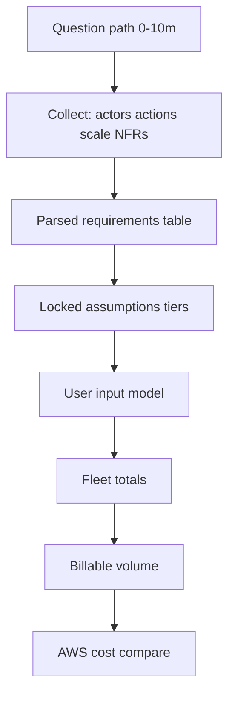
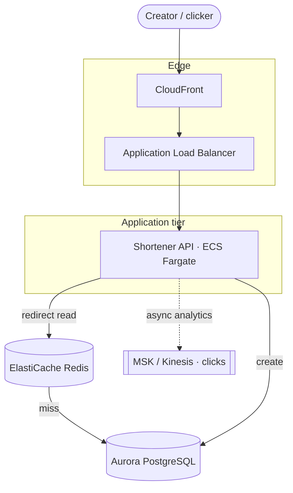
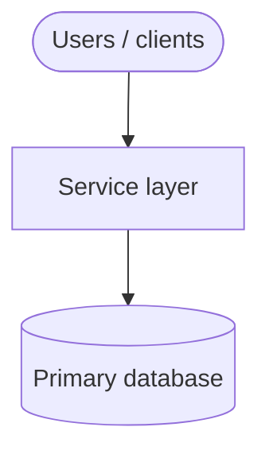

# Example authoring template

**Parent:** [`README.md`](./README.md) (patterns) · **Examples index:** [`examples/README.md`](../examples/README.md) · **Catalog:** [`system-catalog.md`](../prep/system-catalog.md)

Authoring contract for files under [`examples/`](../examples/). Consolidates patterns from the [60-minute runbook](../prep/interview-runbook-60m.md), [topics index](../topics-index.md), and gold examples.

**Gold references (v3 — copy structure and depth):**

| Doc | Teaches |
| --- | --- |
| [`examples/url-shortener.md`](../examples/platform/url-shortener.md) | Parsed requirements, dialogue, UX→API; read-heavy capacity + cost |
| [`examples/news-feed.md`](../examples/social/news-feed.md) | Social parsed fields (`K`, `L_feed`, celebrities); fan-out UX→API |
| [`examples/sequential-replica-digestion.md`](../examples/platform/sequential-replica-digestion.md) | Infra parsed fields (`G`, `SLA`, `X`); operator UX→API |

---

## End-to-end pipeline (one interview round)


| Phase | Minutes | Deliverable |
| --- | --- | --- |
| Introduction + discovery | 0–10 | Q&A theater + **locked assumptions** + **parsed requirement rows** |
| Capacity sketch | 10–18 | Input model, fleet totals, billable volumes, AWS-aligned cost + cliffs |
| Diagram + contracts | 18–46 | Mermaid, UX surface, APIs, DB paths |
| Deep dive + failure | 46–60 | One catalog axis + metrics tied to it |

If discovery is fuzzy at 10 minutes, **lock defaults** and proceed ([runbook heuristics](../prep/interview-runbook-60m.md)).

---

## What each example must deliver

| Expectation | Detail |
| --- | --- |
| Interview-ready | Full loop; link [interview runbook](../prep/interview-runbook-60m.md) in Introduction |
| Scoped | One [catalog](../prep/system-catalog.md) row (bucket + primary deep dive) |
| Traceable | Every capacity row traces to a **parsed field** or **UX action** |
| Consistent math | Prototype → growth → target: same per-user rates; only scale drivers change |
| Honest units | Separate OLTP, cache RAM, blob/CDN/stream, warehouse/archive |
| Actionable estimates | **Billable volumes** in AWS units (per M req, GB-mo) → per-service $ → **$/DAU/mo**; **cost cliffs** + **first payment block** at prototype |

**Pattern reference:** [`aws-reference-layout.md`](./aws-reference-layout.md) — cloud topology; use discovery + capacity where applicable, skip consumer DAU fiction.

---

## Section order (v3 full-round)

| # | Section | Purpose |
| --- | --- | --- |
| 1 | **Introduction** | Problem, users, runbook link, sibling distinction |
| 2 | **Requirements discovery** | Playbook path, question bank, dialogue, **parsed requirements**, **locked assumptions** |
| 3 | **Capacity sketch** | Capacity blocks (below); billable volumes → AWS-aligned cost |
| 4 | **High-level design** | Mermaid + hot-path narrative |
| 5 | **User-visible surface** | UX/UI triggers (before API names) |
| 6 | **API contract and input model** | UX→API map, endpoints, JSON, validation |
| 7 | **Database model** | Tables, indexes, numbered read/write paths |
| 8 | **Interview deep dive** | One catalog axis; tradeoff table |
| 9 | **Scale and failure** | Correctness, failure table, metrics → deep dive |
| 10 | **Related** | Topics, siblings, hub links |

---

## 1. Introduction

Include:

- **One-line problem** — what the system does and the dominant traffic shape (read-heavy, write-heavy, async, realtime).
- **Primary users** — consumers, operators, internal services (name each).
- **Interview pacing** — link runbook; name the **single** deep-dive axis (must match catalog).
- **Sibling distinction** — 1–2 sentences vs closest example in catalog overlap notes.

---

## 2. Requirements discovery

Goal: in **~10 minutes**, turn a vague prompt into **parsed fields** you can multiply in capacity—and later into **AWS billing units**. Split into subsections below; **author every example** with at least **2a–2d**; gold examples also show a full **dialogue** and **reality check**.



---

### Discovery playbook — question path (0–10 minutes)

Ask in **this order** so each answer unlocks the next. If the interviewer is vague, **offer a default and ask to confirm** (“I’ll assume 100M DAU and 10 redirects per user per day—OK?”).

| Phase | Minutes | Your goal | Ask (verbatim-ish) | If vague, lock |
| --- | --- | --- | --- | --- |
| **1. Scope** | 0–3 | One vertical slice | “Who are the users?” → “What is the **one** happy path we must nail?” → “What is **out of scope** for this round?” | 2–3 actor types; defer auth/billing/ML unless core |
| **2. Scale anchor** | 3–5 | Target `U` or `Q` | “**Daily active users** (or peak **requests/events per second**)?” “Prototype vs where you want to be in **1–2 years**?” | Prototype **10k** → growth **1M** → target **{{TARGET}}** |
| **3. Actions** | 5–7 | Per-user/day rates | “For each actor, how many times per **day** do they do X?” “What **%** of DAU does the rare action?” | 2–5 rows for **input model**; state `% of DAU` + count |
| **4. Shape** | 7–8 | Read:write + bytes | “Which API dominates **request count**? **Bytes** (egress, storage)?” “Any **10× spike** (launch, on-sale, viral link)?” | Ratio (e.g. **100:1**); peak **×10** on hot path |
| **5. NFRs** | 8–9 | Latency + correctness | “**p99** on the hot path?” “After a write, must the next read see it?” “Retention / TTL?” | p99 ms; read-your-writes vs eventual; hot window |
| **6. Lock** | 9–10 | Parsed summary | “I’ll lock: `U`, actions, read:write, p99, retention, out of scope—unless you want to change anything.” | Copy into **parsed requirements** + **locked assumptions** |

**Do not** jump to boxes or AWS names until phase 6 is locked (or timeboxed). Diagramming with wrong `U` wastes the next 20 minutes.

---

### Interview Q&A cheat sheet (required in every example)

Condensed **say-aloud** script for minutes 0–10. Derive rows from the **question bank**; keep defaults aligned with the **target** column in **locked assumptions**.

| Step | You ask | Lock if vague (target) |
| --- | --- | --- |
| 1 — Scope | Who are the users? What is the **one** happy path? What is **out of scope**? | … |
| 2 — Scale | DAU (or peak QPS / events per day)? Prototype vs 12-month target? | Prototype **10k** → growth **1M** → target **{{TARGET}}** |
| 3 — Actions | What does each actor do per day? % of DAU for rare writes? | 2–5 rows for **input model** |
| 4 — Shape | Which path dominates requests and bytes? Any **10×** spike? | Read:write ratio; peak multiplier |
| 5 — NFRs | Hot-path **p99**? Read-your-writes vs eventual? Retention / TTL? | ms latency; consistency; hot window |
| 6 — Confirm | “I’ll lock these in **parsed requirements** unless you want different numbers.” | Proceed to capacity + diagram |

Place this subsection **after** **locked assumptions** and **before** **capacity sketch**.

---

### What to collect (discovery checklist)

Every item below should land in **parsed requirements** or **locked assumptions** before capacity math.

| # | Collect | Example (URL shortener) | Parsed field | Next use |
| --- | --- | --- | --- | --- |
| 1 | Actor types | creators, clickers, owners | (rows in input model) | UX surface |
| 2 | Target scale | 100M DAU | `U` | Fleet totals |
| 3 | % DAU per action | 10% create | `p_creator` | `creates_day = p × U × L` |
| 4 | Actions per actor / day | 1 create, 10 redirects | `L_c`, `L_r` | Requests/day |
| 5 | Request read:write | 100:1 redirect:create | `read:write` | Cache / deep dive |
| 6 | Row or event size | 200 B mapping, 80 B click | `S_row`, `S_click` | Storage GB |
| 7 | Hot-path p99 | &lt; 50 ms redirect | `p99_hot` | Redis, CDN |
| 8 | Retention / churn | ~500M live links | `retention` | Steady-state rows |
| 9 | Peak multiplier | ×10 RPS | (locked or traffic profile) | Peak RPS, footprint |
| 10 | Out of scope | no billing, no ML | (prose) | Avoid scope creep |

**Platform / infra:** replace rows 2–4 with `Q` (peak RPS), `T` (tenants), `G`/`N` (rows/gaps), `S` (payload bytes)—see parsed template below.

---

### Estimation ladder (conversation → AWS $)

Use the same chain in the interview and in every example doc. **Say the step aloud** when estimating (“that’s 1B redirects per day → about 12k average RPS → about 30 billion requests per month for billing”).

| Step | You produce | How | AWS link |
| --- | --- | --- | --- |
| **1. Parse** | `U`, `p_*`, `L_*`, `S_*`, NFRs | From Q&A → **parsed requirements** | Defines *what* to count |
| **2. Input model** | One row per API-touching action | `% DAU × L` per row | Maps to endpoints |
| **3. Fleet totals** | `requests_day`, `bytes_day`, domain totals | `Σ (p × U × L)` per action; add management reads | **Traffic** for RPS |
| **4. Normalize** | Per-DAU or per-unit economics | `requests_day / U` | Sanity vs industry |
| **5. Billable volume** | Millions req/mo, GB-mo, vCPU-h | `requests_day × 30`; steady GB from storage table | **Same units as AWS list price** |
| **6. AWS cost** | Per-service $, cliffs, $/DAU | `volume × ballpark rate`; **9b** reconcile | Compare design to practice |

**Rules of thumb while estimating:**

- **Average RPS** = `requests_day / 86,400`. **Peak RPS** ≈ `10 × avg` unless they give a spike factor.
- **Monthly requests** = `requests_day × 30` → express as **millions/month** if the service bills per million.
- **Steady storage** ≈ `rows_live × row_size`; **new bytes/day** ≈ `new_rows_day × row_size` (do not confuse the two).
- **Egress** ≈ `redirects_day × response_bytes` (often dominates $ at scale).
- Round to **2 significant figures** in the interview; keep formulas exact in the doc.

---

### Reality anchors (compare your numbers)

After locking target scale, **sanity-check** parsed fields against known orders of magnitude. Say: *“100M DAU with 10 reads each is ~1B requests/day—that’s Twitter-scale redirect traffic, not Gmail attachment volume.”*

| Anchor | Scale (order of magnitude) | Typical use in examples |
| --- | --- | --- |
| Small SaaS / MVP | **1k–50k** DAU | Prototype column |
| Regional product | **1M–10M** DAU | Growth column |
| Large consumer app | **50M–500M** DAU | Target for social, URL, feed |
| Global top-tier | **1B+** DAU | Only if interviewer insists; call out cost |
| Read-heavy utility | **10–100×** more reads than writes | URL shortener, CDN, feed |
| Write-heavy social | **10–30%** of DAU post; **1–5** posts/day | News feed input model |
| Peak / viral | **10×–100×** avg on one key or event | Hot key, ticket on-sale |
| OLTP row | **100 B–2 KB** | Mapping, post metadata |
| Event / click | **50–500 B** | Analytics stream (often **not** OLTP) |
| Avg RPS from 1B req/day | **~12k** | `1e9 / 86400` |
| 1B req/month (not day) | **~400 RPS** avg | Common confusion—clarify day vs month |
| Prototype AWS “platform tax” | **~$200–400/mo** | ALB + small RDS + minimal compute |
| Target core (read-heavy, no warehouse) | **~$0.0001–0.001 / DAU / mo** ballpark | Before uncapped analytics |

If your **parsed** numbers are **10× above** an anchor without a story (viral tier, uncapped logs), flag it in dialogue or sensitivity.

---

### Worked conversation → estimates → AWS (URL shortener pattern)

Use this shape in **example dialogue** + capacity (see [`examples/url-shortener.md`](../examples/platform/url-shortener.md)).

| Turn | Dialogue | You write down | Math (target) |
| --- | --- | --- | --- |
| 1 | “100M DAU, 10% create 1 link/day” | `U=100M`, `p_creator=0.1`, `L_c=1` | Creates = **10M/day** |
| 2 | “10 redirects per user per day” | `L_r=10` | Redirects = **1B/day** |
| 3 | “Reads dominate—100:1” | `read:write=100:1` | Requests ≈ **1.01B/day** |
| 4 | “p99 redirect under 50ms” | `p99_hot<50ms` | Cache-first path |
| 5 | “200B row, async clicks” | `S_row=200B`, `S_click=80B` | OLTP **~2 GB/day**; clicks **~80 GB/day** async |

**Fleet → AWS (target):**

| Design metric | Value | Monthly billable unit | Ballpark check |
| --- | --- | --- | --- |
| API requests | 1.01B/day | **~30.3B/mo** → **30,300 million** | Not all priced on API GW if ALB terminates |
| OLTP steady | ~100 GB | **100 GB-mo** | ~$10 storage + instance minimum |
| Redirect egress (theoretical) | 500 GB/day | **~15k GB/mo** | ~$1.4k @ $0.09/GB if not CDN-cached |
| Click stream (if uncapped) | 80 GB/day | **~2.4 PB/mo** ingest | **Cost cliff** — must sample/TTL |

**Prototype vs target:** at **10k DAU**, same per-user rates → **~101k req/day** (~1.2 RPS)—still pay **~$200/mo** ALB+DB+compute (**first payment block**), not 30B requests/mo.

---

### 2a. Question bank (interview theater)

Use a table. Cover **playbook phases 1–5**; add domain-specific rows.

| Topic | You ask | If they push back | Example answer (reasonable default) |
| --- | --- | --- | --- |
| **Actors** | Who uses this? Human vs service? | "Everyone" | List 2–4 actor types |
| **Core journey** | What is the one happy path? | "Many features" | One vertical slice for v1 |
| **Scale** | DAU / QPS / events per day? Peak multiplier? | "Unknown" | Prototype 10k → growth 1M → **target** anchor |
| **Actions per user** | What does each actor do per day? | "Everything" | 2–5 measurable actions (feeds into input model) |
| **Read vs write** | Which path dominates requests and bytes? | "Balanced" | Ratio or dominant path |
| **Consistency / latency** | Strong vs eventual? p99 on hot path? | "Always consistent" | Explicit compromise |
| **Retention / lifetime** | TTL, archive, legal hold? | "Forever" | Hot OLTP window + cold tier |
| **Multi-region / tenancy** | Single region? B2B tenants? | "Global day one" | Defer or state model |
| **Out of scope** | What are we not designing today? | "Add X" | Defer list (auth, ML, search, …) |

Domain packs (add rows as needed):

- **Social/feed:** follow graph, fan-out vs read merge, celebrity threshold, items per load, materialized cap `K`.
- **Commerce:** inventory model, reservation TTL, payment handoff, cart merge.
- **Platform/infra:** tenants, QPS, cardinality of keys, fail-open vs closed.
- **Realtime:** ordering key, reconnect, presence TTL.
- **Fintech:** idempotency, ledger vs orchestration, reconciliation window.

### 2b. Example dialogue (required for gold; recommended for all)

Script **one full pass** through the playbook: scope → scale → actions → shape → lock. After each answer, **verbalize the math** so the interviewer sees estimates are derived, not invented.

**Template (adapt domain):**

> **You:** Let's scope v1: one happy path and what's out of scope?
> **Them:** …
> **You:** For scale, what DAU should we design for—prototype vs 12-month target?
> **Them:** …
> **You:** So `U = {{TARGET}}`. What % of DAU does [write action], and how many times per day?
> **Them:** …
> **You:** That gives **[formula]** = **[number]/day**. And for the hot read path?
> **Them:** …
> **You:** So read:write is about **[ratio]**; avg RPS ≈ **[requests_day/86400]**, peak about **[×10]**.
> **You:** I'll lock these in parsed requirements unless you want different numbers.

Optional closing line tying to cost: *“At target that's ~[X] million requests per month—I'll map that to ALB/Fargate, not just API Gateway per-million pricing.”*

See **Worked conversation** above and gold [`examples/url-shortener.md`](../examples/platform/url-shortener.md).

### 2c. Parsed requirements (structured extraction)

Turn answers into **machine-usable fields** before locking tiers. This is the bridge from conversation to capacity. **Every row** should trace to a question in **2a** or the **playbook**.

**Consumer product template** (add **Reality check** column for gold examples):

| Field | Source question | Example parsed value | Drives | Reality check |
| --- | --- | --- | --- | --- |
| `U` | DAU | 100M | Scale tiers, fleet totals | Large consumer app tier |
| `p_action` | % DAU doing action X | 0.1 creators | Input model `% of DAU` | Typical creator % |
| `L_action` | Per actor per day | 1 create, 10 redirects | Input model `per user / day` | Read-heavy ratio |
| `read:write` | Traffic shape | 100:1 | Derivation, cache emphasis | Matches redirect-heavy utility |
| `requests_day` | derived | 1.01B | RPS, AWS millions/mo | ~12k avg RPS; ~30.3B/mo |
| `p99_hot` | Latency | 50 ms redirect | Deep dive, cache design | Aggressive but common for redirects |
| `S_row` | Row size estimate | 200 B mapping | Storage table | Small OLTP row |
| `retention` | Lifetime | 90d hot / churn | Storage steady-state | Steady-state row count |

**Platform / infra template** (no `U`):

| Field | Source question | Example parsed value | Drives |
| --- | --- | --- | --- |
| `Q` | Peak RPS / checks / events | 100k/s | Scale tiers |
| `T` | Tenants or shards | 10k | Key cardinality |
| `G` or `N` | Gap rows / total rows | 800k gap | Infra capacity |
| `S` | Payload bytes | 8 KB | Storage + egress |

Add rows until every **locked assumption** and **input model action** has a parent field here.

### 2d. Locked assumptions

Three columns — **Prototype (MVP) | Growth | Target (anchor)**. Same behavior rates across tiers; only scale drivers (`U`, `Q`, `N`, …) change.

```markdown
Use **target** for the interview anchor unless the interviewer changes scope.

| Assumption | Prototype (MVP) | Growth | Target (anchor) |
| --- | --- | --- | --- |
| DAU (`U`) | 10k | 1M | {{TARGET}} |
| … | … | … | … |

*After ~10 minutes, proceed with the **target** column.*
```

Copy every numeric field from **parsed requirements** into this table.

---

## 3. Capacity sketch (numbered blocks)

Build in order. Each block should cite symbols from **parsed requirements** / **locked assumptions**. Blocks **2b–2d** and **9a–9d** align traffic/storage with **AWS billing meters** before dollar totals.

**Interview bridge:** When you finish **fleet totals**, pause and say: *“That's [X] per day → [Y] million per month on the meter AWS uses—I'll line that up with [service] pricing.”* Then fill **billable volume** before **9a** dollar amounts.

| # | Block | Purpose |
| --- | --- | --- |
| 1 | **User input model** | Actors/actions → API → bytes (see below) |
| 2 | **Fleet totals (target)** | `requests_day`, `bytes_day`, domain-specific totals |
| 2b | **Traffic profile (target tier)** | Read:write (requests + bytes), per-user/day throughput, peak RPS |
| 2c | **AWS service map (target deployment)** | Real AWS names + **billing unit** per service |
| 2d | **Billable volume (target month)** | Fleet totals converted to AWS meters (per M req, GB-mo, …) |
| 3 | **Scale tiers** | Prototype → growth → target |
| 4 | **Symbols** | Variables used in derivations |
| 5 | **Derivation (traffic)** | Writes/reads per day, avg/peak RPS, egress, fan-out |
| 6 | **Storage and growth over time** | Row sizes, retention, steady-state, 30d/1y |
| 7 | **Per-user or per-unit economics** | Normalized target-tier metrics |
| 8 | **Service footprint** | Instance/shard ballpark; **first scale cliff** |
| 9 | **Cloud cost ballpark** | Per-service $ from billable volumes; **traffic vs cost** check; **cost cliffs** |
| 10 | **Timeline** | Launch → month 3/6/12; pairs with **9d** (time to material bill) |
| 11 | **Sensitivity** | 10× `U`, 10× read:write, 2× payload, … |

### User input model (required shape)

| Action | Actor / % of DAU | Per user (or actor) / day | API / event | ~Req size | Durable write / day |
| --- | --- | --- | --- | --- | --- |
| … | … | … | … | … | … |

Rules:

- **One row per measurable action** that hits the API or emits durable bytes.
- **% of DAU** for consumer products; **actor + volume** for platform/infra.
- Tie **API** column to section 6 endpoints (same path names).
- Call out **0 OLTP** rows when writes are async (analytics, events).

**Social/feed extras:** home loads / DAU / day, items per load, cap `K`, explain `loads × items` vs `K`.

After the table:

```markdown
### Fleet totals (target)

| Metric | Formula | Value |
| --- | --- | --- |
| … | … | … |
```

### Traffic profile (target tier)

| Metric | Value |
| --- | --- |
| **Read:write (API requests)** | **R:W** (e.g. **100:1** reads:writes) |
| **Read:write (durable bytes)** | **R:W** or N/A if ephemeral-heavy |
| **Requests / day (fleet)** | … |
| **Avg RPS** | `requests_day / 86,400` |
| **Peak RPS** | **×10** (or domain spike, e.g. on-sale) |

| User / actor | Action | R/W | Per user (or actor) / day | % of fleet requests |
| --- | --- | --- | --- | --- |
| … | … | R or W | … | … |

*Per-user rates stay fixed across prototype → target; only `U` (or `Q`) scales fleet totals.*

### AWS service map (target deployment)

Use **real** AWS names ([topics index](../topics-index.md) checklist). Map each Mermaid box and add **what you count in design** so cost math uses the same units AWS bills.

| AWS service | Role in this design | Design metric (express monthly) | Typical AWS bills on |
| --- | --- | --- | --- |
| Application Load Balancer | L7 ingress | Peak RPS, active connections | **LCU-hours** + hourly minimum |
| Amazon API Gateway | Optional edge API | `requests_mo = requests_day × 30` | **Per million requests** |
| Amazon ECS on Fargate | App tier | `pods × vCPU × GB-RAM × 730 h` | **vCPU-hours**, **GB-hours** |
| AWS Lambda | Event handlers | `invocations_mo`, `GB-seconds` | **Per million requests**, duration |
| Amazon ElastiCache (Redis) | Hot cache | `cache_GB` RAM, ops/sec | **Node-hours**, memory tier |
| Amazon Aurora / RDS | OLTP | `storage_GB` steady, read/write IOPS | **Instance-hours**, **GB-mo**, IOPS |
| Amazon DynamoDB | Key-value | `RCU`, `WCU` or on-demand R/W | **Per million read/write request units** |
| Amazon MSK / Kinesis | Event log | `events_mo`, retention GB, ingress GB | **Broker-hours**, **GB-mo**, **per-GB in/out** |
| Amazon SQS / SNS | Queue / fanout | `messages_mo` | **Per million requests** |
| AWS Step Functions | Workflows | `transitions_mo` | **Per state transition** |
| Amazon S3 | Objects / archive | `storage_GB`, `GET/PUT` per month | **GB-mo**, **per 1k/1M requests** |
| Amazon CloudFront | CDN egress | `egress_GB_mo` to viewers | **Per GB data transfer out** |
| Amazon CloudWatch | Logs/metrics | `log_GB_ingest_mo` | **Per GB ingest**, per metric |

**Rule:** If AWS quotes **per million**, your fleet table should also show **`X million per month`** (not only RPS).

### Billable volume (target month)

Convert **fleet totals** and **traffic profile** into monthly meters **before** dollar math.

| Design quantity (target) | Formula | Monthly billable unit |
| --- | --- | --- |
| API requests | `requests_day × 30` | **___ million requests / mo** |
| OLTP storage steady | from storage table | **___ GB-mo** |
| Cache RAM | from footprint | **___ GB** (node size × count) |
| Egress to internet | `egress_day × 30` | **___ GB / mo** |
| Stream events | `events_day × 30` | **___ million events / mo** |
| Log volume (if full capture) | `log_GB_day × 30` | **___ GB ingest / mo** |

Example (URL shortener target): `1.01B req/day` → **~30.3B req/mo**; redirect egress `500 GB/day` → **~15k GB/mo** (before CDN/cache); OLTP **~100 GB** steady.

### AWS billing units ↔ design metrics (reference)

Interview ballparks — **us-east-1 order of magnitude**, not quotes. Align design counters to the **same column**.

| AWS service | Bills on (typical) | Count in design as | Ballpark rate | Quick $/mo formula |
| --- | --- | --- | --- | --- |
| **ALB** | LCU-h + ~$16–25/mo baseline | Peak RPS, conn/sec | ~$0.008/LCU-h | `baseline + f(RPS)` |
| **API Gateway** (HTTP) | Per million requests | `requests_mo / 1e6` | ~$1.00 / M | `(req_M) × $1` |
| **ECS Fargate** | vCPU-h, GB-h | `pods × vCPU × 730` | ~$0.04/vCPU-h, ~$0.004/GB-h | `vCPU×730×0.04 + GB×730×0.004` |
| **Lambda** | Per M invocations + GB-s | invocations, duration ms | ~$0.20/M + compute | dominated by GB-s if long |
| **Aurora/RDS** | Instance-h + storage GB-mo + IOPS | `storage_GB`, instance size | ~$0.10/GB-mo storage + $50+ instance | `instance + GB×0.10` |
| **DynamoDB** on-demand | Per million R/W request units | Derived WCU/RCU from RPS | ~$0.25/M reads, ~$1.25/M writes (simplified) | `reads_M×0.25 + writes_M×1.25` |
| **ElastiCache** | Node-h (memory tier) | `cache_GB` | ~$0.017/h small node + RAM tier | `nodes × $/h × 730` |
| **S3 Standard** | GB-mo + per 1k/1M requests | `storage_GB`, GET/PUT counts | ~$0.023/GB-mo; ~$0.40/M GET (tiered) | `GB×0.023 + ops` |
| **CloudFront** | Per GB egress | `egress_GB_mo` | ~$0.085/GB (US) | `egress_GB × 0.085` |
| **MSK** | Broker-h + storage + transfer | Brokers × 730, log GB | ~$0.10+/broker-h | `brokers×730×rate + GB` |
| **Kinesis** | Shard-h + PUT payload GB | Shards × 730, `PUT_GB` | ~$0.015/shard-h | `shards×730×0.015 + PUT` |
| **SQS** | Per million requests | `messages_mo / 1e6` | ~$0.40/M (after free tier) | `msg_M × 0.40` |
| **Step Functions** | Per state transition | `transitions_mo` | ~$25/M transitions | `trans_M × 25` |
| **Data transfer out** (to internet) | Per GB | Non-CDN egress | ~$0.09/GB | `egress_GB × 0.09` |
| **NAT Gateway** | Hourly + per GB processed | Avoid in MVP if possible | ~$32+/mo/AZ + $0.045/GB | **first payment trap** |
| **CloudWatch Logs** | Per GB ingest | Full request logging | ~$0.50/GB ingest | scales with log verbosity |

Always say: *"At list-price ballparks, order-of-magnitude — reserved capacity and free tier change this."*

### Cost at a glance (required — interview sound bite)

One table the interviewer remembers; numbers must match **billable volume** and **cloud cost** below.

| Tier | Scale driver | ~Monthly $ (core product) | Per unit |
| --- | --- | --- | --- |
| Prototype (MVP) | e.g. `U` = 10k | **$…** | **$…/DAU/mo** or **$/1k RPS/mo** |
| Growth | e.g. `U` = 1M | **$…** | … |
| Target (anchor) | e.g. `U` = {{TARGET}} | **$…** | … |

Call out **first payment block** (ALB + DB + compute exist before traffic scales) and **one cost cliff** (egress, uncapped logs, analytics).

### Cloud cost ballpark (required shape)

Build **four subsections** (target tier). Numbers must reconcile with **billable volume** above.

#### 9a. Per-service cost estimate

| AWS service | Monthly billable volume | Rate (ballpark) | ~$/mo | Driver in *this* design |
| --- | --- | --- | --- | --- |
| … | e.g. **30.3B req → 30,300 M** | $1/M | $… | redirects dominate |
| … | … | … | … | … |
| **Subtotal (core product)** | | | **$…** | excl. optional analytics |
| **Total** | | | **$…** | |
| **Per DAU** (or per unit) | `total / U` | | **$…/DAU/mo** | |

Split **core** vs **optional** paths (e.g. full click warehouse, multi-AZ NAT, cross-region replication) so the interview shows judgment.

#### 9b. Traffic vs cost sanity check

Prove the design volume implies the dollar total.

| What you designed | Volume (monthly) | Ballpark rate | Implied $/mo | Matches line item? |
| --- | --- | --- | --- | --- |
| Redirect API requests | 30.3B | $1/M (if API GW) | ~$30k | vs compute+ALB (often lower — traffic on ALB/Fargate) |
| Internet egress | 15k GB | $0.09/GB | ~$1.4k | vs egress row |
| OLTP storage | 100 GB | $0.10/GB-mo | ~$10 | vs Aurora row (+ instance minimum) |
| Click stream (if uncapped) | 2.4 PB ingest | $0.05/GB (MSK/S3) | **$100k+** | flag as **cost cliff** |

Call out **mismatches** on purpose (e.g. API Gateway $/M is not the whole story when ALB terminates TLS).

#### 9c. Cost cliffs and minimum payment blocks

Services that cost money **even at low traffic**, or explode when a meter is left uncapped.

| Cliff | What triggers the bill | Typical floor or knee | Design lever |
| --- | --- | --- | --- |
| **ALB / NLB exists** | Hourly + minimum LCU | **~$16–25/mo** before meaningful RPS | Single ALB; share across services |
| **RDS/Aurora instance** | Smallest prod instance always on | **~$15–80/mo** + storage | Start micro; serverless v2 for spiky |
| **NAT Gateway** | Internal subnet egress | **~$32/mo/AZ** + $0.045/GB | NAT-less MVP; VPC endpoints for S3/DynamoDB |
| **Multi-AZ** | 2× databases, 2× NAT | **2×** baseline | Single-AZ prototype |
| **Uncapped analytics** | 1B events/day × bytes | Dominates total $ | Sample, aggregate, TTL |
| **Cross-AZ / cross-region** | Replication, chatter | $0.01–0.02/GB each hop | Co-locate hot path |
| **MSK cluster** | Min 3 brokers | **~$220+/mo** minimum | SQS for MVP; MSK at growth |
| **API Gateway per-M** | High request count | Linear in millions | ALB + Fargate for steady high RPS |
| **DynamoDB hot partition** | Single hot key | RCU/WCU spike cost | Shard keys, cache |

**First payment block:** the **first line item that appears on an AWS bill** even at prototype scale — usually **load balancer + database + one compute tier**, not per-million API charges.

#### 9d. Time to material AWS bill (prototype → growth)

Tie to **Timeline** block. Show when you cross free tier and when **$/DAU** flattens or jumps.

| Milestone | Scale | Dominant cost drivers | ~Monthly $ (core) | $/DAU/mo | Notes |
| --- | --- | --- | --- | --- | --- |
| **Launch** | Prototype `U` | ALB + micro RDS + 2 Fargate + tiny Redis | $… | $… | **Baseline block** — mostly fixed |
| **Month 3** | ~8× `U` | + egress, cache growth | $… | $… | Variable $ starts to show |
| **Month 6** | ~32× `U` | + read replicas or Redis cluster | $… | $… | **First scale cliff** (cite) |
| **Month 12** | ~128× `U` | Still sub-target? | $… | $… | May still be growth tier |
| **Target anchor** | Target `U` | Sharding, MSK, multi-AZ | $… | $… | Per-service table above |

**Interview sound bite:** *"At 10k DAU we pay the **platform tax** (~$200–400/mo) before we pay for scale; at 100M DAU variable egress and compute dominate; uncapped analytics can exceed everything else."*

### Worked example (URL shortener target) — copy pattern

**Billable volume:** 30.3B req/mo · 100 GB OLTP · 20 GB Redis · 15k GB egress/mo (theoretical) · 2.4 PB click ingest/mo (uncapped).

**Per-service (core only, ballpark):**

| Service | Volume | Rate | ~$/mo |
| --- | --- | --- | --- |
| ECS Fargate (~200 pods × 0.5 vCPU) | 73k vCPU-h | $0.04 | ~$15k |
| Aurora | 100 GB + IOPS | instance + storage | ~$3k |
| ElastiCache | 20 GB tier | node-h | ~$1k |
| Egress | 15k GB | $0.09/GB | ~$1.5k |
| **Core total** | | | **~$20–25k/mo** |
| Click pipeline (uncapped) | 2.4 PB | $0.02–0.05/GB | **$50k+** |

**First payment block at launch (10k DAU):** ALB + `db.t4g.small` + 2 Fargate tasks + `cache.t4g.micro` ≈ **$200/mo** with almost no per-million request charge yet.

**Cost cliff:** uncapped click stream; **1M DAU** single-writer DB (see gold [examples/url-shortener.md](../examples/platform/url-shortener.md)).

---

## 4. High-level design

Every example needs a **human-readable** diagram an interviewer can redraw in ~3 minutes: **users at the top**, **managed services in the middle**, **durable stores at the bottom**. Use real **AWS product names** in node labels or a legend table right below the figure. See [`architecture-diagram-conventions.md`](./architecture-diagram-conventions.md) for the shared Mermaid palette and layout rules.

### Architecture (user → database) — required

- **Layout:** `flowchart TB` (top → bottom). Optional `subgraph` for Edge / App / Data.
- **Top:** actors — `([Creator])`, `([API client])`, `([Mobile app])`, not internal codenames alone.
- **Middle:** ingress (CloudFront, ALB, API Gateway), compute (ECS Fargate, Lambda), async (SQS, MSK, Step Functions) as needed.
- **Bottom:** OLTP / object store — `[(Aurora PostgreSQL)]`, `[(DynamoDB)]`, `[(S3)]`, `[(Redis cache)]`.
- **Edges:** label hot path (`GET redirect`, `POST create`, `fan-out write`); dashed `-.->` for async / non-critical path.
- **Narrative** (3–6 sentences) immediately after the diagram: sync hot path, async boundaries, what is **not** on the critical path.

**Palette (optional, improves readability):**

```text
classDef user fill:#e3f2fd,#42a5f5,stroke:#1565c0
classDef edge fill:#fff8e1,#ffb74d,stroke:#ef6c00
classDef app fill:#e8f5e9,#66bb6a,stroke:#2e7d32
classDef data fill:#fce4ec,#ef5350,stroke:#c62828
classDef async fill:#f3e5f5,#ab47bc,stroke:#6a1b9a
```

**Worked shape (URL shortener):**



If the system has a second diagram (sequence, deployment, or plugin chain), put it in a subsection **after** this one (e.g. `### Gateway plugin chain`).

---

## 5. User-visible surface

Describe **what humans see and do** before REST paths. Bullets or short table:

| Surface | Actor | Trigger | Expected outcome |
| --- | --- | --- | --- |
| … | end user | taps "Post" | post appears on profile |
| … | operator | opens lag dashboard | gap count + ETA |

Include error UX where it matters (404 page vs JSON error, stale feed indicator).

---

## 6. API contract and input model

### 6a. UX → API traceability (required)

Map product behavior to contracts (consolidates UX + API):

| UX / UI action | User intent | API or event | Sync/async | Idempotent? | Validates (summary) |
| --- | --- | --- | --- | --- | --- |
| Paste URL, click Shorten | create link | `POST /v1/urls` | sync | optional `Idempotency-Key` | HTTPS URL, length, rate limit |
| Open short link | resolve redirect | `GET /{code}` | sync | yes (read) | code format |
| … | … | … | … | … | … |

For **event-driven** systems, use `OrderCreated`, `PaymentCaptured`, etc. instead of REST where appropriate.

### 6b. Endpoints or events

| Method | Path / topic | Purpose |
| --- | --- | --- |
| … | … | … |

### 6c. Example payloads

At least **one happy-path** request/response pair and **one error** (4xx/5xx). Use fenced `json` blocks.

### 6d. Input validation

Bullet list: field rules, auth, rate limits, idempotency keys, out-of-band policies (SSRF, reserved slugs).

Link to topic primers when useful: [api-design](../topics/api-design.md), [messaging-async](../topics/messaging-async.md).

---

## 7. Database model

### Tables / stores

| Table / stream | Key fields | Notes |
| --- | --- | --- |
| … | … | … |

### Indexes

Bullet list with **why** each index exists (which read path).

### Read/write paths (numbered)

Numbered list mapping hot paths to storage (from gold examples):

1. **Create** — validate → write OLTP → cache invalidate/warm.
2. **Hot read** — cache → DB on miss → response.
3. **Async side effect** — queue → consumer → warehouse.

Each path should reference APIs from section 6.

---

## 8. Interview deep dive

- Title: `## Interview deep dive: {{PRIMARY_DEEP_DIVE}}` — must match catalog axis.
- **Tradeoff table** (≥3 rows): strategy | how it works | pros | cons.
- Tie back to **parsed requirements** (e.g. read:write ratio, celebrity tier).

---

## 9. Scale and failure

| Subsection | Content |
| --- | --- |
| **Correctness model** | Invariants (uniqueness, ordering, balances, lag SLA) |
| **Failure cases** | Table: failure | symptom | mitigation |
| **Key metrics** | Metrics that detect deep-dive regressions (not generic CPU only) |
| **Talking points** (optional) | 3–5 bullets for last 2 minutes |

---

## Traceability cheat sheet

Use this when authoring or reviewing:

```text
Interview answer
 → Parsed requirements row
 → Locked assumptions (target column)
 → User input model row
 → Fleet totals → Billable volume (AWS meters)
 → Per-service $ + traffic vs cost check
 → UX → API row
 → Read/write path #
 → Deep dive tradeoff
 → Failure metric
```

---

## Acceptance checklist

-  All v3 sections and subsections (2a–2d, 6a–6d) present or explicit N/A
-  **Interview Q&A cheat sheet** (say-aloud table) after locked assumptions
-  **Discovery playbook** reflected: ordered Q&A or dialogue through scope → scale → actions → lock
-  **Architecture (user → database)** mermaid: users top → AWS services → stores bottom; labeled hot path
-  **Cost at a glance** table (prototype / growth / target $ and per-unit)
-  **Parsed requirements** table bridges Q&A to numbers; optional **reality check** vs anchors
-  **Estimation ladder** visible: parse → input model → fleet → billable volume → AWS cost
-  **Locked assumptions** has prototype | growth | target
-  Capacity sketch has all **numbered blocks** including **2b–2d** (traffic, AWS map, billable volume)
-  Traffic profile: read:write, fleet requests/day, avg/peak RPS, per-user/action breakdown
-  AWS map: real product names + **billing unit** + monthly design metric per major component
-  **Billable volume** table: fleet totals in AWS meters (e.g. **million requests/mo**, GB-mo)
-  **Cloud cost ballpark**: 9a per-service $, 9b traffic vs cost check, 9c cliffs, 9d timeline / **first payment block**
-  Cost math uses same units as AWS pricing pages (per million, GB-mo, vCPU-h) — labeled ballpark, not quotes
-  **UX → API** table aligns with user-visible surface and input model
-  ≥1 JSON success + ≥1 error example
-  DB **read/write paths** numbered and reference APIs
-  Deep dive title matches catalog; failure metrics tie to deep dive
-  Related links to [topics index](../topics-index.md) + siblings

---

## Document skeleton (copy into `examples/<name>.md`)

```markdown
# {{SYSTEM_NAME}}

## Introduction

{{ONE_LINE_PROBLEM}}

**Primary users:** {{PRIMARY_USERS}}

**Interview pacing:** [60-minute runbook](../prep/interview-runbook-60m.md) — ~10 min discovery, ~18–32 min diagram + API/DB, ~46–56 min deep dive on **{{PRIMARY_DEEP_DIVE}}**.

{{SIBLING_DISTINCTION}}

## Requirements discovery (interview theater)

*Optional one-liner:* link to playbook phases (scope → scale → actions → shape → lock) or embed a short **example dialogue** below.

### Question bank

| Topic | You ask | If they push back | Example answer (reasonable default) |
| --- | --- | --- | --- |
| Actors | … | … | … |
| Scale | … | … | Prototype 10k → 1M → {{TARGET_U}} |
| Core actions | … | … | … |
| Read vs write | … | … | … |
| Consistency / latency | … | … | … |
| Retention | … | … | … |
| Out of scope | … | … | … |

### Example dialogue

> **You:** …
> **Them:** …
> **You:** So I'll lock {{PARSED_SUMMARY}} unless you disagree.

### Parsed requirements

| Field | Source question | Parsed value (target) | Drives | Reality check |
| --- | --- | --- | --- | --- |
| `U` | DAU | {{TARGET_U}} | tiers, fleet totals | vs anchors table |
| `requests_day` | derived | … | RPS, AWS millions/mo | ~avg RPS = value/86400 |
| … | … | … | … | … |

### Locked assumptions

| Assumption | Prototype (MVP) | Growth | Target (anchor) |
| --- | --- | --- | --- |
| DAU (`U`) | 10k | 1M | {{TARGET_U}} |
| … | … | … | … |

*Proceed with **target** after ~10 minutes unless scope changes.*

### Interview Q&A cheat sheet

| Step | You ask | Lock if vague (target) |
| --- | --- | --- |
| 1 — Scope | … | … |
| 2 — Scale | … | … |
| … | … | … |

## Capacity sketch

### User input model

| Action | % of DAU | Per user / day | API | ~Req size | Durable write / user / day |
| --- | --- | --- | --- | --- | --- |
| … | … | … | … | … | … |

### Fleet totals (target)

| Metric | Formula | Value |
| --- | --- | --- |
| … | … | … |

### Traffic profile (target tier)

| Metric | Value |
| --- | --- |
| **Read:write (API requests)** | … |
| **Requests / day (fleet)** | … |
| **Avg RPS** | … |
| **Peak RPS** | … |

| User / actor | Action | R/W | Per user (or actor) / day | % of fleet requests |
| --- | --- | --- | --- | --- |
| … | … | R/W | … | … |

### AWS service map (target deployment)

| AWS service | Role in this design | Monthly meter (target) | Bills on |
| --- | --- | --- | --- |
| … | … | e.g. **30,300 M req/mo** | per million requests |

### Billable volume (target month)

| Design quantity | Formula | Monthly billable unit |
| --- | --- | --- |
| API requests | `requests_day × 30` | … million req/mo |
| … | … | … |

### Scale tiers

| Tier | `U` | … | Avg RPS | Peak RPS (×10) |
| --- | --- | --- | --- | --- |
| Prototype | 10k | … | … | … |
| Growth | 1M | … | … | … |
| Target | {{TARGET_U}} | … | … | … |

### Symbols

| Symbol | Meaning |
| --- | --- |
| `U` | Daily active users |
| … | … |

### Derivation (traffic)

…

### Storage and growth over time

| Table / store | ~Row size | New rows/day (target) | Retention | Steady-state (target) | Per user (target) |
| --- | --- | --- | --- | --- | --- |
| … | … | … | … | … | … |

### Per-user economics (target tier)

| Metric | Formula | Target value |
| --- | --- | --- |
| Requests / DAU / day | `requests_day / U` | … |
| … | … | … |

### Service footprint (instance count ballpark)

| Service | Scales with | Prototype | Growth | Target |
| --- | --- | --- | --- | --- |
| … | … | … | … | … |

**First scale cliff:** …

### Cost at a glance

| Tier | Scale driver | ~Monthly $ (core) | Per unit |
| --- | --- | --- | --- |
| Prototype | … | **$…** | … |
| Target | {{TARGET_U}} | **$…** | **$…/DAU/mo** |

### Cloud cost ballpark (target tier)

#### Per-service cost estimate (9a)

| AWS service | Monthly billable volume | Rate (ballpark) | ~$/mo | Driver |
| --- | --- | --- | --- | --- |
| … | … | … | … | … |
| **Total (core)** | | | $… | |
| **Per DAU** | `total / U` | | $…/DAU/mo | |

#### Traffic vs cost sanity check (9b)

| What you designed | Volume (monthly) | Ballpark rate | Implied $/mo | Matches 9a? |
| --- | --- | --- | --- | --- |
| … | … | … | … | … |

#### Cost cliffs and first payment block (9c)

| Cliff | Trigger | Floor / knee | Design lever |
| --- | --- | --- | --- |
| ALB + RDS + compute (prototype) | Resources exist | ~$200–400/mo | **First payment block** at launch |
| … | … | … | … |

#### Time to material AWS bill (9d)

| Milestone | Scale | Dominant drivers | ~Monthly $ (core) | $/DAU/mo |
| --- | --- | --- | --- | --- |
| Launch | 10k | fixed platform tax | $… | $… |
| Month 3 / 6 / 12 | … | … | $… | $… |
| Target | {{TARGET_U}} | … | $… | $… |

### Timeline (prototype → early growth)

| Milestone | `U` | … | ~Monthly $ |
| --- | --- | --- | --- |
| Launch | 10k | … | $… |
| Month 3 | … | … | $… |
| Month 6 | … | … | $… |
| Month 12 | … | … | $… |

### Sensitivity

- …

## High-level design

### Architecture (user → database)



**Narrative:** …

## User-visible surface

| Surface | Actor | Trigger | Outcome |
| --- | --- | --- | --- |
| … | … | … | … |

## API contract and input model

### UX → API traceability

| UX / UI action | User intent | API or event | Sync/async | Idempotent? | Validates |
| --- | --- | --- | --- | --- | --- |
| … | … | … | … | … | … |

### Endpoints

| Method | Path | Purpose |
| --- | --- | --- |
| … | … | … |

### Example payloads

`POST …`

```json
{ }
```

### Input validation

- …

## Database model

### Tables

| Table | Key fields | Notes |
| --- | --- | --- |
| … | … | … |

### Indexes

- …

### Read/write paths

1. **…** — …
2. **…** — …

## Interview deep dive: {{PRIMARY_DEEP_DIVE}}

| Strategy | How | Pros | Cons |
| --- | --- | --- | --- |
| … | … | … | … |

## Scale and failure

### Correctness model

- …

### Failure cases

| Failure | Symptom | Mitigation |
| --- | --- | --- |
| … | … | … |

### Key metrics

- …

## Related

- [Examples hub](./README.md)
- [Topics index](../topics-index.md)
- …
```

---

## Authoring notes

- **Parsed requirements** is the highest-leverage new section—without it, capacity feels invented.
- **Discovery:** follow the **playbook order**; never skip “actions per user per day” before drawing AWS boxes.
- **Reality check:** one column or sentence comparing `requests_day` / `U` to the anchors table catches 10× errors early.
- **Cost:** convert `requests_day` to **millions/month** before multiplying by `$1/M`; separate **core product** from **optional analytics** so cliffs are visible.
- **First payment block** is usually fixed infra (ALB + DB + minimal compute), not request-metered spend—state it at prototype `U`.
- **UX → API** must match **user-visible surface** and **user input model** API column exactly.
- **Platform systems:** replace DAU columns with actors (`operator`, `worker`, `tenant`) and per-unit economics.
- When filing GitHub work, reference the target example path from [system-catalog.md](../prep/system-catalog.md); do not paste this template into issues.
- Topic depth: [api-design](../topics/api-design.md), [data-stores](../topics/data-stores.md), [messaging-async](../topics/messaging-async.md), [caching](../topics/caching.md), [reliability](../topics/reliability.md).
