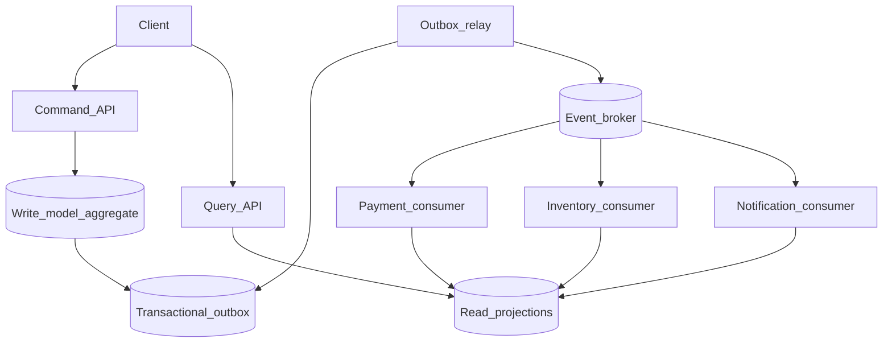

# Event-driven architecture reference

## Introduction

**Parent:** [`README.md`](./README.md)

**Pattern reference.** This page is a **reusable event-driven architecture (EDA) reference** for interviews: how to split **sync command APIs** from **async domain events**, publish reliably with the **transactional outbox**, evolve **contracts**, and choose **choreography vs orchestration**. It complements the worked example [event-driven order pipeline](../examples/event-driven/event-driven-order-pipeline.md).

**Primary users:** architects (boundaries, semantics), service owners (event schemas), operators (replay, DLQ), interview candidates (pattern vocabulary).

**Interview pacing:** Use [60-minute runbook](./interview-runbook-60m.md) — ~10 min scoping (below), ~20 min diagram + CQRS split, ~45 min deep dive on **contract/versioning + orchestration boundaries**.

## Requirements discovery (interview theater)

Use these to tailor the pattern—not every system needs all boxes.

### Question bank

| Topic | You ask | If they push back | Example answer (when EDA fits) |
| --- | --- | --- | --- |
| Boundaries | Monolith or microservices? | "Monolith" | Still use **outbox + internal bus**; fewer network failures |
| User path | Sync or async UX? | "Fully async" | **Command API** returns `202` + `resource_id`; poll/read model for status |
| Consistency | Strong cross-service? | "ACID everywhere" | **Eventual** between contexts; **strong** inside aggregate |
| Delivery | Exactly-once? | "Required globally" | **At-least-once** broker + **idempotent** consumers → effective once |
| Ordering | Global order? | "Yes" | **Per-aggregate** (`order_id`) partition only |
| Orchestration | Central workflow? | "No Sagas" | **Choreography** default; orchestrator for visibility-heavy flows ([workflow orchestration](../examples/infra/workflow-orchestration.md)) |
| Out of scope | Stream analytics platform | "Include Flink" | Point to [stream processing platform](../examples/event-driven/stream-processing-platform.md) |

### Example dialogue

> **You:** Let's scope v1: one happy path and what's out of scope?
> **Them:** …
> **You:** For scale, prototype vs 12-month target?
> **Them:** …
> **You:** What does each actor do per day on the hot path?
> **Them:** …
> **You:** I'll lock the **target** column assumptions unless you want different numbers — next I'll map fleet totals to monthly AWS meters in **billable volume**.

### Parsed requirements

| Field | Source question | Parsed value (target) | Drives |
| --- | --- | --- | --- |
| `bounded_contexts` | Bounded contexts | **8–20 services** | Scale tiers, input model, fleet totals |
| `command_api_peak_c_peak` | Command API peak (`C_peak`) | **20k/s** | Scale tiers, input model, fleet totals |
| `events_per_command_fan-out` | Events per command (fan-out) | **3×** | Scale tiers, input model, fleet totals |
| `event_log_peak_e_peak` | Event log peak (`E_peak`) | **60k/s** | Scale tiers, input model, fleet totals |
| `broker_partitions_p` | Broker partitions (`P`) | **512** | Scale tiers, input model, fleet totals |
| `consumer_groups_n` | Consumer groups (`N`) | **30** | Scale tiers, input model, fleet totals |
| `event_size_b_evt` | Event size (`B_evt`) | **500 B** | Scale tiers, input model, fleet totals |
| `cqrs_read:command_ratio` | CQRS read:command ratio | **10×** | Scale tiers, input model, fleet totals |
| `mau_illustrative_product` | MAU (illustrative product) | **10M** | Scale tiers, input model, fleet totals |

### Locked assumptions (reference workload)

**Reference workload** — scale by **command RPS** and **event fan-out**, not shopper DAU. Omit boxes at MVP as needed.

| Assumption | Prototype (MVP) | Growth | Target (anchor) |
| --- | --- | --- | --- |
| Bounded contexts | 3–5 | 8–12 | **8–20 services** |
| Command API peak (`C_peak`) | 200/s | 2k/s | **20k/s** |
| Events per command (fan-out) | 2× | 3× | **3×** |
| Event log peak (`E_peak`) | 400/s | 6k/s | **60k/s** |
| Broker partitions (`P`) | 32 | 128 | **512** |
| Consumer groups (`N`) | 5 | 15 | **30** |
| Event size (`B_evt`) | 500 B | 500 B | **500 B** |
| CQRS read:command ratio | 5× | 8× | **10×** |
| MAU (illustrative product) | 100k | 1M | **10M** |

*State which pieces you omit for smaller designs (e.g. no registry at MVP).*

## Capacity sketch

### User input model

| Action | Actor | Per day (target) | Unit | ~Size | Durable write |
| --- | --- | --- | --- | --- | --- |
| Command (write) | client | **~1.7B** | REST/command API | 1 KB | aggregate + outbox |
| Outbox relay publish | system | = commands × 3 | broker | 500 B | event log |
| Consumer handle | services | 60k/s peak | subscribe | — | projection |
| Query (read model) | client | **~17B** | query API | 600 B | read store |
| Projection rebuild | ops | rare | replay | — | rebuildable |

### Fleet totals (target reference product)

| Metric | Formula | Value |
| --- | --- | --- |
| Commands / day | `20k × 86,400` | **~1.7B** |
| Events / day | `× 3 fan-out` | **~5.2B** |
| Log bytes / day | `60k × 500 B × 86,400` | **~2.6 TB/day** |
| 14d hot retention | steady | **~12 TB** |
| Read QPS peak | `10 × C_peak` | **200k/s** |

### Traffic profile (target tier)

Locked **target** assumptions: **20k/s** command peak (`C_peak`), **60k/s** event publish peak (`E_peak`), **200k/s** read peak.

| Metric | Value |
| --- | --- |
| **Read:write (API requests)** | **10:1** (query API : command API) |
| **Read:write (durable bytes)** | **3:1** (projection reads : command + outbox writes) |
| **Requests / day (fleet)** | **~18.7B** (**17B** queries + **1.7B** commands) |
| **Avg RPS** | **~216k/s** combined; **~20k/s** commands avg at peak tier |
| **Peak RPS** | **200k/s** reads; **20k/s** commands; **60k/s** broker events |

| User / actor | Action | R/W | Per user / day | % of fleet requests |
| --- | --- | --- | --- | --- |
| End user | Command (write) | W | ~0.17 (fleet **1.7B**) | **~9%** |
| End user | Query (read model) | R | ~1.7 (fleet **17B**) | **~91%** |
| Outbox relay (system) | Publish event | W | 3× commands | broker path |
| Domain consumer (system) | Handle event | W | — | **60k/s** peak |
| Operator | Projection rebuild | R/W | rare | ops |

*Command rate scales with product DAU; **10×** read:write ratio holds at target (`P` query partitions).*

### AWS service map (target deployment)

| Diagram component | AWS service | Role in this design |
| --- | --- | --- |
| Client | — (web / mobile / service) | Commands + queries |
| Command_API | **Application Load Balancer** + **Amazon ECS on Fargate** | Validate; mutate aggregate + outbox (**20k/s**) |
| Write_model_aggregate | **Amazon Aurora PostgreSQL** (or **DynamoDB**) | Transactional aggregate store |
| Transactional_outbox | **Amazon Aurora** (same TX) | Outbox rows relayed to broker |
| Outbox_relay | **Amazon ECS on Fargate** / **AWS Lambda** | Poll outbox → **MSK** at **60k/s** |
| Event_broker | **Amazon MSK** (Kafka) | **~2.6 TB/day** log; 14d hot **~12 TB** |
| Payment_consumer | **Amazon ECS** (MSK consumer) | Idempotent handler + local projection |
| Inventory_consumer | **Amazon ECS** (MSK consumer) | Same pattern; independent group |
| Notification_consumer | **Amazon ECS** / **Lambda** | Async side effects |
| Read_projections | **Amazon DynamoDB** + **Amazon ElastiCache** | CQRS read models; **200k/s** peak |
| Query_API | **Amazon API Gateway** + **ECS** / **Lambda** | Serve projections only |
| Schema_registry | **AWS Glue Schema Registry** (or Confluent on **ECS**) | Versioned event contracts |
| DLQ | **Amazon SQS** / **MSK** DLQ topic | Poison messages for replay |
| Observability | **Amazon CloudWatch**, **AWS X-Ray** | Trace by `correlation_id`; consumer lag |

### Scale tiers

| Tier | `C_peak` | `E_peak` | `P` | Log GB/day | Consumer groups |
| --- | --- | --- | --- | --- | --- |
| Prototype | 200/s | 400/s | 32 | **~17** | 5 |
| Growth | 2k/s | 6k/s | 128 | **~260** | 15 |
| Target | 20k/s | 60k/s | 512 | **~2,600** | 30 |

### Symbols

| Symbol | Meaning |
| --- | --- |
| `C_peak` | Peak commands/s |
| `E_peak` | Peak events/s |
| `f_evt` | Events per command (3) |
| `P` | Broker partitions |
| `N` | Consumer groups |
| `R_read` | Read:command ratio (10) |

### Derivation (traffic)

**Events:** `E_peak = C_peak × f_evt = 20k × 3 = **60k/s**`.

**Partitions:** `60k / 512 ≈ **117 events/s/partition**`.

**Outbox relay:** must sustain **60k/s** publish after commit.

**Read path:** `C_peak × R_read = **200k/s**` on materialized views (separate stores).

**Per MAU (10M):** `2.6 TB / 10M / 30 ≈ **8.7 KB/MAU-day**` log bytes (metadata-heavy product).

### Storage and growth over time

| Pattern / store | ~Row size | Rate (target) | Retention | Steady-state (target) | Per service |
| --- | --- | --- | --- | --- | --- |
| Outbox (OLTP) | 500 B | 20k/s fleet | minutes | ephemeral | shared pattern |
| Event log | 500 B | 60k/s | 14d | **~12 TB** | bus |
| Command store | 1 KB | 5k/s each | 7y | **~3 TB/yr** | per context |
| Read projection | 600 B | 200k/s reads | rebuildable | **~2× command** | CQRS |

**5-year command store (one service at 5k/s):** `5k × 1 KB × 86,400 × 365 × 5 ≈ **790 TB**` — monthly partitions + archive.

### Per-unit economics (target reference)

| Metric | Formula | Target value |
| --- | --- | --- |
| Log bytes / command | `3 × 500 B` | **~1.5 KB** |
| Outbox bytes / command | 500 B | **500 B** (ephemeral) |
| Read bytes / command (served) | `10 × 600 B` | **~6 KB** (read path) |
| Log bytes / MAU / day | `2.6TB/10M/30` | **~8.7 KB** |

### Service footprint (instance count ballpark)

| Service | Scales with | Prototype | Growth | Target |
| --- | --- | --- | --- | --- |
| Command APIs | `C_peak` | 4 | 40 | **~200** |
| Outbox relay | `E_peak` | 2 | 10 | **~40** |
| Kafka brokers | log GB/day | 3 | 9 | **~15** |
| Consumer instances | lag per group | 10 | 60 | **~300** |
| Read query tier | 200k/s | 4 | 40 | **~400** |

**First scale cliff:** **Growth (2k commands/s)** — outbox relay lag; registry + idempotent consumers before **20k/s**.

### Billable volume (target month)

Reference workload — convert fleet totals to AWS meters before dollar math. *List-price ballparks — not a quote.*

| Design quantity (target) | Formula | Monthly billable unit |
| --- | --- | --- |
| Command API requests | `C_peak` sustained | **~52B** commands / mo (at **20k/s**) |
| Event log writes | `E_peak` sustained | **~155B** events / mo (at **60k/s**) |
| CQRS read API | **10×** commands | **~520B** reads / mo (illustrative) |
| Broker storage | retention × `B_evt` | **___ GB-mo** on MSK |
| Outbox + idempotency OLTP | steady rows | **___ GB-mo** |

*Reconcile rows in **Cloud cost ballpark** below.*

### Cloud cost ballpark (target reference)

| Line item | Driver | ~Monthly |
| --- | --- | --- |
| Event log (12 TB hot) | RF3 | **~$4k** |
| Command + outbox OLTP | 1.7B cmds/day | **~$25k** |
| Consumer compute | 300 pods | **~$45k** |
| Read projections + cache | 200k/s | **~$60k** |
| Schema registry | 30 services | **~$2k** |
| **Total (EDA slice)** | | **~$136k/mo** |
| **Per MAU** | `136k / 10M` | **~$0.014/MAU/mo** |
| **Per million commands** | `136k / 1.7M×30` | **~$2.7/M cmds/mo** |

### Timeline (prototype → early growth)

| Milestone | `C_peak` | Log hot | Services | ~Monthly $ |
| --- | --- | --- | --- | --- |
| Launch | 200/s | **0.5 TB** | 5 | **~$5k** |
| Month 3 | 500/s | **1.2 TB** | 8 | **~$12k** |
| Month 6 | 1k/s | **2.5 TB** | 12 | **~$25k** |
| Month 12 | 2k/s | **5 TB** | 15 | **~$50k** |

Month 12 is **growth tier** — partition and consumer scaling before **20k/s** command peak.

### Sensitivity

| Change | Effect | Response |
| --- | --- | --- |
| **Chatty choreography (10× events)** | Broker + consumer lag | Orchestrate or consolidate contexts |
| **Large event payloads** | Broker bloat | Blob ref in event body |
| **10× reads** | Projection store hot | Scale read tier; cache |
| **No registry at MVP** | Schema drift risk | Add registry before multi-team fan-out |

## High-level design



**Narrative:** **Command API** validates intent, mutates **aggregate** in write DB, inserts **outbox row** in same transaction. **Relay** publishes to **broker**. **Domain consumers** react independently, update local state or **read projections**. **Query API** serves reads from projections—not the write model. Cross-cutting IDs tie the story together for ops.

## User-visible surface

- **End user:** synchronous validation on command (reject bad input fast); status via query API or push notification when async work completes.
- **Developer:** publishes/consumes versioned events; registers schemas.
- **Operator:** trace by `correlation_id`; replay consumer group; inspect DLQ.

## API contract and input model

### UX → API traceability

| UX / UI action | User intent | API or event | Sync/async | Idempotent? | Validates |
| --- | --- | --- | --- | --- | --- |
| Place order (example) | mutate aggregate | `POST /v1/commands/place-order` | sync | `Idempotency-Key` | command schema |
| Check status | read projection | `GET /v1/orders/{id}` | sync | read | eventual lag OK |
| Downstream reaction | fulfill side effect | `OrderPlaced` event | async | consumer idempotent | contract version |
| Replay / fix | recover consumer | admin replay tool | async | yes | partition + offset |
| Register schema | safe evolution | schema registry API | sync | yes | compatibility mode |

### Command side (sync write)

`POST /v1/commands/place-order`

```http
Idempotency-Key: cmd-ord-8f2a1c-001
X-Correlation-Id: corr-7b3c9e2a
```

```json
{
 "customer_id": "cust_9912",
 "lines": [{ "sku": "SKU-42", "quantity": 2 }]
}
```

Response `202 Accepted` (async processing) or `201` if read model updated inline for create:

```json
{
 "order_id": "ord_8f2a1c",
 "status": "PENDING",
 "correlation_id": "corr-7b3c9e2a"
}
```

### Query side (read)

`GET /v1/queries/orders/ord_8f2a1c`

```json
{
 "order_id": "ord_8f2a1c",
 "status": "CONFIRMED",
 "total_cents": 3998,
 "projection_version": 12,
 "updated_at": "2026-05-23T22:05:00Z"
}
```

May lag write model by seconds—document staleness bound.

### Event envelope (inter-service contract)

```json
{
 "event_id": "evt_01HZXK9Q2M3N4P5Q6R7S8T9U0",
 "event_type": "OrderCreated",
 "schema_version": 3,
 "aggregate_type": "Order",
 "aggregate_id": "ord_8f2a1c",
 "correlation_id": "corr-7b3c9e2a",
 "trace_id": "trace_abc123",
 "occurred_at": "2026-05-23T22:00:00.123Z",
 "producer": "ordering-service",
 "payload": {
 "customer_id": "cust_9912",
 "total_cents": 3998
 }
}
```

**Partition key:** `aggregate_id` (`ord_8f2a1c`).

## Database model

### Write path (per service)

| Store | Purpose |
| --- | --- |
| `aggregates` / domain tables | Source of truth inside bounded context |
| `outbox` | `event_id`, `aggregate_id`, `type`, `payload`, `published_at` |
| `idempotency_keys` | Command dedupe |

### Read path

| Store | Purpose |
| --- | --- |
| `read_projections` | Denormalized views per query |
| `projection_offsets` | Consumer offset + projection version |

### Platform metadata

| Store | Purpose |
| --- | --- |
| `schema_registry` | `event_type`, `version`, Avro/JSON schema |
| `consumer_offsets` | Per consumer group |
| `dlq` | Poison messages |

### Read/write paths

1. **Command** — txn: aggregate + outbox → return to client.
2. **Relay** — publish unpublished outbox → mark `published_at`.
3. **Consumer** — dedupe `event_id` → apply handler → update projection / emit command to another context (careful loop).
4. **Query** — read projection only.
5. **Replay** — reset consumer offset with ops approval → projections rebuilt or versioned sink.

## Interview deep dive: Contract/versioning + orchestration boundaries

### Bounded context boundaries

| Rule | Rationale |
| --- | --- |
| **Own your aggregate** | Only ordering service mutates `Order` write model |
| **Integrate via events** | Payment service consumes `OrderCreated`; does not read ordering DB |
| **No shared tables** | Avoid distributed monolith database |

**Sync calls across contexts:** use sparingly for **read validation** (e.g. fraud score) with timeout + fallback—not for dual writes.

### Contract versioning

| Change | Strategy |
| --- | --- |
| Add optional field | **Backward compatible** — old consumers ignore |
| Rename field | **Dual-write** two schema versions or upcast in relay |
| Breaking change | New `event_type` v2 + dual consume period |

**Schema registry** enforces compatibility on publish. Consumers **defensive** parse unknown fields.

**Event type naming:** past tense domain facts — `OrderCreated`, `PaymentCaptured`, not `CreateOrder`.

### Choreography vs orchestration

| Style | Pros | Cons |
| --- | --- | --- |
| **Choreography** | Loose coupling, independent deploy | Hard to see global state; cyclic risk |
| **Orchestration** | Clear saga, timeouts centralized | Orchestrator availability; coupling to definition |
| **Hybrid** | Choreography + workflow for money path | Complexity |

**Interview guidance:** start choreography for notifications/analytics; **orchestrator** ([workflow orchestration](../examples/infra/workflow-orchestration.md)) when payment + inventory must complete with compensations.

### Delivery semantics matrix

| Layer | Typical guarantee |
| --- | --- |
| Broker | At-least-once |
| Outbox + relay | At-least-once publish |
| Consumer | Idempotent → effective once |
| Projection | Eventual consistency |

### CQRS split responsibilities

| Command API | Query API |
| --- | --- |
| Validate business rules on write model | Optimized reads |
| Emit events | May be stale vs write |
| Strong per-aggregate | Scale read replicas |

Do not query write DB for high-QPS list screens.

### Anti-patterns (call out in interview)

- **Dual write** (DB + broker) without outbox.
- **Chatty sync mesh** replacing events—cascading failures.
- **God events** carrying entire aggregate snapshot every time—use diffs or references.
- **Cyclic events** A→B→A without clear termination.

## Scale and failure

### Correctness model

- Committed command implies outbox row eventually published (relay SLA).
- Per-aggregate order preserved on single partition.
- Projections converge; bound staleness SLO (e.g. p99 &lt; 5s).

### Failure cases

| Failure | Symptom | Mitigation |
| --- | --- | --- |
| Outbox relay stuck | Downstream delay | Scale relay; alert unpublished age |
| Consumer poison | DLQ growth | Schema validation; replay after fix |
| Incompatible schema | Deserialize fail | Registry gate; consumer dual support window |
| Projection bug | Wrong read UI | Rebuild projection from offset |
| Hot partition | One aggregate flood | Rare; split model or async command queue |
| Orchestrator down | Saga pause | Resume from history; idempotent activities |

### Key metrics

- Outbox lag (unpublished age)
- End-to-end lag: command → projection updated
- Consumer lag per group
- DLQ rate; schema reject rate
- `correlation_id` trace completeness
- Choreography cycle detection (arch review)

### Interview deep dive talking points

- Draw **command + outbox + broker + consumers + projection** in one pass.
- **Per-aggregate partition** ordering; at-least-once + idempotency.
- Schema evolution table — backward compatible default.
- Choreography vs orchestration — when to add Step Functions/Temporal.
- Point to [order pipeline](../examples/event-driven/event-driven-order-pipeline.md) as concrete instance.

## Related

- [Examples index](../examples/README.md)
- [Event-driven order pipeline](../examples/event-driven/event-driven-order-pipeline.md)
- [Stream processing platform](../examples/event-driven/stream-processing-platform.md)
- [Workflow orchestration](../examples/infra/workflow-orchestration.md)
- [Cross-service audit logging](../examples/platform/cross-service-audit-logging.md)
- [AWS reference layout]./aws-reference-layout.md
- [Messaging & async](./messaging-async.md)
- [60-minute runbook](./interview-runbook-60m.md)
